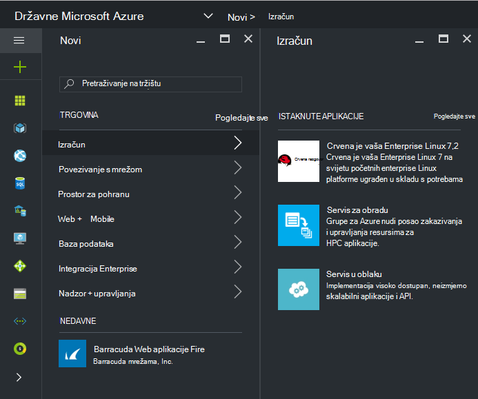
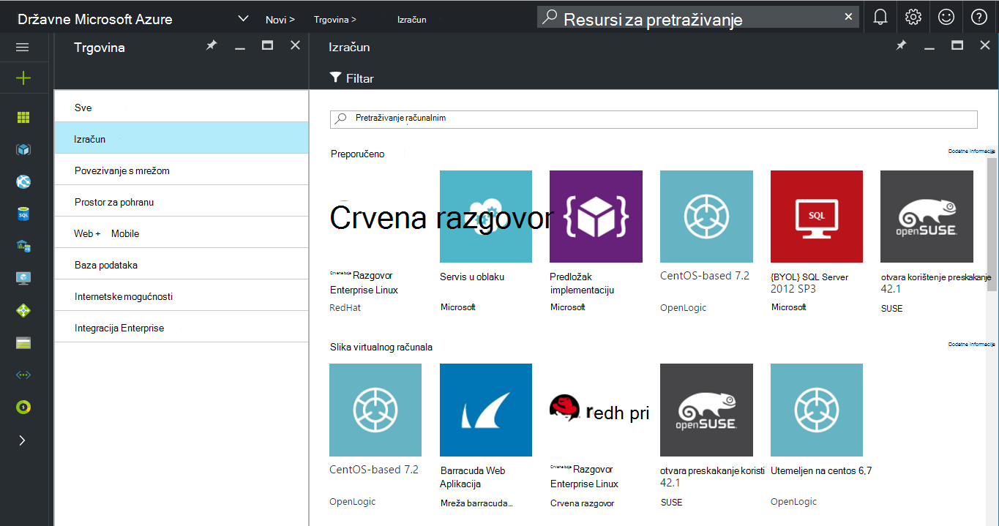
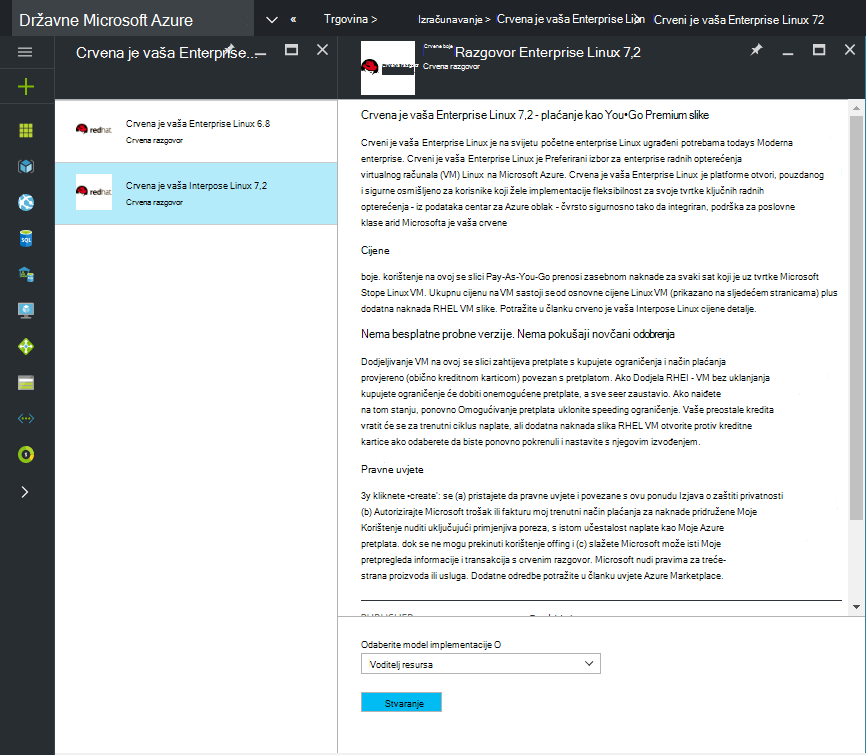
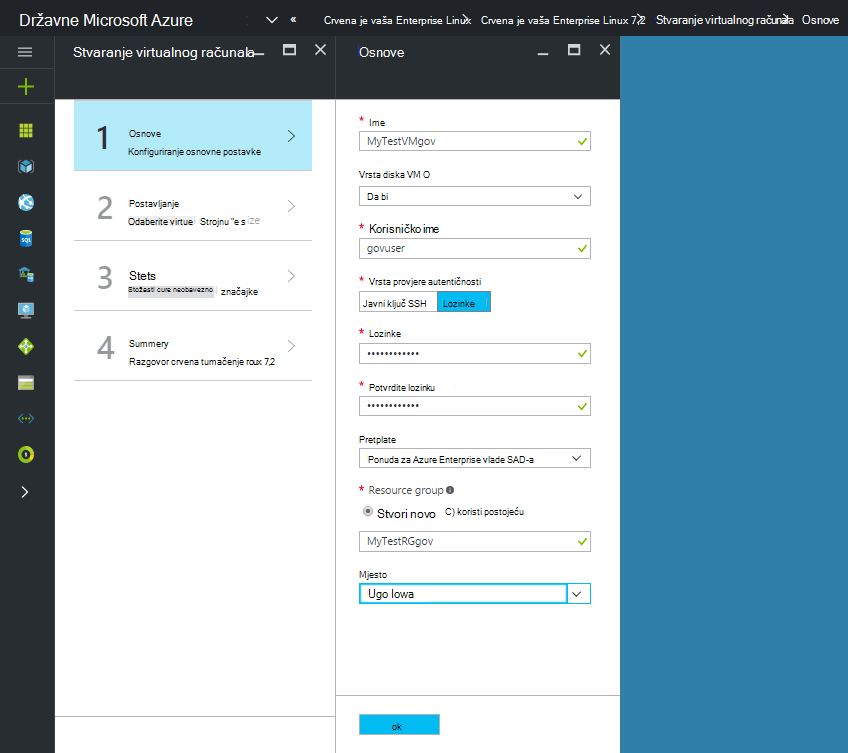
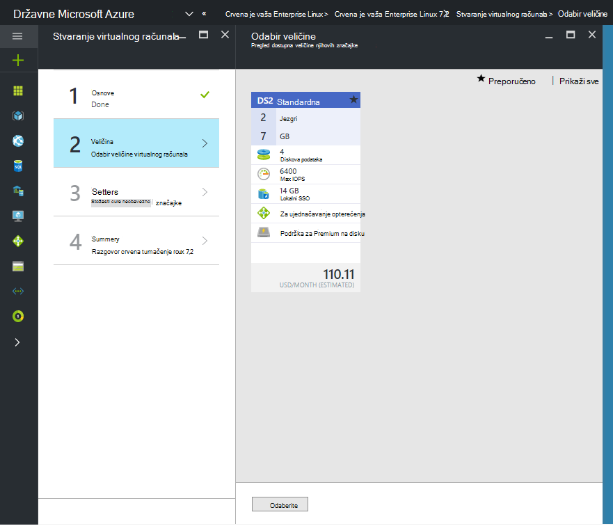

 <properties
    pageTitle="Azure državne dokumentaciju | Microsoft Azure"
    description="To omogućuje usporedbu značajki i upute na razvoj aplikacija za državne ustanove Azure."
    services="Azure-Government"
    cloud="gov"
    documentationCenter=""
    authors="VybavaRamadoss"
    manager="asimm"
    editor=""/>

<tags   ms.service="multiple"
    ms.devlang="na"
    ms.topic="article"
    ms.tgt_pltfrm="na"
    ms.workload="azure-government"
    ms.date="10/20/2016"
    ms.author="zakramer;vybavar"/>

# Azure Marketplace za državne ustanove
Trgovine Windows Azure dostupna je za državne ustanove Azure s ažuriranim popisom slika iz naših izdavača trgovine. 

## Varijacije
U nastavku su što valja prilikom korištenja trgovine Windows Azure za državne ustanove:

- Dostupni su samo slike ponijeti vaše vlastite licence (BYOL). Ne mogu pristupiti sve slike koje je potrebno za kupnju transakcije putem servisa Azure Marketplace
- Samo podskup slike trenutno nije dostupno to javno trgovine. Možete pronaći popis dostupnih slika [ovdje](../azure-government-image-gallery.md) 
- Prije dodjele resursa sliku, Administrator u tvrtki morate omogućiti Nabava trgovine Azure pretplatu
  - Prijavite se na Portal kao Enterprise Administrator
  - Dođite do *Upravljanje*
  - U odjeljku *Detalji registraciju* kliknite ikonu olovke pokraj stavke linijski *Azure Marketplace*
  - Uključivanje/isključivanje *Omogućeno/onemogućeno* po potrebi
  - Kliknite *Spremi*

>[AZURE.NOTE] Ako vas zanima unošenju slike dostupne u Azure državne pogledajte [partnera za uhodavanje smjernice](documentation-government-manage-marketplace-partners.md) za dodatne informacije.

### Korak 1
Pokretanje trgovine

  

### Korak 2
Pregledajte različite proizvode da biste pronašli odgovarajuću domenu.

Publisher trgovine daje popis certifications kao dio opis proizvoda koji olakšavaju odabir. 

### Korak 3
Odaberite programa product\image

### Korak 4
Pokretanje tijeka Stvori, a zatim unesite potrebne parametre radi implementacije

>[AZURE.NOTE] Na padajućem popisu mjesto su vidljivi samo Azure državne mjesta

### Korak 5
Pridržavajte se cijene

### Korak 6
Dovršavanje svih koraka, a zatim kliknite u redu da biste pokrenuli postupak za dodjelu resursa

## Daljnji koraci

Dodatne informacije i ažuriranja, pretplatiti na [Blog o programu Microsoft Azure državne](https://blogs.msdn.microsoft.com/azuregov/).
