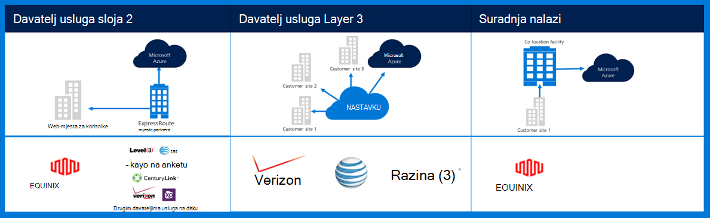
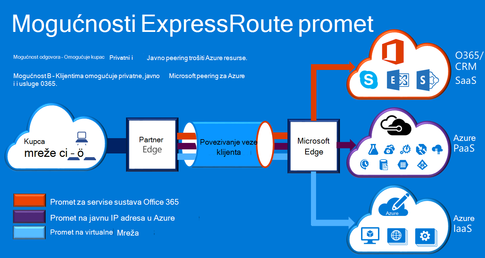

<properties
    pageTitle="Azure Governmenmt dokumentaciju | Microsoft Azure"
    description="Ovo omogućuje usporedbu značajki i upute za privatno povezivanje e državne"
    services="Azure-Government"
    cloud="gov" 
    documentationCenter=""
    authors="ryansoc"
    manager="zakramer"
    editor=""/>

<tags
    ms.service="multiple"
    ms.devlang="na"
    ms.topic="article"
    ms.tgt_pltfrm="na"
    ms.workload="azure-government"
    ms.date="09/28/2016"
    ms.author="ryansoc"/>

#  Azure državne umrežavanje

##  ExpressRoute (privatne povezivosti)

ExpressRoute načelu dostupan je u državne Azure. Dodatne informacije (uključujući partnera i peering mjesta) potražite u članku <a href="https://azure.microsoft.com/en-us/documentation/services/expressroute/">ExpressRoute javno dokumentaciju </a>.

###  Varijacije

ExpressRoute je obično dostupnih (GA) u državne Azure. 

- Državne kupci povezati fizički Izolirani kapaciteta putem namjenski veze za državne ustanove (Gov) Azure ExpressRoute (ER)

- Azure Gov omogućuje dostupnost Increased & rok trajanja po korištenje više područja parove nalazi najmanje 500 milja odvojili 

- Po zadanom sve povezivanjem Azure Gov ER je konfiguriran aktivno aktivan suvišnih s podrškom za bursting te nudi do 10 G elektronička kapaciteta (najmanja je 50MB)

- Azure Gov ER mjesta pružaju Optimizirano staze (pretraživanje po najkraćoj preskakanja niske latencije, visoke performanse, itd.) za kupce i Azure Gov zemlj suvišne područja

- Azure Gov ER privatne veze ne koristi funkciju, prolaziti ili ovise o tome na Internetu

- Azure Gov fizičke i logičke infrastrukture fizički namjenski i odvojene i pristup je ograničeno na osobe SAD-a

- Microsoft je vlasnik i pristajete sve infrastrukture optičkog između regija Gov Azure i Azure Gov ER zadovoljavaju-ja mjesta

- Azure Gov ER omogućuje povezivost Microsoft Azure, O365 i CRM servisima u oblaku

### Razmatranja

Postoje dvije osnovne servise koji omogućuju privatne mrežne veze u Azure državne: VPN-a (web-mjesta-na-web-mjesta za uobičajene tvrtku ili ustanovu) i ExpressRoute.

Azure ExpressRoute se koristi za stvaranje privatne veze između podatkovnim centrima Azure državne i infrastruktura za na lokaciji ili u okruženju colocation. Veze ExpressRoute otvorite putem javnog Interneta – ponude pouzdanosti, brže brzine i donjem latencies od standardne internetske veze. U nekim slučajevima pomoću veze ExpressRoute za prijenos podataka između na lokalnu instancu sustavi i Azure prinosa značajan cijena prednosti.   

S ExpressRoute, uspostavljanje veze s Azure na lokaciji ExpressRoute (kao što su Exchange funkcijom davatelja) ili izravno povežete s Azure iz postojeće mreže WAN (kao što je višeprotokolnog natpis prijelaz između VPN (MPLS), koji vam je dao davatelj usluga za mreže).

    

Za mrežnim servisima za podršku aplikacije Azure državne klijenta i rješenja, preporučuje implementira li se u povezati državne Azure ExpressRoute (privatne povezivosti). Ako koriste VPN veze, sljedeće razmatranje:

- Korisnici potrebno obratiti njihove authorizing službenog/agencija da biste odredili privatno povezivanje ili druge mehanizam sigurnu vezu je li potreban i da biste odredili dodatna ograničenja treba uzeti u obzir.

- Korisnici trebali biste razmisliti o mandate da VPN web-mjesto je usmjerena kroz privatno povezivanje zone.

- Korisnici trebali nabaviti je elektronička MPLS ili VPN-a kod davatelja licencirani privatno povezivanje programa access.

Svim klijentima koji koriste arhitekturu privatno povezivanje bi trebali provjeriti odgovarajuće implementacija uspostaviti i zadržane za klijenta vezu da biste pristupnika mreže/Interneta (GN / li) ruba usmjerivačem demarcation točke za državne ustanove Azure. Isto tako, vašoj tvrtki ili ustanovi moraju uspostaviti mrežne veze između lokalnog okruženja i mrežni pristupnik/klijenta (GN na C) rub usmjerivač demarcation točke za državne ustanove Azure.

## Daljnji koraci

Za dodatne podatke i ažuriranja provjerite pretplatiti na <a href="https://blogs.msdn.microsoft.com/azuregov/">državne Blog o programu Microsoft Azure.</a>
