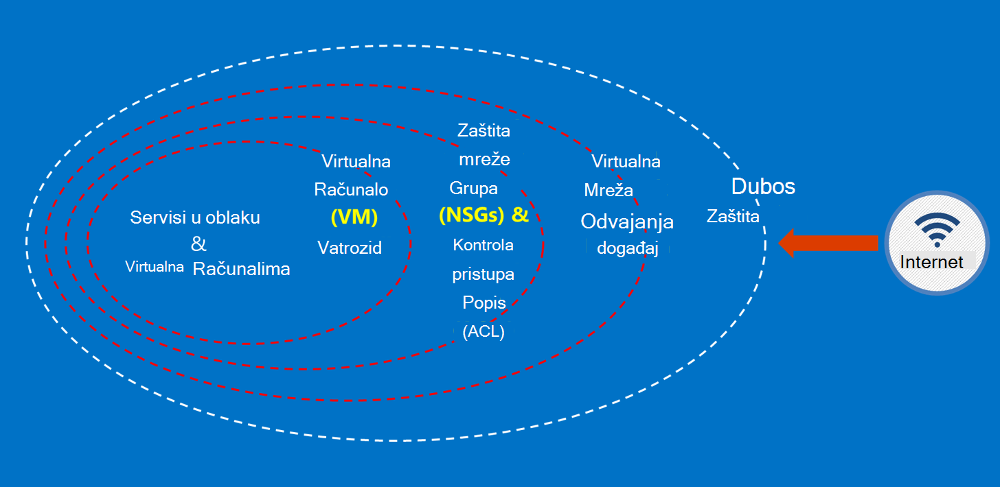

<properties
    pageTitle="Servisa Azure državne | Microsoft Azure"
    description="Omogućuje i pregled raspoloživim servisima u državne Azure"
    services="Azure-Government"
    cloud="gov"
    documentationCenter=""
    authors="zakramer"
    manager="liki"
    editor="" />

<tags
    ms.service="multiple"
    ms.devlang="na"
    ms.topic="article"
    ms.tgt_pltfrm="na"
    ms.workload="azure-government"
    ms.date="10/18/2016"
    ms.author="ryansoc" />

#  Sigurnost

##  Zaštita korisničkih podataka u Azure državne načela

Azure državne nudi raspon značajke i servise koje možete koristiti da biste sastavili oblaka rješenja potrebama regulated/kontrolirati podataka. Rješenje klijentima usklađene sa se ništa ne više od učinkovitih implementacije mogućnosti Izlaz u-tvorničke Azure državne povezano s vježbe za sigurnost pune podataka.

Kada hostira rješenja u državne Azure, Microsoft upravlja mnoge preduvjeta na razini infrastrukture oblaka.

Sljedeći dijagram prikazuje Azure obrane u dubine modela. Na primjer, Microsoft pruža infrastrukture u oblaku osnovni DDOS, zajedno s klijenta mogućnosti kao što su aparata sigurnosti za aplikaciju specifične za klijenta mora DDOS.

Ova stranica opisuje foundational načela za osiguravanje servisa i aplikacije, koja omogućuje upute i najbolje prakse za primjenu tih načela; drugim riječima, kako korisnici trebali napraviti pametno iskoristili Azure državne da bi odgovarao obaveze i radni zadaci koji su potrebni za rješenje koje obrađuje ITAR podatke.

 Overarching načela zaštita korisničkih podataka su:

- Zaštita podataka pomoću šifriranja
- Upravljanje tajne
- Odvajanja da biste ograničili pristup podacima

###  Zaštita korisničkih podataka pomoću šifriranja

Mitigating rizik i sastanaka pravnih obveza su vožnju rastuće fokusa i važnost šifriranje podataka. Implementacija učinkovitih šifriranje koristiti da biste poboljšali trenutni mreža i aplikacije sigurnosnim mjerama – i smanjenju cjelokupan rizika vaše okruženje oblaka.

#### Šifriranje na ostale
Šifriranje podataka na ostale primjenjuje zaštitu sadržaja kupca sadrži prostor za pohranu na disku. To se može dogoditi na nekoliko načina:

#### Šifriranje servis za pohranu

Azure šifriranje servis za pohranu omogućena na račun za razinu pohrane rezultira bloka blob-ova i blob polja stranice koja se automatski šifrirane kada zapisan Azure prostora za pohranu. Prilikom čitanja podataka iz spremišta Azure, ona će se dešifrirati servis za pohranu prije nego što se vraćaju. Ta postavka omogućuje zaštitu podataka bez potrebe za izmjenu ili dodavanje koda za sve programe.

#### Klijentsko šifriranje
Šifriranje klijentsko ugrađen u na Java i pohranu .NET klijenta biblioteke koje mogu koristiti Azure ključ sigurnog API-ji, napravite to jednostavne za implementaciju. Da biste dobili pristup tajne u sigurnog Azure ključ za određenim osobama pomoću servisa Azure Active Directory pomoću sigurnog ključ Azure.

#### Šifriranje na putu

Osnovni šifriranja dostupne za povezivanje za Azure državne podržava protokol prijenosa razinu sigurnosti (TLS) 1.2 i X.509 certifikate. Savezna informacije Processing Standard (FIPS) razine 1 140-2-šifriranja algoritmima pomoću se koriste za infrastrukturu mrežnih veza između podatkovnim centrima državne Azure.  Windows Server 2012 R2 i Windows 8-plus VMs i Azure zajedničke datoteke možete koristiti SMB 3.0 za šifriranje između na VM i zajedničko korištenje datoteka. Korištenje šifriranja klijentsko za šifriranje podataka da bi se prenosi u prostor za pohranu u klijentsku aplikaciju i dešifrirati podatke nakon njega se prenose više mjesta za pohranu.

#### Najbolje prakse za šifriranje

- IaaS VMs: Korištenje šifriranja Azure Disk. Uključivanje prostora za pohranu servisa šifriranje VHD datoteke koje se koriste za sigurnosno kopiranje tih diskova u Azure prostora za pohranu, ali to samo šifrira upravo pisane podataka. To znači da, ako stvorite na VM, a zatim omogućiti šifriranje servis za pohranu na računu za pohranu koja sadrži datoteku VHD, samo promjene će biti šifrirane, ne izvornu datoteku VHD.
- Šifriranje klijentsko: To je najsigurnija metoda za šifriranje vaše podatke jer je šifrira prije prijenosa te šifrira podatke na ostale. Međutim, je potreban je dodavanje koda za aplikacije na kojima se koriste za pohranu koji ne želite učiniti. U tom slučaju možete koristiti HTTPs za podatke u prijenosa i šifriranje servis za pohranu za šifriranje podataka na ostale. Šifriranje klijentsko uključuje i više opterećenja na klijentskom računalu – imate račun za to u skalabilnost planove, osobito ako su šifriranje i prijenos velike količine podataka.

###  Zaštita korisničkih podataka putem upravljanja tajne

Sigurna upravljanja ključem ključan za zaštitu podataka u oblaku. Korisnici trebali biste pokušajte Pojednostavnite upravljanja ključem i kontrolirati tipke koriste oblaka aplikacija i servisa za šifriranje podataka.

#### Najbolje prakse za upravljanje tajne

- Pomoću tipke sigurnog radi minimiziranja rizika tajne izlaganja programiranih konfiguracijske datoteke, skripte, ili pak u izvornog koda. Azure sigurnog ključ šifrira tipke (kao što su ključeva za šifriranje za šifriranje Azure) i tajne (kao što su lozinke), spremanjem ih u FIPS 140-2 razine 2 provjeriti hardver sigurnost Module (HSMs). Za dodatnu jamstva, moguće je uvesti i generiranje ključeva u te HSMs.
- Kod aplikacije i predloške moraju sadržavati samo URI reference na tajne (što znači stvarni tajne se ne nalaze u kod, konfiguriranje ili izvornog koda spremištima). To sprječava ključa napadima krađe identiteta na unutarnji ili vanjski repos, kao što su harvest robotima u GitHub.
- Koristi funkciju istaknuti RBAC kontrole unutar zbirke ključeva ključ. Ako pouzdanih operator Ostavi tvrtke ili prijenosi u novu grupu unutar tvrtke, trebali biste ih spriječio moći pristupati tajne.

Dodatne informacije <a href="https://azure.microsoft.com/documentation/services/key-vault">Azure ključ sigurnog javno dokumentacije.</a>

###  Odvajanja da biste ograničili pristup podacima

Odvajanja je pomoću ograničenja, segmente i spremnika za ograničavanje pristupa podacima samo autoriziranih korisnika, servise i aplikacijama. Na primjer, odvojenosti između klijenata je mehanizam za ključne sigurnosti za složene oblaka platforme kao što je Microsoft Azure. Logička odvajanja pomaže u sprečavanju jednog klijenta s ometaju operacije drugi klijent.

#### Odvajanja okruženje
Okruženje za Azure državne je instanca komponente fizičke koji se razlikuje od ostatka mrežu tvrtke Microsoft. To se postiže prelaziti s jedne fizičke i logičke kontrole koje obuhvaćaju sljedeće:

- Zaštita od fizičke barriers pomoću biometrijski uređaji i kamere.
- Korištenje određene vjerodajnice i multifactor provjere autentičnosti Microsoftovo osoblje koje je obavezna logičke pristup radnog okruženja.
- Sve usluge infrastrukture za Azure državne nalazi se u Sjedinjenim Američkim Državama.

#### Odvajanja po klijenta
Kontrola pristupa za Azure primjenjuje mreže i segregation kroz VLAN odvajanja, ACL-a, učitavanje balancers i IP filtara

Korisnici možete dodatno izdvajanja njihove resursi preko pretplate, grupa resursa, virtualne mreže i podmreže.

## Rasterskih

Nedavno najavljena najviše FedRAMP i accreditation odjel obrane (DoD) utjecaj na razinu 4. To je pomaknu sigurnost i usklađenost preko okruženje za državne ustanove Azure.

Ne možemo su sada screening naš operatori pri nacionalna provjerite agencija s pravom i odobrenja (NACLC) kako je definirano u odjeljku 5.6.2.2 od u DoD oblaka računalstvo sigurnosne preduvjete vodič (SRG):

>[AZURE.NOTE] Minimalne pozadine istrage potrebne za osoblje CSP imate pristup na razinu 4 i 5 informacije koje se temelje na na "manje osjetljivi" (npr., DoD-ADP-2) nacionalna agencija za provjeru s pravom i odobrenja (NACLC) (za radnici "manje osjetljivi") ili na moderiranje rizika pozadine istrage (MBI) za položaj oznaka "moderiranje rizika".

U sljedećoj su tablici navedene naš trenutni rasterskih za Azure državne operatora:

Azure Gov screenings i provjeru u pozadini | Opis|
---|---|
Citizenship SAD-a |Provjera citizenship SAD-a.
Microsoft cloud pozadine potvrdite (svake dvije godine)|JMBG pretraživanje, potvrdite prema povijest, od strane imovine kontrolu Office popisa (OFAC), a zatim popis ured industrijskih i sigurnost (BIS), popis sustava Office od obrane trgovinu kontrole Debarred osobe.
Agencija za nacionalna potvrdite s pravom i odobrenja (NACLC) (svakih pet godina) | Dodaje provjeru pozadine otiska prsta FBI baze podataka. Dodatne informacije potražite<a href="https://www.opm.gov/investigations/background-investigations/federal-investigations-notices/1997/fin97-02/"> Office osoblje upravljanja web-mjesta</a>. | 
<a href="https://www.microsoft.com/en-us/TrustCenter/Compliance/CJIS">Prema Justice Information Services (CJIS)</a> | CJIS je stanje, lokalni i FBI državne screening koje procesa otiska prsta zapisa i Provjeri valjanost prema transparentnost u radu sa servisom zaposlenici koji nije naveden pristup podacima ključnih kriminalac justice informacije (CJI).  Svakog pojedinog statusa ne vlastite pozadine Provjera i kasnije odobrenje svih zaposlenika potencijalne pristup CJI.|

Za osoblje Azure operacije, primjenjuju se na sljedeći način pristupa:

- Obavezama koje imate jasno definiraju, s zasebni radni zadaci za traženje, odobravanje i implementacija promjene.
- Pristup je definirani sučelja koje sadrže određene funkcije.
- Access je samo u – vrijeme (JIT) i moguć je samo na temelju po incident ili za određenu održavanju pa uvijek ograničeno vrijeme.
- Pristup je na temelju pravila, s definirani uloge koje se dodjeljuju samo su dozvole potrebne za otklanjanje poteškoća.

Rasterskih standarde obuhvaćaju provjere valjanosti sad citizenship svih Microsoftovoj službi za podršku i radu osoblje prije pristup moguć je Azure državne hostira sustave. Osoblje službe za podršku koji je potrebno za prijenos podataka pomoću sigurne mogućnosti unutar državne Azure. Prijenos sigurne podataka potreban je zaseban skup vjerodajnice za pristup. Na primjer, da biste pristupili metapodataka sustava, osoblje operacije pomoću alata za određene utemeljen na webu Interna upravljanje, API-je samo za čitanje i JIT visinu.

## Daljnji koraci

Za dodatne podatke i ažuriranja provjerite pretplatiti na <a href="https://blogs.msdn.microsoft.com/azuregov/">državne Blog o programu Microsoft Azure.</a>
