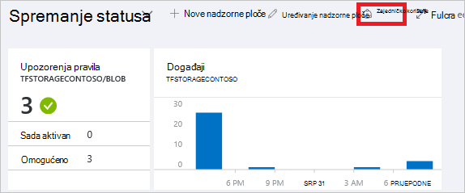
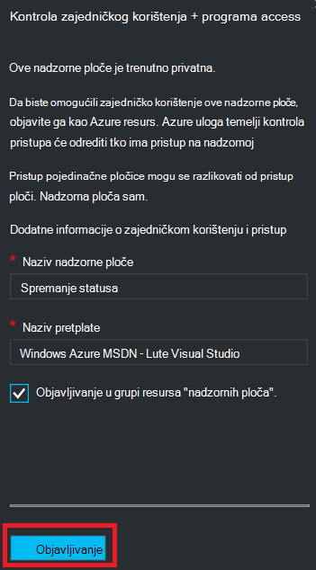
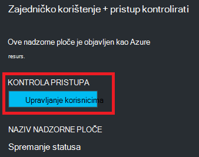
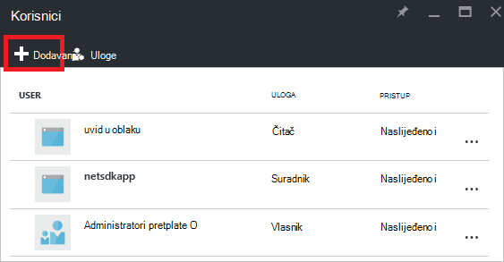
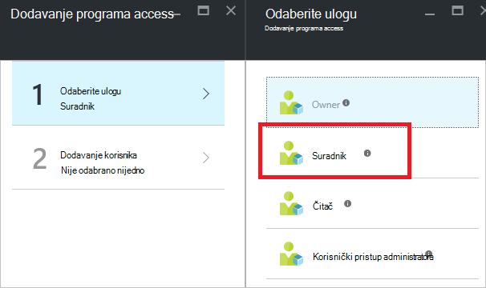
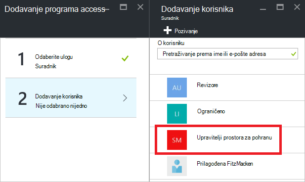
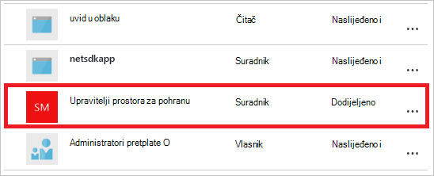

<properties
   pageTitle="Pristup Azure portala nadzorne ploče | Microsoft Azure"
   description="U ovom se članku objašnjava kako zajednički koristiti pristup nadzorne ploče na portalu za Azure."
   services="azure-portal"
   documentationCenter=""
   authors="tfitzmac"
   manager="timlt"
   editor="tysonn"/>

<tags
   ms.service="multiple"
   ms.devlang="NA"
   ms.topic="article"
   ms.tgt_pltfrm="NA"
   ms.workload="na"
   ms.date="08/01/2016"
   ms.author="tomfitz"/>

# Zajedničko korištenje Azure nadzornih ploča

Nakon konfiguriranja nadzorne ploče, možete ga objaviti i zajednički koristite s drugim korisnicima u tvrtki ili ustanovi. Dopustite drugima da biste pristupili pomoću Azure [Kontrola pristupa temelji uloga](../active-directory/role-based-access-control-configure.md)nadzorne ploče. Dodjela korisnika ili grupu korisnika u ulogu i uloge određuje hoće li ti korisnici mogu prikaz i izmjena objavljene nadzorne ploče. 

Sve objavljene nadzorne ploče primjenjuju kao Azure resursa, što znači da ona postoji kao moguće upravljati stavke u svoju pretplatu i nalaze se u grupu resursa.  Iz perspektive kontrole programa access, nadzorne ploče ne razlikuju od drugih resursa, kao što su virtualnog računala ili spremanje računa.

> [AZURE.TIP] Pojedinačne pločice na nadzornoj ploči nametnuti vlastite preduvjeti kontrolu pristupa resursa koji će biti prikazani na temelju.  Zbog toga možete dizajnirati nadzorne ploče koje je omogućeno zajedničko korištenje njih svim korisnicima Dopusti dok još uvijek zaštita podataka na pojedinačne pločice.

## Razumijevanje kontrola pristupa za nadzornih ploča

Kontrola pristupa na temelju uloga korisnicima možete dodijeliti uloge tri različite razine opsega:

- pretplate
- grupa resursa
- resurs

Dodijeljene dozvole se naslijeđuju s pretplate prema dolje do resurs. Resurs je objavljeni nadzorne ploče. Dakle, možda već imate korisnike dodijeljene ulogama za pretplatu koja funkcionira i za objavljene nadzorne ploče. 

Evo primjera.  Recimo da imate pretplatu na Azure i razne članovima tima dodijeljeni je uloge **vlasnika**, **Suradnik**ili **čitač** za pretplatu. Korisnici koji su vlasnici i suradnici će moći popisa, prikaz, stvaranje, izmjena i brisanje nadzornih ploča u pretplatu.  Korisnike koji su čitači mogu popis i prikaz nadzorne ploče, ali ne možete izmijeniti ili ih izbrisati.  Korisnici s pristupom čitač će moći unesite lokalne izmjene objavljene nadzorne ploče (kao što su pri otklanjanju problema), ali neće moći objaviti te promjene na poslužitelj.  Oni će imati mogućnost da biste privatnu kopiju na nadzornoj ploči za sebe

Međutim, i ne može dodijeliti dozvole grupi resursa koja sadrži nekoliko nadzorne ploče ili pojedinačne nadzorne ploče. Na primjer, možda odlučite da grupe korisnika trebali biste umanjenom sposobnosti dozvole preko pretplatu, ali veći pristup određenom nadzorne ploče. Korisnicima dodijeliti ulogu za taj nadzorne ploče. 

## Objavljivanje nadzorne ploče

Pretpostavimo da ste završili konfiguriranje nadzorne ploče koju želite zajednički koristiti s grupe korisnika iz pretplate. Koraci u nastavku opisuju prilagođenu grupu upravitelja za pohranu, ali možete nazvati vašoj grupi što god želite. Informacije o stvaranju grupe sustava Active Directory i dodavanje korisnika u grupu, potražite u članku [Upravljanje grupama u Azure Active Directory](../active-directory/active-directory-accessmanagement-manage-groups.md).

1. Na nadzornoj ploči odaberite **zajedničko korištenje**.

     

2. Prije dodjele pristup, morate objaviti na nadzornoj ploči. Prema zadanim postavkama, na nadzornoj ploči će se objaviti u grupu resursa pod nazivom **nadzorne ploče**. Odaberite **Objavi**.

     

Sada se objavljuje nadzorne ploče. Ako su prikladne dozvole koje nasljeđuju iz pretplate, ne morate više ništa učiniti. Ostali korisnici u vašoj tvrtki ili ustanovi bit će moći pristupiti i izmjena nadzorne ploče na temelju njihove uloge razine pretplate. No za ovog praktičnog vodiča recimo dodijeliti grupe korisnika ulogu za taj nadzorne ploče.

## Dodijelili pristup nadzorne ploče

1. Nakon objavljivanja nadzorne ploče, odaberite **Upravljanje korisnicima**.

     

2. Vidjet ćete popis postojećim korisnicima koji su već dodijeljeni uloge za ovu nadzornu ploču. Na popisu postojeće korisnike bit će razlikuje se od na slici u nastavku. Najvjerojatnije u dodjele nasljeđuju iz pretplate. Da biste dodali novog korisnika ili grupu, odaberite **Dodaj**.

     

3. Odaberite ulogu koja predstavlja dozvole koje želite dodijeliti. U ovom primjeru odaberite **suradnika**.

     

4. Odaberite korisnika ili grupu koju želite dodijeliti ulogu. Ako ne vidite korisnik ili grupa koju tražite na popisu, pomoću okvira za pretraživanje. Na popisu dostupnih grupama ovisi o grupe koje ste stvorili u servisu Active Directory.

      

5. Kada završite s dodavanjem korisnike ili grupe, odaberite **u redu**. 

6. Dodjela nove se dodaje na popis korisnika. Obratite pozornost na to da se **Access** prikazuju u obliku **dodijeljene** umjesto **naslijeđeno**.

     

## Daljnji koraci

- Popis uloge, potražite u članku [RBAC: ugrađene uloge](../active-directory/role-based-access-built-in-roles.md).
- Da biste saznali više o upravljanju resursa, potražite u članku [Upravljanje Azure resursi putem portala](resource-group-portal.md).