<properties
   pageTitle="Azure portala nadzornih ploča | Microsoft Azure"
   description="U ovom se članku objašnjava kako stvarati i uređivati nadzorne ploče na portalu za Azure."
   services="azure-portal"
   documentationCenter=""
   authors="sewatson"
   manager="timlt"
   editor="tysonn"/>

<tags
   ms.service="multiple"
   ms.devlang="NA"
   ms.topic="article"
   ms.tgt_pltfrm="NA"
   ms.workload="na"
   ms.date="09/06/2016"
   ms.author="sewatson"/>

# Stvaranje i zajedničko korištenje nadzorne ploče na portalu za Azure

Možete stvoriti više nadzornih ploča i zajednički ih koristite s drugim korisnicima koji imaju pristup pretplate Azure.  Ovaj članak prolazi kroz osnove stvaranja i uređivanja, objavljivanje i upravljanje pristupom nadzorne ploče.

## Prilagodba nadzornih ploča i blades

Nakon pokretanja nadzornih ploča prije nekoliko mjeseca, je stižu odbijanje u plohu prilagodbe i brz povećava prilagodbe nadzorne ploče. Ovaj trend istaknuti korištenje prikazuje radije prilagodbu nadzornih ploča putem blades. Za podršku te trend, uklonit ćemo mogućnost za prilagodbu blades i odvojiti naš trudu poboljšavanje funkcionalnost nadzorne ploče. Ako ste prilagodili na plohu, uklonit će se uskoro prilagodbe. Da biste sačuvali te prilagodbe prikvačite prilagođene pločice na nadzornu ploču. Jednostavno desnom tipkom miša kliknite pločicu i odaberite **Prikvači na nadzornu ploču** , kao što je prikazano na sljedećoj slici.

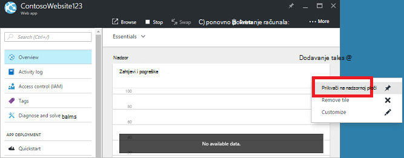

## Stvaranje nadzorne ploče

Da biste stvorili nadzorne ploče, odaberite gumb **nove nadzorne ploče** pokraj naziva trenutne nadzorne ploče na.  

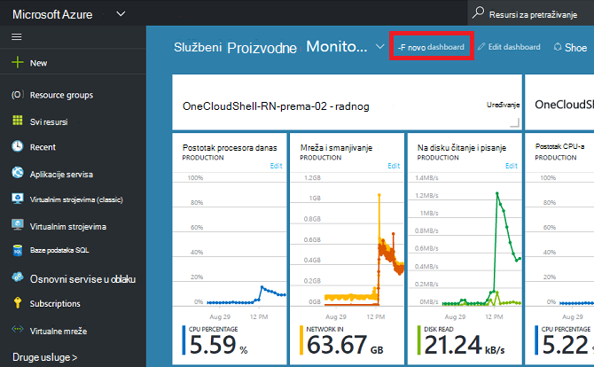

Ova akcija stvara novi, prazan, privatni nadzorne ploče i stavlja vas u način za prilagodbu gdje možete nazvati nadzorne ploče i dodavanje ili prerasporediti pločice.  U tom načinu rada koji je moguće sažeti pločica Galerija preuzme lijevi navigacijski izbornik.  Galerija pločica omogućuje pronalaženje pločice za Azure resursa na različite načine:, možete se pomicati prema [grupi resursa](../azure-resource-manager/resource-group-overview.md#resource-groups), prema vrsti resursa, prema [oznaci](../resource-group-using-tags.md)ili traženjem vaše resursa po nazivu.  

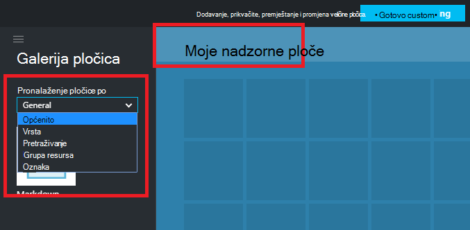

Dodavanje pločica povlačenjem i ispuštanjem ih na nadzornoj ploči plošni mjesto na kojem želite.

Postoji novu kategoriju **Općenito** naziva za pločice koje su vezane uz određeni resurs.  U ovom primjeru smo prikvačiti pločicu Markdown.  Dodavanje prilagođenog sadržaja nadzorne ploče pomoću toj pločici.  Na pločici podržava običnim tekstom, [Markdown sintaksa](https://daringfireball.net/projects/markdown/syntax)i ograničenim HTML.  (Za sigurnost, ne možete primjerice ubaciti `<script>` oznake ili koristite određeni stil element CSS koje možda ometaju portalu.) 

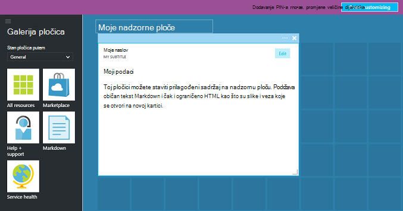

## Uređivanje nadzorne ploče

Nakon stvaranja nadzorne ploče, možete prikvačiti pločice iz galerije pločica ili prikaz pločica blades. Pogledajmo prikvačite prikaz naše grupu resursa. Možete ili pin pri pregledavanju stavku ili iz grupe plohu resursa. Oba pristupa rezultat prikvačivanje pločice prikaz grupa resursa.

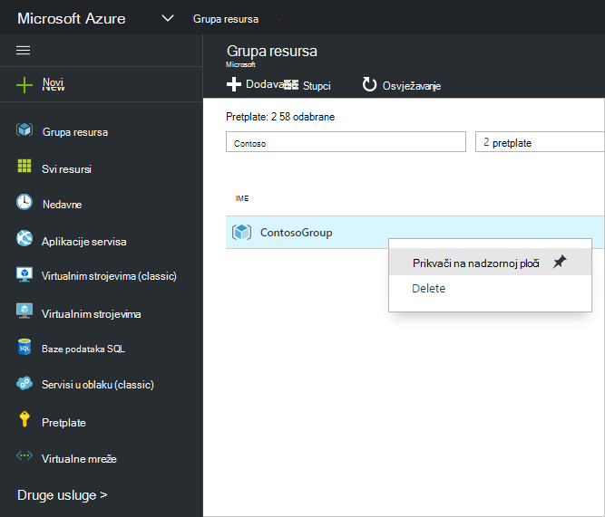

Nakon prikvačivanje stavku, pojavljuje se na nadzornoj ploči.

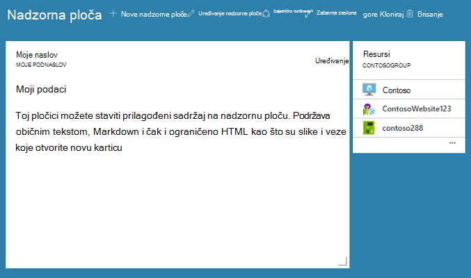

Sada kada imamo Markdown pločica i grupu resursa prikvačiti na nadzornoj ploči, možemo promjena veličine i razmještanje pločice u odgovarajuću raspored.

Zadrži pokazivač i odaberete "..." ili desnom tipkom miša na pločicu možete vidjeti sve kontekstne naredbe za tu pločicu. Prema zadanim postavkama, postoje dvije stavke:

1. **Otkvači s nadzorne ploče** – uklanja pločicu na nadzornoj ploči
2.  **Prilagodba** – unosi Prilagodba načinu rada

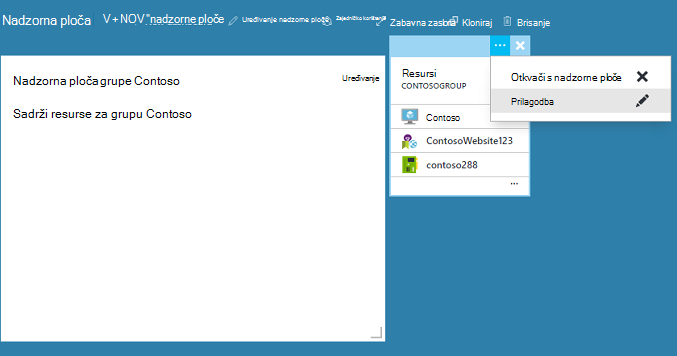

Tako da odaberete Prilagodi, možete promijeniti veličinu i Promjena redoslijeda pločica. Da biste promijenili veličinu pločicu, odaberite novu veličinu na kontekstnom izborniku, kao što je prikazano na sljedećoj slici.

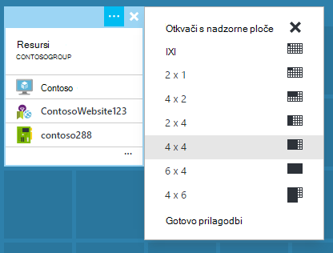

Ili, ako pločicu podržava bilo koje veličine, možete povući u donjem desnom kutu do željene veličine.

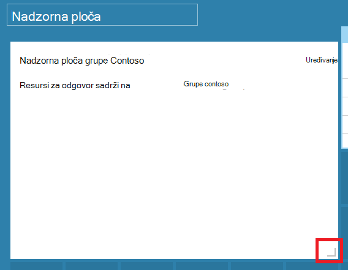

Nakon promjene veličine pločice, prikaz na nadzornoj ploči.

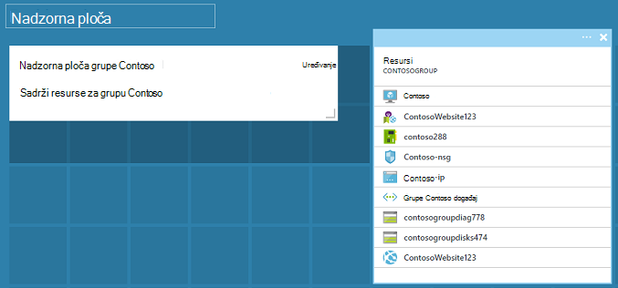

Kada završite prilagodbu na nadzornoj ploči, samo odaberite na **gotovo prilagodbu** da biste izašli iz Prilagodi način ili desnom tipkom miša kliknite i odaberite **gotovo prilagodbu** na kontekstnom izborniku.

## Objavljivanje na nadzornoj ploči i upravljanje kontrola pristupa

Prilikom stvaranja nadzorne ploče komponente je privatna prema zadanim postavkama, što znači da vi jedina osoba tko može vidjeti.  Da bi se vide, pomoću gumba **zajedničko korištenje** koji će se prikazati uz ostale naredbe nadzorne ploče.

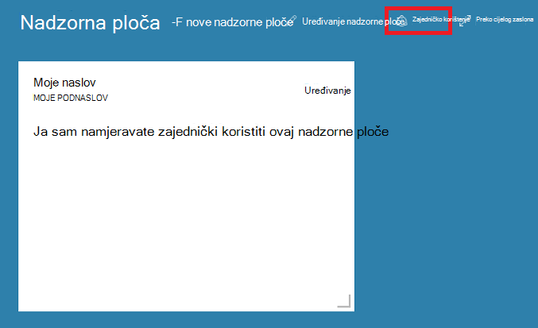

Što trebate odaberite pretplata i grupa resursa za nadzorne ploče za objavljivanje. Jednostavno integracije nadzornih ploča u u zajednici, Implementirali smo zajedničke nadzornih ploča kao Azure resursa (tako da ne možete zajednički koristiti tako da upišete adresu e-pošte).  Kontrola [pristupa](../active-directory/role-based-access-control-configure.md )za Azure temelji ulogu mjerodavni su pristup informacijama koje Većina pločica na portalu. Iz perspektive za kontrole programa access ne razlikuje se od virtualnog računala ili spremanje računa su zajedničke nadzorne ploče.  

Recimo da imate pretplatu na Azure i članovi vašeg tima je dodijeljena uloga **vlasnika**, **Suradnik**ili **čitač** pretplate.  Korisnici koji su vlasnici i suradnici će moći popisa, prikaz, stvaranje, izmjena i brisanje nadzornih ploča te pretplate.  Korisnike koji su čitači mogu popis i prikaz nadzorne ploče, ali ne možete izmijeniti ili ih izbrisati.  Korisnici s pristupom čitač moći unesite lokalne izmjene zajedničke nadzorne ploče, ali nećete da biste objavili te promjene na poslužitelj.  Međutim, možete napraviti privatnu kopiju na nadzornoj ploči za svoj poštanski.  Kao i uvijek, pojedinačne pločice na nadzornoj ploči nametnuti vlastite pristup pravilima kontrole ovisno o resursima mogu odgovarati.  

Pogodnost, sučelje za objavljivanje na portal vas vodi pri uzorak mjestu nadzornih ploča u grupu resursa naziva **nadzorne ploče**.  

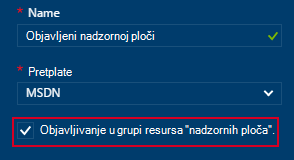

Možete odabrati i objaviti na nadzornoj ploči u određenoj grupi resursa.  Kontrola pristupa za tu nadzornu ploču odgovara kontrola pristupa za grupu resursa.  Korisnici koji mogu upravljati resursa u toj grupi resursa i imaju pristup nadzorne.

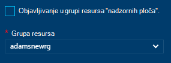

Nakon objavljivanja nadzorne ploče kontrola okno **zajedničko korištenje + access** će osvježavanje i prikazivati informacije o objavljenim nadzorne ploče, uključujući veze na Upravljanje korisničkim pristupom na nadzornu ploču.  Sljedeću vezu pokreće standardni plohu kontrola pristupa temelji ulogu služi za upravljanje pristupom za sve Azure resurs.  Možete uvijek se vratiti na taj prikaz tako da odaberete **zajedničko korištenje**.

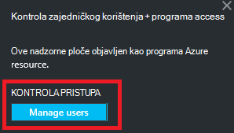

## Daljnji koraci

- Upravljanje resursima potražite u članku [Upravljanje Azure resursi putem portala](resource-group-portal.md).
- Da biste implementirali resursa, potražite u članku [uvođenja resursa s resursima predloške i Azure portal](../resource-group-template-deploy-portal.md).