<properties 
    pageTitle="Upravljanje resursima Azure pomoću portala za Azure | Microsoft Azure" 
    description="Koristite i upravljanje resursa Azure Azure portal za upravljanje resurse. Prikazuje kako raditi s nadzornih ploča praćenje resursi." 
    services="azure-resource-manager,azure-portal" 
    documentationCenter="" 
    authors="tfitzmac" 
    manager="timlt" 
    editor="tysonn"/>

<tags 
    ms.service="azure-resource-manager" 
    ms.workload="multiple" 
    ms.tgt_pltfrm="na" 
    ms.devlang="na" 
    ms.topic="article" 
    ms.date="09/12/2016" 
    ms.author="tomfitz"/>

# Upravljanje resursima Azure putem portala

> [AZURE.SELECTOR]
- [Azure PowerShell](../powershell-azure-resource-manager.md)
- [Azure EŽA](../xplat-cli-azure-resource-manager.md)
- [Portal](resource-group-portal.md) 
- [REST API-JA](../resource-manager-rest-api.md)

U ovoj se temi objašnjava za uporabu [Voditelj resursa Azure](../azure-resource-manager/resource-group-overview.md) [Azure portal](https://portal.azure.com) za upravljanje Azure resurse. Da biste saznali više o implementaciji resursi putem portala sustava, potražite u članku [uvođenja resursa s resursima predloške i Azure portal](../resource-group-template-deploy-portal.md).

Trenutno ne svaku uslugu podržava portala i resursima. Za te servise, morate koristiti [klasične portal](https://manage.windowsazure.com). Status svaki servis, potražite u članku [Azure portala dostupnost grafikona](https://azure.microsoft.com/features/azure-portal/availability/).

## Upravljanje grupama resursa

1. Da biste vidjeli sve grupe resursa u vašoj pretplati, odaberite **grupe resursa**.

    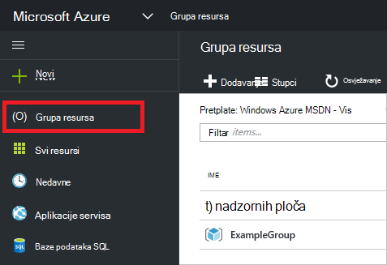

1. Da biste stvorili grupu prazan resursa, odaberite **Dodaj**.

    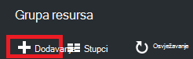

1. Navedite naziv i mjesto za novu grupu resursa. Odaberite **Stvori**.

    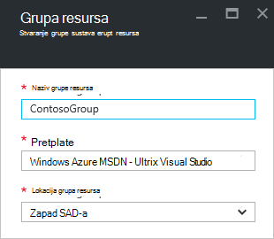

1. Možda ćete morati odaberite **Osvježi** da biste vidjeli grupu nedavno stvorene resursa.

    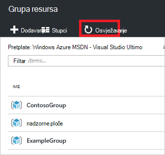

1. Da biste prilagodili informacija prikazanih za svoje grupe resursa, odaberite **stupce**.

    

1. Odaberite stupce koje želite dodati, a zatim odaberite **Ažuriraj**.

    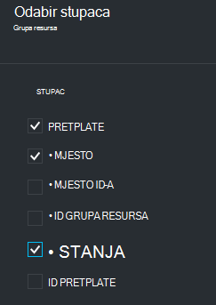

1. Da biste saznali više o resursima za implementaciju u novu grupu resursa, potražite u članku [uvođenja resursa s resursima predložaka i Azure portal](../resource-group-template-deploy-portal.md).

1. Za brzi pristup u grupu resursa možete prikvačiti na plohu nadzorne ploče.

    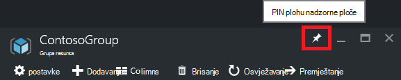

1. Na nadzornoj ploči prikazuje grupu resursa i njegovih resursa. Možete odabrati ili grupe resursa ili bilo koji od njegovih resursa idite na stavku.

    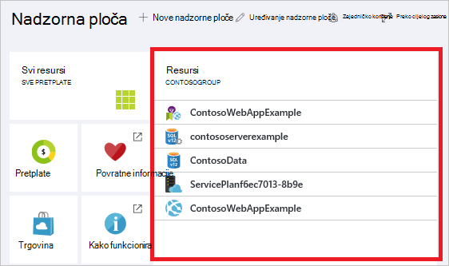

## Oznaka resursi

Grupa resursa i resursima da biste logično organizirali svoje imovine možete primijeniti oznake. Informacije o radu s oznakama, potražite u članku [Korištenje oznake da biste organizirali Azure resurse](../resource-group-using-tags.md).

[AZURE.INCLUDE [resource-manager-tag-resource](../../includes/resource-manager-tag-resources.md)]

## Resursi za praćenje

Kad odaberete resursa, plohu resursa predstavlja zadani grafikone i tablice za tu vrstu resursa za nadzor.

1. Odabir resursa i obratite pozornost odjeljku **nadzor** . Uključuje grafikone koji se odnose na vrstu resursa. Sljedeća slika prikazuje zadane podatke za račun za pohranu za nadzor.

    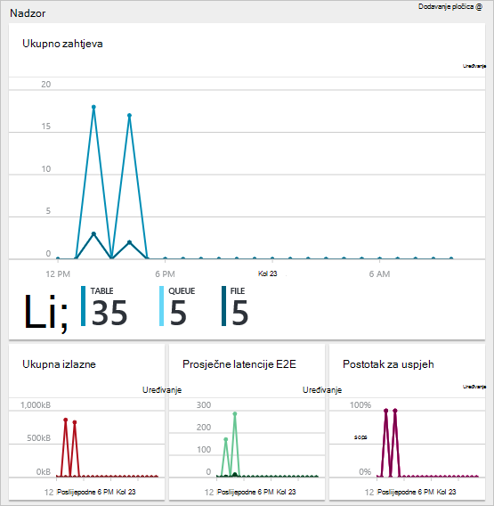

1. Prikvači dio na plohu na nadzornu ploču tako da odaberete tri točke (...), iznad sekcije. Možete prilagoditi veličina u odjeljku na plohu ili potpuno ukloniti. Sljedeća slika prikazuje kako prikvačite, Prilagodba i uklanjanje sekcije opterećenje procesora i memorije.

    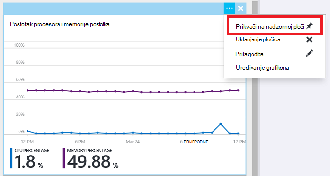

1. Nakon prikvačivanje sekcije nadzorne ploče, vidjet ćete sažetak na nadzornoj ploči. Možete i da ga odaberete odmah vodi vas na dodatne detalje o podacima.

    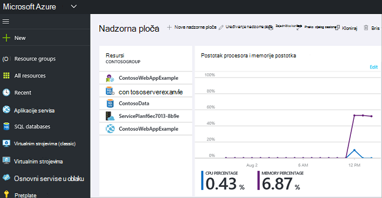

1. Da biste podatke u potpunosti prilagoditi praćenje putem portala sustava, idite na zadane nadzorne ploče i odaberite **novu nadzornu ploču**.

    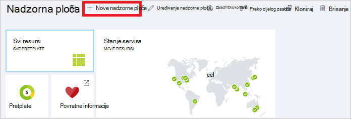

1. Unesite naziv nove nadzorne ploče i povucite pločice na nadzornu ploču. Pločice su filtrirani prema različite mogućnosti.

    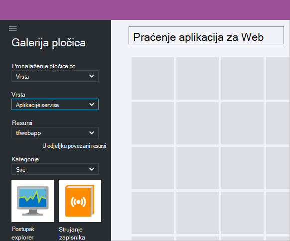

     Dodatne informacije o radu s nadzorne ploče, potražite u članku [Stvaranje i zajedničko korištenje nadzorne ploče na portalu za Azure](azure-portal-dashboards.md).

## Upravljanje resursima

U plohu resursa, prikazuju se mogućnosti za upravljanje resurs. Na portalu prikazuju se mogućnosti upravljanja za tu vrstu određeni resurs. Naredbe za upravljanje potražite na vrhu plohu resursa i na lijevoj strani.

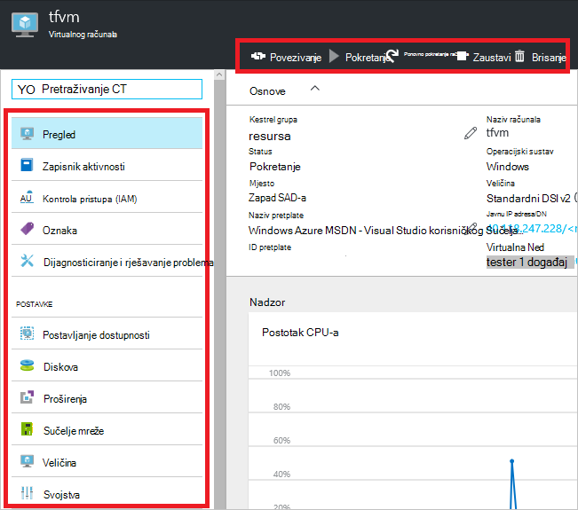

Od ovih mogućnosti možete izvršiti operacija kao što su pokretanje i zaustavljanje virtualnog računala ili ponovno konfiguriranje svojstva virtualnog računala.

## Premještanje resursi

Ako vam je potrebna za premještanje resursa u drugu grupu resursa ili drugu pretplatu, potražite u članku [Premještanje resursa ili pretplatu za novu grupu resursa](../resource-group-move-resources.md).

## Zaključavanje resursi

Možete zaključati na pretplatu, grupa resursa ili resursa da biste drugim korisnicima u tvrtki ili ustanovi iz slučajno izbrišete ili izmjena ključnih resursi. Dodatne informacije potražite u članku [Lock resursi s Azure Voditelj resursa](../resource-group-lock-resources.md).

[AZURE.INCLUDE [resource-manager-lock-resources](../../includes/resource-manager-lock-resources.md)]

## Prikaz svoju pretplatu i troškove

Prikaz informacija o pretplate i troškove kumulativni za sve resurse. Odaberite **pretplate** i pretplata na koje želite vidjeti. Možda imate samo jedan pretplate da biste odabrali.

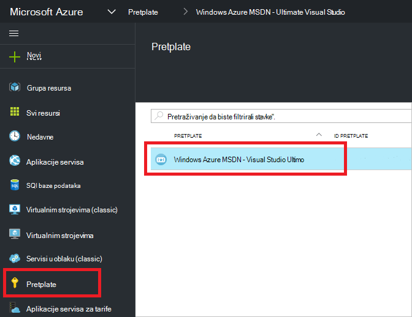

Unutar plohu pretplate vidjet ćete stopa za snimanje.

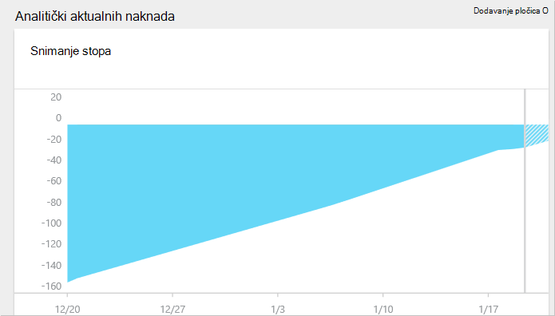

I razrada svega troškove po vrsti resursa.

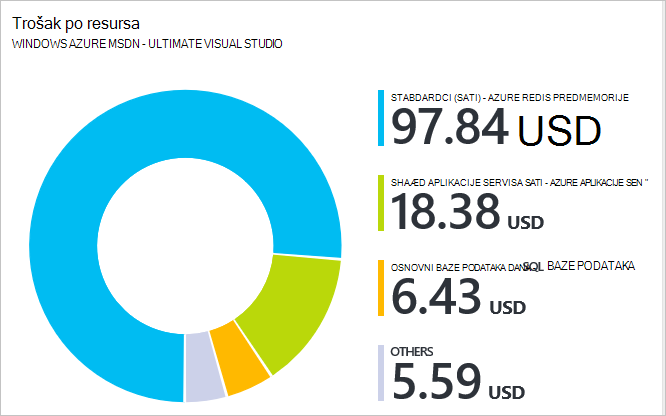

## Izvoz predloška

Kada postavite grupu resursa, preporučujemo vam da biste pogledali predložak resursima za grupu resursa. Izvoz predložak nudi dva pogodnosti:

1. Jednostavno možete automatizirati buduće implementacije rješenja jer predložak sadrži potpuni infrastrukture.

2. Koje možete se upoznali sa sintaksa predložak tako da pri na JavaScript objekt notaciju (JSON) koji predstavlja rješenje.

Detaljne upute potražite u članku [Izvoz Voditelj resursa Azure predloška iz postojećih resursa](../resource-manager-export-template.md).

## Brisanje grupe resursa ili resursi

Brisanje grupe resursa briše sve resurse koje se nalaze u njoj. Možete i izbrisati pojedinačnih resursa u grupu resursa. Želite li tuđe Budite oprezni kad izbrišete grupu resursa jer mogu postojati resursa u druge grupe resursa koji su povezani s njom. Voditelj resursa brisanje povezani resursi, ali se možda neće ispravno raditi bez očekivani resursi.

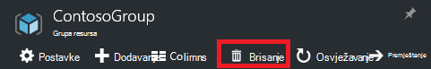

## Daljnji koraci

- Da biste pogledali zapisnike nadzora, potražite u članku [nadzora operacije s Voditelj resursa](../resource-group-audit.md).
- Da biste otklonili pogreške implementaciju, potražite u članku [Otklanjanje poteškoća resursa grupe implementacijama pomoću portala za Azure](../resource-manager-troubleshoot-deployments-portal.md).
- Implementacija resursi putem portala sustava potražite u članku [uvođenja resursa s resursima predloške i Azure portal](../resource-group-template-deploy-portal.md).
- Upravljanje pristupom resursima, potražite u članku [Korištenje dodjele uloga upravljanje pristup resursi za Azure pretplate](../active-directory/role-based-access-control-configure.md).

