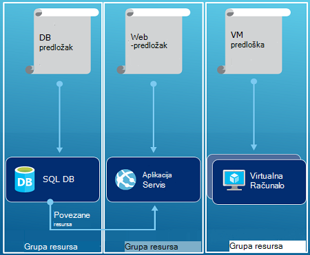

<properties
   pageTitle="Pregled Azure resursima | Microsoft Azure"
   description="U članku se opisuje kako koristiti Azure Voditelj resursa za implementaciju, upravljanje i pristup kontrole resursa na Azure."
   services="azure-resource-manager"
   documentationCenter="na"
   authors="tfitzmac"
   manager="timlt"
   editor="tysonn"/>

<tags
   ms.service="azure-resource-manager"
   ms.devlang="na"
   ms.topic="get-started-article"
   ms.tgt_pltfrm="na"
   ms.workload="na"
   ms.date="10/21/2016"
   ms.author="tomfitz"/>

# Pregled Azure Voditelj resursa

Infrastruktura za svoju aplikaciju obično sastoji od više komponenti – možda virtualnog računala, računa za pohranu i virtualne mreže ili web-aplikacijama, baze podataka, poslužitelj baze podataka i 3 davatelja usluga. Ne vidite te komponente kao zasebna entiteti, umjesto toga ih vi vidite povezane i međusobno zavisnih dijelove jedan entitet. Želite uvesti, upravljanje i praćenje ih kao grupu. Azure Voditelj resursa omogućuje rad s resursima u rješenje grupno. Možete uvesti, ažuriranje i brisanje svih resursa za rješenje u jednom, usklađenih postupak. Pomoću predloška za implementaciju i taj predložak možete iskoristiti različitim okruženjima kao što su testiranja, pripremna i proizvodnje. Voditelj resursa nudi sigurnosti, nadzor i značajke koje olakšavaju upravljanje resursa nakon implementacije za označavanje. 

## Terminologija

Ako ste novi za Azure Voditelj resursa, postoje neka uvjete možda niste upoznati s.

- **resurs** - moguće upravljati stavke koja je dostupan putem Azure. Nekoliko uobičajenih resursa virtualnog računala, račun za pohranu, web-aplikacije, baze podataka i virtualne mreže, no postoje mnogo više.
- **grupa resursa** – spremnika koja sadrži povezane resurse za Azure rješenja. Grupa resursa možete uključiti svi resursi za rješenja ili samo resursa koje želite upravljati kao grupu. Odlučite kako želite dodijeliti resurse grupama resursa koji se temelji na što vam najviše odgovara za tvrtku ili ustanovu. U odjeljku [grupe resursa](#resource-groups).
- **davatelja resursa** - servis koji dohvaćaju resursa možete uvesti i upravljati njima putem upravitelja resursa. Svaki davatelja resursa nudi postupci za rad s resursima koji su raspoređeni. Neki davatelji usluga uobičajenih resursa su Microsoft.Compute koji daje resursa virtualnog računala, Microsoft.Storage koji daje račun resursa za pohranu i Microsoft.Web koji daje resursi koji se odnose na web-aplikacije. U odjeljku [davatelji resursa](#resource-providers).
- **Voditelj resursa predložak** - A JavaScript objekt notacija (JSON) datoteka koja definira jedan ili više resursa za implementaciju u grupu resursa. Određuje i međuzavisnosti distribuiranih resursi. Predložak se može koristiti za implementaciju resurse dosljedno i više puta. [Uvođenje predloška](#template-deployment)potražite u članku.
- **sintaksa deklarativno** - sintaksa koja omogućuje stanja "Evo što koje namjeravate stvoriti" bez potrebe za pisanje slijed programiranje naredbe ga stvoriti. Voditelj resursa predložak je primjer deklarativno sintakse. U datoteci, definirati svojstava infrastrukture za implementaciju Azure. 

## Prednosti korištenja Voditelj resursa

Voditelj resursa pruža nekoliko prednosti:

- Možete uvesti, upravljanje i praćenje svih resursa za rješenje kao grupe umjesto pojedinačno rukovanje ove resurse.
- Možete više puta implementaciju rješenja životni ciklus razvoja i confidence su resursa u uveden u ujednačeno stanje.
- Možete upravljati preduvjete infrastrukture kroz deklarativno predložaka umjesto skripti.
- Možete definirati međuzavisnosti resurse tako da ih uvode ispravnim redoslijedom.
- Kontrola pristupa možete primijeniti na sve usluge u grupu resursa na temelju uloga kontrole pristupa (RBAC) nativno je integriran u platformu upravljanje.
- Oznake možete primijeniti na resurse da biste logično organizirali sve resursa u svoju pretplatu.
- Naplata u vašoj tvrtki ili ustanovi možete pojašnjavaju pregledom troškove za grupu resursa zajedničko korištenje istu oznaku.  

Voditelj resursa omogućuje novi način implementacije i upravljanja vašeg rješenja. Ako ste primijenili starijim model implementacije i želite saznati o promjenama, potražite u članku [Implementacija upravljanja resursima za razumijevanje i klasični implementacije](../resource-manager-deployment-model.md).

## Dosljedno upravljanje slojevima

Voditelj resursa nudi dosljedno upravljanje slojevima zadataka koji se izvršavaju Azure PowerShell, EŽA Azure, Azure portal, REST API-JA i alatima za razvoj. Sve alate pomoću zajednički skup operacije. Pomoću alata koji najbolje odgovara, a možete ih naizmjence koristiti bez zbrku. 

Sljedeće slike prikazuju kako sve alate za interakciju s istom Azure resursima API-jem. U API prosljeđuje zahtjeve za servis za Voditelj resursa koji potvrđuje i neadministratorskog zahtjeve. Voditelj resursa zatim preusmjerava zahtjeve davatelji odgovarajuće resursa.

## Upute

Sljedeće prijedloge za pomoći u potpunosti iskoristiti Voditelj resursa prilikom rada s vašeg rješenja.

1. Definiranje i implementacija infrastrukture kroz sintaksa deklarativno u predlošcima Voditelj resursa, a ne putem izuzetne naredbe.
2. Definiranje svih implementaciji i konfiguraciji koraka u predlošku. Trebali biste dobiti bez ručne korake za postavljanje vašeg rješenja.
3. Pokrenite izuzetne naredbi za upravljanje resurse, kao što su pokrenuti ili zaustaviti aplikaciju ili računalu.
4. Rasporedite resursi s istom životni ciklus u grupu resursa. Pomoću oznaka za sve druge organiziranje resursa.

Dodatne preporuke potražite u članku [preporučeni Načini stvaranja predloška Azure Voditelj resursa](../resource-manager-template-best-practices.md).

## Grupa resursa

Postoje neke važne čimbenici koje treba uzeti u obzir prilikom definiranja grupu resursa:

1. Resursa u vašoj grupi treba zajednički koristiti iste životni ciklus. Implementacija, ažuriranje i zajednički ih izbrisati. Ako jedan resurs, kao što je poslužitelj baze podataka, treba postoji na drugu implementaciju ciklusa mora biti u drugu grupu resursa.
2. Svaki resurs može postojati samo u jednu grupu resursa.
3. Možete dodati ili ukloniti resursa u grupu resursa u bilo kojem trenutku.
4. Resurs iz jedne grupe resursa možete premjestiti u drugu grupu. Dodatne informacije potražite u članku [Premještanje resursa ili pretplatu za novu grupu resursa](../resource-group-move-resources.md).
4. Grupa resursa mogu sadržavati resursi koji se nalaze u različitim područjima.
5. Grupa resursa mogu se opseg kontrole pristupa za administratorske akcije.
6. Resurs možete raditi s resursa u druge grupe resursa. Interakciju uobičajeno je kada dva resursa povezani, ali zajednički koristiti iste životni ciklus (na primjer, web apps povezivanje s bazom podataka).

Kada stvarate grupu resursa, morate je mjesto za tu grupu resursa. Koje možda se pitate li se, "Zašto grupu resursa mora mjesto? I, ako resursa možete imati različitim mjestima od grupa resursa, zašto lokacija grupu resursa važna uopće?" Grupa resursa pohranjuje metapodatke o resurse. Dakle, kada odredite mjesto za grupu resursa, određujete pohranjuju te metapodataka. Usklađenost razloga, morate biti sigurni da su podaci spremljeni unutar određenog područja.

## Davatelji resursa

Svaki davatelja resursa nudi skup resursa i postupci za rad sa servisom za Azure. Na primjer, ako želite spremiti ključeva i tajne, radite s davatelja resursa **Microsoft.KeyVault** . Ovaj resurs davatelj nudi resursa vrsta naziva **sefovi** za stvaranje ključa sigurnog i resursa vrsta naziva **sefovi/tajne** za stvaranje na tajna ključa zbirke ključeva. 

Prije no što počnete s implementacija resursa, trebali biste dobiti poznavati davatelja usluga dostupnih resursa. Zna nazive resursa davatelji i resursima vam omogućuje definiranje resursa koje želite implementirati Azure.

Dohvaćanje svih proizvođača resursa pomoću cmdleta komponente PowerShell sustava sljedeće:

    Get-AzureRmResourceProvider -ListAvailable

Ili s EŽA Azure dohvatite svih proizvođača resursa pomoću sljedeće naredbe:

    azure provider list

Vraćeni popisa možete pregledati davateljima resursa koje su vam potrebne da biste koristili.

Da biste vidjeli detalje o davatelju usluga resursa, dodati prostor za naziv davatelja naredbu. Naredba vraća vrste podržanih resursa za davatelja resursa i podržanim mjesta i verzije API-JA za svaku vrstu resursa. Sljedeći cmdlet PowerShell može vidjeti detalje o Microsoft.Compute:

    (Get-AzureRmResourceProvider -ProviderNamespace Microsoft.Compute).ResourceTypes

Ili s EŽA Azure dohvaćanje vrste podržanih resursa, mjesta i verzije API-JA za Microsoft.Compute, pomoću sljedeće naredbe:

    azure provider show Microsoft.Compute --json > c:\Azure\compute.json

Dodatne informacije potražite u članku [davatelji Voditelj resursa, područja, verzije API-JA i sheme](../resource-manager-supported-services.md).

## Uvođenje predloška

S Voditelj resursa možete stvoriti predložak (u JSON OSNOVNI oblik) koji definira Infrastruktura i konfiguraciji vašeg rješenja Azure. Pomoću predloška možete više puta implementaciju rješenja tijekom njegova životnog ciklusa te kako preuzeti pouzdanosti su resursa u uveden u ujednačeno stanje. Kada stvarate rješenje na portalu, rješenje automatski uključuje uvođenje predloška. Ne morate stvoriti predložak iznova jer možete započeti s predloškom za rješenje i ga prilagoditi kako bi odgovarao vašim potrebama. Predložak za postojeću grupu resursa možete dohvatiti izvoz trenutnog stanja u grupi resursa ili prikaz predložak koji se koristi za određeni implementaciju. Prikaz [izvezeni predložak](../resource-manager-export-template.md) je koristan način dodatne informacije o sintaksi predložak.

Dodatne informacije o obliku predloška i kako je sastavljanje potražite u članku [Za izradu predložaka Azure Voditelj resursa](../resource-group-authoring-templates.md) i [Resursima predložak vodič](../resource-manager-template-walkthrough.md).

Voditelj resursa obrađuje predložak kao što je bilo koji zahtjev (pogledajte sliku [dosljedno upravljanje layer](#consistent-management-layer)). Raščlanjuje predloška i pretvara njegovoj sintaksi u operacije REST API-JA za davatelje usluga odgovarajuće resursa. Ako, na primjer, kada resursima prima predloška s definicijom sljedećih resursa:

    "resources": [
      {
        "apiVersion": "2016-01-01",
        "type": "Microsoft.Storage/storageAccounts",
        "name": "mystorageaccount",
        "location": "westus",
        "sku": {
          "name": "Standard_LRS"
        },
        "kind": "Storage",
        "properties": {
        }
      }
      ]

Pretvara ga definicije REST API-JA operacije, koja se šalje davatelja resursa Microsoft.Storage:

    PUT
    https://management.azure.com/subscriptions/{subscriptionId}/resourceGroups/{resourceGroupName}/providers/Microsoft.Storage/storageAccounts/mystorageaccount?api-version=2016-01-01
    REQUEST BODY
    {
      "location": "westus",
      "properties": {
      }
      "sku": {
        "name": "Standard_LRS"
      },   
      "kind": "Storage"
    }

Kako odrediti predloške i grupa resursa nije potpuno na koji način želite upravljati rješenje. Na primjer, možete implementirati aplikaciju tri sloju kroz jedan predložak grupi jedan resursa.

No nemate da biste definirali infrastruktura za cijelu u jedan predložak. Često je li bolje podjele preduvjeti za implementaciju u čitav niz predložaka ciljano, specifične za više nije potrebna. Možete jednostavno ponovno iskoristiti te predloške za različite rješenja. Da biste implementirali određenog rješenja, stvorite predložak za osnovne koja povezuje sve potrebne predloške. Sljedeća slika prikazuje kako implementirati rješenje tri sloju kroz nadređeni predložak koji sadrži tri ugniježđene predloške.

Ako envision vaše razine pojavljuju zasebnom lifecycles, možete implementirati na tri razine za razdvajanje grupa resursa. Obratite pozornost na resurse i dalje mogu povezati s resursima u druge grupe resursa.

Više prijedloga o dizajniranju predložaka potražite u članku [uzoraka za dizajniranje Voditelj resursa Azure predložaka](../best-practices-resource-manager-design-templates.md). Informacije o predlošcima ugniježđene, potražite u članku [Rad s predlošcima povezane s Azure Voditelj resursa](../resource-group-linked-templates.md).

Azure Voditelj resursa analizira ovisnosti da biste bili sigurni resursi stvaraju se u točno određenim redoslijedom. Ako jedan resurs ovisi o vrijednost koja se nalazi na neki drugi resurs (kao što su virtualnog računala koje je potrebno je račun za pohranu za diskova), postavite ovisnosti. Dodatne informacije potražite u članku [Defining ovisnosti u predlošcima Azure Voditelj resursa](../resource-group-define-dependencies.md).

Predložak možete koristiti i ažuriranja za infrastrukturu. Ako, na primjer, dodavanje resursa u rješenje i dodati pravila za konfiguraciju za resurse koji su već ste implementirali. Ako predložak određuje stvaranje resursa, ali da resurs već postoji, Voditelj resursa Azure izvodi ažuriranje umjesto stvaranja novog resursa. Azure Voditelj resursa ažurira postojeće imovine u istom stanju kao što je kao novi.  

Voditelj resursa nudi proširenja za scenarije kada vam je potrebna dodatna operacija kao što su instalacije određeni softver koji se ne nalazi u. Ako već koristite servisa za upravljanje konfiguracije, primjerice DSC, Chef ili Puppet, možete nastaviti s radom uz servis pomoću proširenja. Informacije o proširenja virtualnog računala potražite u članku [o proširenja virtualnog računala i značajke](../virtual-machines/virtual-machines-windows-extensions-features.md). 

Na kraju, predložak postaje dio izvornog koda za aplikacije. Možete potvrdite ga spremištu kod vašeg izvora i ažurirati ga kao razvoja aplikacije. Možete urediti predložak kroz Visual Studio.

Nakon definiranja predložak, spremni ste za implementaciju resurse za Azure. Naredbe za implementaciju u resursima potražite u članku:

- [Implementacija resursa s resursima predloške i Azure PowerShell](../resource-group-template-deploy.md)
- [Implementacija resursi s resursima predloške i EŽA Azure](../resource-group-template-deploy-cli.md)
- [Implementacija resursa s resursima predloške i portal za Azure](../resource-group-template-deploy-portal.md)
- [Implementacija resursa s resursima predloške i resursima REST API-JA](../resource-group-template-deploy-rest.md)

## Oznaka

Voditelj resursa omogućuje označavanje značajka koja omogućuje da biste kategorizirali resursa u skladu s potrebama za upravljanje ili naplate. Pomoću oznaka kada složene skup resursa grupama i resursima, morate vizualizacija te imovine na način koji vam najviše odgovara. Na primjer, nije moguće oznaku resursa koji vam poslužiti slične uloga u tvrtki ili ustanovi ili nalaze u istom odjelu. Bez oznake, korisnici u vašoj tvrtki ili ustanovi možete stvoriti više resursa koji je teško kasnije prepoznavanje i upravljanje njima. Ako, na primjer, možda želite da biste izbrisali sve resurse za određeni projekt. Ako su tih resursa nije označeno za projekt, morate ručno ih pronaći. Označavanje može biti važan način želite smanjiti nepotrebne troškove u svoju pretplatu. 

Resursi ne moraju se nalaziti u istoj grupi resursa da biste zajednički koristili oznake. Možete stvoriti vlastitu taksonomije oznake da biste bili sigurni da svi korisnici u vašoj tvrtki ili ustanovi koristiti uobičajene oznake umjesto korisnici nenamjerno primjene malo drugačije oznake (kao što su "Odj" umjesto "odjela").

Sljedeći primjer prikazuje oznake primjenjuje se na virtualnog računala.

    "resources": [    
      {
        "type": "Microsoft.Compute/virtualMachines",
        "apiVersion": "2015-06-15",
        "name": "SimpleWindowsVM",
        "location": "[resourceGroup().location]",
        "tags": {
            "costCenter": "Finance"
        },
        ...
      }
    ]

Da biste dohvatili sve resurse vrijednošću oznaka, koristite sljedeći cmdlet komponente PowerShell:

    Find-AzureRmResource -TagName costCenter -TagValue Finance

Ili sljedeću naredbu Azure EŽA:

    azure resource list -t costCenter=Finance --json

Možete pogledati i označeni resursi putem portala za Azure.

[Izvješća o korištenju](../billing/billing-understand-your-bill.md) za vašu pretplatu sadrži nazive oznake i vrijednosti, koji omogućuje da biste prekinuli out troškove po oznake. Dodatne informacije o oznake potražite u članku [Korištenje oznake da biste organizirali Azure resurse](../resource-group-using-tags.md).

## Kontrola pristupa

Voditelj resursa omogućuje vam da biste kontrolirali tko ima pristup određene akcije za tvrtku ili ustanovu. Nativno integrira kontrola pristupa na temelju uloga (RBAC) u platformu za upravljanje i primijeniti kontrolu pristupa svim servisima u grupu resursa. 

Postoje dva glavna pojma da biste razumjeli kada radite s kontrola pristupa na temelju uloga:

- Definicija uloga - opisuju skup dozvola i može se koristiti u mnogo dodjele.
- Dodjele uloga – povežite definiciju s identiteta (korisnika ili grupu) za dani doseg (pretplatu, grupa resursa ili resursa). Dodjela nasljeđuju donjem opsega.

Korisnike možete dodati unaprijed definiranih platforme i uloga specifičnih za resursa. Na primjer, možete iskoristiti uloge unaprijed definiranih naziva čitača koji omogućuje korisnicima prikaz resursa, ali ne i promijeniti. Dodavanje korisnika u tvrtki ili ustanovi koje je potrebno tu vrstu pristupa ulozi čitač i primijenite ulogu pretplatu, grupa resursa ili resurs.

Azure nudi sljedeće četiri platformu uloge:

1.  Vlasnik – možete upravljati sve, uključujući programa access
2.  Sve osim programa access možete upravljati suradničke-
3.  Čitač – možete pogledati sve, ali ne možete mijenjati
4.  Administratorski pristup korisnika – možete upravljati korisničkog pristupa resursima za Azure

Azure sadrži i nekoliko resursa specifične uloge. Neke uobičajene su:

1.  Suradnik virtualnog računala – možete upravljati virtualnim strojevima, ali ne dodijelite pristup na njih, a nije moguće upravljati virtualne mreže ili prostora za pohranu račun s kojim su povezani
2.  Mreža suradnika – možete upravljati Svi mrežni resursi, ali se dati pristup do njih
3.  Suradnik račun za pohranu – možete upravljati računima za pohranu, ali se dati pristup do njih
4. SQL Server suradničke – možete upravljati SQL poslužitelja i baze podataka, ali ne njihove vezane uz sigurnost pravila
5. Suradnik web-mjesta – možete upravljati web-mjesta, ali ne tarife web na koji su povezani

Cijeli popis uloga i dopušteno akcije potražite u članku [RBAC: ugrađena uloge](../active-directory/role-based-access-built-in-roles.md). Dodatne informacije o kontrola pristupa na temelju uloga potražite u članku [Utemeljeno na ulogama Azure kontrola pristupa](../active-directory/role-based-access-control-configure.md). 

U nekim slučajevima koju želite pokrenuti kod ili skriptu koja pristupa resursima, ali ne želite pokrenuti u odjeljku korisničke vjerodajnice. Umjesto toga, želite identitet naziva servisa glavnice za aplikaciju za stvaranje i dodjela odgovarajuću ulogu upravitelja servisa. Voditelj resursa omogućuje vam stvaranje vjerodajnica za aplikaciju i programski provjere autentičnosti aplikacije. Dodatne informacije o stvaranju upravitelji servisa, potražite u nekom od sljedeće teme:

- [Stvaranje glavni servisa za pristup resursima pomoću Azure PowerShell](../resource-group-authenticate-service-principal.md)
- [Stvaranje glavni servisa za pristup resursima pomoću EŽA Azure](../resource-group-authenticate-service-principal-cli.md)
- [Stvaranje aplikacije servisa Active Directory i glavnica servis koji može pristupiti resursima pomoću portala](../resource-group-create-service-principal-portal.md)

Izričito također možete zaključati ključnih resurse da korisnici s brisanjem ili izmjena ih. Dodatne informacije potražite u članku [Lock resursi s Azure Voditelj resursa](../resource-group-lock-resources.md).

## Zapisnici aktivnosti

Voditelj resursa evidentira sve operacije koje stvaranje, izmjena i brisanje resurs. U zapisnicima aktivnosti možete koristiti da biste pronašli pogreške pri otklanjanju ili praćenje način na koji je korisnik u tvrtki ili ustanovi izmijenio resurs. Da biste pogledali zapisnike, odaberite **zapisnika aktivnosti** u plohu **Postavke** za grupu resursa. U zapisnicima možete filtrirati prema mnogo različitih vrijednosti uključujući koji je korisnik pokrene postupak. Informacije o radu sa zapisnicima aktivnosti, potražite u članku [nadzora operacije s Voditelj resursa](../resource-group-audit.md).

## Prilagođenih pravila

Voditelj resursa vam omogućuje stvaranje prilagođenih pravila za upravljanje resurse. Vrste pravilnika stvorite možete uključiti raznih scenarijima. Možete nametnuti imenovanja na resursa, ograničenja može uvesti koji su vrste i instance resursa, i koje područja možete hostirati vrstu resursa. Možete zatražiti vrijednost oznake na resurse za organiziranje naplatu po odjela. Stvaranje pravila radi smanjenja troškova i održavanje dosljednosti u svoju pretplatu. 

Definiranje pravilnika za JSON, a zatim primijenite ta pravila preko pretplate ili unutar grupu resursa. Pravila se razlikuju od kontrola pristupa na temelju uloga jer su primijenjeni na vrste resursa.

Sljedeći primjer prikazuje pravila koja osigurava oznaka dosljednost navođenjem da svi resursi uključiti costCenter oznake.

    {
      "if": {
        "not" : {
          "field" : "tags",
          "containsKey" : "costCenter"
        }
      },
      "then" : {
        "effect" : "deny"
      }
    }

Nema više vrste pravila možete stvoriti. Dodatne informacije potražite u članku [Korištenje pravilnika za upravljanje resursima i nadzor pristupa](../resource-manager-policy.md).

## SDK-ovi

Azure SDK-ovi dostupni su za više jezika i platformama.
Svaki od tih jezika implementacije je dostupan putem njezin Upravitelj zajednici paketa i GitHub.

Kod u svakoj od tih SDK-ovi se generira iz specifikacije Azure RESTful API.
Ove specifikacije se Otvori izvor i na temelju opisa Swagger 2.0.
Kod SDK generira se putem programa project Otvori izvor pod nazivom AutoRest.
AutoRest pretvorbe te RESTful API specifikacije u bibliotekama klijenta na više jezika.
Ako želite da biste poboljšali sve aspekte generirani kod u na SDK-ovi, cijeli skup alata za stvaranje na SDK-ovi su otvori, slobodno možete i ovisno o obliku specifikacija široko adopted API-JA.

Evo naš spremištima SDK Otvori izvor. Ne možemo Dobro došli povratne informacije, probleme i povući zahtjeva.

[.NET](https://github.com/Azure/azure-sdk-for-net) | [Java](https://github.com/Azure/azure-sdk-for-java) | [Node.js](https://github.com/Azure/azure-sdk-for-node) | [PHP](https://github.com/Azure/azure-sdk-for-php) | [Python](https://github.com/Azure/azure-sdk-for-python) | [Ruby](https://github.com/Azure/azure-sdk-ruby)

> [AZURE.NOTE]Ako SDK ne nudi tu funkciju, koje možete i izravno upućivanje poziva za [Azure REST API -JA](https://msdn.microsoft.com/library/azure/dn790568.aspx) .

## Uzorci

### .NET

- [Upravljanje Azure resursa i grupa resursa](https://azure.microsoft.com/documentation/samples/resource-manager-dotnet-resources-and-groups/)
- [Implementacija programa SSH VM s omogućenom predloška](https://azure.microsoft.com/documentation/samples/resource-manager-dotnet-template-deployment/)

### Java

- [Upravljanje resursima za Azure](https://azure.microsoft.com/documentation/samples/resources-java-manage-resource/)
- [Upravljanje grupama za Azure resursa](https://azure.microsoft.com/documentation/samples/resources-java-manage-resource-group/)
- [Implementacija programa SSH VM s omogućenom predloška](https://azure.microsoft.com/documentation/samples/resources-java-deploy-using-arm-template/)

### Node.js

- [Upravljanje Azure resursa i grupa resursa](https://azure.microsoft.com/documentation/samples/resource-manager-node-resources-and-groups/)
- [Implementacija programa SSH VM s omogućenom predloška](https://azure.microsoft.com/documentation/samples/resource-manager-node-template-deployment/)

### Python

- [Upravljanje Azure resursa i grupa resursa](https://azure.microsoft.com/documentation/samples/resource-manager-python-resources-and-groups/)
- [Implementacija programa SSH VM s omogućenom predloška](https://azure.microsoft.com/documentation/samples/resource-manager-python-template-deployment/)

### Ruby

- [Upravljanje Azure resursa i grupa resursa](https://azure.microsoft.com/documentation/samples/resource-manager-ruby-resources-and-groups/)
- [Implementacija programa SSH VM s omogućenom predloška](https://azure.microsoft.com/documentation/samples/resource-manager-ruby-template-deployment/)

Osim tih uzorka, možete pretražiti uzoraka galerije.

[.NET](https://azure.microsoft.com/documentation/samples/?service=azure-resource-manager&platform=dotnet) | [Java](https://azure.microsoft.com/documentation/samples/?service=azure-resource-manager&platform=java) | [Node.js](https://azure.microsoft.com/documentation/samples/?service=azure-resource-manager&platform=nodejs) | [Python](https://azure.microsoft.com/documentation/samples/?service=azure-resource-manager&platform=python) | [Ruby](https://azure.microsoft.com/documentation/samples/?service=azure-resource-manager&platform=ruby)

## Daljnji koraci

- Jednostavan Uvod u rad s predlošcima potražite u članku [Izvoz predložak Voditelj resursa Azure iz postojećih resursa](../resource-manager-export-template.md).
- Dodatna vodič stvaranja predloška potražite u članku [Vodič za upravljanje resursima predložak](../resource-manager-template-walkthrough.md).
- Da biste shvatili funkcije možete koristiti u predlošku, potražite u odjeljku [funkcije predloška](../resource-group-template-functions.md)
- Informacije o korištenju Visual Studio sa Voditelj resursa potražite u članku [Stvaranje i implementacija grupe Azure resursa kroz Visual Studio](../vs-azure-tools-resource-groups-deployment-projects-create-deploy.md).
- Informacije o pomoću koda za dodavanje veze za VANJSKIH s Voditelj resursa potražite u članku [Rad s predlošcima resursima Azure u Visual Studio kod](../resource-manager-vs-code.md).

Evo pokazni videozapis o ovom pregled:

[AZURE.VIDEO azure-resource-manager-overview]

[powershellref]: https://msdn.microsoft.com/library/azure/dn757692(v=azure.200).aspx
