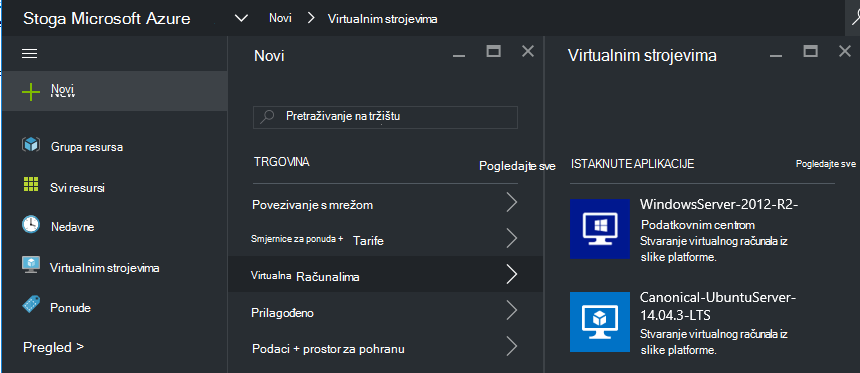
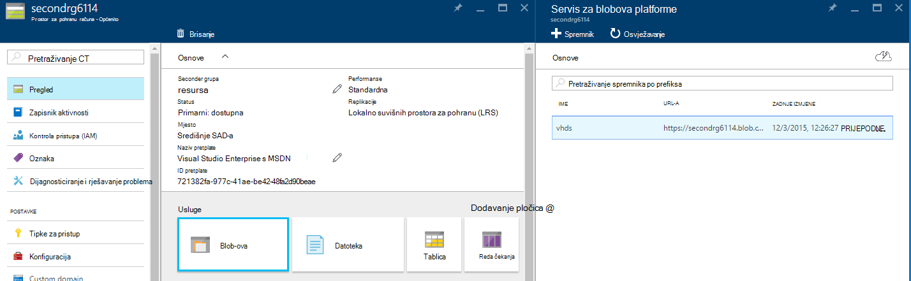
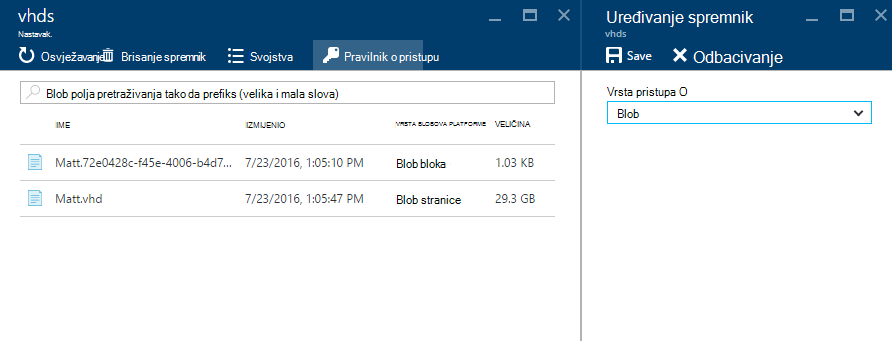
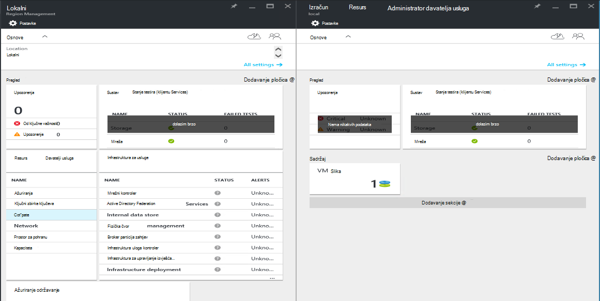
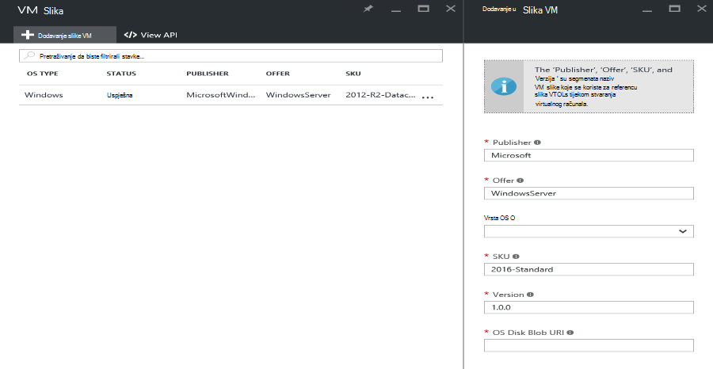

<properties
    pageTitle="Dodavanje VM slike u stogu Azure | Microsoft Azure"
    description="Dodavanje vaše tvrtke ili ustanove prilagođene Windows ili Linux VM slike za klijenata za korištenje"
    services="azure-stack"
    documentationCenter=""
    authors="mattmcg"
    manager="darmour"
    editor=""/>

<tags
    ms.service="azure-stack"
    ms.workload="na"
    ms.tgt_pltfrm="na"
    ms.devlang="na"
    ms.topic="get-started-article"
    ms.date="09/26/2016"
    ms.author="mattmcg"/>

# <a name="make-a-custom-virtual-machine-image-available-in-azure-stack"></a>Dostupnost prilagođene virtualnog računala slike u stogu Azure


Administratorima dostupnim VM slike, kao što su prilagođene VHD svoje tvrtke ili ustanove, s svojim korisnicima omogućuje Azure stogu. Slike možete referencira Voditelj resursa Azure predložaka ili dodati Azure Marketplace korisničkog Sučelja stvaranjem stavke na tržištu. Sliku Windows Server 2012 R2 uključena je prema zadanim postavkama u stogu Azure za Tehnički pretpregled.

> [AZURE.NOTE] Slika VM sa stavkama trgovine može uvesti tako da odaberete **Novo** u korisničkom Sučelju, a zatim odaberite kategoriju **virtualnim računalima** . Navedene su stavke VM slike.


## <a name="add-a-vm-image-to-marketplace-with-powershell"></a>Dodavanje slike VM Marketplace sa servisom PowerShell

Ako slika VM VHD nije dostupan lokalno na konzoli VM (ili neki drugi uređaj vanjsko povezanog), poduzmite sljedeće korake:

1. Priprema Windows ili Linux operacijski sustav virtualne na tvrdom disku sliku u obliku VHD (ne VHDX).
    -   Za slike u sustavu Windows, u članku [Prijenos Windows VM slike za Azure za resursima implementacije](virtual-machines-windows-upload-image.md) sadrži upute za pripremu slika u odjeljku **Priprema VHD za prijenos** .
    -   Za Linux slike, slijedite korake da biste Priprema slike ili koristili postojeću sliku Azure stogu Linux kao što je opisano u članku [Implementacija Linux virtualnim strojevima na hrpu Azure](azure-stack-linux.md).

2. Kloniraj [spremište Azure stogu Alati](https://aka.ms/azurestackaddvmimage), a zatim uvezete modul **ComputeAdmin**

    ```powershell
    Import-Module .\ComputeAdmin\AzureStack.ComputeAdmin.psm1
    ```

3. Dodavanje slike VM po pozivanje cmdlet za dodavanje VMImage.
    -  Obuhvaćaju publisher, ponuda, SKU i verzija za VM sliku. Voditelj resursa Azure predloške koje se odnose na sliku VM koristi parametara.
    -  Odredite osType kao Windows i Linux.
    -  Uključiti svoj ID klijenta Azure Active Directory u obrazac * &lt;myaadtenant&gt;*. onmicrosoft.com.
    - Slijedi poziva na primjer skripte:

    ```powershell
       Add-VMImage -publisher "Canonical" -offer "UbuntuServer" -sku "14.04.3-LTS" -version "1.0.0" -osType Linux -osDiskLocalPath 'C:\Users\AzureStackAdmin\Desktop\UbuntuServer.vhd' -tenantID <myaadtenant>.onmicrosoft.com
    ```

    > [AZURE.NOTE] Cmdlet zahtijeva vjerodajnice za dodavanje slike VM. Unesite administrator Azure Active Directory vjerodajnice, kao što su serviceadmin@ * &lt;myaadtenant&gt;*. onmicrosoft.com na upit.  

Naredba čini sljedeće:
- Potvrđuje okruženje stogu Azure
- Prenosi lokalni VHD novostvorenu privremenu pohranu računa
- Dodaje VM sliku u spremištu VM slike
- Stvara stavku Marketplace

Da biste provjerili uspješno pokrenuli naredbu, idite na portalu za trgovinu, a zatim provjerite je li slika VM dostupni u kategoriji **virtualnim računalima** .

> 

Slijedi opis parametara naredbe.


| Parametar | Opis |
|----------| ------------ |
|**tenantID** | Svoj ID klijenta Azure Active Directory u obrascu * &lt;AADTenantID*. onmicrosoft.com&gt;. |
|**Publisher** | Publisher naziv segment VM sliku koja klijenata za korištenje prilikom implementacije slike. Primjer je "Microsoft". Nemojte uvrstiti razmak ili druge posebne znakove u ovom polju.|
|**ponude** | Naziv segment ponuda, VM slike koji klijenata za korištenje prilikom implementacije VM slike. Primjer je 'WindowsServer'. Nemojte uvrstiti razmak ili druge posebne znakove u ovom polju. |
| **SKU** | SKU naziv segment VM slike koju klijenata za korištenje prilikom implementacije VM slike. Primjer je 'Datacenter2016'. Nemojte uvrstiti razmak ili druge posebne znakove u ovom polju. |
|**verzija** | Verzija VM slike koju klijenata za korištenje prilikom implementacije VM slike. Ova verzija je u obliku * \#.\#. \#*. Primjer je '1.0.0'. Nemojte uvrstiti razmak ili druge posebne znakove u ovom polju.|
| **osType** | OsType slika mora biti 'Windows' ili "Linux". |
|**osDiskLocalPath** | Lokalni put na disk OS VHD koja se prenosi kao sliku VM snop Azure. |
|**dataDiskLocalPaths**| Neobavezna polja lokalne putove za diskova podataka koje je moguće prenijeti kao dio slike VM.|
|**CreateGalleryItem**| Booleova Zastavica koja određuje želite li stvoriti stavku tržištu. Zadani je postavljen na true.|
|**Naslov**| Zaslonsko ime trgovine stavke. Zadani postavljen je na Publisher-ponuda-Sku VM slike.|
|**Opis**| Opis stavke trgovine. |
|**osDiskBlobURI**| Po želji, Ova skripta prihvaća spremište blobova platforme URI za osDisk.|
|**dataDiskBlobURIs**| Po želji, Ova skripta i prihvaća polja blobova ji za dodavanje podataka diskova sliku.|


## <a name="add-a-vm-image-through-the-portal"></a>Dodavanje slike VM putem portala sustava

> [AZURE.NOTE] Ovu metodu zahtijeva stvaranje trgovine stavku zasebno.

Jedan zahtjev slika je da se mogu upućivati blobova URI. Priprema Windows ili Linux operacijski sustav virtualne na tvrdom disku sliku u obliku VHD (ne VHDX), a zatim prijenos slike s računom za pohranu u Azure ili u stogu Azure. Ako sliku već prenijeli u spremište blobova platforme Azure ili u stogu Azure, možete preskočiti ovaj korak.

Slijedite korake iz članka [prenijeti sliku Windows VM za Azure za resursima implementacije](https://azure.microsoft.com/documentation/articles/virtual-machines-windows-upload-image/) kroz postupak **Prijenos slike VM na račun servisa za pohranu**. Imajte na umu sljedeće:

-   Linux slika, slijedite upute da biste pripremili slike ili koristite postojeću sliku Azure stogu Linux kao što je opisano u članku [Implementacija Linux virtualnim strojevima na hrpu Azure](azure-stack-linux.md).

- To je učinkovitiji prenijeti sliku sa spremištem blobova platforme Azure stogu od spremište blobova platforme Azure jer je potrebno manje vremena za automatske VM slike u stogu Azure slika spremište. Tijekom slijedite upute za prijenos, provjerite je li zamijeniti korak [Autentičnost PowerShell s Microsoft Azure stogu](azure-stack-deploy-template-powershell.md) 'Prijava za Azure' koraka.

- Zabilježite blobova URI koju prenijeti sliku. Ima sljedećem obliku: * &lt;storageAccount&gt;/&lt;blobContainer&gt;/&lt;targetVHDName&gt;*.vhd

2.  Da biste anonimno pristupiti blob-om, idite na spremnik za pohranu računa blob gdje je slika VM VHD prenijeli **Blob,** a zatim odaberite **Pravilnik o pristupu**. Ako želite, umjesto toga možete generirati zajednički pristup potpis za spremnik i uključiti kao dio blob URI.





1.  Prijavite se u stogu Azure kao administrator. Idite na **područje upravljanje**. Zatim u odjeljku **RPs**, odaberite **Davatelja resursa za izračun** > **VM slike** > **tečaj**

    

2.  Na sljedeće plohu unesite publisher, ponuda, SKU i verzije VM slike. Ove segmenata naziv odnose se na VM slike u predlošcima Azure Voditelj resursa. Provjerite jeste li pravilno odaberite **osType** . Za **osDiskBlobURI**unesite URI gdje je prenijeti sliku u koraku 1. Kliknite **Stvori** da biste započeli stvaranje VM slike.

    

3.  Status VM slike mijenja se u "je"uspjelo Nakon uspješnog dodavanja slike.

4.  Samoposlužni možete implementirati slika VM navođenjem publisher, ponuda, SKU i verzije slike VM u predlošku Azure Voditelj resursa. Da biste sliku VM još uvijek su dostupne za klijent potrošnje u korisničkom Sučelju, preporučuje se da biste [stvorili trgovine stavku](azure-stack-create-and-publish-marketplace-item.md).
