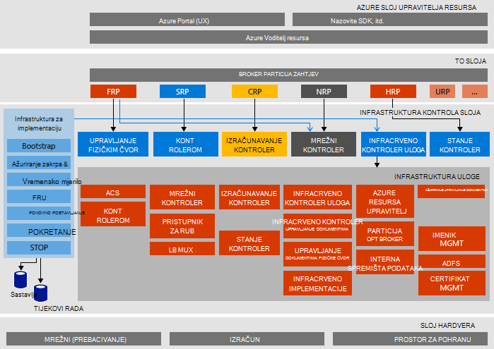

<properties
    pageTitle="Arhitektura Microsoft Azure stogu dokaz od pojam (PNA) | Microsoft Azure"
    description="Pogledati arhitekturi Microsoft Azure stogu PNA."
    services="azure-stack"
    documentationCenter=""
    authors="heathl17"
    manager="byronr"
    editor=""/>

<tags
    ms.service="azure-stack"
    ms.workload="na"
    ms.tgt_pltfrm="na"
    ms.devlang="na"
    ms.topic="article"
    ms.date="10/25/2016"
    ms.author="helaw"/>

# Microsoft Azure stogu PNA arhitekture

Stoga PNA Azure je jedan čvor implementacije Azure stogu Tehnički pretpregled 2. Sve komponente su instalirani na virtualnim računalima sustava pokrenut na jednom glavnom računalu. 

## Logička arhitektura dijagrama
Sljedeći dijagram prikazuje logičke arhitektura PNA snop Azure i njegove komponente.

## Uloge virtualnog računala
Stoga PNA Azure nudi servise pomoću sljedećih VMs na glavnom računalu PNA:

 - **MAS ACS01** Virtualnog računala hosting Azure stogu servise za pohranu.

 - **MAS ADFS01** Virtualnog računala hosting Active Directory Federation Services.  U ovom virtualnog računala ne koristi u Tehnički pretpregled 2.  

 - **MAS ASQL01**  Virtualnog računala koja omogućuje internih podataka za pohranu za Azure stogu infrastrukture uloge.  

 - **MAS BGPNAT01** Virtualnog računala ulozi na rub usmjerivača i pruža mogućnosti NAT i VPN-a za Azure stogu.

 - **MAS CA01** Virtualnog računala pružanja usluge izdavanje certifikata za servisa Azure stogu uloga.

 - **MAS CON01** Dostupno za razvojne inženjere za instalaciju PowerShell, Visual Studio i druge alate za virtualnog računala.

 - **MAS DC01** Virtualnog računala hosting servisa Active Directory, DNS i DHCP usluge za Microsoft Azure stogu.

 - **MAS GWY01** Virtualnog računala pruža rub pristupnika servise kao što je VPN veza web-mjesto za klijentske mreže.

 - **MAS NC01**  Virtualnog računala hosting mrežni kontroler koji upravlja Azure stogu mrežnim servisima.  

 - **MAS SLB01**  Virtualnog računala omogućuje servise u stogu Azure za klijenata i servisa Azure stogu infrastrukture za ujednačavanje opterećenja.  

 - **MAS SUS01**  Virtualna hosting servisa Windows Server Update, i odgovorna za osiguravanje ažuriranja za druge virtualnim strojevima stogu Azure.

 - **MAS WAS01**  Virtualnog računala koji se nalaze i portal servisa Azure Voditelj resursa.

 - **MAS XRP01** Virtualnog računala u kojem je smještena davatelje usluga resursa core Microsoft Azure snopa, uključujući resursa davatelji računalnim, mreže i prostora za pohranu.

## Servise za pohranu
Servise za pohranu u operacijskom sustavu na glavnom računalu fizičke obuhvaćaju sljedeće:

 - **ACS Blob servisa** Azure dosljedan spremište blobova platforme servis koji omogućuje servise za pohranu blob i tablice.

 - **SoFS** Promjena veličine iz datotečnog poslužitelja.

 - **ReFS CSV** Prebacuju datoteka sustava klaster zajednički koriste glasnoću.

 - **Virtualni Disk**, **Prostora za pohranu**i **Pohranu razmake Izravni** su odgovarajući pozadinsku tehnologiju prostora za pohranu u sustavu Windows Server da biste omogućili davatelja resursa za pohranu Microsoft Azure stogu core.

## Daljnji koraci

[Implementacija Azure stogu](azure-stack-deploy.md)

[Prvi scenariji pokušati](azure-stack-first-scenarios.md)

