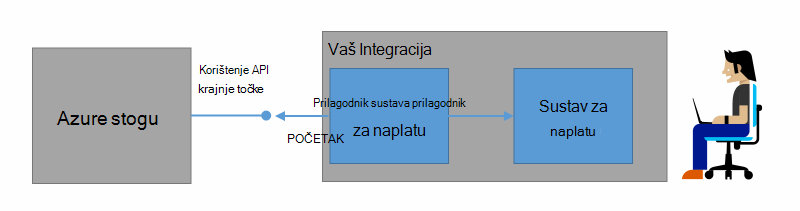
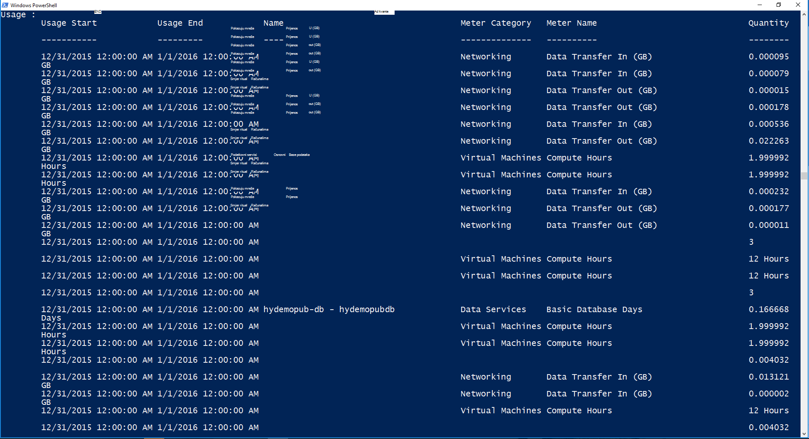

<properties
    pageTitle="Naplata klijenta i Chargeback u stogu Azure | Microsoft Azure"
    description="Saznajte kako Dohvaćanje informacija o korištenju resursa iz Azure stogu."
    services="azure-stack"
    documentationCenter=""
    authors="AlfredoPizzirani"
    manager="byronr"
    editor=""/>

<tags
    ms.service="azure-stack"
    ms.workload="na"
    ms.tgt_pltfrm="na"
    ms.devlang="na"
    ms.topic="article"
    ms.date="10/18/2016"
    ms.author="alfredop"/>

# Klijenta za naplatu i chargeback u stogu Azure

Sad kad koristite stogu Azure, je dobro razmislite o tome kako pratiti korištenje. Davatelji usluga oslanjate informacije o korištenju izraditi fakturu svoje kupce, a da biste shvatili trošak pružanja usluge.
Korporacije, obično praćenje korištenja odjel.

Azure stog nije naplatu sustava. Ga neće naplatiti vaše klijenata za resurse koji se koriste. Ali, stoga Azure infrastrukturu za prikupljanje i prikupljati podatke o korištenju za svaki pojedinačni resurs davatelja usluga. Možete pristupiti te podatke i izvoz naplatu sustava pomoću prilagodnik za naplatu ili izvoz u alatu za poslovne inteligencije kao što je Microsoft Power BI.

## Koje informacije o korištenju možete pronaći, a kako?

Davatelji resursa za Azure snop generirati zapisa za korištenje svaki sat intervalima. Zapisi Prikaži količinu svaki resurs koji je potrošena i pretplati potrošena resursa. U ovom se podaci se pohranjuju. Možete pristupiti podataka putem REST API-JA.

Administrator servisa možete dohvatiti podatke o korištenju za sve pretplate na klijentu. Pojedinačne klijenata možete dohvatiti samo svoje podatke.

Korištenje zapisa sadrže informacije o prostora za pohranu, mreža i korištenju računalnim. Popis metar, potražite u [ovom članku](azure-stack-usage-related-faq.md).

## Dohvaćanje informacija o korištenju

Da biste generirali zapisa je ključan imate resursi operacijski sustav, a Aktivno u sustavu. Ako niste sigurni imate li neki resursi pokrenut, trgovine Windows Azure stogu implementirati, a zatim pokrenite virtualnog računala (VM). Susret VM nadzor plohu li se izvodi.

Preporučujemo da pokrenete cmdleta ljuske Windows PowerShell za prikaz podataka o korištenju.
PowerShell poziva API-ji za korištenje resursa.

1.  [Instalirati i konfigurirati Azure PowerShell](https://azure.microsoft.com/en-us/documentation/articles/powershell-install-configure/).

2.  Upute za prijavu za Azure Voditelj resursa pomoću cmdleta ljuske PowerShell **Prijava AzureRmAccount**.

3.  Da biste odabrali pretplatu u koju ste koristili za stvaranje resursa, upišite **Get-AzureRmSubscription – SubscriptionName "vaše sub" | Odaberite AzureRmSubscription**.

4.  Za dohvaćanje podataka pomoću cmdleta ljuske PowerShell [**Get-UsageAggregates**](https://msdn.microsoft.com/en-us/library/mt619285.aspx).
    Ako podatke o korištenju nije dostupan, vratit će se u ljusci PowerShell, kao u sljedećem primjeru. PowerShell vraća 1000 retke korištenje po poziv.
    Argument *nastavka* možete koristiti za dohvaćanje skupa reci izvan prvi 1000. Dodatne informacije o korištenju podataka potražite u članku [Referenca API -JA za korištenje resursa](azure-stack-provider-resource-api.md).

    

## Daljnji koraci

[Korištenje resursa davatelja API-JA](azure-stack-provider-resource-api.md)

[Smjernice za korištenje resursa API-JA](azure-stack-tenant-resource-usage-api.md)

[Najčešća pitanja vezana uz vezane uz korištenje](azure-stack-usage-related-faq.md)
