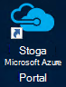
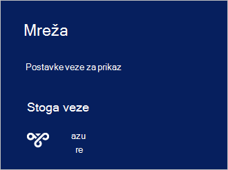

<properties
    pageTitle="Povezivanje s Azure stogu | Microsoft Azure"
    description="Saznajte kako se povezati stogu Azure"
    services="azure-stack"
    documentationCenter=""
    authors="ErikjeMS"
    manager="byronr"
    editor=""/>

<tags
    ms.service="azure-stack"
    ms.workload="na"
    ms.tgt_pltfrm="na"
    ms.devlang="na"
    ms.topic="get-started-article"
    ms.date="10/18/2016"
    ms.author="erikje"/>

# <a name="connect-to-azure-stack"></a>Povezivanje s Azure stogu
Da biste upravljali resursa, morate se povezati s računalom PNA snop Azure. Možete koristiti bilo koju od sljedećih mogućnosti povezivanja:

 - Udaljena radna površina: omogućuje brzo povezivanje s računala PNA jednom korisniku Istodobni.
 - Virtualne privatne mreže (VPN-a): omogućuje većem broju korisnika Istodobni povezati s klijenti izvan infrastrukture Azure snop (zahtijeva konfiguracije).

## <a name="connect-with-remote-desktop"></a>Povezivanje s udaljene radne površine
S vezom za udaljene radne površine jednom korisniku Istodobni možete raditi s portala za upravljanje resursima. Možete koristiti i alate na MAS CON01 virtualnog računala.

1.  Prijavite se na računalo fizičke PNA snop Azure.

2.  Otvorite udaljene radne površine i povezivanje s MAS CON01. Unesite **AzureStack\AzureStackAdmin** kao korisničko ime i administratora lozinkom tijekom postavljanja Azure stogu.  

3.  Na radnoj površini MAS CON01, dvokliknite ikonu **Microsoft Azure stogu Portal** (https://portal.azurestack.local/) da biste otvorili [portal](azure-stack-key-features.md#portal).

    

4.  Prijavite se pomoću servisa Azure Active Directory vjerodajnice navedene tijekom instalacije.

## <a name="connect-with-vpn"></a>Povezivanje s VPN-a
Virtualna privatna mreža povezivanja korisnicima više Istodobni povezati s klijenti izvan infrastruktura za Azure stogu. Možete koristiti na portalu za upravljanje resoures. Alati, kao što su Visual Studio i komponente PowerShell možete koristiti i na lokalno klijentsko.

1.  Instalirajte modul AzureRM pomoću sljedeće naredbe:
   
    ```PowerShell
    Install-Module -Name AzureRm -RequiredVersion 1.2.6 -Scope CurrentUser
    ```   
   
2. Preuzmite skripte Azure stogu Alati.  Datoteke koje se mogu preuzeti pregledavanja weba u [spremištu GitHub](https://github.com/Azure/AzureStack-Tools), ili pokretanjem sljedeće skripte komponente Windows PowerShell kao administrator službi za podršku:
    
    >[AZURE.NOTE]  Sljedeće korake potrebna PowerShell 5.0.  Da biste provjerili verziju, pokrenite $PSVersionTable.PSVersion i Usporedba "Glavne" verzije.  

    ```PowerShell
       
       #Download the tools archive
       invoke-webrequest https://github.com/Azure/AzureStack-Tools/archive/master.zip -OutFile master.zip

       #Expand the downloaded files. 
       expand-archive master.zip -DestinationPath . -Force

       #Change to the tools directory
       cd AzureStack-Tools-master
    ````

3.  U isti sesiju ljuske PowerShell dođite do mape **za povezivanje** i uvoz modul AzureStack.Connect.psm1:

    ```PowerShell
    cd Connect
    import-module .\AzureStack.Connect.psm1
    ```

4.  Da biste stvorili Azure stogu VPN vezu, pokrenite sljedeće komponente Windows PowerShell. Prije pokretanja, popuniti administratorsku lozinku i polja adresa za Azure stogu glavnog računala. 
    
    ```PowerShell
    #Change the IP Address below to match your Azure Stack host
    $hostIP = "<HostIP>"

    # Change password below to reference the password provided for administrator during Azure Stack installation
    $Password = ConvertTo-SecureString "<Admin Password>" -AsPlainText -Force

    # Add Azure Stack One Node host & CA to the trusted hosts on your client computer
    Set-Item wsman:\localhost\Client\TrustedHosts -Value $hostIP -Concatenate
    Set-Item wsman:\localhost\Client\TrustedHosts -Value mas-ca01.azurestack.local -Concatenate  

    # Update Azure Stack host address to be the IP Address of the Azure Stack POC Host
    $natIp = Get-AzureStackNatServerAddress -HostComputer $hostIP -Password $Password

    # Create VPN connection entry for the current user
    Add-AzureStackVpnConnection -ServerAddress $natIp -Password $Password

    # Connect to the Azure Stack instance. This command (or the GUI steps in step 5) can be used to reconnect
    Connect-AzureStackVpn -Password $Password 
    ```

5. Kada se to od vas zatraži, pouzdanost voditelju Azure stogu.

6. Kada se to od vas zatraži, instalirajte certifikat (pitanje se pojavljuje iza prozora sesije Powershell).

7. Da biste testirali portala veze, u web-pregledniku, pomaknite se do *https://portal.azurestack.local*.

8. Da biste pregledali i upravljanje Azure stogu veze, poslužite se **mreža** na klijent:

    

>[AZURE.NOTE] U ovom VPN veza ne nudi povezivanje VMs ili drugih resursa. Informacije o povezivanje resursima potražite u članku [Jedan čvor VPN veza](azure-stack-create-vpn-connection-one-node-tp2.md)


## <a name="next-steps"></a>Daljnji koraci
[Prvi zadaci](azure-stack-first-scenarios.md)

[Instalacija i povezivanje sa servisom PowerShell](azure-stack-connect-powershell.md)

[Instalacija i povezati se s EŽA](azure-stack-connect-cli.md)


