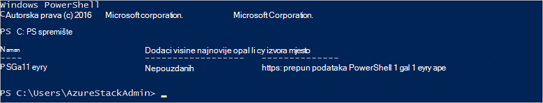

<properties
    pageTitle="Povezivanje s Azure snop sa servisom PowerShell | Microsoft Azure"
    description="Informirajte se o upravljanju Azure snop sa servisom PowerShell"
    services="azure-stack"
    documentationCenter=""
    authors="HeathL17"
    manager="byronr"
    editor=""/>

<tags
    ms.service="azure-stack"
    ms.workload="na"
    ms.tgt_pltfrm="na"
    ms.devlang="na"
    ms.topic="article"
    ms.date="10/19/2016"
    ms.author="helaw"/>

# Instaliranje komponente PowerShell i povezati stogu Azure
U ovom vodiču vodit ćemo kroz korake za povezivanje Azure snop sa servisom PowerShell. Nakon dovršetka, ove korake i omogućuju upravljanje i implementacija resursi.

## Instalacija cmdleta ljuske PowerShell stogu Azure

1.  Cmdleti za AzureRM instaliraju iz galerije PowerShell. Da biste započeli, otvorite konzole za PowerShell na MAS CON01 i pokrenite sljedeću naredbu da biste se vratili popis PowerShell spremištima dostupne:

        Get-PSRepository

      

2.  Pokrenite sljedeću naredbu da biste instalirali AzureRM module:

        Install-Module -Name AzureRM -RequiredVersion 1.2.6 -Scope CurrentUser

    >[AZURE.NOTE] *-CurrentUser opseg* nije obavezno. Ako želite više od trenutnog korisnika da biste imali pristup module, koristite povećane naredbeni redak i ispustiti parametar *opseg* .

3.  Da biste potvrdili instaliranje modula AzureRM, izvršiti sljedeće naredbe:

        Get-Command -Module AzureRM.AzureStackAdmin

## Povezivanje s Azure stogu
Modul dostupna je za preuzimanje koji rukuje Konfiguriranje veze PowerShell Azure snop umjesto vas.  Posjetite [Azure stogu Alati](http://aka.ms/ConnectToAzureStackPS) za modul i dodatne korake. 

## Dohvaćanje popisa pretplate
U ovom ćete odjeljku provjerite cmdleta ljuske PowerShell koristite protiv Azure stogu dohvaćanja i odabirom pretplatu za korištenje.

Pokrenite sljedeću naredbu dohvatiti popis pretplata Azure stogu povezan s vašim računom:

    Get-AzureRmSubscription

## Daljnji koraci
[Implementirati predloške pomoću komponente PowerShell](azure-stack-deploy-template-powershell.md)

[Povezivanje s Azure EŽA](azure-stack-connect-cli.md)

[Implementirati predloške pomoću Visual Studio](azure-stack-deploy-template-visual-studio.md)

