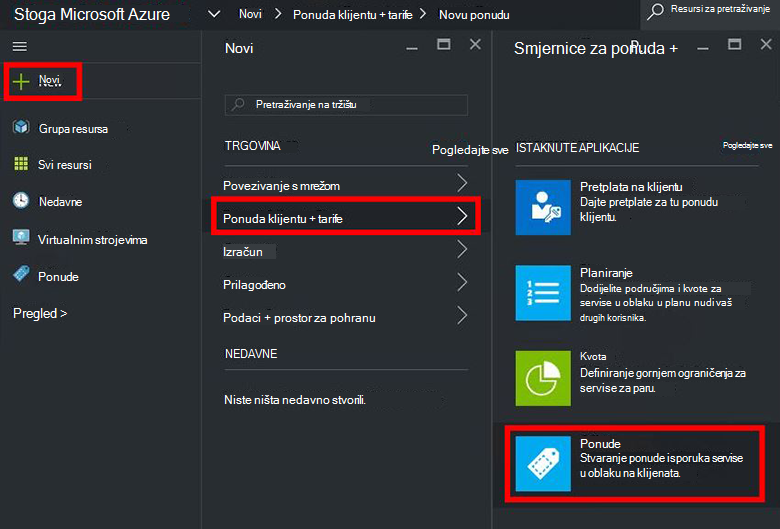
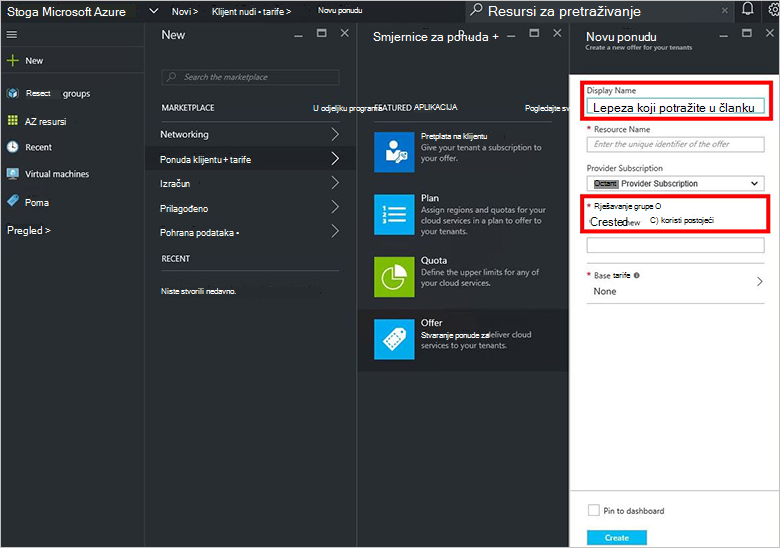
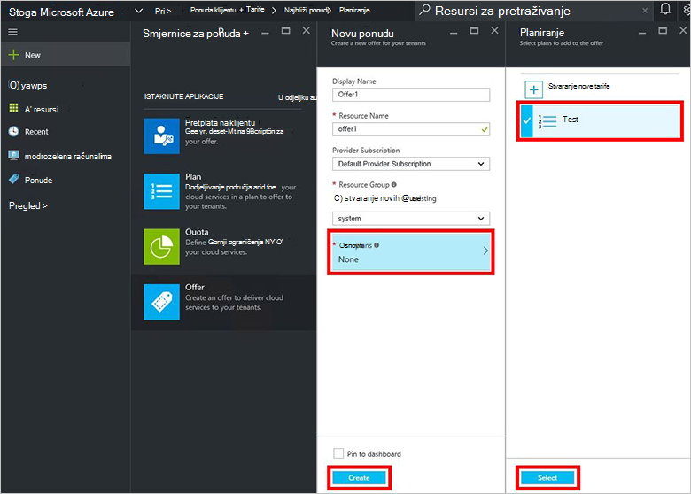
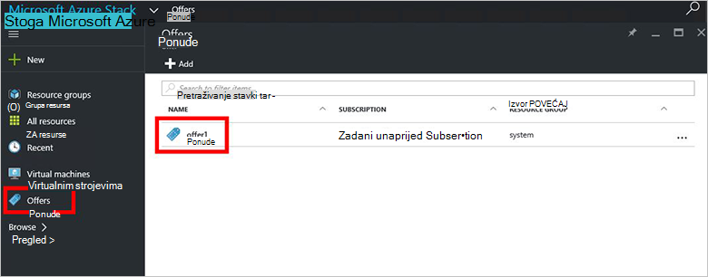
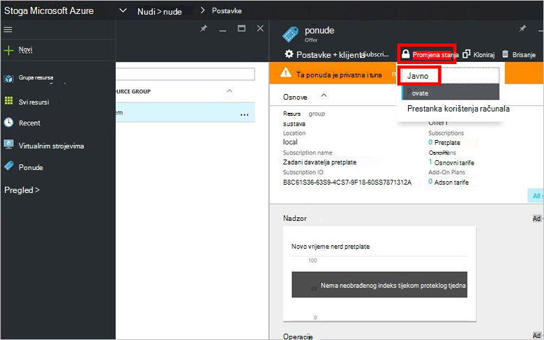

<properties
    pageTitle="Stvaranje ponude u stogu Azure | Microsoft Azure"
    description="Kao administrator usluge, upute za stvaranje ponude za vaše klijenata u stogu Azure."
    services="azure-stack"
    documentationCenter=""
    authors="ErikjeMS"
    manager="byronr"
    editor=""/>

<tags
    ms.service="azure-stack"
    ms.workload="na"
    ms.tgt_pltfrm="na"
    ms.devlang="na"
    ms.topic="get-started-article"
    ms.date="09/26/2016"
    ms.author="erikje"/>

# Stvaranje ponude u stogu Azure

[Nudi](azure-stack-key-features.md#services-plans-offers-and-subscriptions) su grupe jedan ili više tarife koje davatelje usluga prezentirati klijenata za kupnju ili pretplatu. Ovaj dokument prikazuje kako stvoriti ponude koja obuhvaća [tarifu koju ste stvorili](azure-stack-create-plan.md) u posljednjem koraku. Ponudu omogućuje pretplatnike Dodjela virtualnih računala.

1.  [Prijavite se](azure-stack-connect-azure-stack.md#log-in-as-a-service-administrator) na portal kao administrator servisa, a zatim **Novo** > **klijentu nudi + tarife** > **ponuda**.
    

2.  U plohu **Novi nude** ispunite **Zaslonsko ime** i **Naziv resursa**i odaberite novu ili postojeću **Grupu resursa**. Zaslonsko ime je u ponudu neslužbeni naziv. Samo administrator može vidjeti naziv resursa. To je naziv koji koriste administratori za rad s ponuda kao resurs za Azure Voditelj resursa.

    

3.  Kliknite **Osnovni tarife** pa u plohu **Plan** odaberite tarife na koje želite uključiti u ponudu, a zatim **Odaberite**. Kliknite **Stvori** da biste stvorili ponudu.

    
    
4. Kliknite **nudi** , a zatim kliknite ponuda koju ste upravo stvorili.

    

5.  Kliknite **Promjena stanja**, a zatim kliknite **javno**.
  
    

Ponuda mora biti dostupne javnosti za klijenata da biste dobili cijeli prikaz kada pretplate. Ponuda može biti:

- **Javni**: vidljiv drugih korisnika.

- **Privatno**: vidljivo samo administratorima servisa. Korisni tijekom skiciranje plan ili ponuda, ili ako administrator servisa želi da biste odobrili svake pretplate.

- **Povučeno**: Zatvoreno za pretplatnike na novi. Administrator servisa možete koristiti da biste spriječili buduće pretplate, ali trenutno pretplatnike ostaviti nepromijenjen decommissioned.

Promjene na ponudu nisu vidljive u klijent. Da biste vidjeli promjene, možda ćete morati odjavite/prijave da biste vidjeli na novu pretplatu u "Odabir pretplate" prilikom stvaranja resurse ili grupe resursa.

## Daljnji koraci

[Pretplata na ponude i dodjela na VM](azure-stack-subscribe-plan-provision-vm.md)
