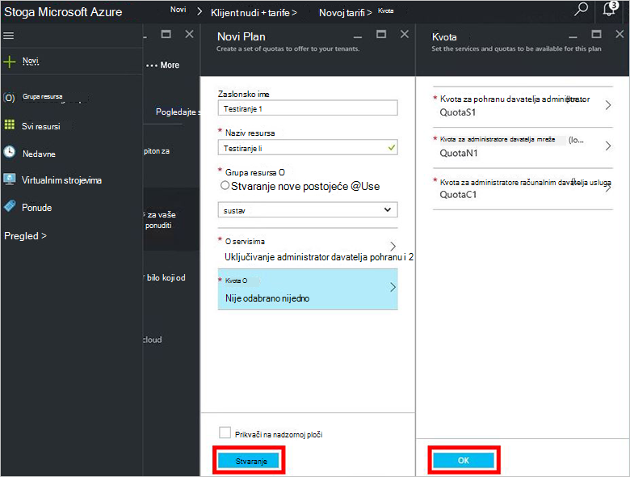

<properties
    pageTitle="Stvaranje plana u stogu Azure | Microsoft Azure"
    description="Kao administrator usluge, stvorite plan koji omogućuje virtualnim strojevima dodjele resursa za pretplatnike."
    services="azure-stack"
    documentationCenter=""
    authors="ErikjeMS"
    manager="byronr"
    editor=""/>

<tags
    ms.service="azure-stack"
    ms.workload="na"
    ms.tgt_pltfrm="na"
    ms.devlang="na"
    ms.topic="get-started-article"
    ms.date="09/26/2016"
    ms.author="erikje"/>

# Stvaranje plana u stogu Azure

[Tarife](azure-stack-key-features.md#services-plans-offers-and-subscriptions) su grupiranja jedne ili više usluga. Kao davatelj, možete stvoriti tarife nudi vaš drugih korisnika. U nizu, vaše klijenata pretplatiti na vaše ponude da biste koristili tarife i servise koje sadrže. U ovom se primjeru pokazuje kako stvoriti plan koji ne uključuje računalnim, mreže i davatelji resursa za pohranu. Ovaj plan omogućuje pretplatnike Dodjela virtualnih računala.

1.  U web-pregledniku, dođite do https://portal.azurestack.local.

2.  [Prijavite se u](azure-stack-connect-azure-stack.md#log-in-as-a-service-administrator) stogu Portal Azure kao administrator servisa i unesite vjerodajnice administratora servisa (račun koji ste stvorili tijekom koraku 5 odjeljka [pokrenuti skriptu PowerShell](azure-stack-run-powershell-script.md) ), a zatim kliknite **Prijava**.

    Administratori servisa možete stvoriti ponude i tarife i upravljanje korisnicima.

3.  Da biste stvorili plan i ponuditi koje možete se pretplatiti klijenata, kliknite **Novo** > **klijentu nudi + tarife** > **Plan**.

    

4.  Na plohu **Novi planiranje** unesite **Zaslonsko ime** i **Naziv resursa**. Zaslonsko ime je u planu neslužbeni naziv koji klijenata potražite u članku. Samo administrator može vidjeti naziv resursa. To je naziv koji koriste administratori za rad s tarifom kao resurs za Azure Voditelj resursa.

    

5.  Stvorite novu **Grupu resursa**ili odaberite postojećeg, kao spremnik za plan (npr. "OffersAndPlans")

    

6.  Kliknite **Services**, odaberite **Microsoft.Compute**, **Microsoft.Network**i **Microsoft.Storage**, a zatim **Odaberite**.

    

7.  Kliknite **kvota**, kliknite **Microsoft.Storage (lokalno)**i zatim odaberite kvota zadani ili kliknite **Stvori novi kvote** da biste prilagodili kvote.

    

8.  Upišite naziv za kvote, kliknite **Postavke kvote**, postavljanje kvote vrijednosti i kliknite **u redu**, a zatim **Stvori**.

    

9. Kliknite **Microsoft.Network (lokalno)**i zatim odaberite zadani kvote ili kliknite **Stvori novi kvote** da biste prilagodili kvote.

    

10. Upišite naziv za kvote, kliknite **Postavke kvote**, postavljanje kvote vrijednosti i kliknite **u redu**, a zatim **Stvori**.

    

11. Kliknite **Microsoft.Compute (lokalno)**i zatim odaberite zadani kvote ili kliknite **Stvori novi kvote** da biste prilagodili kvote.

    

12.  Upišite naziv za kvote, kliknite **Postavke kvote**, postavljanje kvote vrijednosti i kliknite **u redu**, a zatim **Stvori**.

    

13. U plohu **kvote** kliknite **u redu**, a zatim u plohu **Novoj tarifi** kliknite **Stvori** da biste stvorili plan.

    

14. Da biste vidjeli nove tarife, kliknite **sve resurse**, a zatim pretraživanje za plan, a zatim kliknite njegov naziv.

    

## Daljnji koraci

[Stvaranje ponude](azure-stack-create-offer.md)
