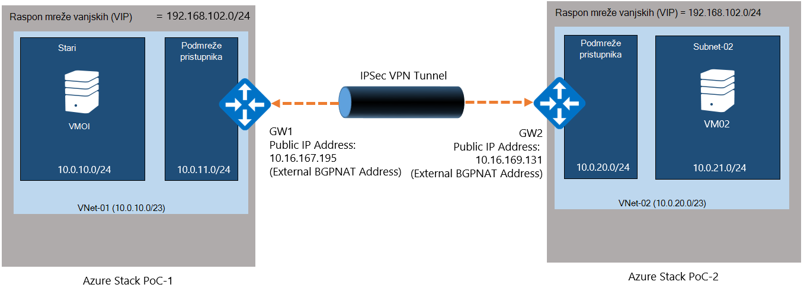
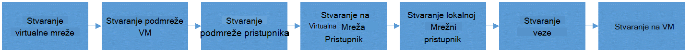
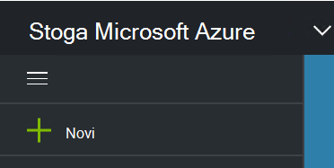
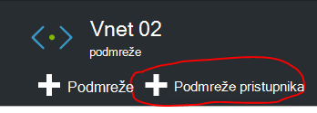
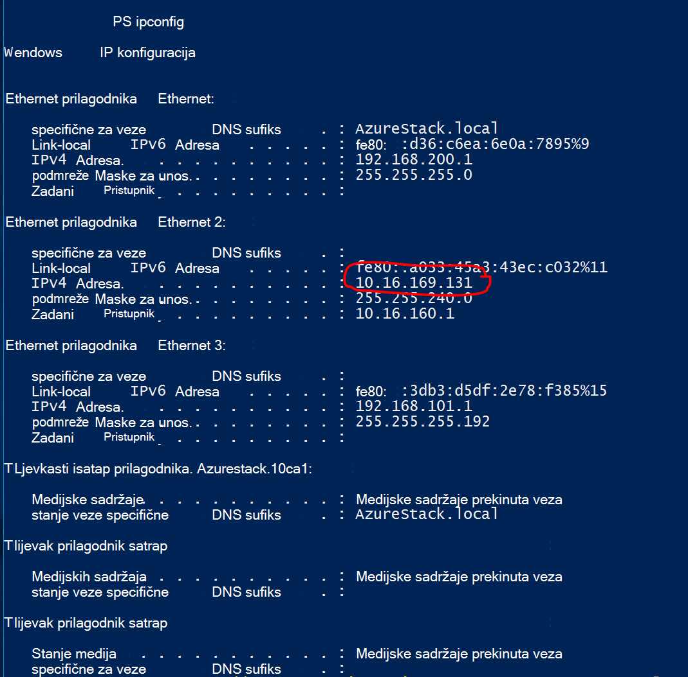
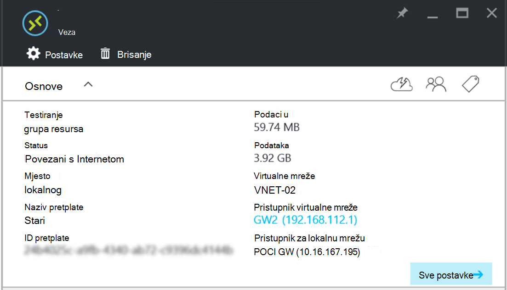

<properties
    pageTitle="Stvaranje web-mjesto VPN veza između dvije virtualne mreže u različitim okruženjima Azure stogu PNA | Microsoft Azure"
    description="Detaljni opis postupka omogućit će oblaka administrator da biste stvorili web-mjesto VPN vezu između dva okruženja PNA za jedan čvor TP2."
    services="azure-stack"
    documentationCenter=""
    authors="ScottNapolitan"
    manager="darmour"
    editor=""/>

<tags
    ms.service="azure-stack"
    ms.workload="na"
    ms.tgt_pltfrm="na"
    ms.devlang="na"
    ms.topic="get-started-article"
    ms.date="09/26/2016"
    ms.author="scottnap"/>

# Stvaranje web-mjesto VPN veza između dvije virtualne mreže u različitim okruženjima PNA snop za Azure

## Pregled

U ovom se članku vodit će vas kroz korake za stvaranje web-mjesto VPN veza između dvije virtualne mreže u dva zasebna okruženja Azure stogu dokaz-od-pojam (PNA). To je da bi osobe koje su procjene web-mjesto pristupnika razumijevanje upute za postavljanje VPN veza između virtualne mreže u dvije različite Azure stogu implementacijama.  U tijeku na taj način će dobiti poznavati funkcioniranje VPN pristupnika u stogu Azure.

>[AZURE.NOTE] Ovaj dokument primjenjuje posebno TP2 PNA za Azure stogu.

### Dijagram veze

Ovo je dijagram koji pokazuje kako treba naš konfiguracije izgledati kada smo gotovo.

### Prije početka

Da biste dovršili konfiguraciju, provjerite je li potrebno je ove stvari prije nego što počnete potrebno sljedeće stavke.

-   Dva poslužitelja koji zadovoljavaju hardverske preduvjete Azure stogu PNA definira [Preduvjeti za implementaciju stogu Azure](azure-stack-deploy.md)i druge preduvjete definira taj dokument.

-   U stogu Azure Tehnički pretpregled 2 paketa za implementaciju.

## Implementacija PNA okruženja

Će implementirati dva okruženja Azure stogu PNA da biste dovršili konfiguraciju.

-   Za svaku PNA implementacije možete jednostavno slijedite upute implementacije detaljne članka [Implementacija PNA Azure stogu](azure-stack-run-powershell-script.md).
    Ne možemo će se svaki okruženje PNA u ovom dokumentu generically kao POC1 i POC2.

## Konfiguriranje kvota za računalnim, mreže i prostora za pohranu

Morate konfigurirati kvote za računalnim, mreže i pohranu da te servise mogu se pridružiti Plan, a zatim ponude koje korisnicima možete se pretplatiti.

>[AZURE.NOTE] Što trebate učiniti korake za svaku PNA snop Azure okruženje.

Sučelje za stvaranje kvote za servise promijenio se iz TP1. Koraci za stvaranje kvote u TP2 možete pronaći na <http://aka.ms/mas-create-quotas>. Možete prihvatiti zadane postavke za sve postavke kvota za ovu vježbu.

## Stvaranje plana i ponuda

[Tarife](azure-stack-key-features.md) su grupiranja jedne ili više usluga. Kao davatelj, možete stvoriti tarife nudi vaš drugih korisnika. U nizu, vaše klijenata pretplatite se nudi vaša da biste koristili tarife i servise koje sadrže.

>[AZURE.NOTE] Morat ćete slijediti ovaj postupak za svaki Azure stogu PNA okruženje.

1.  Najprije stvorite Plan. Da biste to učinili, slijedite korake u članku [Stvaranje plana](azure-stack-create-plan.md) online.

2.  Stvaranje ponude slijedeći korake opisane u [Stvaranje ponude u stogu Azure](azure-stack-create-offer.md).

3.  Prijavite se na Portal kao Administrator klijenta i [pretplata na ponudu koji ste stvorili] (azure-stogu-pretplata-plan-dodjele-vm.md.

## Stvaranje mrežne resurse u PNA 1

Sada ćemo namjeravate zapravo stvoriti resursi smo potrebne za postavljanje naš konfiguracije. Sljedeći koraci objašnjavaju što smo će se način. Ove upute će pokazuje kako stvoriti resursi putem portala, ali isto je moguće napraviti PowerShell.

### Prijavite se kao klijenta

Administrator servisa možete se prijaviti kao klijenta za testiranje tarife, ponuda i pretplata između kojih se mogu koristiti svoje klijenata. Ako nemate nešto [Stvaranje klijentskog računa](azure-stack-add-new-user-aad.md) prije prijave u.

### Stvaranje virtualne mreže & VM podmreže

1.  Prijavite se pomoću računa klijentskog.

2.  Na portalu za Azure, kliknite ikonu **Novo** .

     
3.  Odaberite **mrežu** na izborniku trgovine.

4.  Kliknite stavku **virtualne mreže** na izborniku.

5.  Kliknite gumb **Stvori** pri dnu plohu opis resursa. Unesite sljedeće vrijednosti u odgovarajuća polja prema tu tablicu.

  	| **Polje**             | **Vrijednost** |
  	|----------------------- | ------ |
  	| Ime                  |vnet 01 |
  	| Prostor adrese         | 10.0.10.0/23 |
  	| Naziv podmreže           | podmreže 01 |
  	| Raspon podmreže adresu  | 10.0.10.0/24 |

6.  Trebali biste vidjeti pretplatu koju ste stvorili ranije unose u polje **pretplate** .

7.  Za grupu resursa možete stvoriti novu grupu resursa ili ako već postoji, odaberite koristi postojeći.

8.  Provjerite je li zadano mjesto.

9.  Kliknite gumb **Stvori** .

### Stvaranje podmreže pristupnika

1.  Otvorite virtualne mrežni resurs koji ste upravo stvorili (Vnet 01) na nadzornoj ploči.

2.  Na plohu postavke odaberite podmreže

3.  Kliknite gumb **Pristupnika podmreže** da biste dodali podmreži pristupnika virtualne mreže.

     
4.  Naziv podmreži postavljen je na **GatewaySubnet** prema zadanim postavkama.
    Pristupnik su posebno i mora imati ovaj određeni naziv da bi se ispravno funkcionirati.

5.  U polje **Adresa raspon** unesite **10.0.11.0/24**.

6.  Kliknite gumb **Stvori** da biste stvorili podmreže pristupnika.

### Stvaranje pristupnika za virtualne mreže

1.  Na portalu za Azure, kliknite ikonu **Novo** .

    

2.  Odaberite **mrežu** na izborniku trgovine.

3.  Odaberite **virtualne mrežni pristupnik** popisa mrežni resursi.

4.  Pregledajte opis, a zatim kliknite **Stvori**.

5.  U polje **ime** upišite **GW1**.

6.  Kliknite stavku **virtualne mreže** da biste odabrali virtualne mreže.
    S popisa odaberite **Vnet 01** .

7.  Kliknite stavku izbornika **javnu IP adresa** . Kad se otvori odaberite adresu plohu za javnu IP kliknite na Stvori novi gumb.

8.  U polje **naziv** unesite **GW1 točaka** , a zatim kliknite **u redu.**

9.  **Vrsta pristupnika** moraju imati **VPN** odabrano po zadanom. Zadrži tu postavku.

10. **Vrsta VPN-a** mora sadržavati **utemeljen na usmjeravanje** odabrano po zadanom.
    Zadrži tu postavku.

11. Provjerite koristite li točan **pretplate** i **mjesto** . Po želji možete prikvačiti resursa na nadzornu ploču. Kliknite **Stvori**.

### Stvaranje pristupnika za lokalnu mrežu

Lokalni mrežni pristupnik resurs je malo weird u našem scenariju.
Nije isti resurs pronađete Azure, no u Azure obično je namijenjena za predstavljanje uređaj fizički, na lokaciji koristite da biste se povezali s pristupnikom virtualne mreže u Azure. U našem primjeru oba završava veze su zapravo virtualne mreže pristupnika!

Način razmislite o tome više generically je uvijek je resursa za pristupnik za lokalne mreže namijenjena da biste naznačili udaljene pristupnika na drugoj strani veze. Zbog načina dizajniran u PNA, zapravo moramo da navedete adresu vanjskog mrežnog prilagodnika na VM NAT od drugih PNA kao javnu IP adresu lokalne mreže pristupnika. Ne možemo će stvoriti NAT mapiranja na VM NAT da biste bili sigurni da su oba završava ispravno povezani.

### Dohvaćanje IP adrese vanjski prilagodnik NAT VM

1.  Prijavite se na računalo fizičke Azure stog za POC2.

2.  [Sustava Windows i tipku] + R da biste otvorili izbornik **pokrenuti** i upišite **mstsc** i pritisnite enter.

3.  U polje **računala** unesite naziv **MAS BGPNAT01** , a zatim kliknite gumb **za povezivanje** .

4.  Kliknite izbornik Start, desnom tipkom miša kliknite PowerShell i odaberite **Pokreni kao Administrator**.

5.  Vrsta **IPConfig/sve**.

6.  Pronađite Ethernet prilagodnika koji je povezan s mrežom na lokaciji, a uzeti u obzir IPv4 adresa povezana s tom prilagodnika. U Moje okruženje je **10.16.167.195** , ali vaš će se nešto drugo.

7.  Zapis tu adresu. Ovo je što koristit ćemo kao javnu IP adresu resursa za pristupnik za lokalne mreže ćemo stvoriti POC1.

### Stvaranje resursa za pristupnik za lokalnu mrežu

1.  Prijavite se na računalo fizičke Azure stog za POC1.

2.  U polju **računala** unesite naziv **MAS CON01** , a zatim kliknite gumb **za povezivanje** .

3.  Na portalu za Azure, kliknite ikonu **Novo** .

    

4.  Odaberite **mrežu** na izborniku trgovine.

5.  Odaberite **lokalnu mrežu pristupnika** na popisu resursa.

6.  U polje **naziv** unesite **POC2 GW**.

7.  Još ne možemo ne znate IP adresa naš pristupnika, ali to je u redu Budući da bismo vratite i kasnije promijeniti. Zasad, unesite **10.16.167.195** u **polje IP adresa**.

8.  U polju **Adresnog prostora** unesite adresu prostor Vnet koje ćemo POC2 stvaranje. To će biti **10.0.20.0/23** pa unesite vrijednost.

9.  Provjerite **pretplatu**, **Grupa resursa** i **mjesto** sve ispravni te kliknite **Stvori**.

### Stvaranje veze

1.  Na portalu za Azure, kliknite ikonu **Novo** .

     

2.  Odaberite **mrežu** na izborniku trgovine.

3.  Odaberite **vezu** na popisu resursa.

4.  U **Osnovni** plohu postavke odaberite **web-mjesta web-na-mjesta (IPSec)** kao **vrstu veze**.

5.  Odaberite **pretplatu**, **Grupa resursa** i **lokaciju** , a zatim kliknite **u redu**.

6.  U plohu **Postavke** odaberite **Virtualne mrežni pristupnik** (**GW1**) koji ste prethodno stvorili.

7.  Odaberite u **lokalnoj** **Mreži pristupnika** (**POC2 GW**) koju ste ranije stvorili.

8.  U polje **Naziv veze** unesite **POC1 POC2**.

9.  U polju **Zajednički ključ (PSK)** unesite **12345**. Kliknite **u redu**.

### Stvaranje na VM

Da biste provjerili valjanost podataka putovanje putem veze za VPN, potreban vam je VMs za slanje i primanje podataka u svakom PNA. Sada stvorite na VM POC1 i staviti na našem podmreži VM u našem virtualne mreže.

1. Na portalu za Azure, kliknite ikonu  **Novo** .

     

2.  Odaberite **virtualnim računalima sustava** na izborniku trgovine.

3.  Na popisu virtualnog računala slike odaberite slike **Sustava Windows Server 2012 R2 podatkovnog centra** .

4.  Na plohu **Osnove** u polje **naziv** unesite vrijednost **VM01**.

5.  Unesite valjani korisničko ime i lozinku. Koristit ćete taj račun da biste se prijavili na VM kada je stvorena.

6.  Navedite **pretplatu**, **Grupa resursa** i **mjesto** , a zatim kliknite **u redu**.

7.  Na plohu **Veličina** odaberite veličina VM za ovu instancu, a zatim **Odaberite**.

8.  Na plohu postavke prihvatite zadane vrijednosti, samo provjerite jesu li mrežni virtualne odabrana **VNET 01** i podmreži postavljen na **10.0.10.0/24**. Kliknite **u redu**.

9.  Pregledajte postavke na plohu **Sažetak** i kliknite **u redu**.

## Stvaranje mrežne resurse u PNA 2

### Prijavite se kao klijenta

Administrator servisa možete se prijaviti kao klijenta za testiranje tarife, ponuda i pretplata između kojih se mogu koristiti svoje klijenata. Ako nemate nešto [Stvaranje klijentskog računa](azure-stack-add-new-user-aad.md) prije prijave u.

### Stvaranje virtualne mreže & VM podmreže

1. Prijavite se pomoću računa klijentskog.

2. Na portalu za Azure, kliknite ikonu  **Novo** .

     

3.  Odaberite **mrežu** na izborniku trgovine.

4.  Kliknite na **mreži virtualne** stavci na izborniku.

5.  Kliknite gumb **Stvori** pri dnu plohu opis resursa. Unesite sljedeće vrijednosti s odgovarajućim poljima navedene u tablici u nastavku.

  	|**Polje**              |**Vrijednost** |
  	| ----------------------|----------|
  	| Ime                  | vnet 02 |
  	| Prostor adrese         | 10.0.20.0/23 |
  	| Naziv podmreže           | podmreže 02 |
  	| Raspon podmreže adresu  | 10.0.20.0/24 |

6.  Trebali biste vidjeti pretplatu koju ste stvorili ranije unose u polje **pretplate** .

7.  Za grupu resursa možete stvoriti novu grupu resursa ili ako već postoji, odaberite koristi postojeći.

8.  Provjerite je li zadano **mjesto**. Ako želite, možete prikvačiti virtualne mreže da biste na nadzornoj ploči radi lakšeg pristupa.

9.  Kliknite gumb **Stvori** .

### Stvaranje podmreže pristupnika

1.  Otvorite virtualne mrežni resurs koji ste stvorili (**Vnet 02**) na nadzornoj ploči.

2.  Na plohu **Postavke** odaberite **podmreže.**

3.  Kliknite gumb **Pristupnika podmreže** da biste dodali podmreži pristupnika virtualne mreže.

     

4.  Naziv podmreži postavljen je na **GatewaySubnet** prema zadanim postavkama.
    Pristupnik su posebno i mora imati ovaj određeni naziv da bi se ispravno funkcionirati.

5.  U polje **Adresa raspon** unesite **10.0.20.0/24**.

6.  Kliknite gumb **Stvori** da biste stvorili podmreže pristupnika.

### Stvaranje pristupnika za virtualne mreže

1. Na portalu za Azure, kliknite ikonu  **Novo** .

     

2.  Odaberite **mrežu** na izborniku trgovine.

3.  Odaberite **virtualne mrežni pristupnik** popisa mrežni resursi.

4.  Pregledajte opis, a zatim kliknite **Stvori**.

5.  U polje **ime** upišite **GW2**.

6.  Kliknite stavku **virtualne mreže** da biste odabrali virtualne mreže.
    S popisa odaberite **Vnet 02** .

7.  Kliknite stavku izbornika **javnu IP adresa** . Kad se otvori odaberite adresu plohu za javnu IP kliknite na Stvori novi gumb.

8.  U polje **naziv** unesite **GW2 točaka** , a zatim kliknite **u redu.**

9.  **Vrsta pristupnika** moraju imati **VPN** odabrano po zadanom. Zadrži tu postavku.

10. **Vrsta VPN-a** mora sadržavati **utemeljen na usmjeravanje** odabrano po zadanom.
    Zadrži tu postavku.

11. Provjerite koristite li točan **pretplate** i **mjesto** . Po želji možete prikvačiti resursa na nadzornu ploču. Kliknite **Stvori**.

### Stvaranje pristupnika za lokalnu mrežu

#### Dohvaćanje IP adrese vanjski prilagodnik NAT VM

1.  Prijavite se na računalo fizičke Azure stog za POC1.

2.  Pritisnite i držite [sustava Windows i tipku] + R da biste otvorili izbornik **pokrenuti** i upišite **mstsc** i kliknite unesite.

3.  U polje **računala** unesite naziv **MAS BGPNAT01** , a zatim kliknite gumb **za povezivanje** .

4.  Na izborniku Start kliknite desnom tipkom miša kliknite PowerShell i odaberite **Pokreni kao Administrator**.

5.  Vrsta **IPConfig/sve**.

6.  Pronađite Ethernet prilagodnika koji je povezan s mrežom na lokaciji, a uzeti u obzir IPv4 adresa povezana s tom prilagodnika. U Moje okruženje je **10.16.169.131** , ali vaš će se nešto drugo.

7.  Zapis tu adresu. Ovo je što će kasnije koristimo javnu IP adresu resursa za pristupnik za lokalne mreže ćemo stvoriti POC1.

#### Stvaranje resursa za pristupnik za lokalnu mrežu

1.  Prijavite se na računalo fizičke Azure stog za POC2.

2.  U polje **računala** unesite naziv **MAS CON01** , a zatim kliknite gumb **za povezivanje** .

3. Na portalu za Azure, kliknite ikonu **Novo** .

     

4.  Odaberite **mrežu** na izborniku trgovine.

5.  Odaberite **lokalnu mrežu pristupnika** na popisu resursa.

6.  U polje **naziv** unesite **POC1 GW**.

7.  Sada za mrežni pristupnik virtualne u POC1 moramo javnu IP adresu smo naveden. Unesite **10.16.169.131** u **polje IP adresa**.

8.  U polju **Adresnog prostora** unesite adresu prostor **Vnet 01** iz POC1 - **10.0.0.0/16**.

9.  Provjerite **pretplatu**, **Grupa resursa** i **mjesto** sve ispravni te kliknite **Stvori**.

## Stvaranje veze

1. Na portalu za Azure, kliknite ikonu  **Novo** .

     

2.  Odaberite **mrežu** na izborniku trgovine.

3.  Odaberite **vezu** na popisu resursa.

4.  U **Osnovni** plohu postavke odaberite **web-mjesta web-na-mjesta (IPSec)** kao **vrstu veze**.

5.  Odaberite **pretplatu**, **Grupa resursa** i **lokaciju** , a zatim kliknite **u redu**.

6.  U plohu **Postavke** odaberite **Virtualne mrežni pristupnik** (**GW1**) koji ste prethodno stvorili.

7.  Odaberite u **lokalnoj** **Mreži pristupnika** (**POC1 GW**) koju ste ranije stvorili.

8.  U polje **Naziv veze** unesite **POC2 POC1**.

9.  U polju **Zajednički ključ (PSK)** unesite **12345**. Ako odaberete neku drugu vrijednost, imajte na umu da je moraju podudarati vrijednost za zajedničko korištenje ključ dodijeljeno u POC1. Kliknite **u redu**.

## Stvaranje na VM

Sada stvoriti na VM POC1 i spremite ga na našem podmreži VM u našem virtualne mreže.

1.  Na portalu za Azure, kliknite ikonu **Novo** .

     

2.  Odaberite **virtualnim računalima sustava** na izborniku trgovine.

3.  Na popisu virtualnog računala slike odaberite slike **Sustava Windows Server 2012 R2 podatkovnog centra** .

4.  Na plohu **Osnove** u polje **naziv** unesite vrijednost **VM02**.

5.  Unesite valjani korisničko ime i lozinku. Koristit ćete taj račun da biste se prijavili na VM kada je stvorena.

6.  Navedite **pretplatu**, **Grupa resursa** i **mjesto** , a zatim kliknite **u redu**.

7.  Na plohu **Veličina** odaberite veličina VM za ovu instancu, a zatim **Odaberite**.

8.  Na plohu postavke prihvatite zadane vrijednosti, samo provjerite jesu li mrežni virtualne odabrana **VNET 02** i podmreži postavljen na **20.0.0.0/24**. Kliknite **u redu**.

9.  Pregledajte postavke na plohu **Sažetak** i kliknite **u redu**.

## Konfiguriranje NAT VM u svakom PNA za prijelaz pristupnika

Jer je u PNA dizajniran samostalnih i Izolirani s mrežom na koji je implementiran fizičke glavno računalo, mrežni "Vanjski" VIP pristupnika povezanih s nije zapravo vanjskih, ali umjesto toga je skriven iza usmjerivač način Prijevod mrežne adrese (NAT). Usmjerivač je zapravo je Windows Server VM (**MAS BGPNAT01**) radi usmjeravanja i daljinski pristup servisima (RRAS) uloga u PNA infrastrukture. Moramo da biste konfigurirali NAT VM MAS BGPNAT01 da biste omogućili VPN veza web-mjesto da biste se povezali na oba kraja.

>[AZURE.NOTE] Za PNA okruženja u kojima se samo potreban je tu konfiguraciju.

### Konfiguriranje NAT

Ćete morati slijedite korake u OBJE PNA okruženju.

1.  Prijavite se na računalo fizičke Azure stog za POC1.

2.  Pritisnite i držite [sustava Windows i tipku] + R da biste otvorili izbornik **pokrenuti** i upišite **mstsc** i kliknite unesite.

3.  U polje **računala** unesite naziv **MAS BGPNAT01** , a zatim kliknite gumb **za povezivanje** .

4.  Na izborniku Start kliknite desnom tipkom miša kliknite PowerShell i odaberite **Pokreni kao Administrator**.

5.  Vrsta **IPConfig/sve**.

6.  Pronađite Ethernet prilagodnika koji je povezan s mrežom na lokaciji, a uzeti u obzir IPv4 adresa povezana s tom prilagodnika. U Moje okruženje je **10.16.169.131** (zaokruženog crvenom crtom ispod), ali vaš će se nešto drugo.

     

7.  Unesite sljedeću naredbu komponente PowerShell da biste odrediti vanjskih NAT adrese za priključke koji provjere autentičnosti IKE. Imajte na umu da biste promijenili s IP adresom onu koja odgovara vašem okruženju.

        Add-NetNatExternalAddress -NatName BGPNAT -IPAddress 10.16.169.131 PortStart 499 -PortEnd 501

8. Zatim ćemo stvoriti mapiranja NAT statički da biste mapirali vanjskih adresa pristupnika javnu IP adresu da biste mapirali priključak uslugu ISAKMP 500 za FAZA 1 tunelom IPSEC.

        Add-NetNatStaticMapping -NatName BGPNAT -Protocol UDP -ExternalIPAddress 10.16.169.131 -InternalIPAddress 192.168.102.1 -ExternalPort 500 -InternalPort 500

9.  Na kraju, moramo učinite NAT prijelaz koji koristi priključak 4500 uspješno uspostaviti dovršeno tunelom IPEC putem NAT uređaja.

         Add-NetNatStaticMapping -NatName BGPNAT -Protocol UDP -ExternalIPAddress 10.16.169.131 -InternalIPAddress 192.168.102.1 -ExternalPort 4500 -InternalPort 4500

10.  Ponovite korake od 1 do 9 u POC2.

## Testiranje veze

Sad kad je veza web-mjesto uspostavljena smo koje bi trebali provjeriti da će se koristiti promet slijedi kroz nju. Ovaj zadatak nije jednostavno kao uključuje se samo zapisivanje u jednom od VMs koju smo stvorili u oba okruženja PNA i pinging VM koju smo stvorili u drugom okruženju. Da biste bili sigurni da ne možemo su stavljanje promet putem veze na web-mjesto, želimo da biste provjerili ne možemo ping adresu Izravni IP (DIP) VM na udaljenom podmreži ne VIP. Da biste to učinili, moramo Saznajte što je adresa na drugoj strani naš veze.

### Prijavite se u klijent VM u POC1

1.  Prijavite se na računalo fizičke Azure stog za POC1 i prijavite se na portal pomoću računa klijentskog.

3.  Kliknite ikonu **virtualnim strojevima** na lijevoj navigacijskoj traci.

4.  Pronađite **VM01** koji ste stvorili u prethodnom popisu VMs i kliknite je.

5. Na plohu za virtualnog računala kliknite **Poveži**.

     

6.  Otvorite naredbeni redak s unutar VM i upišite **IPConfig/sve**.

7.  Pronađite **IPv4 adresa** u Izlaz i uzeti u obzir ga. To je adresa će pomoću naredbe ping iz POC2. U okruženju, je li adresa **10.0.10.4**, ali u svom okruženju ga može se razlikovati. No moraju nalaziti unutar ograničenja podmreže **10.0.10.0/24** koja je stvorena neke starije verzije.

### Prijavite se u klijent VM u POC2

1.  Prijava u stogu Azure fizičke računalu za POC2 i Prijava na portal pomoću računa klijentskog.

3.  Kliknite ikonu **virtualnim strojevima** na lijevoj navigacijskoj traci.

4.  Pronađite **VM02** koji ste stvorili u prethodnom popisu VMs i kliknite je.

5.  Na plohu za virtualnog računala kliknite **Poveži**.

     

6.  Otvorite naredbeni redak s unutar VM i upišite **IPConfig/sve**.

7.  Trebali biste vidjeti IPv4 adresa koja se nalazi unutar 10.0.20.0/24. U moje Laboratorija test 10.0.20.4 je adresa, ali vaš može se razlikovati.

8.  Sada iz VM u POC2 želimo VM u POC1, pomoću naredbe ping do na tunelom. Da biste to učinili ćemo pomoću naredbe ping DIP koje ćemo snimili iz VM01.
    U moje Laboratorija to je 10.0.10.4, ali obavezno ping adresu koju ste pronašli u vašem Laboratorija. Trebali biste vidjeti rezultat koji izgleda ovako.

     

9.  Odgovori s udaljenog VM označava uspješno test! Možete zatvoriti prozor VM povezivanje ili, ako želite, pokušajte učiniti nešto neke druge podatke prijenosi testirajte vezu (kao što je kopiju datoteke).

### Statistika putem veze za pristupnik prijenosa prikaza podataka

Ako želite saznati koliko je podataka koje je prolazi kroz vezu s web-mjesto, te su informacije dostupne u plohu veze. Ovaj test je jedan dobar način da biste potvrdili da se ping koji ste upravo poslali zapravo nije putem veze za VPN-a.

1.  Dok je i dalje prijavljeni **ClientVM** u POC2, prijavite se na **Microsoft Azure stogu PNA Portal** pomoću računa klijentskog sustava.

2.  Kliknite stavku izbornika **Pronađite** i odaberite **veze**.

3.  Kliknite vezu **POC2 POC1** na popisu.

4.  Na plohu veza možete pogledati Statistika za podatke u i podataka. Na slici u nastavku pogledajte neki se brojevi veći od samo ping bi računa za. To je zato što smo jeste li neke prijenos datoteka na kao i. Trebali biste vidjeti neke od nule vrijednosti postoji.

     
