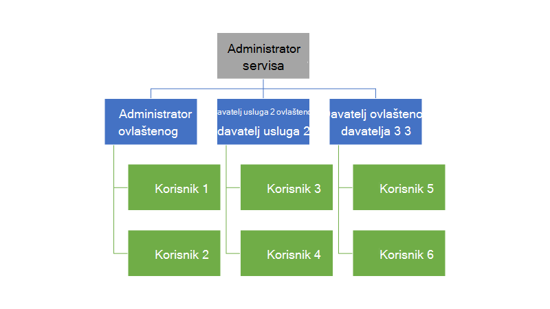
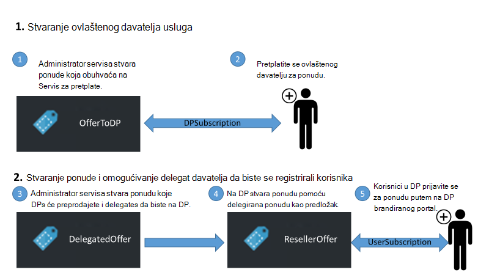
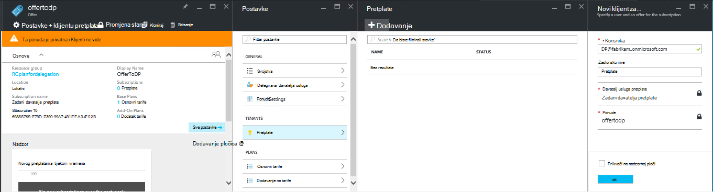
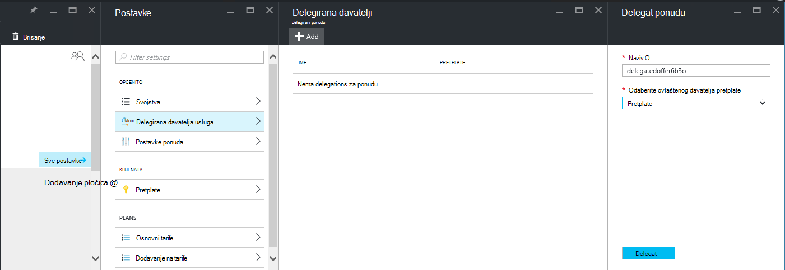
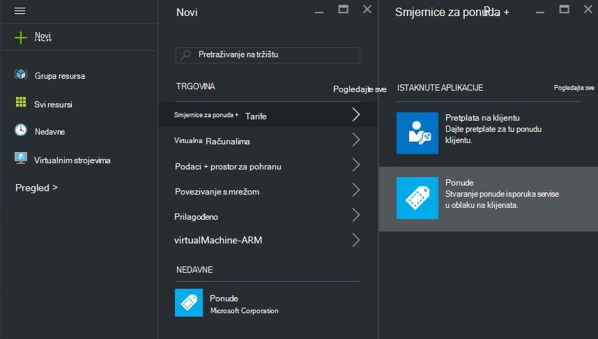
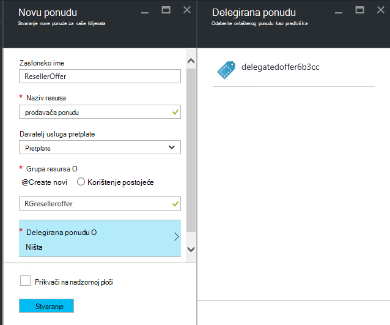
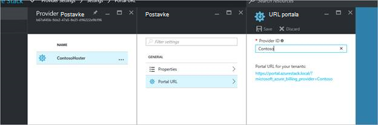
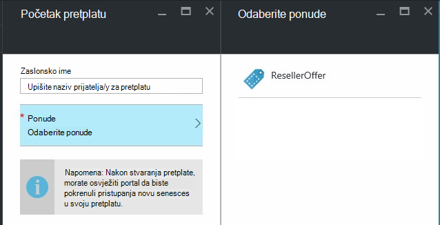

<properties
    pageTitle="Prenošenjem ponude u stogu Azure | Microsoft Azure"
    description="Saznajte kako staviti drugima zaduženi za stvaranje ponuda i registracija korisnika za vas."
    services="azure-stack"
    documentationCenter=""
    authors="AlfredoPizzirani"
    manager="byronr"
    editor=""/>

<tags
    ms.service="azure-stack"
    ms.workload="na"
    ms.tgt_pltfrm="na"
    ms.devlang="na"
    ms.topic="article"
    ms.date="10/07/2016"
    ms.author="alfredop"/>

#Prenošenjem ponude u stogu Azure

Kao administrator usluge, često želite staviti drugima zaduženi za stvaranje ponuda i registracija korisnika za vas. Na primjer, to se može dogoditi ako su davatelj usluga, a želite distributere Registracija korisnika i upravljanje njima u vaše ime. Također događa se u tvrtki ako su dio središnje IT grupe, a želite Odjeli ili podružnice da biste se registrirali korisnicima bez vaše intervencije.

Delegiranje olakšava sljedeće zadatke, što pomaže da dođete do i upravljanje korisnicima više ne bi mogli učiniti izravno. Sljedeća ilustracija prikazuje jednu razinu delegiranje, ali stog Azure podržava više razina. Delegirana davatelji možete shodno delegiranje drugih davatelja usluge do pet razina.

Administratori možete delegirati ograničenu stvaranje ponuda i klijenata drugim korisnicima pomoću funkcije delegiranje.

##Uloge i korake u delegiranje

Da biste shvatili delegiranje, imajte na umu da postoje tri uloge uvrštene:

-   **Administrator servisa** upravlja infrastrukture stogu Azure, stvara predložak ponude i delegates drugima nude svojim korisnicima.

-   Ovlašteni korisnici se nazivaju **delegirani davatelje usluga**. Možete pripadaju drugim tvrtkama ili ustanovama (kao što su druge klijenata za Azure Active Directory).

-   **Korisnici** registrirati za ponude i koristite ih za upravljanje njihove radnih opterećenja, stvaranje VMs, pohranjivanje podataka, itd.

Kao što je prikazano u sljedeća grafika, postoje dva koraka u odjeljku Postavljanje delegiranje.

1.  Odredite ovlaštenog davatelje usluga. Ako se pretplatite ponude tarifu koja sadrži samo servis pretplate na temelju, učinite sljedeće.
    Korisnike pretplaćene na ponudu: D5 neke mogućnosti administrator servisa, uključujući mogućnost proširiti ponude i Prijava korisnika za njih.

2.  Delegiranje ponude ovlaštenog davatelja usluga. Ta ponuda funkcionira kao predloška za što može ponuditi ovlaštenih davatelja. Ovlaštenih davatelja sada je moći preuzeti ponudu, odaberite naziv za dokument (ali ne mijenja svojim servisima i kvotama), a nude klijentima.

Će poslužiti kao ovlaštenog davatelje usluga, korisnici moraju uspostaviti odnos s glavnom davatelja; drugim riječima, koje su im potrebne za stvaranje pretplatu. U ovom scenariju ove pretplate označava ovlaštenog davatelji kao pojavljuju desno da biste izlaganje ponuda ime glavni davatelja usluga.

Uspostavljanja odnos administrator sustava možete delegirati ograničenu ponude ovlaštenog kod davatelja usluga. Ovlaštenog davatelja sada mogu poduzeti ponudu, preimenovati (ali ne i promijeniti njegov substance), a nude svojim korisnicima.

Da biste uspostavili ovlaštenog davatelja usluge, delegiranje ponude i provjeriti jesu li korisnici mogu prijaviti za njega, izvršavanje upute u sljedećim odjeljcima.

##Postavljanje uloge

Da biste vidjeli ovlaštenog davatelja na poslu, morate dodatne račune Azure Active Directory uz administratorski račun servisa. Ako nemate ih, stvorite dva računa. Računi pripadati sve AAD klijenta. Će nazivamo ih ovlaštenog davatelja (DP) i korisnicima.

| **Uloga** | **Prava na tvrtke ili ustanove** |
| -------------------- | ----------------------- |
|  Delegirana davatelja usluga | Korisnik |
| Korisnik | Korisnik |

##Prepoznavanje ovlaštenog davatelja usluga

1.  Prijavite se kao administrator servisa.

2.  Stvaranje ponude za koje će se omogućiti klijenata postati ovlaštenog davatelje usluga. Zahtijeva stvaranje plana i ponude koji se temelje na njemu:

    na.  [Stvaranje plana](azure-stack-create-plan.md).
        Ovaj plan moraju sadržavati samo servis pretplate. U ovom se članku koristimo plan pod nazivom PlanForDelegation.

    b.  [Stvaranje ponude](azure-stack-create-offer.md) 
     temelju ovaj plan. U ovom se članku koristimo ponude pod nazivom OfferToDP.

    c.  Nakon dovršetka stvaranja ponudu, dodajte ID korisnika ovlaštenog davatelja kao klijenta za ponudu tako da kliknete     **pretplate** &gt; **Dodaj** &gt; **Nova pretplata na klijentu**.

  

> [AZURE.NOTE]Sa svih ponuda za Azure stoga ako imate mogućnost upućivanje ponudu javno i da korisnici registracije za, ili čuvanja privatne i imate administrator servisa upravljanje prijavu. Delegirana davatelje usluga obično su maloj grupi, a želite nadzirati tko je primljeni, da držeći ponudu privatne smisla u većini slučajeva.

##Administrator servisa stvara ovlaštenog ponudu

Sada ste uspostavili davatelja uz prijenos ovlasti. Sljedeći je korak da biste stvorili plan i ponuditi koji ćete delegatu, a koje će korisnici koristiti. Morate definirati ponudu točno onako kako želite da kupci da biste vidjeli, jer ovlaštenog davatelja nećete moći za promjenu tarife i kvote obuhvaća.

1.  Kao administrator servisa, [stvorite plan](azure-stack-create-plan.md) i [ponude](azure-stack-create-offer.md) koji se temelje na njemu. Za ovaj članak koristimo ponude pod nazivom DelegatedOffer.
> [AZURE.NOTE]Ponuda ne moraju biti dostupne javnosti. To mogu biti dostupne javnosti Ako odaberete, ali, u većini slučajeva želite samo ovlaštenog davateljima pristup. Kada se privatni ponudu delegatu kao što je opisano u sljedećim koracima, ovlaštenog davatelja će imati pristup na njega.

2.  Delegiranje ponudu. Idite na DelegatedOffer pa u oknu postavke, kliknite **Delegirani davatelji** &gt; **Dodaj**.

3.  U okviru padajućeg popisa odaberite ovlaštenog davatelja pretplate, a zatim kliknite **delegat**.

> 

##Delegirana davatelja prilagođava ponudu

Prijavite se kao ovlašteni davatelj i stvorite novu ponudu pomoću ovlaštenog ponudu kao predložak.

1.  Kliknite **Novi** &gt; **klijentu nudi + tarife** &gt; **nude**.

    

2.  Dodijelite naziv za ponudu. U nastavku ćemo odaberite ResellerOffer. Odaberite ponude za prijenos ovlasti temeljite na, a zatim kliknite **Stvori**.
    
    

    >[AZURE.NOTE] Imajte na umu razlike u usporedbi s nude stvaranja kao iskusnih administrator servisa. Delegirana davatelja sastavljanje ponudu s osnovnim tarife i dodatak tarife; Ana samo na raspolaganju ponude koje ste je većem broju njegove i će unesite promjene u njih.

3. Objavite ponudu tako da kliknete **Pregled** &gt; **nudi**, odaberite ponudu, a zatim kliknite **Promijeni stanje**.

4. Delegirana davatelja izlaže ove ponude putem portala za vlastitu URL-a. Imajte na umu da su ove ponude vidljiv samo putem portala za prijenos ovlasti. Da biste pronašli i promijeniti URL:

    na.  Kliknite **Pregledaj** &gt; **Postavke davatelja** &gt; **portala URL-a**.

    b.  Promjena ID davatelja po želji.

    c.  Kopiranje portalu URL-a odvojeno, kao što je blok za pisanje.

    
<!-- -->
Sada ste dovršili stvaranje ponude za prijenos ovlasti kao ovlaštenih davatelj. Odjavite se kao ovlašteni davatelja usluga. Zatvorite karticu preglednika koji koristite.

##Registracija za ponudu

1.  U novom prozoru preglednika, idite na portalu ovlaštenog URL koji ste spremili u prethodnom koraku. Prijavite se na portal kao korisnik. Napomena: morate koristiti ovlaštenog portal za ovaj korak. Delegirana ponudu neće biti vidljiv u suprotnom.

2.  Na nadzornoj ploči kliknite **Dohvati pretplatu**. Vidjet ćete samo ovlaštenog ponuda stvorio ovlaštenog davatelja predstavljanja korisniku:

> 

To završava postupak delegiranje ponudu. Korisnik sada registrirati za ponudu tako da pretplatu za njega.

##Delegiranje više razina

Delegiranje više razina omogućuje ovlaštenog davatelja delegatu ponudu za drugi entiteti. Time, na primjer, stvaranje dublju prodavača kanali, u kojem davatelja upravljanje stogu Azure delegates ponude za distributer tko shodno ovlaštenicima omogućili prodavača.
Azure stogu podržava do pet razina delegiranje.

Da biste stvorili više razine delegiranje ponuda, ovlaštenog davatelja shodno delegates ponudu sljedeći kod davatelja usluga. Postupak je ista ovlaštenog davatelja, kao što je za administratora servisa (pogledajte [administrator servisa stvara ovlaštenog ponudu](#service-admin-creates-the-delegated-offer)).

##Daljnji koraci
[Dodjela resursa u VM](azure-stack-provision-vm.md)
