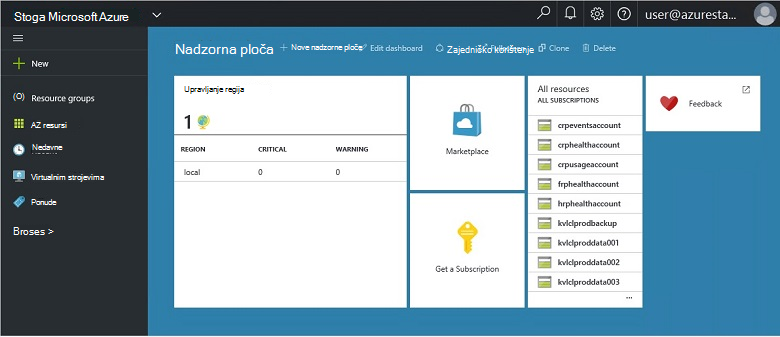
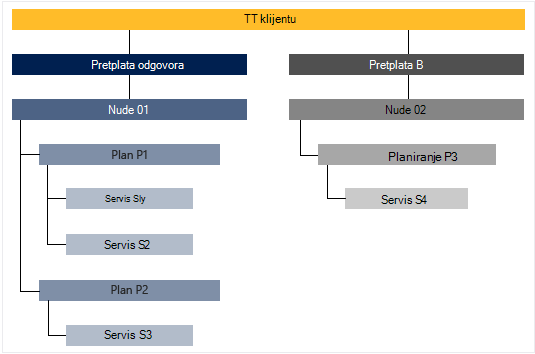

<properties
    pageTitle="Ključne značajke i koncepata u stogu Azure | Microsoft Azure"
    description="Informirajte se o ključne značajke i koncepata u stogu Azure."
    services="azure-stack"
    documentationCenter=""
    authors="Heathl17"
    manager="byronr"
    editor=""/>

<tags
    ms.service="azure-stack"
    ms.workload="na"
    ms.tgt_pltfrm="na"
    ms.devlang="na"
    ms.topic="article"
    ms.date="10/25/2016"
    ms.author="helaw"/>

# Ključne značajke i koncepata u stogu Azure

Ako ste novi korisnik sustava Microsoft Azure stoga ove uvjete i opise može biti korisno.

## Osobe

Postoje postoje dvije vrste korisnika sustava Microsoft Azure, administrator servisa ad-hoc klijenta (Kupac).

-  **Administrator servisa** možete konfigurirati i upravljati davatelji resursa, ponuda za klijenta, tarife, usluge, kvotama i cijene.
-  **Klijent** nabaviti (ili kupi) usluge koje nudi administrator servisa. Samoposlužni možete Dodjela resursa, nadzor i upravljanje servise koji su ste pretplaćeni, kao što je web-aplikacije, za pohranu i virtualnih računala.

## Portal

Primarni metode interakcija s Microsoft Azure stoga je portal i PowerShell.

Portal sustava Microsoft Azure stoga je instanca Azure portal koji se izvode na poslužiteljima. Je pruža sučelje za samostalno administratori servisa i klijenata za kontrolu pristupa na temelju uloga (RBAC) za resurse i kapacitet oblaka, omogućivanje brzi aplikacija i servisa razvoj i implementaciju web-mjesto.

## Područja, usluge, planove, ponuda i pretplate

U stogu Azure services isporučuju klijenata pomoću područja, pretplate, ponuda i tarife. Korisnicima možete se pretplatiti na više ponuda. Ponuda može imati jednu ili više tarife, a tarife može imati jedan ili više usluga.

Primjer hijerarhije u klijentu pretplate na ponuda, svaka s promjenjivih tarife i servisima.

### Područja
Azure područja stoga su osnovni element skaliranje i upravljanje njima.  Tvrtke ili ustanove može imati više područja s resursima dostupne na svakom području.  Područja može biti dostupan ponude različite servisa.

### Usluge

Microsoft Azure stogu omogućuje davatelja usluga za isporuku velik broj services i aplikacija, kao što su virtualnim računalima sustava SQL Server baze podataka, sustava SharePoint, Exchange, itd.

### Tarife

Su tarife grupiranja jedne ili više usluga. Kao davatelj, stvorite tarife nudi vaš drugih korisnika. U nizu, vaše klijenata pretplatite se nudi vaša da biste koristili tarife i servise koje sadrže.

Svaki servis dodali na tarifu možete konfigurirati postavke kvota za upravljanje vaše kapaciteta oblaka. Kvota mogu sadržavati ograničenja kao što su VM, RAM-a i procesora ograničenja te se primjenjuju po pretplata. Kvota se mogu međusobno razlikuju po mjesto. Ako, na primjer, plan koji sadrži računalnim usluge iz područja odgovora može imati kvote dva virtualnim strojevima, 4GB RAM-a i 10 jezgri procesora.

Prilikom sastavljanja ponude, administrator servisa možete uključiti **Osnovni tarife**. Osnovni planova po zadanom obuhvaća kada klijentom pretplaćuje se na tu ponudu. Čim se korisnik prijavi (i stvaranja pretplate), korisnik ima pristup svim davateljima resursa naveden u tim osnovni tarife (s odgovarajućih kvota).

Administrator servisa u ponudu možete uključiti **dodatak tarife** . Dodatak tarife neće biti uvršteni u pretplatu po zadanim postavkama. Dodatak tarife su Dodatni planovi (kvota) dostupne u ponudu za koje je vlasnik pretplate možete dodati svoje pretplate.

### Ponude

Ponude su grupe od jednog ili više tarifa koje davatelje usluga prezentirati klijenata za kupnju (pretplatiti). Ako, na primjer, nude alfa može sadržavati Plan odgovora (od 1 područje koje sadrži skup usluga računalnim) i planiranje B (od 2 područja koja sadrži skup web-mjesto za pohranu i u okvir za mrežne usluge).

Ponude dolazi sa skupom osnovni tarife, a administratori servisa možete stvoriti dodatak tarife koje drugih korisnika možete dodati svoje pretplate.

### Pretplate

Pretplata je kako kupiti klijenata vaše ponude. Pretplata je kombinacija klijenta s ponude. Klijent može imati pretplatu na više ponuda. Pretplate primjenjuje se samo jednu ponudu. Pretplata na klijentu odredite tarife/usluga koje mogu pristupiti.

Pretplate pomoći davatelji organiziranje pristupanje i korištenje resursa u oblak i usluga.

## Azure Voditelj resursa

Pomoću upravitelja Azure resursa možete raditi s infrastrukture resursa u modelu koji je utemeljen predložak, declaritive.   Pruža jedinstveno sučelje koje možete koristiti implementacije, upravljanje i praćenje komponente rješenja, kao što su virtualnim strojevima, račune za pohranu, web-aplikacije i baze podataka. Potpuna informacije i smjernice, potražite u članku [Pregled upravljanja resursima Azure](../azure-resource-manager/resource-group-overview.md).

### Grupa resursa

Grupa resursa su zbirke resursa, services i aplikacija – i svaki resurs je vrsta, primjerice virtualnim strojevima, virtualne mreže, javnu IP-ovi, račune za pohranu i web-mjesta. Svaki resurs mora biti u grupu resursa i tako grupa resursa pomoći logično organizirati resurse, kao što su radno opterećenje i mjesto.

Evo neki važnih stvari koje treba uzeti u obzir prilikom definiranja grupu resursa:

-   Svaki resurs može postojati samo u jednu grupu resursa.

-   Će implementacije, ažuriranje i brisanje stavki u grupu resursa zajedno. Ako jedan resurs, kao što su poslužiteljem baze podataka mora postoji na drugu implementaciju ciklusa, mora biti u drugu grupu resursa.

-   Možete dodati ili ukloniti resursa u grupu resursa u bilo kojem trenutku.

-   Resurs iz jedne grupe resursa možete premjestiti u drugu grupu.

-   Grupa resursa mogu sadržavati resursi koji se nalaze u različitim područjima.

-   Grupa resursa mogu se opseg kontrole pristupa za administratorske akcije.

-   Resurs se može povezati resursa u drugu grupu resursa kada morate međusobna interakcija dva resursa, ali ne koriste zajednički isti životni ciklus. Ako, na primjer, više aplikacije morate se povezati s bazom podataka, ali tu bazu podataka mora neće ažurirati ili izbrisati tempom isti kao aplikacije.

-   U programu Microsoft Azure stogu, resurse kao što su tarife i ponuda upravlja se i u grupama resursa.

-   Možete implementirati grupu resursa.  To je korisno u svrhu testiranja i razvoj.  

### Predlošci Azure Voditelj resursa

Pomoću upravitelja Azure resursa, možete stvoriti jednostavan predloška (u JSON OSNOVNI oblik) koji definira implementaciji i konfiguraciji aplikacije. Ovaj predložak je poznato kao predložak Voditelj resursa Azure i njihovi deklarativno definirati implementacije. Pomoću predloška možete više puta implementacija aplikacije životni ciklus aplikacije te kako preuzeti pouzdanosti su resursa u uveden u ujednačeno stanje.

## Davatelji resursa (RPs) – to to mreže, izračunati to prostora za pohranu

Davatelji resursa su web koji čine temelj za sve utemeljen na Azure IaaS i PaaS services. Azure Voditelj resursa ovisi o različitim RPs omogućuje pristup servisima s hostiranje.

Postoje tri glavna RPs: mreža, za pohranu i računalnim. Svaki od tih RPs pomaže vam konfigurirati i kontrolirati svojih odgovarajući resursa. Administratori servisa možete dodati nove prilagođene resursa davatelje usluga.

### To za izračun

Izračunavanje resursa davatelja (PZK) omogućuje Azure stogu klijenata za stvaranje vlastitih virtualnim računalima. Također nudi funkcije za administratora servisa za instalaciju i konfiguriranje davatelja resursa za drugih korisnika. Na PZK obuhvaća mogućnost stvaranja virtualnih računala, kao i proširenja virtualnog računala. Servis za proširenje virtualnog računala omogućuje IaaS mogućnosti omogućavaju virtualnim strojevima sustava Windows i Linux.

### Mrežni to

Mrežni resurs davatelja (NRP) nudi niz softver definirani umrežavanje (SDN) i Virtualizacija funkcija na mreži (NFV) značajki za privatne oblaka. Te su značajke dosljedna Azure javno oblak tako da predlošci aplikacije mogu zapisan jednom i implementiran u Azure javno oblaka ili lokalnog Microsoft Azure stogu. Mrežni to vam precizniji nadzor mreže, oznaka metapodataka, brže konfiguracije, prilagodbe brzog i kontrolirani i više kontrole sučelja (uključujući PowerShell, .NET SDK, Node.JS SDK, utemeljen na REST API-JA). Da biste stvorili softver učitavanja balancers, a zatim na javnu IP-ovi, mreže sigurnosnih grupa, virtualne mreže, između ostalog možete koristiti u NRP.

### Prostor za pohranu to

Prostor za pohranu to nudi četiri Azure dosljedan servise za pohranu: blob, tablice, reda čekanja i upravljanje računima. Nudi prostora za pohranu servis u oblaku Administracija da biste olakšali davatelj usluga za administraciju servisa Azure dosljedan prostora za pohranu servisa. Azure prostora za pohranu pruža fleksibilnost za pohranu i dohvaćanje velike količine nestrukturirane podatke, poput dokumente i medijske datoteke s Azure blob-ova i strukturirane NoSQL ovise podataka s tablicama Azure. Dodatne informacije o Azure prostora za pohranu potražite u članku [Uvod u spremište na platformi Microsoft Azure](../storage/storage-introduction.md).

#### Spremište blobova platforme

Spremište blobova platforme pohranjuje sve skupa podataka. Blob može biti bilo koje vrste teksta ili binarne podatke, kao što su dokument, medijske datoteke ili program za instalaciju aplikacije. Spremište tablica pohranjuje strukturirane skupova podataka. Spremište tablica je izvor podataka ključ atributa NoSQL, koja omogućuje brz razvoj i brzog pristupa velike količine podataka. Red čekanja za pohranu nudi pouzdanog poruke za obradu tijeka rada i za komunikaciju između komponenti servise u oblaku.

Svaki blob organizirani u odjeljku spremnik. Spremnici nuditi koristan način da biste dodijelili sigurnosnih pravilnika grupe objekata. Prostor za pohranu račun može sadržavati bilo koji broj spremnika i spremnik može sadržavati bilo koji broj blob-ova, najviše 500 TB kapaciteta ograničenje prostora za pohranu računa. Bloba prostora za pohranu nudi tri vrste blob-ova, blokirati blob-ova, dodati blob-ova i blob-Ova stranica (diskova). Blokiranje blob-ova su optimizirani za strujanje i spremanje oblaka objekte te su dobar izbor za spremanje dokumenata, medijske datoteke, a zatim sigurnosno kopiranje itd. Dodavanje blob-ova su slične bloka blob-ova, ali su optimizirani za dodavanje operacije. U upit s dodavanjem blob se može ažurirati samo dodavanjem novi blok do kraja. Dodavanje blob-ova su dobar izbor za scenarije kao što su prijave, gdje nove podatke treba upisati samo na kraju blob-om. Blob-Ova stranica su optimizirani za koji predstavlja IaaS diskova te podrške slučajni ispisuje, a može biti do 1 TB veličine. Na mreži Azure virtualnog računala priložiti IaaS disk je VHD pohranjenih kao blob stranice.

#### Spremište tablica

Spremište tablica je Microsoftov NoSQL ključ/atribut pohrane – sadrži dizajn bez sheme, čime razlikuje od tradicionalni relacijske baze podataka. Budući da podataka pohranjuje sheme nedostatak, jednostavno je prilagodite podataka kao potrebama vaše evolve aplikacije. Spremište tablica je jednostavno je za korištenje, tako da je razvojni inženjeri možete brzo stvoriti aplikacije. Spremište tablica je pohrana ključ atribut, što znači da se svaka vrijednost u tablici pohranjen pod nazivom upisani svojstvo. Naziv svojstva može se koristiti za filtriranje i određenim kriterijima odabira. Zbirka svojstava i njihove vrijednosti čine entitet. Nakon sheme nedostatka prostora za pohranu za tablicu dva entiteti u istoj tablici mogu sadržavati različite skupove svojstva, a ta svojstva mogu biti različitih vrsta. Spremište tablica možete koristiti za pohranu fleksibilne skupova podataka, kao što su korisničkih podataka za web-aplikacije, adresara, informacije o uređaju i neku drugu vrstu metapodataka koje je potrebno za uslugu. Bilo koji broj entiteti mogu pohraniti u tablici, a pohranu račun može sadržavati bilo koji broj tablice, do kapaciteta ograničenje prostora za pohranu računa.

#### Red čekanja za pohranu
Azure reda čekanja za pohranu nudi oblaka razmjene poruka između aplikacija komponente. U dizajniranja aplikacije za skaliranje aplikacije komponente se često samostalne, tako da se mogu mijenjati veličinu neovisno. Reda čekanja za pohranu nudi asinkronog poruka za komunikaciju između aplikacija komponente, bez obzira na kojima rade u oblaku, na radnoj površini, lokalnog poslužitelja ili na mobilnom uređaju. Red čekanja za pohranu podržava i upravljanje asinkronog zadataka te izgradnju tijekove rada postupak.

## Kontrola pristupa (RBAC) na temelju uloga

RBAC možete koristiti da biste omogućili pristup sustavu autoriziranih korisnika, grupe i servisima tako da im dodijelite uloge na pretplatu, grupa resursa ili razinu pojedinačnih resursa. Svaku ulogu definira razinu pristupa korisniku, grupi ili servis pred Microsoft Azure stogu resursi.

Azure RBAC ima tri osnovna uloge koje se odnose na sve vrste resursa: vlasnika, suradnika i Reader. Vlasnik ima puni pristup svim resursima uključujući desno da biste drugima pristup s pravima ovlaštenika. Možete stvoriti suradnika i upravljanje svim vrstama Azure resursa, ali ne možete dopustiti pristup drugim korisnicima. Čitač možete vidjeti samo postojećih Azure resursa. Ostatak RBAC ulogama u Azure omogućuju upravljanje određene Azure resursa. Ako, primjerice, ulogu suradnika virtualnog računala omogućuje stvaranje i upravljanje virtualnim strojevima, ali ne dopušta upravljanje virtualne mreži ili podmreži koja povezuje virtualnog računala.

## Korištenje podataka

Microsoft Azure prikuplja ad-hoc objedinjuje podatke o korištenju preko svih proizvođača resursa možete unijeti kratka izvješća po korisniku. Podaci mogu biti jednostavan broj potrošenih resursa ili pak složene kao pojedinačne mjerača performanse i promjena veličine. Podaci su dostupni putem REST API-JA. Postoji programa Azure dosljedan API klijentu kao i davatelj usluga i delegirani davatelja API-ji da biste dobili podataka o korištenju preko sve pretplate na klijentu. Ti podaci se može koristiti za integraciju s vanjskom alatu za ili usluge za naplatu ili chargeback.

## Daljnji koraci

[Implementacija Azure snop (Tehnički pretpregled) 2 (PNA)](azure-stack-deploy.md)
