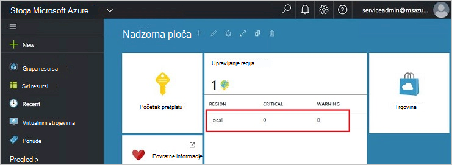
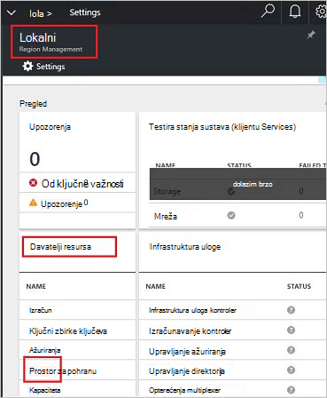
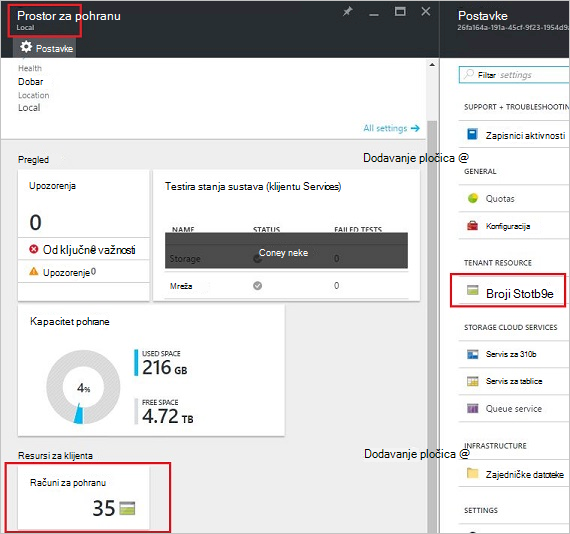
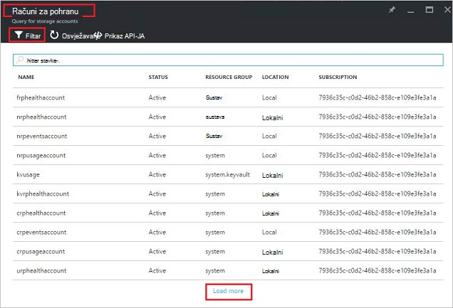
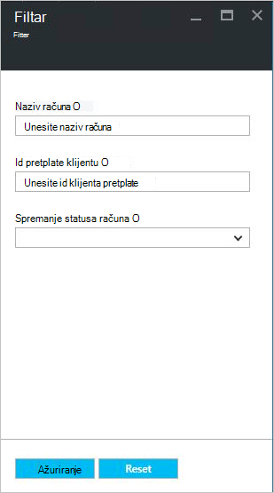
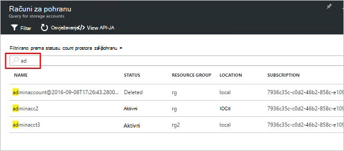
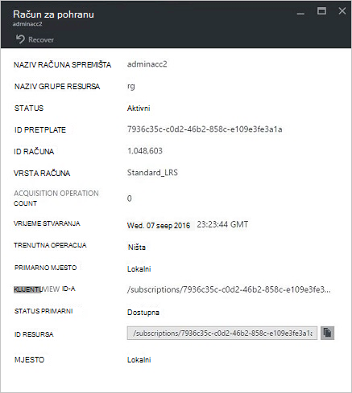
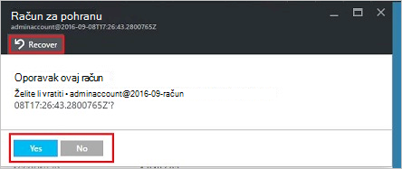
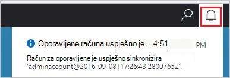
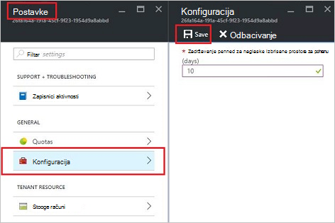

<properties
    pageTitle="Upravljanje računima za pohranu Azure stogu | Microsoft Azure"
    description="Saznajte kako pronaći i upravljanje njima, oporavak oslobodili račune za pohranu stogu Azure"
    services="azure-stack"
    documentationCenter=""
    authors="AniAnirudh"
    manager="darmour"
    editor=""/>

<tags
    ms.service="azure-stack"
    ms.workload="na"
    ms.tgt_pltfrm="na"
    ms.devlang="na"
    ms.topic="get-started-article"
    ms.date="09/26/2016"
    ms.author="anirudha"/>

# <a name="manage-storage-accounts-in-azure-stack"></a>Upravljanje računima za pohranu u stogu Azure

Saznajte kako upravljati računima za pohranu u stogu Azure možete pronaći, oporavak i oslobodili kapacitet pohrane na temelju poslovne potrebe.

## <a name="find-a-storage-account"></a>Pronalaženje s računom za pohranu

Na popisu računa za pohranu u regiji moguće je prikazati u stogu Azure po:

1.  U web-pregledniku, dođite do [https://portal.azurestack.local](https://portal.azurestack.local/).

2.  Prijava na portal Azure stogu kao administrator (pomoću vjerodajnica koje ste naveli tijekom implementacije)

3.  Na nadzornoj ploči za zadani – pronađite **područje upravljanje** popisom i kliknite područje koje želite da biste istražili – na primjer **(lokalni**).

    

4.  Odaberite **prostora za pohranu** na popisu **Davatelji resursa** .

    

5.  Sada na plohu administrator davatelja resursa za pohranu – pomaknite se na kartici "Za pohranu računi" i kliknite je.

    
    
    Stranici rezultata je na popisu računa za pohranu u tom području.

    

Po zadanom prikazuju se prvih 10 računi. Možete odabrati više za dohvaćanje klikom na vezu "učitavanje više" pri dnu popisa <br>
OR <br>
Ako vas zanima određeni prostor za pohranu računa – možete **filtrirati i dohvaćanje s odgovarajućim računima** samo.<br>

Da biste filtrirali za račune:

1. Kliknite gumb filtra pri vrhu na plohu.

2. Na plohu filtar omogućuje vam da odredite **naziv računa**,  **ID pretplate** ili **Stanje** Prilagodba popisa račune za pohranu da se prikazuje. Koristite ih po potrebi.

3. Kliknite Ažuriraj. Na popisu trebali biste osvježiti sukladno tome.

    

4. Da biste ponovno postavite filtar – kliknite gumb filtra, izbrisati odabrane mogućnosti i ažurirati.

Tekstni okvir za pretraživanje pri vrhu stranice popis plohu račune za pohranu omogućuje Isticanje odabranog teksta na popisu računa. Ovo je zaista pri ruci u slučaju kad imena i prezimena ili id nije nadohvat ruke.<br>
Besplatni tekst Ovdje možete koristiti da biste lakše pronašli račun koji vas zanima.




## <a name="look-at-account-details"></a>Pogledajte pojedinosti o računu

Kada pronađete račune vas zanima prikaz, klikom na određeni račun da biste vidjeli određene detalje o. Otvorit će se novi plohu s pojedinosti o računu kao što je vrsta računa, vrijeme stvaranja, mjesto itd.




## <a name="recover-a-deleted-account"></a>Oporavak izbrisane računa

Možda ćete u slučaju koju želite oporaviti izbrisane računa.<br>
U AzureStack postoji vrlo jednostavan način da biste to učinili.

1.  Idite na popis za račune za pohranu. [U odjeljku pronaći račun za pohranu](#find-a-storage-account)

2.  Na popisu pronađite određenog računa. Možda ćete morati filtrirati.

3.  Potvrdite okvir "Stanje" račun. Trebalo bi pisati "izbrisane".

4.  Kliknite račun koji će se otvoriti plohu Detalji o računu.

5.  Pri vrhu plohu – pronađite gumb "Vrati" i kliknite je.

6.  Potvrda pritiskom na tipku "da"

    

7.  Oporavak sada je u tijeku... čekati oznaka je uspio.
    Možete kliknuti i ikonu "slova zbo" pri vrhu portal za prikaz tijeka indications.

    

  Kada uspješno sinkronizira oporavljene računa, jedan možete vratiti ga koristiti.

### <a name="some-gotchas"></a>Neke Preprekama

- Računa izbrisane prikazuje stanje kao "iz zadržavanja".

  To znači da izbrisane račun premašila razdoblje zadržavanja i možda neće biti oporaviti još više.

- Izbrisane račun ne prikazuje na popisu računa.

  To može značiti da je već izbrisane račun smeća koji se prikupljaju. U ovom slučaju je nije moguće oporaviti više. U odjeljku "oslobodili kapaciteta" ispod.

## <a name="set-retention-period"></a>Postavljanje razdoblje zadržavanja

Postavka za razdoblje zadržavanja omogućuje administrator da biste odredili vremensko razdoblje u dana (od 0 do 9999 dana) tijekom kojeg sve izbrisane račun potencijalno može oporaviti. Zadano razdoblje zadržavanja postavljen na 15 dana. Postavljanje vrijednosti na "0" znači da sve izbrisane račun bit će odmah iz pravilnika za zadržavanje i označene za periodičku smeća.

Da biste promijenili razdoblje zadržavanja –

1.  U web-pregledniku, dođite do [https://portal.azurestack.local](https://portal.azurestack.local/).

2.  Prijava na portal Azure stogu kao administrator (pomoću vjerodajnica koje ste naveli tijekom implementacije)

3.  Na nadzornoj ploči za zadani – pronađite **područje upravljanje** popisom i kliknite područje koje želite da biste istražili – na primjer **(lokalni**).

4.  Odaberite **prostora za pohranu** na popisu **Davatelji resursa** .

5.  Kliknite ikonu postavke na vrhu da biste otvorili plohu postavku.

6.  Kliknite na konfiguracija – razdoblje zadržavanja.

7.  Možete uređivati vrijednosti i spremite je.

 Ta vrijednost bit će odmah učinkovitih i odražava preko cijelo područje.



## <a name="reclaim-capacity"></a>Oslobodili kapaciteta

Jedna od strane efekata pojavljuju razdoblje zadržavanja je da će se izbrisane račun nastaviti trošiti kapaciteta dok se ne dolaze iz razdoblje zadržavanja. Kao administrator, morat ćete način da biste oslobodili to izbrisao prostora računa čak i ako je razdoblje zadržavanja još nije istekao. Trenutno koristite na cmdline za izričito nadjačati razdoblje zadržavanja i odmah oslobodili kapaciteta. Da biste to učinili –

1.  Pod pretpostavkom da ste Azure PowerShell instalacije i konfiguracije. Ako ne želite slijedite upute u nastavku: da biste instalirali najnoviju verziju Azure PowerShell i povezati s pretplatom Azure, pogledajte [upute za instalaciju i konfiguriranje Azure PowerShell](http://azure.microsoft.com/documentation/articles/powershell-install-configure/).
    Dodatne informacije o cmdletima Azure upravljanja resursima potražite u članku [Korištenje Azure PowerShell s Azure Voditelj resursa](http://go.microsoft.com/fwlink/?LinkId=394767)

2.  Pokrenite ovaj cmdlet:

    ```
    PS C:\\>; Clear-ACSStorageAccount -ResourceGroupName system
    -FarmName <your farmname>
    ```

> Dodatne informacije pogledajte [powershell](https://msdn.microsoft.com/library/mt637964.aspx) potražite u dokumentaciji AzureStack

> [AZURE.NOTE] Ovaj cmdlet pokretanje trajno izbrisati račun i njezin sadržaj. Više neće biti koje se mogu vratiti. Koristite s njega.

