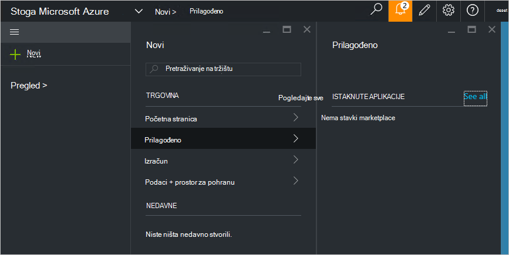

<properties
    pageTitle="Objavljivanje prilagođene trgovine stavke u stogu Azure (administrator servisa) | Microsoft Azure"
    description="Administrator servisa Saznajte kako objaviti prilagođene trgovine stavke u stogu Azure."
    services="azure-stack"
    documentationCenter=""
    authors="rupisure"
    manager="byronr"
    editor=""/>

<tags
    ms.service="azure-stack"
    ms.workload="na"
    ms.tgt_pltfrm="na"
    ms.devlang="na"
    ms.topic="article"
    ms.date="09/26/2016"
    ms.author="rupisure"/>

# Stoga Azure Marketplace

Na tržištu je zbirka stavki prilagođene za Azure snopa, kao što su services, aplikacija i resursa. Je mjesto odakle klijenata za stvaranje nove resurse i implementacija nove aplikacije. Administratori servisa možete dodati prilagođene stavke na tržištu i klijenata prikazat će ih odmah.

Da biste otvorili trgovine, kliknite **Novo**.

Na tržištu se ažurira svakih pet minuta.

## Tržište stavki

Svaka stavka trgovine sadrži:

-   Predložak programa Azure Voditelj resursa za dodjeljivanje resursa

-   Metapodaci, kao što su nizovi, ikone i druge marketinške popratnih materijala

-   Informacije o oblikovanju da biste prikazali stavke na portalu

Svaka stavka objaviti u trgovinu koristi oblik nazvan Galerija paketa Azure (azpkg). Uvođenje ili runtime resursi (kao što je kod, zip datoteke sa softverom ili slike virtualnog računala) treba dodati Azure stogu zasebno, ne kao dio trgovine stavke. 

## Daljnji koraci

[Stvaranje i objavljivanje stavke na tržištu](azure-stack-create-and-publish-marketplace-item.md)
