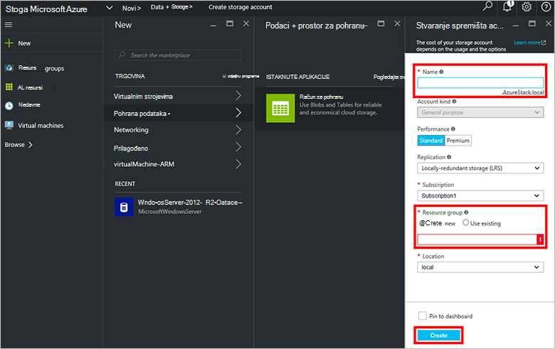

<properties
    pageTitle="Računi za pohranu u stogu Azure | Microsoft Azure"
    description="Saznajte kako stvoriti račun za pohranu Azure stogu."
    services="azure-stack"
    documentationCenter=""
    authors="ErikjeMS"
    manager="byronr"
    editor=""/>

<tags
    ms.service="azure-stack"
    ms.workload="na"
    ms.tgt_pltfrm="na"
    ms.devlang="na"
    ms.topic="get-started-article"
    ms.date="09/26/2016"
    ms.author="erikje"/>

# Računi za pohranu u stogu Azure

Računi za pohranu obuhvaćaju Blob i tablice servise i jedinstvene prostor naziva za objekte za pohranu podataka. Prema zadanim postavkama, na vašem računu podaci dostupni samo vama vlasnika računa za pohranu.

1.  Na računalu PNA snop Azure, prijavite se u sustav `https://portal.azurestack.local` kao [administrator](azure-stack-connect-azure-stack.md#log-in-as-a-service-administrator), a zatim **Novo** > **podataka + prostor za pohranu** > **računa za pohranu**.

    

2.  U plohu **Stvaranje računa za pohranu** unesite naziv računa za pohranu. Stvorite novu **Grupu resursa**ili odaberite postojeći, a zatim kliknite **Stvori** da biste stvorili račun za pohranu.

    

3. Da biste vidjeli na novi račun za pohranu, kliknite **sve resurse**, a zatim potražite račun za pohranu i kliknite njezin naziv.

    
    
## Daljnji koraci

[Korištenje predložaka Voditelj resursa za Azure](azure-stack-arm-templates.md)

[Informirajte se o računima Azure prostora za pohranu](../storage/storage-create-storage-account.md)

[Preuzmite vodič za Azure stogu Azure dosljedan prostora za pohranu provjere valjanosti](http://aka.ms/azurestacktp1doc)
