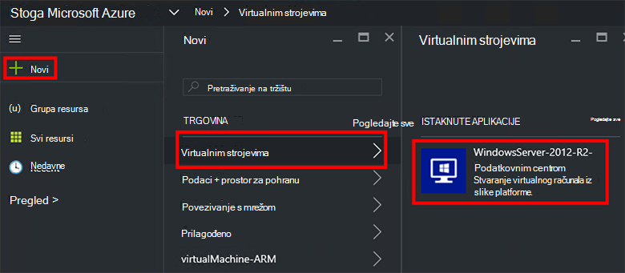
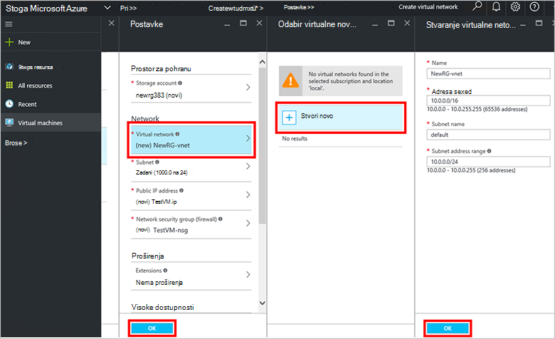
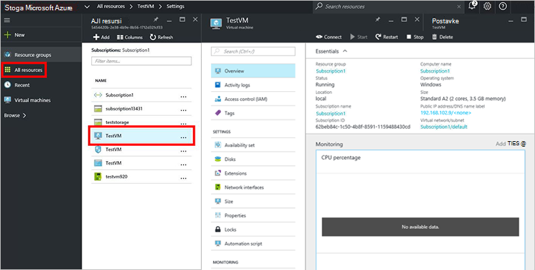

<properties
    pageTitle="Dodjela VM u stogu Azure (klijentsko) | Microsoft Azure"
    description="Kao klijent, upute za dodjelu resursa VM u stogu Azure."
    services="azure-stack"
    documentationCenter=""
    authors="ErikjeMS"
    manager="byronr"
    editor=""/>

<tags
    ms.service="azure-stack"
    ms.workload="na"
    ms.tgt_pltfrm="na"
    ms.devlang="na"
    ms.topic="get-started-article"
    ms.date="10/12/2016"
    ms.author="erikje"/>

# Dodjela virtualnog računala

Kao administrator, možete stvoriti virtualnim strojevima za procjenu resursa prije koja nudi u tarifama.

## Dodjela virtualnog računala

1.  Na računalu PNA snop Azure, prijavite se u sustav `https://portal.azurestack.local` kao [administrator](azure-stack-connect-azure-stack.md#log-in-as-a-service-administrator), a zatim **Novo** > **virtualnim računalima sustava** > **WindowsServer-2012 – R2-podatkovnog centra**.  

    

2.  U plohu **Osnove** upišite **ime**, **korisničko ime**i **lozinku**. Za **vrstu VM disk**, odaberite **podizanje tvrdog diska**. Odaberite **pretplatu**. Stvaranje **grupa resursa**ili odaberite postojeći, a zatim **u redu**.  

3.  U plohu **Odaberite veličinu** kliknite **Osnovni A1**, a zatim **Odaberite**.  

4.  U plohu **Postavke** kliknite **virtualne mreže**. U plohu **Odabir virtualne mreže** kliknite **Stvori novi**. U plohu **Stvaranje virtualne mreže** Prihvati sve zadane postavke pa kliknite **u redu**. U plohu **Postavke** , kliknite **u redu**.

    

5.  U plohu **Sažetak** kliknite **u redu** da biste stvorili virtualnog računala.  

6. Da biste vidjeli nove virtualnog računala, kliknite **sve resurse**, a zatim potražite virtualnog računala i kliknite njezin naziv.

    

## Daljnji koraci

[Računi za pohranu](azure-stack-provision-storage-account.md)
