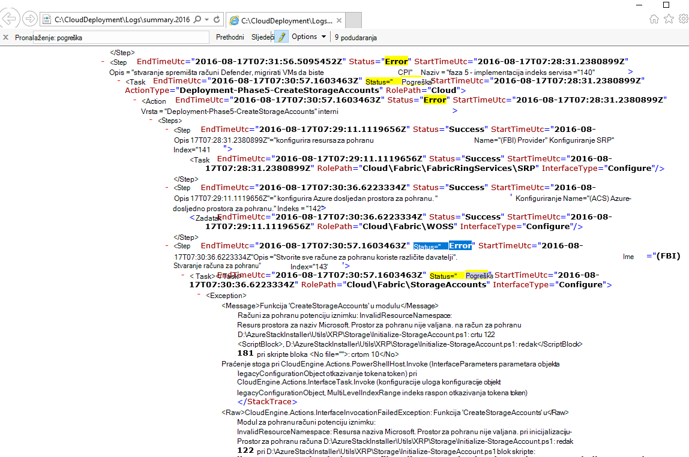
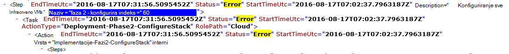

<properties
    pageTitle="Ponovno pokrenite implementaciju iz nije uspjelo koraka | Microsoft Azure"
    description="Ako se pojave pogreške tijekom implementacije, pokušajte sljedeće korake za implementaciju s kojima se nije uspjela, ponovno pokrenite."
    services="azure-stack"
    documentationCenter=""
    authors="ErikjeMS"
    manager="byronr"
    editor=""/>

<tags
    ms.service="azure-stack"
    ms.workload="na"
    ms.tgt_pltfrm="na"
    ms.devlang="na"
    ms.topic="get-started-article"
    ms.date="09/26/2016"
    ms.author="erikje"/>
    
# Ponovno pokrenite implementaciju iz nije uspjelo koraka
  
Ako se pojave pogreške tijekom implementacije, pokušajte sljedeće korake za implementaciju s kojima se nije uspjela, ponovno pokrenite.

## Pronalaženje pogreške

Preuzimanje bilješke pogreške, posebno dio koji poziva na koji korak pozivanje nije uspjelo. Na primjer,

**2016, 08 i 17 00:30:57 pogreške 1 > 1 > akcija: poziva koraka 60.140.143 nije uspjelo. Prekid poziva akcijski plan.**

Ovo je koraku implementacije gdje će pokrenuti ponovno pokrenite implementacije.

## Pronalaženje podrobnije na pogreške

Ako želite više detalja o pogrešci, pronaći pridruženog **sažetak. GGGG MM DD.tt.N.log.xml** u na **C:\CloudDeployment\Logs\* * mapu.
Traženje niz "Pogreška" i slijedite ga prema dolje kroz izlaz dok ne ugledate veliku količinu koji nisu u XML oblikovani tekst koji sadrži poruku o pogrešci (u ovom se odjeljku često coincides s zadnju instancu niz "Pogreška"). Ako, na primjer:

Ove informacije možete koristiti i da biste pratili koraka ponovno pokrenite, slijedite brojeve "Indeks" iz tog zadnju pogrešku. Na gornjoj slici možete vidjeti (počevši od dna): 143, 140 i zatim if pomicanje prema gore, pročitajte članak 60:

Stavljanje sve zajedno (sada odozgo prema dolje), dobit ćete 60.140.143, baš kao i u rezultatu konzole PS pogreške (kao što se vidi u odjeljku "Pronalaženje pogreška" iznad).

## Ponovno pokrenite implementaciju na određeni korak

Sad kad ste korak koji nije uspjela implementaciju, možete pokušati-ponovno pokrenite implementacije iz tog koraka.

> [AZURE.IMPORTANT] Korisnik točan u kontekstu sa pogreške koja se pojavila se moraju se izvoditi sljedeće naredbe. Ako je došlo do pogreške prije nego što je glavno računalo priključeno na domenu, pokrenite sljedeće korake kao lokalnog administratorskog računa. Ako je došlo do pogreške kada je glavno računalo priključeno na domenu, pokrenite sljedeće korake kao administrator domene (azurestack\azurestackadmin).

### Izvršavanje naredbe pozovite EceAction

1. S dodatnim PS konzole uvoz module za sljedeće:

        Import-Module C:\CloudDeployment\CloudDeployment.psd1 -Force
        Import-Module C:\CloudDeployment\ECEngine\EnterpriseCloudEngine.psd1 -Force 

2. Zatim pokrenite sljedeću naredbu (primjer from above korištenih ovdje):

        Invoke-EceAction -RolePath Cloud -ActionType Deployment -Start 60.140.143 -Verbose

3.  To će pokrenuti implementacije od koraka označena parametrom – pokretanje naredbe pozovite EceAction

### Rezultati od-ponovno pokrenite/početak rada

Bez obzira na to mogućnost odaberete, uvođenje će ponovno započeti od navedenog - početka parametar.

1.  Ako je pogreške koje se mogu vratiti implementacijskih će i dalje do dovršetka.

2.  Uvođenje ponovno ne uspije pri...
    
    - na istom mjestu: neuspjeh vjerojatno ne oporaviti, a potreban je daljnje istrage.

    - novo mjesto nakon gdje failed ovaj put: pokušate te iste korake da biste ga ponovno raditi.

    - novo mjesto prije gdje failed ovaj put: nešto drugo je pošlo po zlu s poziv idempotent koji zahtijeva dodatno istrage.

## Daljnji koraci

[Povezivanje s Azure stogu](azure-stack-connect-azure-stack.md)

