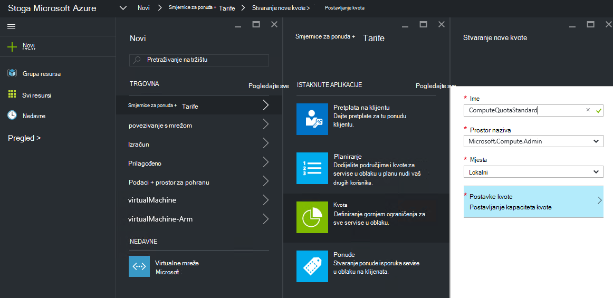
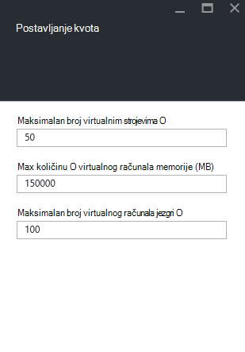
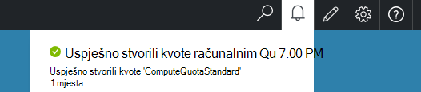

<properties
    pageTitle="Kvota u stogu Azure | Microsoft Azure"
    description="Administratori postavljanje kvote da biste ograničili maksimalnu količinu resursa koji klijenata imaju pristup."
    services="azure-stack"
    documentationCenter=""
    authors="mattmcg"
    manager="byronr"
    editor=""/>

<tags
    ms.service="azure-stack"
    ms.workload="na"
    ms.tgt_pltfrm="na"
    ms.devlang="na"
    ms.topic="get-started-article"
    ms.date="09/26/2016"
    ms.author="mattmcg"/>

# Postavljanje kvota u stogu Azure

Kvota definirati ograničenja resursa koji klijent pretplate možete Dodjela resursa ili zauzeti. Ograničenja, na primjer, možda dopustiti klijentu da biste stvorili do pet VMs. Da biste dodali plan usluge, administrator mora konfigurirati postavke kvota za servis.

Kvota se može konfigurirati po servisa i po lokaciji, omogućivanje administratorima omogućuje zrnastog kontrolu nad potrošnje resursa. Administratori mogu stvoriti jedan ili više kvota resursa i pridružiti tarife, što znači da se pružaju isporučujte prilagođena ponude za svoje usluge. Kvota za na servisu mogu se kreirati plohu administracije **Davatelja resursa** za servis.

Na koji se klijent pretplaćuje ponude koja sadrži više tarifa možete koristiti sve resurse koji su dostupni u svakom plan.

## Da biste stvorili kvota za IaaS

1.  U pregledniku idite na [https://portal.azurestack.local](https://portal.azurestack.local/).

    Prijavite se u stogu Azure portalu kao administrator (pomoću vjerodajnica koje ste naveli tijekom implementacije).

2.  Odaberite **Novo**, a zatim odaberite **kvota**.

3.  Odaberite prvi servis za koju želite stvoriti ograničenja. Kvota za IaaS, slijedite ove korake za servise računalnim, mreže i prostora za pohranu.
U ovom primjeru, najprije ćemo stvoriti kvote za servis računalnim. Na popisu **polja naziva** odaberite mjesto za naziv **Microsoft.Compute.Admin** .

    > 

4.  Odaberite mjesto gdje se kvote definirana (na primjer, 'lokalni').

5.  Na stavci **Postavke kvota** piše **Postavljanje kapaciteta kvote**. Kliknite tu stavku da biste konfigurirali postavke kvote.

6.  Na plohu **Postavljanje kvote** vidjeti sve računalnim resurse za koje možete konfigurirati ograničenja. Svaka vrsta ima zadanu vrijednost koja nije pridružena. Možete promijeniti te vrijednosti ili odaberete gumb **u redu** pri dnu plohu da biste prihvatili zadane vrijednosti.

    > 

7.  Nakon što ste konfigurirali vrijednosti i kliknete **u redu**, pojavit će se **Postavke kvota** stavke kao **Configured**. Kliknite **u redu** da biste stvorili **kvota** resursa.

    Trebali biste vidjeti obavijest koja označava da je stvoren kvota resursa.

8.   Nakon što postavljanje kvote uspješno je stvorili, primit ćete drugi obavijest. Servis kvote računalnim je sada biti povezane s plan. Ponovite te korake sa servisima za mreže i prostora za pohranu i spremni ste stvorili tarifu IaaS!

    >   

## Vrste kvote za izračun

|**Vrsta**                    |**Zadana vrijednost**| **Opis**|
|--------------------------- | ------------------------------------|------------------------------------------------------------------|
|Maksimalan broj virtualnim strojevima   |50|Maksimalan broj virtualnim strojevima pretplatu možete stvoriti na ovom mjestu. |
|Maksimalan broj jezgri virtualnog računala              |100|Maksimalni broj jezgri koji pretplatu možete stvoriti na ovom mjestu (na primjer, ima programa VM A3 četiri jezgri).|
|Max količinu memorije virtualnog računala (GB)         |150|Maksimalno povećali RAM-a koja može biti dodijeljena u megabajtima (na primjer, u VM A1 troši 1,75 GB RAM-a).|

> [AZURE.NOTE] Izračun kvote se primjenjuju na ovaj Tehnički pretpregled.

## Vrste kvote za pohranu

|**Stavke**                           |**Zadana vrijednost**   |**Opis**|
|---------------------------------- |------------------- |-----------------------------------------------------------|
|Maksimalnog kapaciteta (GB)              |500                 |Ukupna kapaciteta koji možete troše pretplatu na ovom mjestu.|
|Ukupan broj računa za pohranu   |20                  |Maksimalni broj računa za pohranu koji pretplatu možete stvoriti na ovom mjestu.|

## Vrste mrežnih kvote

|**Stavke**                                                   |**Zadana vrijednost**   |**Opis**|
|----------------------------------------------------------| ------------------- |--------------------------------------------------------------------------------------------------------------------------------------------------------------------|
| Javnu IP-ovi Max                         |50                  |Maksimalan broj javnu IP-ovi koji pretplatu možete stvoriti na ovom mjestu. |
| Max virtualne mreže                   |50                  |Maksimalan broj virtualne mreže pretplatu možete stvoriti na ovom mjestu. |
| Max virtualne mreže pristupnika           |1                   |Maksimalan broj pristupnika virtualne mreže (VPN-a pristupnika) koje pretplatu možete stvoriti na ovom mjestu. |
| Max mrežne veze                |2                   |Maksimalan broj mrežne veze (point-to-point ili web-mjesto) koje pretplatu možete stvoriti preko svih pristupnika virtualne mreže na ovom mjestu. |
| Max učitavanja balancers                     |50                  |Maksimalan broj balancers opterećenja koji pretplatu možete stvoriti na ovom mjestu. |
| NIC-ovi Max                               |100                 |Maksimalni broj sučelja mreže koju pretplatu možete stvoriti na ovom mjestu. |
| Max mreže sigurnosne grupe            |50                  |Maksimalan broj mreže sigurnosne grupe kojima se pretplatu možete stvoriti na ovom mjestu. |
