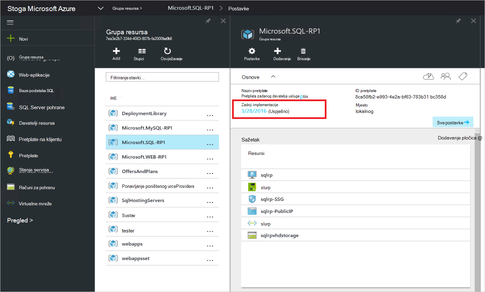

<properties
    pageTitle="Implementacija davatelja resursa sustava SQL Server na hrpu Azure | Microsoft Azure"
    description="Detaljne upute za implementaciju SQL Server resursa davatelja prilagodnik na hrpu Azure."
    services="azure-stack"
    documentationCenter=""
    authors="Dumagar"
    manager="byronr"
    editor=""/>

<tags
    ms.service="multiple"
    ms.workload="na"
    ms.tgt_pltfrm="na"
    ms.devlang="na"
    ms.topic="article"
    ms.date="09/26/2016"
    ms.author="dumagar"/>

# Implementacija davatelja prilagodnika SQL resursa poslužitelja na Azure stogu

> [AZURE.NOTE] Sljedeće informacije odnosi se samo na Azure stogu TP1 implementacije.

Pomoću ovog članka slijediti detaljne upute za postavljanje davatelja prilagodnika SQL resursa poslužitelja na hrpu Azure probni od pojam (PNA). Potražite u članku [korištenje baze podataka SQL Azure stogu](azure-stack-sql-rp-deploy-short.md) da biste razumjeli mogućnosti davatelja resursa i arhitekturu.

## Postavljanje korake prije implementacije

Prije implementacije kod davatelja resursa, morate:

- Sadržavati zadanu sliku Windows Server s .NET 3.5
- Isključivanje poboljšane zaštite Internet Explorer (IE)
- Instalirajte najnoviju verziju Azure PowerShell

### Stvaranje slike sustava Windows Server, uključujući .NET 3.5

Ako ste preuzeli bitova Azure stogu nakon 23/2/2016 jer zadane osnovne Windows Server 2012 R2 slike sadrži .NET 3.5 framework u preuzimanje i novijim verzijama, preskočite ovaj korak.

Ako ste preuzeli prije 23/2/2016, morate stvoriti Windows Server 2012 R2 podatkovnog centra VHD sa slikom za .NET 3.5 i skup je kao zadanu sliku iz spremišta platforme slike.

### Isključivanje IE Poboljšana sigurnost i omogućivanje kolačića

Da biste implementirali davatelja resursa, pokrenete u Očisti integrirani skriptiranje okruženje (filtar) kao administrator, tako da morate dopustiti kolačiće i JavaScript u profilu programa Internet Explorer koristite za prijavu na Azure Active Directory za administratora i korisnički znak dodataka.

**Da biste isključili IE Poboljšana sigurnost:**

1. Prijavite se na računalo (PNA) za Azure stogu dokaz pojam kao AzureStack/administrator, a zatim otvorite upravitelj poslužitelja.

2. Isključite **Poboljšana konfiguracija sigurnosti preglednika Internet Explorer** administratorima i korisnicima.

3. Prijavite se u **ClientVM.AzureStack.local** virtualnog računala kao administrator, a zatim otvorite upravitelj poslužitelja.

4. Isključite **Poboljšana konfiguracija sigurnosti preglednika Internet Explorer** administratorima i korisnicima.

**Da biste omogućili kolačiće:**

1. Na zaslonu Start sustava Windows kliknite **sve aplikacije**, Pomagala **Windows**, desnom tipkom miša kliknite **Internet Explorer**, pokažite na **više**, a zatim **Pokreni kao administrator**.

2. Ako se to od vas zatraži, potvrdite **Upotrijebi preporučeni sigurnost**, a zatim **u redu**.

3. U pregledniku Internet Explorer kliknite **Alati () ikonu zupčanika** &gt; **Internetske mogućnosti** &gt; karticu **Privatnost** .

4. Kliknite **Dodatno**, provjerite jesu li oba gumba **Prihvati** , kliknite **u redu**i zatim kliknite **u redu** .

5. Zatvorite Internet Explorer, a zatim ponovno pokrenite Očisti filtar kao administrator.

### Instalacija Azure stogu kompatibilne izdanje PowerShell Azure

1. Deinstalirajte postojeće Azure PowerShell s VM vaš klijent.

2. Prijavite se na računalo Azure stogu PNA kao AzureStack/administrator.

3. Putem udaljene radne površine, prijavite se u **ClientVM.AzureStack.local** virtualnog računala kao administrator.

4. Otvorite upravljačku ploču, kliknite **Deinstaliraj program** &gt; kliknite **Azure PowerShell** &gt; kliknite **Deinstaliraj**.

5. [Preuzmite najnovije Azure PowerShell koji podržava stogu Azure](http://aka.ms/azstackpsh) i instalirajte ga.

    Nakon što instalirate PowerShell, možete pokrenuti potvrdu skriptu PowerShell da biste provjerili možete li se povezati s vašoj instanci Azure snop (prikazivati na web-stranicu za prijavu).

## Povezati davatelja implementacije resursa PowerShell

1. Povezivanje udaljene radne površine Azure stogu PNA clientVm.AzureStack.Local i prijavite se kao azurestack\\azurestackuser.

2. [Preuzimanje binarne datoteke SQLRP](http://aka.ms/massqlrprfrsh) datoteka. Možda ćete morati uklanjanje bloka za sigurnost Internet preuzimanje klikom desnom tipkom miša na datoteku, odaberite **Svojstva** , a na kartici **Općenito** crtičnih **Unblock** **u redu**. Time se treba spriječiti ' Nije moguće učitati datoteku ili skupa' iznimke vezanih uz DeploymentTelemetry.dll i sljedeće iznimke praćenje implementacije.

3. Izdvajanje datoteke D:\\SQLRP.

4. Pokretanje sustava D:\\SQLRP\\Bootstrap.cmd datoteke kao administrator (azurestack\\administrator).

    Bootstrap.ps1 datoteka se otvara u Očisti filtar.

5. Kada prozor Očisti filtar dovrši učitavanje, kliknite gumb Reproduciraj ili pritisnite F5.

    

    Učitavanje će dvije glavne kartice, svaka sadrži skripte i datoteke koje su potrebne za implementaciju davatelja resursa.

## Priprema preduvjeti

Kliknite karticu **Priprema preduvjeti** za:

- Stvaranje potrebnih certifikata
- Prijenos artefakte s računom za pohranu na hrpu Azure
- Objavljivanje galeriju stavki

### Stvaranje potrebnih certifikata
Ova skripta **Novo SslCert.ps1** dodaje na \_. AzureStack.local.pfx SSL certifikata u D:\\SQLRP\\preduvjeti\\BlobStorage\\spremnik mape. Potvrda secures komunikaciju između davatelja resursa i lokalnu instancu programa upravitelj resursa Azure.

1. Na kartici glavna **Priprema preduvjeti** kliknite karticu **Novo SslCert.ps1** , a zatim ga pokrenuti.

2. U naredbeni redak koji će se pojaviti upišite lozinku PFX koji štiti privatni ključ i **zabilježite lozinku**. Morat ćete ga kasnije.

### Prijenos svih artefakte s računom za pohranu na hrpu Azure

1. Kliknite karticu **Prijenos Microsoft.Sql RP.ps1** , a zatim ga pokrenuti.

2. U dijaloškom okviru Windows PowerShell vjerodajnica zahtjev upišite administratorske vjerodajnice servisa Azure stogu.

3. Kada se to od vas zatraži Azure Active Directory klijentu ID-a, upišite svoje Azure Active Directory klijentu potpuno kvalificirani naziv domene:, na primjer, microsoftazurestack.onmicrosoft.com.

    Skočni prozor traži vjerodajnice.

    

    > [AZURE.TIP] Ako se ne pojavi skočni prozor, koje ili niste isključili IE Poboljšana sigurnost da biste omogućili JavaScript na računalu i korisnika ili niste prihvatili kolačića u preglednika Internet Explorer. Potražite u članku [Postavljanje korake prije implementacije](#set-up-steps-before-you-deploy).

4. Upišite Azure stogu servisa administratorske vjerodajnice, a zatim kliknite **Prijava**.

### Objavljivanje stavki galeriju za kasnije stvaranje resursa

Odaberite karticu **Objavljivanje GalleryPackages.ps1** , a zatim ga pokrenuti. Ova skripta dodaje dvije stavke trgovine portalu PNA snop Azure marketplace koje možete koristiti za implementaciju resurse za bazu podataka kao stavke trgovine.

## Implementacija sustava SQL Server resursa davatelja VM

Sad kad ste pripremili stoga PNA Azure s potrebne potvrde i stavkama trgovine, možete implementirati davatelj usluga SQL Server resursa. Kliknite karticu **davatelj usluga za SQL implementacija** da biste:

   - Unesite vrijednosti u JSON datoteku koja referencira postupak implementacije
   - Implementacija davatelja resursa
   - Ažuriranje lokalni DNS-a
   - Registrirajte se prilagodnik za davatelja resursa SQL Server

### Unesite vrijednosti u datoteci JSON

Kliknite **Microsoft.Sqlprovider.Parameters.JSON**. Datoteka sadrži parametre koje predloška Azure Voditelj resursa treba pravilno implementacija snop Azure.

1. Popunite **prazne** parametara u datoteci JSON:

    - Provjerite je li vam **adminusername** i **adminpassword** za VM davatelj usluga za SQL resursa:

        

    - Provjerite je li unesete lozinku za parametar **SetupPfxPassword** koje ste napravili bilješku o [Pripremi prequisites](#prepare-prerequisites) koraka:

    

2. Kliknite **Spremi** da biste spremili datoteku parametar.

### Implementacija davatelja resursa

1. Kliknite karticu **uvođenja Microsoft.sql provider.PS1** i pokrenuti skriptu.
2. U Azure Active Directory kada se to od vas zatraži, upišite svoje ime klijenta.
3. U skočnom prozoru unos administratorske vjerodajnice servisa Azure stogu.

Potpuna implementaciju, može proći između 25 i 55 minuta na nekim vrlo koriste POCs snop Azure. Najdulje korake bit će nastavak želji stanje konfiguracije (DSC) i izvršavanje PowerShell, završnom koraku. Svaki može potrajati 10 25 minuta.

### Ažuriranje lokalni DNS-a

1. Kliknite karticu **Register Microsoft.SQL fqdn.ps1** i pokrenuti skriptu.
2. Upit za Azure Active Directory klijentu ID za unos vašeg Azure Active Directory klijentu potpuno kvalificirani naziv domene:, na primjer, **microsoftazurestack.onmicrosoft.com**.

### Registrirajte se davatelj usluga za SQL to resursa##

1. Kliknite karticu **Register Microsoft.SQL provider.ps1** i pokrenuti skriptu.

2. Kada se pojavi upit za vjerodajnice, koristite sljedeće vrijednosti za korisničko ime i lozinku:

   - **sqlRpUsername**
   - **sqlRpPassw0rd**

   > [AZURE.IMPORTANT] To su *slovni* vrijednosti koje ćete morati unijeti kada morati unijeti vjerodajnice. To su nije rezervirana mjesta. * *Učinite *ne* vrsta ** username\password koje ste spremili u datoteci parametar prije no što implementirate u VM.

## Provjera uvođenja pomoću portala za stog Azure

1. Odjava iz sustava ClientVM i ponovno se prijavite kao **AzureStack\AzureStackUser**.

2. Na radnoj površini, kliknite **Azure stogu PNA Portal** i prijavite se na portal kao administratora servisa.

3. Provjerite je li uspješno uvođenje. Kliknite **Pregledaj** &gt; **Grupa resursa** &gt; kliknite grupu resursa koji ste koristili (Zadana vrijednost je **SQLRP**), i provjerite je li to essentials dio plohu (gornjem dijelu) glasi **implementacije uspješno**.

      

4. Provjerite je li uspješno registracije. Kliknite **Pregledaj** &gt; **davatelji resursa**, a zatim potražite **SQL lokalne**:

      

## Pružanje kapaciteta vaš davatelj usluga za SQL resursa povezivanjem domaćinu SQL server

1. Prijavite se na portal za Azure stogu PNA kao administrator servisa

2. Kliknite **davatelja resursa** &gt; **lokalne SQL** &gt; **otvorite Upravljanje resursima davatelja** &gt; **poslužitelji** &gt; **Dodavanje**.

    **SQL Server za hostiranje** plohu je gdje možete povezati davatelja resursa za SQL Server stvarni instance sustava SQL Server kao pozadinskom davatelja resursa.

    

3. Ispunite obrazac Pojedinosti veze instance sustava SQL Server. Prema zadanim postavkama konfiguriranog SQL Server pod nazivom "SQLRP" pomoću administratorskog korisničkog imena "sa" i oblačićima u parametru "adminpassword" u parametara JSON radi na VM lozinku.

## Stvaranje prve baze podataka SQL da biste testirali implementaciju sustava

1. Prijavite se na portal za Azure stogu PNA kao administrator servisa.

2. Kliknite **Pregledaj** &gt; **baze podataka SQL** &gt; **Dodavanje**
  

3. Ispunite obrazac Detalji baze podataka, uključujući **Naziv poslužitelja**, **Prijavu administrator poslužitelja**i **lozinku** za novi *virtualnog poslužitelja* u Elektronička ploča **Novi poslužitelja** .

    

    Virtualni poslužitelj je artificial konstrukciju. Ne mapirajte SQL Server sam, ali umjesto manifesti putem korisničkog imena u nizu za povezivanje koje generira davatelja resursa na kraju ovog postupka. **Napomena lozinku unos zasebno za virtualni poslužitelj**. Na portalu će nikad ne prikazuj lozinku.

4. Zatraži da biste odabrali cijene sloju za bazu podataka.

    

    Razine ne primjenjuju se u ovoj verziji, ali njihove potrošnje prati Azure resursa Upravitelj kao načine demonstracije razlikovanja možete stvoriti u kvote provođenja itd.

5. Slanje obrasca i pričekajte da implementaciju da biste dovršili.

6. U stvorenom plohu obratite pozornost na to polje "Niz za povezivanje". U snop Azure možete koristiti taj niz u bilo kojoj aplikaciji kojima je potreban pristup sustava SQL Server (na primjer, web-aplikacijama).

    

## Daljnji koraci

Pokušajte drugih [PaaS servise](azure-stack-tools-paas-services.md) kao što je web-mjesto [davatelja poslužitelj MySQL resursa](azure-stack-mysql-rp-deploy-short.md) i u okvir za [davatelja resursa web-aplikacije](azure-stack-webapps-deploy.md).
