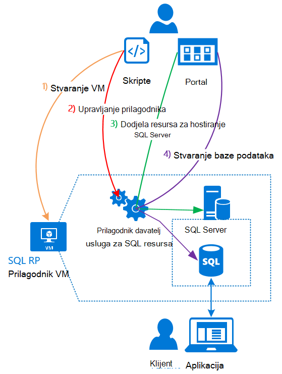

<properties
    pageTitle="Pomoću baze podataka SQL Azure stogu | Microsoft Azure"
    description="Saznajte kako možete implementirati baze podataka SQL kao servisa na Azure ad-hoc brzi koraci za implementaciju prilagodnik davatelja usluga za SQL Server resursa."
    services="azure-stack"
    documentationCenter=""
    authors="Dumagar"
    manager="byronr"
    editor=""/>

<tags
    ms.service="multiple"
    ms.workload="na"
    ms.tgt_pltfrm="na"
    ms.devlang="na"
    ms.topic="article"
    ms.date="09/26/2016"
    ms.author="dumagar"/>

# Korištenje baze podataka SQL na hrpu Azure

> [AZURE.NOTE] Sljedeće informacije odnosi se samo na Azure stogu TP1 implementacije.

Da biste baze podataka SQL kao servisa Azure stogu pomoću prilagodnik davatelja usluga za SQL Server resursa. Nakon što instalirate davatelja resursa, vi i vaši korisnici možete stvoriti baze podataka za aplikacije oblaka lokalnog, web-mjesto koje se temelje na SQL i radnih opterećenja koji se temelje na SQL bez potrebe za dodjeljivanje virtualnog računala (VM) koji sadrži SQL Server svaki put.

Budući da davatelja resursa nema mogućnosti baze podataka SQL Azure tijekom dokaz pojam (PNA), u ovom se članku počinje pregled davatelja arhitektura resursa. Zatim se kratak pregled koraka možete postaviti davatelja resursa, s vezama na detaljnije upute u [uvođenja u SQL baze podataka resursa davatelja prilagodnika na PNA snop Azure](azure-stack-sql-rp-deploy-long.md).

## SQL Server resursa davatelja prilagodnik arhitekture
Davatelja resursa ne nude svi baze podataka mogućnosti upravljanja baze podataka SQL Azure. Na primjer, grupe elastic baze podataka i mogućnost pozivanja performanse baze podataka prema gore i dolje u hodu nisu dostupni. No davatelja resursa podržavaju isti stvaranje, čitanje, ažuriranje i operacija brisanja (CRUD) koji je dostupan u bazi podataka SQL Azure.

Davatelja resursa sastoji se od tri komponente:

- **SQL resursa davatelja prilagodnik VM**, što obuhvaća postupak davatelja resursa i poslužitelja koji hostira SQL Server.
- **Davatelja resursa sam**, koji obrađuje zahtjevi za dodjeljivanje i izlaže baze podataka resursa.
- **Poslužitelja koji hostira SQL Server**, čime se omogućuje kapaciteta za baze podataka.

Sljedeće konceptualni dijagram prikazuje te komponente i koraci koje prolaze kroz kada implementacija davatelja resursa, postavljanje poslužitelja koji sadrži SQL Server, a zatim stvorite bazu podataka.

## Brzi koraci za implementaciju davatelja resursa
Ako ste već upoznati s stogu Azure, poduzmite sljedeće korake. Ako želite više detalja, slijedite veze na svakoj sekciji ili idite izravno na [uvođenja u SQL baze podataka resursa davatelja prilagodnika na PNA snop Azure](azure-stack-sql-rp-deploy-long.md).

1.  Provjerite je li dovršili sve [korake prije implementacije za postavljanje](azure-stack-sql-rp-deploy-long.md#set-up-steps-before-you-deploy) davatelja resursa:

  - .NET 3.5 framework već postavili osnovni slike u sustavu Windows Server. (Ako ste preuzeli bitova Azure stogu nakon veljača 23, 2016, možete preskočiti ovaj korak.)
  - [Izdanje Azure PowerShell koji je kompatibilan s Azure stoga je instaliran](http://aka.ms/azStackPsh).
  - U pregledniku Internet Explorer sigurnosnih postavki na ClientVM, [omogućena je isključen bolja sigurnost u pregledniku Internet Explorer i kolačiće](azure-stack-sql-rp-deploy-long.md#Turn-off-IE-enhanced-security-and-enable-cookies).

2. [Preuzimanje datoteke binarne datoteke za SQL Server to](http://aka.ms/massqlrprfrsh) i Izdvoji ClientVM u svoje PNA snop Azure.

3. [Pokrenite bootstrap.cmd i skripti](azure-stack-sql-rp-deploy-long.md#Bootstrap-the-resource-provider-deployment-PowerShell-and-Prepare-for-deployment).

    Skup skripte je grupirati prema dvije glavne kartice otvorena u na Očisti integrirani skriptiranje okruženje (filtar). Pokretanje učitati skripti u nizu slijeva nadesno na svakoj kartici.

    1. Pokreću skripte na kartici **Priprema** slijeva nadesno da biste:

        - Stvaranje zamjenskih certifikata radi zaštite komunikaciju između davatelja resursa i upravljanja resursima Azure.
        - Prijenos potvrde i druge artefakte s računom za pohranu za Azure stogu.
        - Objavite Galerija paketa tako da možete implementirati SQL i resursima putem galerije.

        > [AZURE.IMPORTANT] Ako bilo koji od skripte blokira bez razloga vidljivu nakon izvršavanja vaš klijent Azure Active Directory, postavke sigurnosti možda blokira DLL nužnog za implementaciju da biste pokrenuli. Da biste riješili taj problem, potražite Microsoft.AzureStack.Deployment.Telemetry.Dll u mapi davatelja resursa, desnom tipkom miša, kliknite **Svojstva**, a zatim potvrdite **Unblock** na kartici **Općenito** .

    1. Pokreću skripte na kartici **uvođenja** slijeva nadesno da biste:

        - [Uvođenje na VM](azure-stack-sql-rp-deploy-long.md#Deploy-the-SQL-Server-Resource-Provider-VM) koji hostira vaš davatelj usluga resursa i SQL Server. Ova skripta reference datoteka parametar JSON koje je potrebno ažurirati neke vrijednosti prije nego što pokrenete skriptu.
        - [Registrirati lokalni DNS zapis](azure-stack-sql-rp-deploy-long.md#Update-the-local-DNS) koji se preslikava davatelja resursa VM.
        - [Registrirajte se vaš davatelj usluga resursa](azure-stack-sql-rp-deploy-long.md#Register-the-SQL-RP-Resource-Provider) s lokalnom Azure upravitelj resursa.

        > [AZURE.IMPORTANT] Sve skripte pretpostavlja da slike Temeljni operacijski sustav ispunjava preduvjeti (.NET 3.5 instaliran, Omogući JavaScript i kolačiće u ClientVM i kompatibilna verzija programa Azure PowerShell instaliran). Ako primite pogreške prilikom pokretanja skripte, ponovno da ispunjena preduvjete.

6. [Povezivanje davatelja resursa na poslužitelju koji se nalazi SQL Server](#Provide-capacity-to-your-SQL-Resource-Provider-by-connecting-it-to-a-hosting-SQL-server) na portalu za Azure stogu. Kliknite **Pregledaj** &gt; **resursa davatelji** &gt; **SQLRP** &gt; **otvorite Upravljanje resursima davatelja** &gt; **poslužitelji** &gt; **Dodavanje**.

    Koristite "s" za korisničko ime i lozinka koje ste koristili prilikom implementiran davatelja resursa VM.

7. [Testiranje davatelja novi resurs sustava SQL Server](/azure-stack-sql-rp-deploy-long.md#create-your-first-sql-database-to-test-your-deployment)implementirati bazom podataka sustava SQL na portalu za Azure stogu. Kliknite **Stvori** &gt; **Prilagođena** &gt; **baze podataka SQL Server**.

Trebali biste dobiti sustava SQL Server resursa davatelja usluga za te izvodi u oko 45 minuta (ovisno o hardvera).
