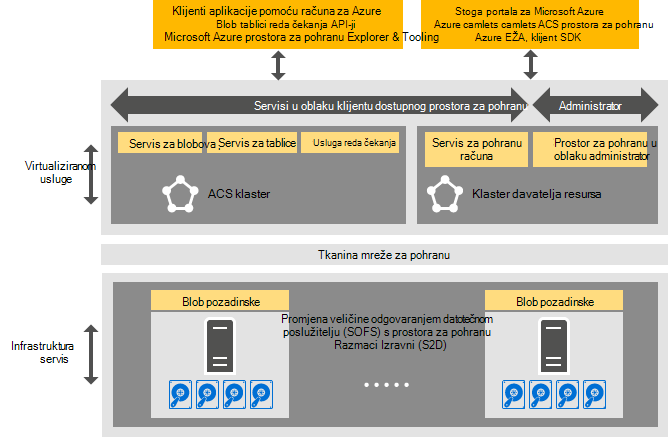

<properties
    pageTitle="Uvod u dosljedan Azure prostora za pohranu | Microsoft Azure"
    description="Dodatne informacije o Azure dosljedan prostora za pohranu"
    services="azure-stack"
    documentationCenter=""
    authors="AniAnirudh"
    manager="darmour"
    editor=""/>

<tags
    ms.service="azure-stack"
    ms.workload="na"
    ms.tgt_pltfrm="na"
    ms.devlang="na"
    ms.topic="get-started-article"
    ms.date="09/26/2016"
    ms.author="anirudha"/>

# Uvod u dosljedan Azure prostora za pohranu
Azure dosljedan prostora za pohranu je skup servise u oblaku za pohranu u stogu Microsoft Azure. Azure dosljedan prostora za pohranu nudi blob, tablice, reda čekanja i funkcija upravljanja račun s Azure dosljedan semantiku. Također nudi funkcije da biste lakše administrator oblaka Upravljanje uslugama za pohranu. Ovaj članak predstavlja Azure dosljedan prostora za pohranu i objašnjava kako servise u oblaku za pohranu u stogu Azure radi boljeg nadopunjuju obogaćenog [Mogućnosti definiranim softver za pohranu u sustavu Windows Server 2016](https://blogs.technet.microsoft.com/windowsserver/2016/04/14/ten-reasons-youll-love-windows-server-2016-5-software-defined-storage/).

Azure dosljedan prostora za pohranu nudi sljedeće široke kategorije funkcija:

- **Blob-ova**: stranica blob-ova, blokirati blob-ova i dodavanje blob polja s   [blob Azure dosljedan](https://msdn.microsoft.com/library/azure/dd179355.aspx#Anchor_1) 
   ponašanje

- **Tablica**: entiteti, particije i druga svojstva tablice s   [tablicom Azure dosljedan](https://msdn.microsoft.com/library/azure/dd179355.aspx#Anchor_3) 
   ponašanje

- **Reda čekanja**: pouzdanog i trajni poruke "i" Redovi s   [Azure dosljedan reda čekanja](https://msdn.microsoft.com/library/azure/dd179355.aspx#Anchor_2) 
   ponašanje

- **Računi**: upravljanje pohranom resursa za račun u pomoću   [računa za Azure dosljedan](https://azure.microsoft.com/documentation/articles/storage-create-storage-account/) 
   ponašanje za račune općenite namjene prostora za pohranu dodjeli putem [model implementacije Voditelj resursa za Azure](https://azure.microsoft.com/documentation/articles/resource-manager-deployment-model/)

- **Administracija**: Upravljanje servise internog prostora za pohranu za pohranu klijenta i web-Azure dosljedan (koje se spominju u druge članke)

## Arhitektura Azure dosljedan prostora za pohranu

Slika 1. Azure dosljedan prostora za pohranu: prikaz rješenja

## Azure dosljedan prostora za pohranu virtualiziranom servisa i klastere

Azure dosljedan arhitekture prostora za pohranu, sve klijenta ili servise za pohranu administrator dostupne su virtualiziranom. To jest, oni pokrenuti servisu davatelja upravlja, Visoko dostupne VMs na temelju [Hyper-V](https://technet.microsoft.com/library/dn765471.aspx) funkcije u [sustavu Windows Server 2016](http://www.microsoft.com/server-cloud/products/windows-server-2016/).
Iako u VMs iznimno dostupne su na temelju tehnologije [Windows klasteriranja na retke poslužitelja](https://technet.microsoft.com/library/dn765474.aspx) , Azure dosljedan servisa za pohranu virtualiziranom same su grupirani za goste, Visoko dostupna usluga na temelju [tehnologije tkanina servisa Azure](http://azure.microsoft.com/campaigns/service-fabric/).

Azure dosljedan prostora za pohranu uključuje dva klastere tkanina servisa u implementacije sustava Azure stogu.
Servis za davatelja resursa za pohranu je implementiran na servis tkanina klasteru ("to klaster") koji se zajednički koriste i tako da druge foundational resursa davatelja usluge. Ostatak prostora za pohranu virtualiziranom podatkovne usluge put – uključujući Blob, tablice i reda čekanja usluge – nalaze se na drugi servis tkanina klaster ("Azure dosljedan prostora za pohranu klaster").

## Servis blob i definiranim softver za pohranu

Blob servisa natrag završili, s druge strane, pokreće se izravno na čvorove klaster [Skaliranje iz datotečnog poslužitelja](https://technet.microsoft.com/library/hh831349.aspx) . U rješenje arhitekturi Azure stogu skaliranje iz datotečnog poslužitelja temelji se na u [Prostor za pohranu razmake Izravni](https://technet.microsoft.com/library/mt126109.aspx)-prebacivanje na temelju, zajednički koristiti nothing klaster. 1 slika prikazuje glavne Azure dosljedan usluge komponenti za pohranu i njihova model raspodijeljeno implementacije. Kao što vidite u dijagramu, Azure dosljedan prostora za pohranu dovetails s postojećih značajki definiranim softver za pohranu u sustavu Windows Server 2016. Nema poseban hardver potreban je za Azure dosljedan prostora za pohranu osim preduvjeta platforme Windows Server.

## Prostor za pohranu farme

Prostor za pohranu farme je zbirka infrastrukture za pohranu, resursa i pozadinske servise koje zajedno daju klijenta i web-administrator dostupnog Azure dosljedan servise za pohranu u implementacije sustava Azure stogu. Konkretno, za pohranu farme obuhvaća sljedeće:

- Hardver za pohranu (na primjer, čvorove skaliranje iz datotečnog poslužitelja, diskova)

- Prostor za pohranu tkanina resursa (na primjer, zajedničko korištenje SMB)

- Vezane uz prostora za pohranu servisa tkanina servisa (, na primjer, Blob krajnjoj točki servis isključivanje Azure dosljedan klaster prostora za pohranu)

- Usluge vezane uz prostora za pohranu koji se izvode na čvorove skaliranje iz datotečnog poslužitelja (na primjer, servis Blob)

## Scenariji za pohranu korištenje IaaS i PaaS

Azure dosljedan prostora za pohranu stranica blob-ova, kao Azure, navedite sve Infrastruktura virtualne diskova kao korištenja servisa (IaaS) scenariji:

- Stvorite na VM pomoću prilagođenih OS disk u blob stranice

- Stvorite na VM pomoću prilagođenu sliku s operacijskim Sustavom u blob stranice

- Stvorite na VM pomoću servisa Azure Marketplace sliku u blob nove stranice

- Stvorite na VM pomoću prazan disk u blob nove stranice

Isto tako, platforme kao usluge (PaaS) scenariji Azure dosljedan prostora za pohranu bloka blob-ova, dodavanje blob-ova, redove, i tablica funkcionira kao i u Azure.

## Uloge korisnika

Azure dosljedan prostora za pohranu je korisna za dva uloge korisnika:

- Vlasnici aplikacije, uključujući razvojnim inženjerima i enterprise IT. Oni više ne morate zadržati ili uvođenje dvije verzije aplikacije i skripte koje izvršiti isti posao preko javno oblaka i oblaka nalaze/Privatno u na podatkovnog centra. Azure dosljedan prostora za pohranu omogućuje servise za pohranu putem REST API-JA, SDK, cmdlet i stoga Azure portal.

- Davatelji usluga, uključujući enterprise IT, tko olakšati upravljanje sustavom Microsoft Azure snop, složene prostora za pohranu servisa u oblaku i.

## Daljnji koraci

- [Azure dosljedan prostora za pohranu: razlike i napomene] (azure-stogu-acs-razlike-tp2.md)
