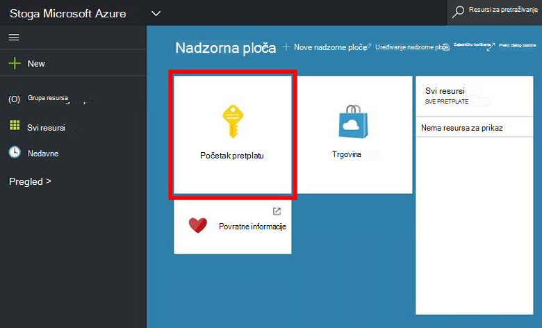
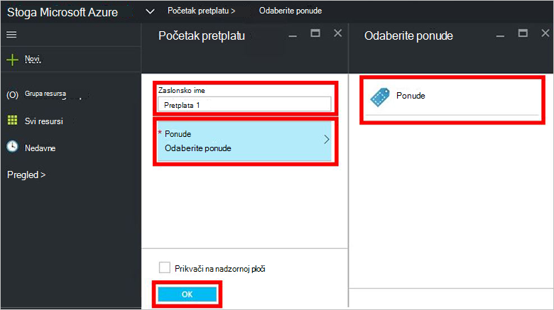
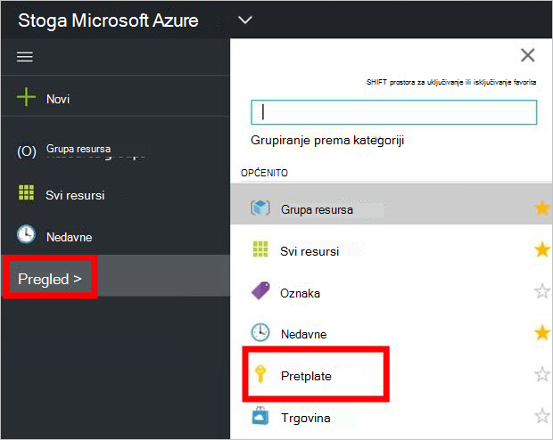

<properties
    pageTitle="Pretplata na ponude i dodjela VM u stogu Azure (klijentsko) | Microsoft Azure"
    description="Kao klijent, Saznajte kako se pretplatiti na ponude i dodjela VM u stogu Azure."
    services="azure-stack"
    documentationCenter=""
    authors="ErikjeMS"
    manager="byronr"
    editor=""/>

<tags
    ms.service="azure-stack"
    ms.workload="na"
    ms.tgt_pltfrm="na"
    ms.devlang="na"
    ms.topic="get-started-article"
    ms.date="09/26/2016"
    ms.author="erikje"/>

# Pretplata na ponude

Sad kad ste [stvorili ponude](azure-stack-create-offer.md), testirajte svoje klijenata, možete stvoriti pretplatu.

1.  Na računalu PNA snop Azure, prijavite se u sustav `https://portal.azurestack.local` kao [klijenta](azure-stack-connect-azure-stack.md#log-in-as-a-tenant) i kliknite **Preuzmi pretplatu**.

    

2.  U polje **Ime** upišite naziv za vašu pretplatu, kliknite **nude**, kliknite jednu od ponude u plohu **Odabir ponude** pa kliknite **Stvori**.

    

4.  Da biste pogledali pretplatu koju ste stvorili, kliknite **Pregledaj**, kliknite **pretplate**, a zatim kliknite novu pretplatu.  

    

Kada se pretplatite na ponude, osvježite portal da biste vidjeli koji su servisi dio na novu pretplatu.

## Daljnji koraci

[Dodjela virtualnog računala](azure-stack-provision-vm.md)
