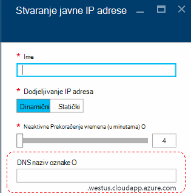
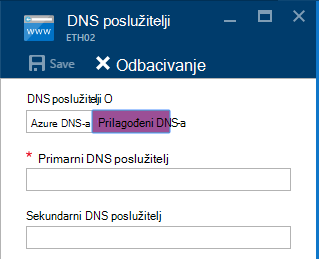
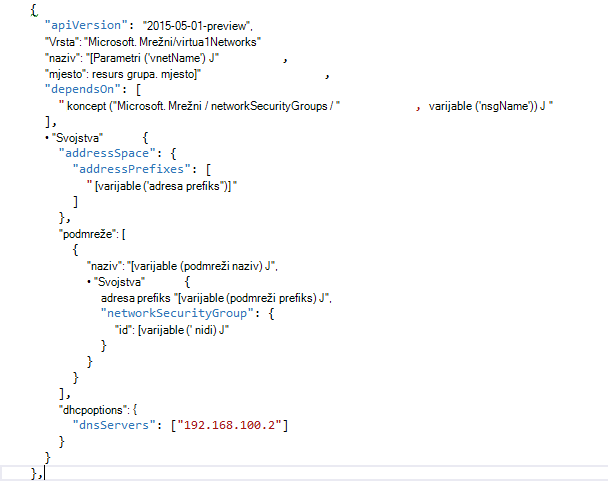

<properties
    pageTitle="Osnove DNS-a u stogu Azure TP2 | Microsoft Azure"
    description="Objašnjenje novi DNS značajkama i mogućnostima u TP2 snop Azure"
    services="azure-stack"
    documentationCenter=""
    authors="ScottNapolitan"
    manager="darmour"
    editor=""/>

<tags
    ms.service="azure-stack"
    ms.workload="na"
    ms.tgt_pltfrm="na"
    ms.devlang="na"
    ms.topic="get-started-article"
    ms.date="09/26/2016"
    ms.author="scottnap"/>

# Uvod u IDN-ovi za Azure stogu
================================

IDN-ovi je nova značajka u tehnologiji pretpregled 2 za Azure snopu koji omogućuje vam da biste riješili nazive vanjskih DNS-a (primjerice http://www.bing.com).
Omogućuje vam da biste registrirali internoj mreži virtualne imena. Na taj način možete riješiti VMs na istoj virtualne mreži naziv umjesto IP adresu bez potrebe za prilagođeni DNS poslužitelja stavke.

Nije koja se nekad je bio postoji u Azure, ali sada je dostupna u sustavu Windows Server 2016 i stoga Azure previše.

Čemu služi IDN-ovi?
------------------

S IDN-ovi u stogu Azure, bez potrebe da biste odredili prilagođeni DNS poslužitelja stavke se sljedeće mogućnosti.

-   Usluge za zajedničko korištenje DNS naziv rješenja za radnih opterećenja klijenta.

-   Mjerodavne DNS servis za razlučivanje naziva i registraciji DNS-a u klijentu virtualne mreže.

-   Rekurzivne DNS servis za razlučivanje imena Internet iz klijenta VMs. Samoposlužni više nije potrebna da biste odredili prilagođeni DNS stavke da biste riješili nazive internetskih (na primjer, www.bing.com).

I dalje možete prenijeti vlastite DNS i koristiti prilagođene DNS poslužitelji ako želite. No sada ako samo želite moći riješiti Internet DNS imena, a mogu povezati s drugim virtualnim strojevima u istom virtualne mreže, ne morate ništa odredite i samo funkcionirat će.

Što radi IDN-ovi ne?
---------------------

Što IDN-ovi ne dopušta da je stvaranje DNS zapisa za naziv koji se može riješiti iz izvan virtualne mreže.

U Azure, imate mogućnost određuje natpis naziv DNS-a koji mogu se pridružiti javnu IP adresa. Možete odabrati oznaku (prefiks), ali Azure odabire sufiks koji se temelji na područje u kojem stvarate na javnu IP adresu.

U gornjoj slici Azure će stvoriti "U" zapis u DNS-a za oznaku naziv DNS navedene u odjeljku zone **westus.cloudapp.azure.com**. Prefiks i sufiks zajedno sastavite na potpuno kvalificirani domene naziv (FQDN) koja se može riješiti iz bilo kojeg mjesta na Internetu javno.

U TP2, stoga Azure podržava samo IDN-ovi za registraciju naziv internog tako da ne možete učinite sljedeće.

-   Stvaranje DNS zapisa u odjeljku na postojeće hostiranu DNS zone (na primjer, azurestack.local).

-   Stvaranje DNS zone (primjerice Contoso.com).

-   Stvorite zapis u odjeljku vlastiti prilagođeni DNS zone.

-   Podržava kupnju naziva domena.

Promjene u DNS-a iz TP1 Azure stogu
-----------------------------------

U izdanju tehnologije pretpregled 1 (TP1) Azure stogu morali Navedite prilagođeni DNS poslužitelji kad biste željeli moći riješiti domaćini putem naziv umjesto IP adresa. To znači da ako stvarate virtualne mreže i s VM, imao najmanje jednu stavku DNS poslužitelj. Okruženju TP1 PNA to namijenjena unos IP PNA tkanina DNS poslužitelj, odnosno 192.168.200.2.

Ako ste stvorili VM putem portala sustava, morali odaberite **Prilagođeni DNS** virtualne mreže ili postavke ethernet prilagodnika.

U TP2, možete odabrati Azure DNS-a i ne morate da biste odredili prilagođeni DNS poslužitelja stavke.

Ako ste stvorili VM putem predloška s vlastite slike, morali ste dodali svojstvo **DHCPOptions** i DNS poslužitelj da biste dobili DNS-om nazovite rješenja za rad. Sljedeća slika prikazuje što to bile.

U TP2, više nije potrebna te promjene VM predloške da biste omogućili vaše VMs za razrješavanje imena Internet. Trebali biste samo rade.