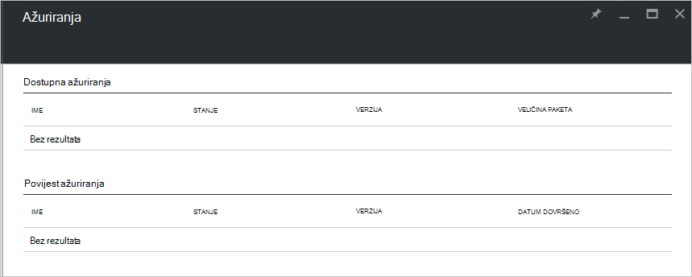

<properties
    pageTitle="Ažuriranja u stogu Azure | Microsoft Azure"
    description="Informirajte se o ažuriranjima u stogu Azure"
    services="azure-stack"
    documentationCenter=""
    authors="HeathL17"
    manager="byronr"
    editor=""/>

<tags
    ms.service="azure-stack"
    ms.workload="na"
    ms.tgt_pltfrm="na"
    ms.devlang="na"
    ms.topic="article"
    ms.date="09/26/2016"
    ms.author="Helaw"/>

# Upravljanje ažuriranjima u stogu Azure
Tehnički pretpregled 2 predstavlja pretpregled sučelje za upravljanje ažuriranjima Azure stogu.  U ovoj se temi ćete dođite do čvor ažuriranja.  

## Plohu ažuriranja
1.  Da biste pristupili plohu ažuriranja, kliknite **Pregledaj** , a zatim kliknite **ažuriranja**.

2.  Kliknite na **lokalno** mjesto.

3.  Će se pojaviti zaslon popis dostupnih ažuriranja i povijest ažuriranja.  Tehnički pretpregled 2, ažuriranja bit će dostupan za instalaciju.  

    

## Daljnji koraci
- [Razumijevanje Azure stogu PNA arhitekture](azure-stack-architecture.md)      
- [Objašnjenje preduvjeta za implementaciju](azure-stack-deploy.md)
- [Implementacija Azure stogu](azure-stack-run-powershell-script.md)
 
    
  

  

