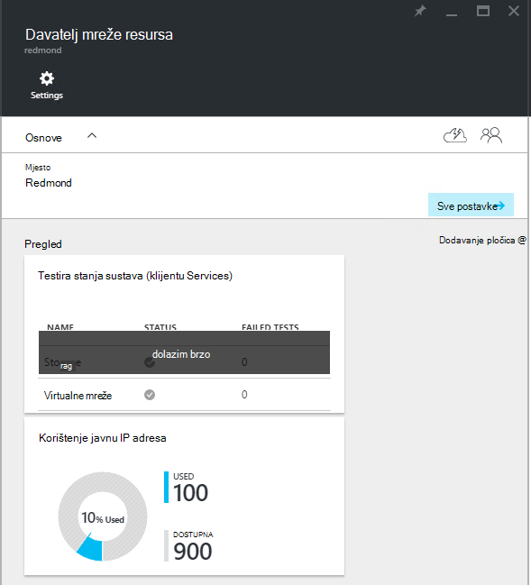
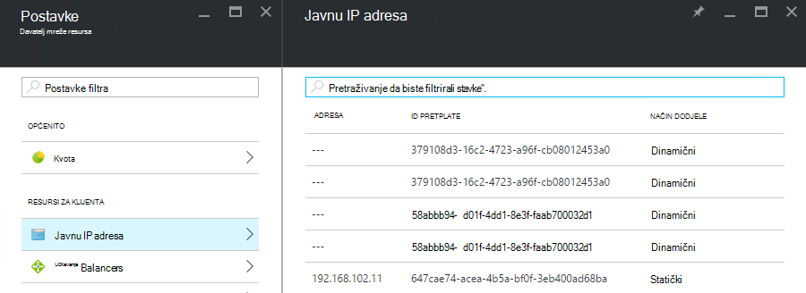

<properties
    pageTitle="Prikaz javno potrošnje IP adresa u TP2 | Microsoft Azure"
    description="Administratori mogu pregledati potrošnje javnu IP adrese unutar područja"
    services="azure-stack"
    documentationCenter=""
    authors="ScottNapolitan"
    manager="darmour"
    editor=""/>

<tags
    ms.service="azure-stack"
    ms.workload="na"
    ms.tgt_pltfrm="na"
    ms.devlang="na"
    ms.topic="get-started-article"
    ms.date="09/26/2016"
    ms.author="scottnap"/>

# Prikaz javnu IP adresa potrošnje u TP2 snop Azure

Kao administrator servisa, možete prikazati broj javnu IP adresa dodijeljena vam je s korisnicima, broj javnu IP adrese i dalje su dostupni za dodjelu i postotak javnu IP adresa dodijeljena vam je na tom mjestu.

Pločice **Javno korištenje IP adresa** prikazuje ukupan broj javnu IP adresama potrošena preko svih javnu IP adresa grupe na na tkanina, hoće li se ona koriste za klijent IaaS VM instance, servisi infrastrukturu tkanina ili javni resursi IP adresa izričito stvorenih pomoću drugih korisnika.

Svrha toj pločici je da bi se dobilo Azure stogu administratori osjećaj od ukupnog broja javnu IP adrese potrošena na ovom mjestu. Pomaže utvrditi radi li oni su niska na ovaj resurs za administratore.

Stavka izbornika na **Javnu IP adrese** pod **resurse za klijenta** na plohu **Postavke** su navedeni samo one javno IP adrese koje su *izričito stvorio klijenata*. Kao takve, broj **u kombinaciji** javnu IP adrese na **Javnu IP adresa korištenje** pločica se uvijek razlikuje od (veće od) broj na pločici **Javnu IP adrese** pod **resurse za klijenta**.

## Prikaz javno podataka IP adrese korištenja

Da biste pogledali ukupan broj javnu IP adrese potrošena u regiji:

1.  Na portalu za Azure stogu kliknite **Pregledaj**, a zatim **Resurs davatelje usluga**.

2.  Na popisu **Resursa davatelji**odaberite **Mrežni resurs davatelja administrator**.

3.  Umjesto toga možete kliknuti Pregledaj **| Mjesta** i odaberite mjesto na koje želite prikazati na popisu. Pa na pločici **Davatelji resursa** odaberite **Mrežni resurs davatelja administrator**.

4.  Odredišna plohu **Mrežni resurs davatelja** prikazuje pločicu **Javno korištenje IP adresa** u odjeljku **Pregled** .

Imajte na umu da **korišteni** broj označava broj javnu IP adrese iz svih javnu IP adresa grupe na tom mjestu koji su vam dodijeljeni. **Dostupno** broj označava broj javnu IP adrese iz svih javnu IP adresi grupe koji nisu dodijeljeni, a i dalje su dostupni. **% Korišteni** broj označava broj korištenih ili dodijeliti adresa kao postotak ukupan broj javnu IP adrese u sve javnu IP adresi grupe na tom mjestu.

## Prikaz javnu IP adrese koje je stvorila klijent pretplate

Da biste vidjeli popis javnu IP adrese koje je izričito stvorila klijent pretplate u određenoj regiji, idite na **Postavke** plohu od **Mrežni resurs davatelja administrator**, a zatim **Javnu IP adrese**.

Mogli biste primijetiti neke javnu IP adresama dodijeljena vam je dinamički pojavljuju se na popisu, ali ste adresu koja je povezana s njima još. To je zato resursa adresu stvorena u davatelja resursa mreže, ali ne u mreži kontroler još.

Mrežni kontroler dodjeljujete adresu se ovim resursom dok je zapravo povezana s sučelja, mrežna kartica (NIC), raspoređivača opterećenja ili pristupnik virtualne mreže. Kada je na javnu IP adresu vezana uz sučelja, kontrolerom mreže dodjeljuje IP adresu na njega, a pojavljuje se u polje **Adresa** .

## Prikaz na javnu IP adresa informacije sumarnu tablicu

Postoji nekoliko različitih predmeta dodijeljeni javnu IP adrese da biste odredili hoće li se adresa pojaviti jedan popis ili neki drugi.

| **Javnu IP adresu dodjele slučaja** | **Pojavit će se u odjeljku korištenje sažetka** | **Pojavit će se u klijentu javno popisa IP adresa** |
| ------------------------------------- | ----------------------------| ---------------------------------------------- |
| Dinamični javnu IP adresu još nisu dodijeljene programa NIC ili učitavanje opterećenja (privremeni) | ne | Da |
| Dinamični javne IP adresa dodijeljena NIC ili učitavanje raspoređivanje opterećenja. | Da | Da |
| Statički javnu IP adresa dodijeljena klijentu NIC ili učitavanje opterećenja. | Da | Da |
| Statički javnu IP adresa dodijeljena krajnja točka tkanina infrastrukture servisa. | Da | ne |
| Javnu IP adresu implicitno stvorili instanci IaaS VM i koristiti za izlazni NAT na virtualne mreže. Te se stvaraju u pozadini prilikom klijentom stvara instancu komponente VM tako da se VMs možete poslati podatke s Internetom. | Da | ne |
