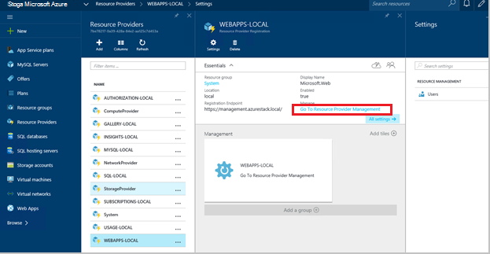
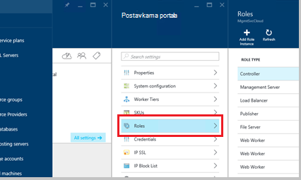
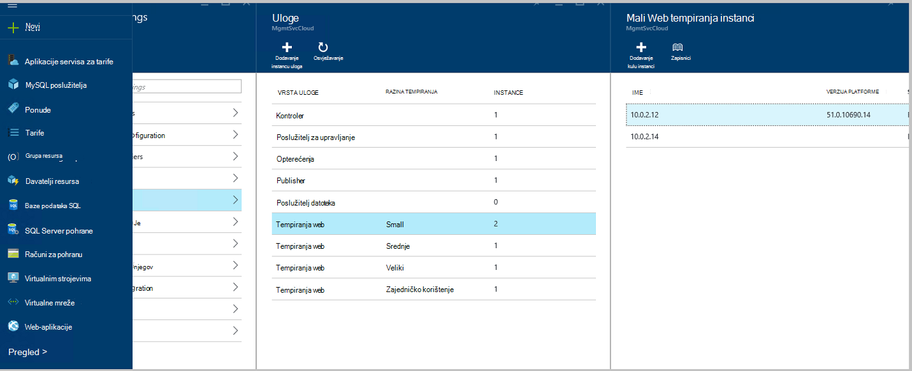
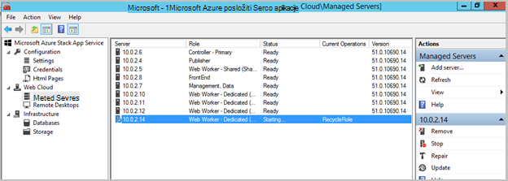
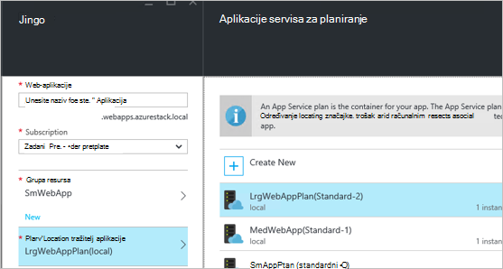
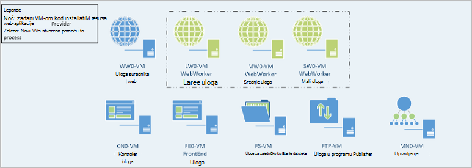

<properties
    pageTitle="Web-aplikacije dodavanje više web-uloge suradnika | Microsoft Azure"
    description="Detaljne upute za skaliranje Azure stogu Web App"
    services="azure-stack"
    documentationCenter=""
    authors="kathm"
    manager="slinehan"
    editor=""/>

<tags
    ms.service="azure-stack"
    ms.workload="app-service"
    ms.tgt_pltfrm="na"
    ms.devlang="na"
    ms.topic="article"
    ms.date="09/26/2016"
    ms.author="kathm"/>

#   <a name="web-apps-adding-more-web-worker-roles"></a>Web-mjesto aplikacije: Dodavanje više uloge suradnika web

> [AZURE.NOTE] Sljedeće informacije odnosi se samo na Azure stogu TP1 implementacije.

Ovaj dokument sadrži upute za promjenu veličine web-aplikacije web tempiranja uloge. Sadrži korake za stvaranje dodatnih web tempiranja uloge za podršku web apps ponuda bilo koje veličine.

Azure stogu podržava implementacijama aplikacije besplatnim i zajedničke web. Da biste dodali druge vrste, morat ćete dodati više uloge suradnika web.

Ako niste sigurni što je uveden s web-aplikacije Zadana instalacija, možete pregledati dodatne informacije [u nastavku](azure-stack-webapps-overview.md).

Sljedeći koraci su potrebne za skaliranje web tempiranja uloge:

1.  [Stvaranje novog virtualnog računala](#step-1-create-a-new-vm-to-support-the-new-instance-size)

2.  [Konfiguriranje virtualnog računala](#step-2-configure-the-virtual-machine)

3.  [Konfiguriranje radnih uloga web na portalu stogu Azure](#step-3-configure-the-web-worker-role-in-the-azure-stack-portal)

4.  [Konfiguriranje aplikacije servisa tarife](#step-4-configure-app-service-plans)

##<a name="step-1-create-a-new-vm-to-support-the-new-instance-size"></a>Korak 1: Stvaranje novog VM za podršku novu veličinu instanci

Stvaranje virtualnog računala kao što je opisano [u ovom se članku](azure-stack-provision-vm.md)Provjera nastaju sljedeće:

 - Korisničko ime i lozinku: isto korisničko ime i lozinka koje ste naveli prilikom instalacije web-aplikacije.

 - Pretplata na: Pomoću davatelja pretplate zadane.

 - Grupa resursa: odaberite **AppService lokalno**.

> [AZURE.NOTE]Pohranite virtualnim strojevima za uloge suradnika u istoj grupi resursa kao aplikacija je implementiran na web-aplikacije. (To se preporučuje za ovo izdanje.)

##<a name="step-2-configure-the-virtual-machine"></a>Korak 2: Konfiguriranje virtualnog računala

Kada implementacijskih dovrši, sljedeću konfiguraciju potreban je za podršku web ulogu suradnika:

1.  Otvorite upravitelj poslužitelja na glavno računalo, a zatim kliknite **Alati** &gt; **HyperV Manager**.

2.  Povezivanje putem protokola udaljene radne površine (RDP) da biste novi virtualnog računala koju ste stvorili u koraku 1. Kada je odabrana svaki VM naziv poslužitelja nalazi se u oknu sažetka.

3.  Otvorite PowerShell klikom na gumb **Start** i upisivanjem PowerShell. Desnom tipkom miša kliknite **PowerShell.exe**pa odaberite **Pokreni kao administrator** da biste otvorili PowerShell u načinu rada za administratora.

4.  Kopiranje i lijepljenje svaku od sljedećih naredbi (jedan po jedan) u prozoru PowerShell i pritisnite unesite:

    ```netsh advfirewall firewall set rule group="File and Printer Sharing" new enable=Yes```
    ```netsh advfirewall firewall set rule group="Windows Management Instrumentation (WMI)" new enable=yes```
    ```reg add HKLM\\SOFTWARE\\Microsoft\\Windows\\CurrentVersion\\Policies\\system /v LocalAccountTokenFilterPolicy /t REG\_DWORD /d 1 /f```

5.  Ponovno virtualnog računala.

> [AZURE.NOTE]Napomena: To su minimalni preduvjeti za web-aplikacije. To su zadane postavke slike Windows 2012 R2 sklopu Azure stogu. Upute je dodijeljen za buduću upotrebu i onih koji koriste nekom drugom slikom.

##<a name="step-3-configure-the-web-worker-role-in-the-azure-stack-portal"></a>Korak 3: Konfiguriranje ulogu suradnika web na portalu stogu Azure

1.  Otvorite portal sustava kao administrator servisa na **ClientVM**.

2.  Dođite do **davatelji resursa** &gt; **WEBAPPS LOKALNO**.

    
 
3.  Kliknite **Idi na Upravljanje resursima davatelja usluga**.

4.  Kliknite **uloge**.

    
 
5.  Kliknite **Dodaj uloga Instance**.

6.  Kliknite **sloju** koju želite uvesti nove instance (mali, Srednja, velika ili zajedničkim).

    
 
7.  Konfigurirajte sljedeće:
 - Naziv poslužitelja: Navedite IP adresu poslužitelja koji ste stvorili ranije (u odjeljku 1).
 - Vrsta uloge: Tempiranja Web.
 - Razina tempiranja: Podudaranja sloju veličina odabran.

8. Kliknite **u redu.**

9. Prijavite se na CN0 VM i otvorite **BLOG upravljanje oblaka za Web**.

10. Dođite do **Web oblaka** &gt; **upravlja poslužiteljima**.

11. Kliknite naziv poslužitelja koji ste upravo implementiran. Pregledajte stupac statusu i pričekajte da biste premjestili na sljedeći korak dok je status "Spremna".

    

##<a name="step-4-configure-app-service-plans"></a>Korak 4: Konfiguriranje aplikacije servisa tarife

> [AZURE.NOTE]U trenutnom izdanju web-aplikacije aplikacije servisa tarife mora biti pohranjena u grupama zasebnom resursa. Stvaranje grupe resursa za svaki veličinu web-aplikacije i postavite tarife za aplikacije u svoje grupe odgovarajuće resursa.

1.  Prijavite se na portal u sustavu u ClientVM.

2.  Otvorite **Novi** &gt; **Web i Mobile**.

3.  Odaberite web-aplikaciju koju želite uvesti.

4.  Navedite podatke za web-aplikacije, a zatim odaberite **AppService Plan / mjesto**.

-   Kliknite **Stvori novi**.

-   Stvorite novu tarifu, odabirom odgovarajućih sloju cijene za plan.

> [AZURE.NOTE]Možete stvoriti više tarife na ovom plohu. Prije implementacije, međutim, provjerite je li odaberete odgovarajući plan.

Na sljedećoj je slici prikazan primjera više tarife dostupne:    

##<a name="final-web-app-service-vm-configuration"></a>Konačni konfiguracija VM servisa za web-aplikacije

Na slici u nastavku nudi prikaz okruženje kada ste skalirana uloge suradnika web. Zelena stavke predstavljaju nove dodatke uloge.
    
