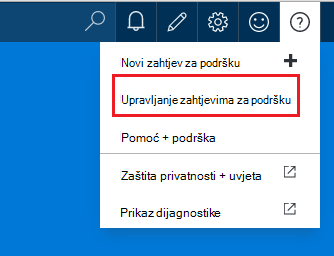

<properties
     pageTitle="Stvaranje zahtjeva za podršku za Azure | Microsoft Azure"
     description="Upute za stvaranje zahtjeva za Azure podrška."
     services="Azure Supportability"
     documentationCenter=""
     authors="ganganarayanan"
     manager="scotthit"
     editor=""/>

<tags
     ms.service="azure-supportability"
     ms.workload="na"
     ms.tgt_pltfrm="na"
     ms.devlang="na"
     ms.topic="article"
     ms.date="10/25/2016"
     ms.author="gangan"/>

# Stvaranje zahtjeva za podršku za Azure

## Sažetak
Azure korisnici možete stvarati i Upravljanje zahtjevima za podršku Azure portalu [https://portal.azure.com](https://portal.azure.com).
>[AZURE.NOTE] Azure portal za Njemačka je [https://portal.microsoftazure.de](https://portal.microsoftazure.de) i Azure državne portala je [https://portal.azure.us](https://portal.azure.us).

Na temelju povratnih informacija od klijenata, ne možemo ste ažurirali sučelje zahtjev za podršku da biste fokus na tri glavna ciljeve:

- **Streamlined**: smanjite klikova i blades da biste lakše postupak slanja zahtjeva za podršku.
- **Integrirane**: kada ste otklanjanje problema s Azure resursa, mora biti lako da biste otvorili zahtjev za podršku za resursa bez prijenosa kontekst.
- **Efficient**: prikupljanje podaci o ključu inženjer za podršku ćete morati učinkovito riješiti problem.

## Početak rada
Zahtjev za podršku možete stvoriti iz navigacijski izbornik ili izravno iz resursa plohu.

**Na gornjoj navigacijskoj traci**

**Iz resursa plohu**

## Osnove
U prvom koraku postupka zahtjev za podršku prikuplja osnovne informacije o problem i vaša tarifa za podršku.

Pogledajmo primjer: ste nasuprotne tehničkih poteškoća s virtualnog računala i vam se čini problema s mrežnim povezivanjem.
Odabir servisa ("virtualnog računala sa sustavom Windows") i resursa (naziv virtualnog računala) u prvom koraku čarobnjaka pokreće postupak pristup pomoći za taj problem.

>[AZURE.NOTE] Azure nudi neograničeno podršku za Upravljanje pretplatom (recimo naplate, kvote prilagodbe i prijenosi račun). Za tehničku podršku, potrebno vam je plan za podršku. [Saznajte više o tarifama za podršku](https://azure.microsoft.com/support/plans).

## Problem
Drugi korak čarobnjaka prikuplja dodatne detalje o tom problemu. Daje točan pojedinosti u ovom ćete koraku omogućuje nam da biste usmjerili slučaj na najbolji inženjer za podršku za problem i da biste započeli čim dijagnosticiranje problema.

Nastavite s povezivanjem primjer virtualnog računala odozgo, želite ispuniti ovaj obrazac da biste naznačili problema s mrežnim povezivanjem, a želite sadrže dodatne pojedinosti o problemu, uključujući očekivano vrijeme kada je naišao na problem.

## Srodni pomoći
Za neke probleme mi nudimo veze povezane pomoć za otklanjanje poteškoća. Ako ne pomogne preporučenih dokumenata, možete i dalje kroz postupak da biste stvorili zahtjev za podršku.

## Podaci za kontakt
Posljednji korak čarobnjaka za potvrđuje svoje podatke za kontakt tako da bismo znali kako doći do koje.

Ovisno o težinu problem, možda ćete morati da biste naznačili želite li nam s vama u kontakt tijekom radno vrijeme ili ako biste radije 24 x 7 odgovor, što znači da ne možemo vam se obratiti u bilo kojem trenutku.

## Upravljanje zahtjevima za podršku
Kada stvorite zahtjev za podršku, možete vidjeti detalje na stranici **Upravljanje zahtjeva za podršku** .

**Na gornjoj navigacijskoj traci**

Na stranici **Upravljanje zahtjeva za podršku** možete pogledati sve zahtjeve za podršku i njihovo stanje.

Odaberite zahtjev za podršku da biste vidjeli detalje, uključujući težinu i očekivani vrijeme potrebno za inženjer za podršku za odgovor.

Ako želite promijeniti težinu zahtjev, kliknite pločicu **utjecaj tvrtke** . U ovom primjeru prethodnoj zahtjev trenutno postavljen na težinu C.

Klikom na pločici prikazuje na popisu severities možete dodijeliti zahtjev za podršku za otvaranje.

>[AZURE.NOTE] Maksimalna težinu razinu ovisi o vašoj tarifi za podršku. [Saznajte više o tarifama za podršku](https://azure.microsoft.com/support/plans).

## Povratne informacije
Uvijek smo otvoreno za povratne informacije i prijedlozi! Pošaljite nam [prijedloge](https://feedback.azure.com/forums/266794-support-feedback). Uz to, koje mogu sudjelovati s nama putem [na Twitteru](https://twitter.com/azuresupport) ili na [forume MSDN](https://social.msdn.microsoft.com/Forums/azure).

## uči više
[Najčešća pitanja vezana uz Azure podrška](https://azure.microsoft.com/support/faq)
