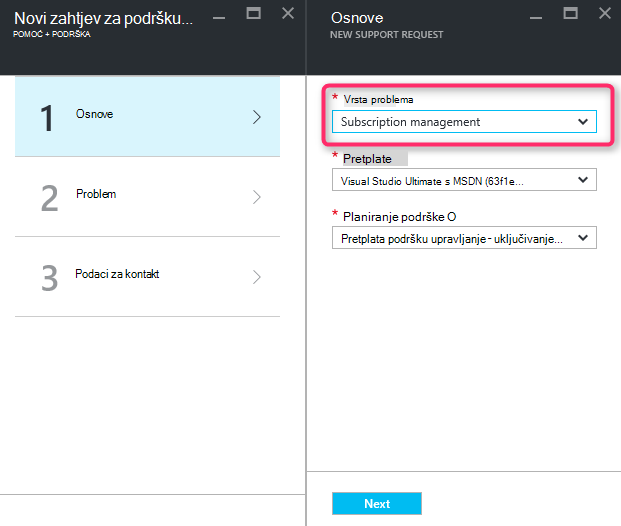
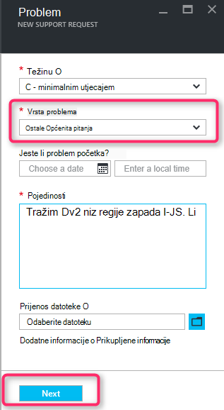
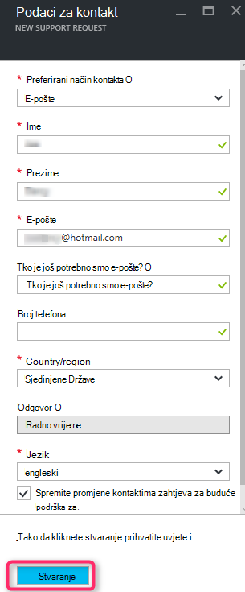

<properties
     pageTitle="Niz SKU dostupna | Microsoft Azure"
     description="Neki nizovi prikazuju SKU nisu dostupne za odabrani pretplatu na tom području."
     services="Azure Supportability"
     documentationCenter=""
     authors="ganganarayanan"
     manager="scotthit"
     editor=""/>

<tags
     ms.service="azure-supportability"
     ms.workload="na"
     ms.tgt_pltfrm="na"
     ms.devlang="na"
     ms.topic="article"
     ms.date="08/12/2016"
     ms.author="gangan"/>

# Niz SKU nije dostupan

U nekim područjima određene SKU-ove ne postoje automatski na novog pretplatama.  To se može dogoditi kada [jače SKU-ove uvode se u područje](https://azure.microsoft.com/updates/announcing-new-dv2-series-virtual-machine-size/) i popularnosti na naslijeđen SKU odbije.
Poruka "*neke SKU niz nisu dostupne za odabrani pretplatu na tom području*" prikazuje se pri stvaranju zahtjev za podršku da biste povećali računalnim core kvote.

Proučite SKU dostupnost na stranici [servisa Azure po regijama](https://azure.microsoft.com/regions/#services) . 

Da biste zatražili pristup SKU s ograničenom iz pretplate, stvorite zahtjev za podršku "Upravljanje pretplatom".

- Na stranici osnove odaberite vrstu problem kao "Upravljanje pretplatom", a zatim kliknite "Sljedeće".

- Na stranici Problem kao "Druge Općenita pitanja" odaberite željenu vrstu problema, a zatim unesite točan regija i SKU ne vide.
Omogućuje ubrzali postupak za podršku.

- Na stranici podaci za kontakt unesite detalje o kontaktu, a zatim kliknite "Stvori".

## Povratne informacije
Uvijek smo otvoreno za povratne informacije i prijedlozi! Pošaljite nam [prijedloge](https://feedback.azure.com/forums/266794-support-feedback). Uz to, koje mogu sudjelovati s nama putem [na Twitteru](https://twitter.com/azuresupport) ili na [forume MSDN](https://social.msdn.microsoft.com/Forums/azure).

## uči više
[Najčešća pitanja vezana uz Azure podrška](https://azure.microsoft.com/support/faq)
