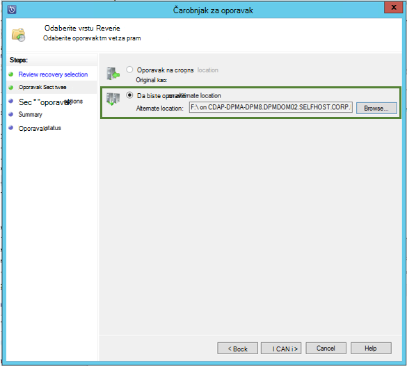

<properties
    pageTitle="Oporavak podataka iz drugog DPM poslužitelja u sigurnosno kopiranje zbirke ključeva | Microsoft Azure"
    description="Oporavak podataka ste zaštićeni programa Azure sigurnosno kopiranje zbirke ključeva s bilo kojeg poslužitelja DPM registriran za taj sigurnog."
    services="backup"
    documentationCenter=""
    authors="nkolli1"
    manager="shreeshd"
    editor=""/>

<tags
    ms.service="backup"
    ms.workload="storage-backup-recovery"
    ms.tgt_pltfrm="na"
    ms.devlang="na"
    ms.topic="article"
    ms.date="08/08/2016"
    ms.author="giridham;jimpark;trinadhk;markgal"/>

# Oporavak podataka iz drugog DPM poslužitelja u sigurnosno kopiranje zbirke ključeva
Sada možete oporaviti podatke ste zaštićeni programa Azure sigurnosno kopiranje zbirke ključeva s bilo kojeg poslužitelja DPM registriran za taj sigurnog. Postupak za to pa posve integriran u konzolu za upravljanje DPM i je slična drugih tijekova oporavak.

Oporavak podataka iz drugog DPM poslužitelja u sigurnosno kopiranje zbirke ključeva morat ćete [Sustava centra Upravitelj zaštite podataka UR7](https://support.microsoft.com/en-us/kb/3065246) i [najnovije agent za Azure sigurnosne kopije](http://aka.ms/azurebackup_agent).

## Oporavak podataka iz drugog DPM poslužitelja
Oporavak podataka iz drugog DPM poslužitelja:

1. Na kartici **oporavak** DPM konzole za upravljanje kliknite **' dodavanje vanjskog DPM'** (u gornjem lijevom kutu zaslona).

    

2. Preuzimanje nove **zbirke ključeva vjerodajnice** iz zbirke ključeva povezan s **poslužitelja DPM** gdje je obnavljaju podatke, odaberite poslužitelj DPM s popisa DPM poslužitelje registriran sigurnosno kopiranje zbirke ključeva i navedite **pristupni izraz za šifriranje** povezan s poslužiteljem DPM obnavljaju čije podatke.

    

    >[AZURE.NOTE] Samo poslužitelji DPM povezan s istom sigurnog Registracija možete oporaviti tuđe podataka.

    Kada poslužitelj za vanjske DPM uspješnog dodavanja možete pregledati podatke o vanjskim poslužiteljem DPM i lokalni poslužitelj DPM na kartici **oporavak** .

3. Pregledajte popis dostupnih proizvodne poslužitelje zaštićen vanjskim poslužiteljem DPM, a zatim odaberite odgovarajući izvor.

    

4. Odaberite **mjesec i godinu** iz **oporavak točke** padajućeg izbornika odaberite potreban **oporavak datum** stvaranja točke oporavka, a odaberite **oporavku**.

    Pojavit će se popis datoteka i mapa u oknu dolje koja se može pregledane i oporaviti na bilo koje mjesto.

    

5. Desnom tipkom miša kliknite odgovarajuću stavku, a zatim kliknite **Oporavi**.

    

6. Pregledajte **oporavak odabira**. Provjerite je li podatke i vrijeme sigurnosne kopije obnavljaju, kao i izvor iz kojeg je stvorena sigurnosnu kopiju. Ako odabrani nije valjana, kliknite **Odustani** da biste vratite se na oporavak tab da biste odabrali odgovarajući oporavak zareza. Ako je ispravno odabira, kliknite **Dalje**.

    

7. Odaberite **oporavak na drugo mjesto**. **Dođite** na odgovarajuće mjesto za oporavak.

    

8. Odaberite mogućnost vezane uz **stvaranje kopije**, **Preskoči**ili **Prebriši**.
    - **Stvaranje kopije** će stvoriti kopiju datoteke u događaja postoji kolizije naziv.
    - **Preskoči** će preskočite oporavak datoteka u događaja postoji kolizije naziv.
    - Prebrisat će **Prebriši** postojeće kopirate u navedenom u slučaju naziv koliziju mjestu.

    Odaberite odgovarajuću mogućnost da biste **vratili sigurnost**. Postavke sigurnosti računala odredište gdje je obnavljaju podatke ili sigurnosne postavke koje su odnosi se na proizvoda u vrijeme stvaranja točke oporavak možete primijeniti.

    Odredite hoće li se **obavijest** će biti poslana kada oporavka uspješno Završi.

    

9. Na zaslonu **Sažetak** popis mogućnosti odabrali dosad. Kada kliknete **"oporavak**, podatke moguće oporaviti na odgovarajuće lokalne lokacije.

    

    >[AZURE.NOTE] Na kartici **praćenja** poslužitelja DPM moguće nadzirati zadatka oporavak.

    

10. Na kartici **oporavak** poslužitelja DPM da biste uklonili prikaz vanjskim poslužiteljem DPM možete kliknite **Očisti vanjskih DPM** .

    

## Poruka o pogrešci za otklanjanje poteškoća
|ne. |  Poruka o pogrešci | Korake za otklanjanje poteškoća |
| :-------------: |:-------------| :-----|
|1.|        Ovaj poslužitelj nije prijavljen sigurnog određen sigurnog vjerodajnica.|  **Uzrok:** Ta se pogreška pojavljuje kada je odabrana datoteka vjerodajnica sigurnog smjestiti sigurnosno kopiranje zbirke ključeva povezan s poslužiteljem DPM pokušava oporavka.   **Razlučivost:** Preuzmite datoteku vjerodajnica sigurnog iz sigurnosne kopije sigurnog registriran DPM poslužitelja.|
|2.|        Koje se mogu vratiti podaci nisu dostupni ili odabrani poslužitelj nije DPM poslužitelj.|   **Uzrok:** Postoje bez DPM poslužitelji s DPM 2012 R2 UR7 registriran za sigurnosno kopiranje zbirke ključeva DPM poslužiteljima sa servisu DPM 2012 R2 UR7 ste prenijeli još metapodatke ili odabrani poslužitelj nije poslužitelj DPM (ili Windows Server ili Windows klijent).   **Razlučivost:** Ako postoje poslužitelji DPM registriran za sigurnosno kopiranje zbirke ključeva, provjerite SCDPM 2012 R2 UR7 te najnovije Azure sigurnosne kopije agent instaliraju.  Ako postoje poslužitelji DPM registriran za sigurnosno kopiranje zbirke ključeva s DPM 2012 R2 UR7, pričekajte dana nakon instalacije UR7 da biste pokrenuli postupak za oporavak. Nightly posao će prijenos metapodataka za sve prethodno zaštićeni sigurnosnih kopija na cloud. Podaci će biti dostupan za oporavak.|
|3.|        Nijedan DPM poslužitelj registriran za ovaj zbirke ključeva.|   **Uzrok:** Su još nema DPM poslužitelji s DPM 2012 R2 UR7 ili iznad registrirane sigurnog iz kojeg je u tijeku pokušaj oporavka. **Razlučivost:** Ako postoje poslužitelji DPM registriran za sigurnosno kopiranje zbirke ključeva, provjerite SCDPM 2012 R2 UR7 te najnovije Azure sigurnosne kopije agent instaliraju. Ako postoje poslužitelji DPM registriran za sigurnosno kopiranje zbirke ključeva s DPM 2012 R2 UR7, pričekajte dana nakon instalacije UR7 da biste pokrenuli postupak za oporavak. Nightly posao će prijenos metapodataka za sve prethodno zaštićeni sigurnosnih kopija na cloud. Podaci će biti dostupan za oporavak.|
|4.|        Pristupni izraz šifriranje dobili ne odgovara pristupni izraz povezan s poslužiteljem za sljedeće:**<server name>**|  **Uzrok:** Šifriranje pristupni izraz koristi u tijeku podatke iz podataka DPM poslužitelja koji je obnavljaju odgovara šifriranje pristupni izraz naveden. Agenta ne može dešifrirati podatke. Dakle oporavka neće uspjeti. **Razlučivost:** Navedite točne isti šifriranje pristupni izraz povezan s poslužiteljem DPM obnavljaju čije podatke.|

## Najčešća pitanja:
1. **Zašto ne mogu dodati vanjskim poslužiteljem DPM iz drugog DPM poslužitelja nakon instalacije UR7 i najnovije agent za sigurnosno kopiranje Azure?**

    A) za postojeće DPM poslužitelje s izvorima podataka koji su zaštićeni s oblakom (pomoću Kumulativno ažuriranje starija od ažuriranje 7 skupne vrijednosti), morate Pričekajte barem jedan dan nakon instalacije UR7 i najnovije Azure Backup agent pokrenuli *Dodavanje vanjskog DPM poslužitelja*. To je potrebno da biste prenijeli metapodataka zaštitu grupe DPM Azure. To se događa kada prvi put do nightly posao.

2. **Što je minimalna verzija potrebno agent za sigurnosno kopiranje Azure?**

    A) Azure sigurnosne kopije agent Minimalna verzija da biste omogućili ovu značajku je 2.0.8719.0.  Azure verziju agent za sigurnosno kopiranje se možete provjeriti tako da odete na upravljačkoj ploči **>** stavke sve upravljačke ploče **>** programi i značajke **>** agenta servisa za Microsoft Azure oporavak. Ako je verzija manje od 2.0.8719.0, preuzmite [najnoviju Azure Backup agent](https://go.microsoft.com/fwLink/?LinkID=288905) i instalirajte.

    

## Sljedeće korake:
• [Azure sigurnosne kopije najčešća Pitanja](backup-azure-backup-faq.md)
