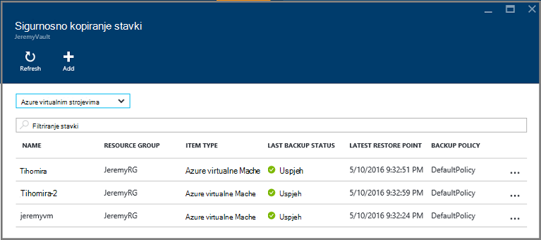

<properties
    pageTitle="Vraćanje virtualnim strojevima iz sigurnosne kopije pomoću portala za Azure | Microsoft Azure"
    description="Vraćanje Azure virtualnog računala s točke oporavak pomoću portala za Azure"
    services="backup"
    documentationCenter=""
    authors="markgalioto"
    manager="cfreeman"
    editor=""
    keywords="Vraćanje sigurnosne kopije; Kako vratiti; oporavak zareza"/>

<tags
    ms.service="backup"
    ms.workload="storage-backup-recovery"
    ms.tgt_pltfrm="na"
    ms.devlang="na"
    ms.topic="article"
    ms.date="08/10/2016"
    ms.author="trinadhk; jimpark;"/>

# Pomoću portala za Azure da biste vratili virtualnim strojevima

> [AZURE.SELECTOR]
- [Vraćanje VMs klasični portalu](backup-azure-restore-vms.md)
- [Vraćanje VMs portalu za Azure](backup-azure-arm-restore-vms.md)

Zaštita podataka prihvaćanjem snimke podataka definirani intervalima. Ove snimke nazivaju oporavak točke pa se spremaju u sefovi servise za oporavak. Ako ili kada je potrebno da biste popravili ili ponovno sastavljanje na VM, možete se vratiti na VM s bilo kojeg točaka spremljenu oporavak. Ako vraćate točka vraćanja, vratiti ili vratiti VM u stanje kada je točka vraćanja snimanja. U ovom se članku objašnjava kako se vratiti na VM.

> [AZURE.NOTE] Azure sadrži dvije implementacije modela za stvaranje i rad s resursima: [Voditelj resursa i classic](../resource-manager-deployment-model.md). Ovaj članak sadrži informacije i postupci za vraćanje VMs implementiran pomoću modela Voditelj resursa.

## Oporavak točku vraćanja

1. Prijava na [portal za Azure](http://portal.azure.com/)

2. Na izborniku Azure kliknite **Pregledaj** , a zatim na popisu servisa unesite **Servise za oporavak**. Na popisu servisa prilagođava radi onoga što tipkate. Kada se prikaže **sefovi oporavak servisa**, odaberite ga.

    

    Prikazat će se popis sefovi u pretplate.

    

3. Na popisu odaberite sigurnog pridružene VM koju želite vratiti. Kada kliknete na sigurnog, otvorit će se njegove nadzorne ploče.

    

4. Sad kad ste na nadzornoj ploči zbirke ključeva. Na **Sigurnosnu kopiju stavke** pločica, kliknite **virtualnim računalima sustava Azure** da biste prikazali VMs pridružene na zbirke ključeva.

    

    **Sigurnosno kopiranje stavki** plohu otvara i prikazuje popis Azure virtualnim strojevima.

    

5. Na popisu odaberite VM da biste otvorili na nadzornoj ploči. Otvorit će se na nadzornoj ploči VM područje praćenja koja sadrži pločicu točke vraćanja.

    

6. Na izborniku VM nadzorne ploče, kliknite **Vrati**

    

    Otvorit će se plohu vraćanja.

    

7. Na plohu **Vraćanje** kliknite da biste otvorili plohu **Odaberite Vrati točku** **točke vraćanja** .

    

    Dijaloški okvir po zadanom se prikazuju sve točke vraćanja iz zadnjih 30 dana. Korištenje **filtra** za izmjenu vremenski raspon točke vraćanja prikazuju. Po zadanom prikazuju se točke Vrati sve dosljednost. Izmjena **Vrati sve točke** filtar da biste odabrali određene dosljednost točaka vraćanja. Dodatne informacije o svakoj vrsti vraćanje pokažite, potražite u članku objašnjenje [dosljednost podataka](./backup-azure-vms-introduction.md#data-consistency).  
    - **Vraćanje točke dosljednost** s ovog popisa odaberite:
        - Pasti točke dosljedan vraćanja
        - Točke dosljedan vraćanja aplikacije
        - Datoteka točke dosljedan vraćanja sustava
        - Sve točke vraćanja.  

8. Odaberite točku vraćanja, a zatim kliknite **u redu**.

    

    **Vraćanje** plohu prikazuje točku vraćanja postavljen.

    

9. Na plohu **Vraćanje** **Vraćanje konfiguracije** otvara se automatski nakon točke vraćanja postavljen.

    

## Odabir konfiguracije za vraćanje VM

Sad kad ste odabrali točku vraćanja, odaberite konfiguraciju za vraćanje VM. Na raspolaganju za konfiguriranje vraćene VM vam da biste koristili: Azure portal ili PowerShell.

> [AZURE.NOTE] Portal nudi mogućnost za brzo stvaranje vraćene VM. Ako želite prilagoditi konfiguraciju VM to-be vraćene VM pomoću komponente PowerShell Vraćanje sigurnosne kopije diskova i priložite odabir VM konfiguracije. Pročitajte članak [Vraćanje VM s posebnim mrežnim konfiguracijama](#restoring-vms-with-special-network-configurations).

1. Ako niste već postoji, idite na plohu **vratiti** . Provjerite je li **točku vraćanja** nije odabran, a kliknite da biste otvorili plohu **oporavak konfiguracije** **Vraćanje konfiguracije** .

    

2. Na plohu **Vraćanje konfiguracije** unesite ili odaberite vrijednosti za svaku od sljedećih polja:
    - **Naziv virtualnog računala** - Navedite naziv u VM. Naziv mora biti jedinstvena za grupu resursa (za resursima implementiran VM) ili u oblaku (za klasični VM). Ako već postoji u pretplatu ne možete zamijeniti virtualnog računala.
    - **Grupa resursa** - koristite postojeću grupu resursa ili stvorite novi. Ako vraćate klasični VM, to polje koristite da biste odredili naziv nove servise u oblaku. Ako stvorite novi servis grupe/oblaka resursa, naziv mora biti globalno jedinstveni. Obično naziv usluge oblak je povezan s dostupnog javnosti URL - na primjer: [cloudservice]. cloudapp.net. Ako pokušate koristiti naziv oblaka resursa grupe/servisa u oblaku koja se već koristi Azure dodjeljuje servisa za grupu/oblaka resursa isti naziv kao i u VM. Azure prikazuje resursa grupe/oblaka services i VMs nije povezana ni s afinitet grupe. Dodatne informacije potražite u članku [migriranje iz grupe afinitet regionalnih virtualne mreže (VNet)](../virtual-network/virtual-networks-migrate-to-regional-vnet.md).
    - **Virtualne mreže** – odaberite virtualne mreže (VNET) pri stvaranju na VM. Polje sadrži sve VNETs povezan s pretplatom. Grupe resursa u VM prikazuje se u zagradama.
    - **Podmreže** – ako je na VNET podmreže, po zadanom je potvrđen prvi podmreže. Ako postoje dodatni podmreže, odaberite željeni podmreže.
    - **Račun za pohranu** – izbornik popis račune za pohranu u na isto mjesto kao sigurnog servise za oporavak. Prilikom odabira prostora za pohranu računa odaberite račun koji se zajednički koristi na isto mjesto kao oporavak servisa sigurnog. Računi za pohranu koji su Zone suvišnih nisu podržani. Ako nema prostora za pohranu računa s na isto mjesto kao sigurnog oporavak Services, morate ga stvoriti prije pokretanja postupka vraćanja. Vrsta računa za pohranu replikacijom se spominju u zagradama.

    > [AZURE.NOTE] Ako vraćate VM za resursima implementiran, morate identificirati virtualne mreže (VNET). Virtualne mreže (VNET) nije obavezna za klasični VM.

3. Na plohu **Vraćanje konfiguracije** kliknite **u redu** za konfiguraciju vraćanja.

4. Na plohu **Vraćanje** kliknite **Vrati** da biste pokrenuli postupak vraćanja.

    

## Pratite postupak vraćanja

Kada pokrenete postupak vraćanja, servis za sigurnosno kopiranje stvara zadatak za praćenje postupak vraćanja. Servis za sigurnosno kopiranje i stvara i privremeno prikazuje obavijest u područje obavijesti portal. Ako ne vidite obavijest, uvijek možete kliknuti i ikonu obavijesti da biste pogledali obavijesti.

Da biste pogledali postupak dok obrađuje ili da biste prikazali kada se završi, otvorite popis zadataka sigurnosnu kopiju.

1. Na izborniku Azure kliknite **Pregledaj** , a zatim na popisu servisa unesite **Servise za oporavak**. Na popisu servisa prilagođava radi onoga što tipkate. Kada se prikaže **sefovi oporavak servisa**, odaberite ga.

    

    Prikazat će se popis sefovi u pretplate.

    

2. Na popisu odaberite sigurnog pridružene VM ste vratili. Kada kliknete na sigurnog, otvorit će se njegove nadzorne ploče.

3. Na nadzornoj ploči zbirke ključeva za **Sigurnosno kopiranje poslove** pločica, kliknite **virtualnim računalima sustava Azure** da biste prikazali zadatke povezane s na sigurnog.

    

    Plohu **Sigurnosne kopije zadataka** otvara i prikazuje na popisu zadataka.

    

## Vraćanje VMs s posebnim mrežnim konfiguracijama
Moguće je sigurnosnog kopiranja i vraćanja VMs pomoću sljedećih konfiguracija posebno mreže. Međutim, ove konfiguracije zahtijevaju neke posebne mogućnosti prilikom prolaska kroz postupak vraćanja.

- VMs u odjeljku opterećenja (interne i vanjske)
- VMs s više rezerviranih IP-ovi
- VMs s više NIC-ovi

>[AZURE.IMPORTANT] Pri stvaranju posebnih mrežnoj konfiguraciji za VMs, morate koristiti PowerShell da biste stvorili VMs iz diskova vratiti.

Da biste u potpunosti ponovno stvorite virtualnim strojevima nakon vraćanja na disk, slijedite ove korake:

1. Vraćanje na diskova iz zbirke ključeva servisa oporavak za pomoću [komponente PowerShell](../backup-azure-vms-automation.md#restore-an-azure-vm)

2. Stvaranje konfiguracije VM potrebne za opterećenja / više NIC-više Rezervirana IP pomoću cmdleta ljuske PowerShell i koristite da biste stvorili VM od želji konfiguracije.
    - Stvaranje VM u oblaku s [internim opterećenja](https://azure.microsoft.com/documentation/articles/load-balancer-internal-getstarted/)
    - Stvaranje VM povezivanje [Internetom nasuprotne opterećenja] (https://azure.microsoft.com/en-us/documentation/articles/load-balancer-internet-getstarted/)
    - Stvaranje VM s [više NIC-ovi](https://azure.microsoft.com/documentation/articles/virtual-networks-multiple-nics/)
    - Stvaranje VM s [više rezerviranih IP-ovi](https://azure.microsoft.com/documentation/articles/virtual-networks-reserved-public-ip/)

## Daljnji koraci
Sad kad se možete vratiti na VMs, u članku otklanjanje poteškoća informacije na uobičajene pogreške s VMs. Osim toga, pogledajte članak o upravljanju zadatke s vašeg VMs.

- [Otklanjanje poteškoća](backup-azure-vms-troubleshoot.md#restore)
- [Upravljanje virtualnim strojevima](backup-azure-manage-vms.md)
