<properties
    pageTitle="Priprema vaše okruženje za sigurnosno kopiranje resursima implementiran virtualnim strojevima | Microsoft Azure"
    description="Provjerite je li vaše okruženje je pripremiti za sigurnosno kopiranje virtualnim strojevima servisu Azure"
    services="backup"
    documentationCenter=""
    authors="markgalioto"
    manager="cfreeman"
    editor=""
    keywords="sigurnosno kopiranje; sigurnosno kopiranje;"/>

<tags
    ms.service="backup"
    ms.workload="storage-backup-recovery"
    ms.tgt_pltfrm="na"
    ms.devlang="na"
    ms.topic="article"
    ms.date="08/21/2016"
    ms.author="trinadhk; jimpark; markgal;"/>


# <a name="prepare-your-environment-to-back-up-resource-manager-deployed-virtual-machines"></a>Pripremu okruženja za sigurnosno kopiranje resursima implementiran virtualnim strojevima

> [AZURE.SELECTOR]
- [Voditelj resursa modela](backup-azure-arm-vms-prepare.md)
- [Klasični modela](backup-azure-vms-prepare.md)

U ovom se članku navode koraci za pripremu okruženja za sigurnosno kopiranje s resursima implementiran virtualnog računala (VM). Koraci prikazani u postupke pomoću portala za Azure.  

Servis za sigurnosno kopiranje Azure omogućuje dvije vrste sefovi (sigurnosno sefovi i oporavak services sefovi) za zaštitu vaše VMs. Sigurnosno kopiranje zbirke ključeva štiti VMs uvesti pomoću model implementacije klasični. Sigurnog za usluge oporavak štiti **i klasični implementiran ili Voditelj resursa implementiran VMs** . Oporavak servisa sigurnog morate koristiti da biste zaštitili VM za resursima implementiran.

>[AZURE.NOTE] Azure sadrži dvije implementacije modela za stvaranje i rad s resursima: [Voditelj resursa i Classic](../resource-manager-deployment-model.md). Detalje o radu s modelom implementacije klasični VMs potražite u odjeljku [Priprema vaše okruženje za sigurnosno kopiranje Azure virtualnih računala](backup-azure-vms-prepare.md) .

Prije no što zaštitite ili sigurnosno kopiranje s resursima implementiran virtualnog računala (VM), provjerite postoji te preduvjete:

- Stvaranje sigurnog za usluge oporavak (ili prepoznavanje postojeće servisa sigurnog za oporavak) *na istom mjestu, kao na VM*.
- Odaberite scenarij, definirajte sigurnosne kopije pravila, a definiranje stavki za zaštitu.
- Provjera instalacije VM Agent na virtualnog računala.
- Provjera veza s mrežom

Ako znate da sljedeće uvjete već postoje u okruženju sustava zatim nastavite s [sigurnosnu kopiju vašeg VMs članka](backup-azure-vms.md). Ako vam je potrebna da biste postavili ili potvrdite, bilo koji od tih preduvjeti u ovom se članku će vas voditi kroz korake da biste pripremili te preduvjeta.


## <a name="limitations-when-backing-up-and-restoring-a-vm"></a>Ograničenja kad sigurnosno kopiranje i vraćanje na VM

Prije nego što pripremu okruženja, razumijete ograničenja.

- Sigurnosno kopiranje virtualnim strojevima s više od 16 diskova podataka nije podržana.
- Sigurnosno kopiranje virtualnim strojevima s rezerviranim IP adresa i bez definirani krajnje točke nije podržana.
- Sigurnosna kopija Linux virtualnim strojevima s nastavkom Docker nije podržana. 
- Sigurnosno kopiranje podataka ne obuhvaća mreže postavljena pogona priložiti VM. 
- Zamjena postojećeg virtualnog računala tijekom vraćanja nije podržana. Ako pokušate da biste vratili na VM kada postoji u VM, neće uspjeti postupak vraćanja.
- Više područja sigurnosno kopiranje i vraćanje nije podržana.
- Možete stvoriti sigurnosnu virtualnim strojevima u svim područjima javno Azure (pogledajte [kontrolnog popisa](https://azure.microsoft.com/regions/#services) podržanih regija). Ako regiju koju tražite nije podržana danas, on se neće pojaviti na padajućem popisu tijekom stvaranja zbirke ključeva.
- Možete stvoriti sigurnosnu virtualnim strojevima samo za verzije odaberite operacijski sustav:
  - **Linux**: Azure sigurnosne kopije podržava [popis raspodjele koji su licencira po Azure](../virtual-machines/virtual-machines-linux-endorsed-distros.md) osim Core OS Linux.  Distribucija druge Premjesti-vaše – vlasnik – Linux možda sve dok se VM agent dostupna je na virtualnog računala i podrška za Python postoji.
  - **Windows Server**: verzije starije od Windows Server 2008 R2 nisu podržane.
- Vraćanje kontroler domene VM (Kontroler) koja je dio višestruki Kontroler konfiguracije podržana je samo putem komponente PowerShell. Dodatne informacije o [vraćanju kontroler višestruki Kontroler domene](backup-azure-restore-vms.md#restoring-domain-controller-vms).
- Vraćanje virtualnim strojevima koji imaju sljedećih konfiguracija posebnim mrežnim podržana je samo putem komponente PowerShell. Nakon dovršetka postupka vraćanja VMs stvoren pomoću tijeka rada za vraćanje u korisničkom Sučelju neće imati ove konfiguracije mreže. Dodatne informacije potražite u članku [Obnavljanje VMs s posebnim mrežnim konfiguracijama](backup-azure-restore-vms.md#restoring-vms-with-special-netwrok-configurations).
  - Virtualnim strojevima u odjeljku konfiguracije raspoređivača opterećenja (interne i vanjske)
  - Virtualnim strojevima s više rezerviranih IP adresa
  - Virtualnim strojevima sa većeg broja mrežnih prilagodnika

## <a name="create-a-recovery-services-vault-for-a-vm"></a>Stvaranje sigurnog za usluge oporavak za na VM

Sigurnog za usluge oporavak je entitet koji se sprema sigurnosno kopiranje i vraćanje točke stvorenog tijekom vremena. Servisa sigurnog oporavak sadrži sigurnosne kopije pravila pridružene zaštićeni virtualnim računalima.

Da biste stvorili sigurnog za usluge oporavak:

1. Prijavite se na [portal za Azure](https://portal.azure.com/).

2. Na izborniku koncentrator kliknite **Pregledaj** , a zatim na popisu resursi upišite **Servise za oporavak**. Kao što počnete pisati, na popisu će filtrirati na temelju unos. Kliknite **zbirke ključeva servisa za oporavak**.

     <br/>

    Prikazat će se popis sefovi servise za oporavak.

3. Na izborniku **sefovi oporavak servisi** kliknite **Dodaj**.

    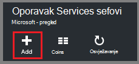

    Otvorit će se sigurnog plohu oporavak servise koje možete unijeti **naziv**, **pretplatu**, **grupa resursa**i **mjesto**pitanja.

    

4. U odjeljku **naziv**unesite neslužbeni naziv da biste odredili na zbirke ključeva. Naziv mora biti jedinstvena za Azure pretplatu. Upišite naziv koji sadrži od 2 do 50 znakova. Morate pokrenuti slovom i mogu sadržavati samo slova, brojeve i spojnice.

5. Kliknite **pretplatu** da biste vidjeli dostupne popis pretplata. Ako niste sigurni koju pretplatu za korištenje, koristite zadanu (ili predložena) pretplate. Pojavit će se više mogućnosti samo ako je povezan s više pretplata Azure računa tvrtke ili ustanove.

6. Kliknite **grupu resursa** da biste vidjeli popis dostupnih grupa resursa ili **Novo** da biste stvorili novu grupu resursa. Potpune informacije o grupama resursa potražite u članku [Pregled upravljanja resursima za Azure](../azure-resource-manager/resource-group-overview.md)

7. Kliknite **mjesto** da biste odabrali regiji u zbirke ključeva. Sigurnog **mora** biti u istom području kao virtualnim strojevima koji želite zaštititi.

    >[AZURE.IMPORTANT] Ako niste sigurni lokacije u kojem postoji vaše VM, zatvorite iz dijaloškom okviru Stvaranje sigurnog te otvorite popis virtualnim strojevima na portalu. Ako imate virtualnim strojevima u više područja, morat ćete stvoriti oporavak servisa sigurnog u svakom području. Stvorite na sigurnog na prvom mjestu prije prelaska na sljedeću lokaciju. Nema potrebe da biste naveli račune za pohranu za spremanje sigurnosne kopije podataka – oporavak servisa sigurnog i servis za Azure sigurnosne kopije obradu to automatski.

8. Kliknite **Stvori**. Može potrajati neko vrijeme za oporavak servisa sigurnog će biti stvoren. Praćenje obavijesti o statusu u gornjem desnom području na portalu. Nakon stvaranja vaše zbirke ključeva, pojavljuje se na popisu sefovi servise za oporavak.

    

    Sad kad ste stvorili vaše zbirke ključeva, informacije o postavljanju replikacije prostora za pohranu.

## <a name="set-storage-replication"></a>Postavljanje ponavljanja prostora za pohranu

Mogućnost replikacije pohrane omogućuje odabir između zemlj suvišnih prostora za pohranu i lokalno suvišnih prostora za pohranu. Prema zadanim postavkama vašeg sigurnog ima zemlj suvišnih prostora za pohranu. Ostavite mogućnost postaviti zemlj suvišnih prostora za pohranu ako je primarni sigurnosnu kopiju. Ako želite da se jeftinijim mogućnost koja nije baš kao i durable, odaberite lokalno suvišnih prostora za pohranu. Dodatne informacije o [zemlj suvišne](../storage/storage-redundancy.md#geo-redundant-storage) i [lokalno suvišne](../storage/storage-redundancy.md#locally-redundant-storage) mogućnosti pohrane u [Pregled replikacije Azure prostora za pohranu](../storage/storage-redundancy.md).

Da biste uredili replikacije postavku za pohranu:

1. Odaberite vaše zbirke ključeva da biste otvorili na nadzornoj ploči sigurnog i plohu postavke. Ako ne možete otvoriti plohu **Postavke** , kliknite **sve postavke** na nadzornoj ploči zbirke ključeva.

2. Na plohu **Postavke** kliknite **Sigurnosno kopiranje infrastrukture** > **Konfiguracije sigurnosnu kopiju** da biste otvorili plohu **Konfiguracije sigurnosnu kopiju** . Na plohu **Sigurnosne kopije konfiguracije** odaberite mogućnost replikacije prostora za pohranu za vaše zbirke ključeva.

    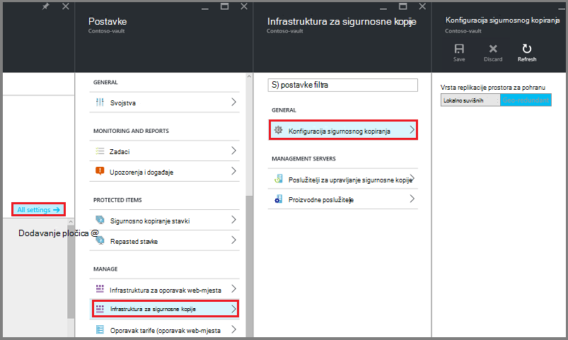

    Nakon odabira mogućnosti prostora za pohranu za vaše zbirke ključeva, spremni ste za pridruživanje s VM na sigurnog. Da biste započeli pridruživanja, otkrivanje i registrirati Azure virtualnih računala.


## <a name="select-a-backup-goal-set-policy-and-define-items-to-protect"></a>Odaberite sigurnosne kopije cilj, postavljanje pravila i definiranje stavki za zaštitu

Prije registracije VM s sigurnog, pokrenite istrage da biste bili sigurni sve nove virtualnim strojevima koji su dodani na pretplatu prepoznaju. Naziv usluge oblaka i područja, kao što su upiti postupak Azure popis virtualnim strojevima u pretplatu, zajedno s dodatnim informacijama. Na portalu Azure scenarij se odnosi na što namjeravate staviti u servisa sigurnog oporavak. Pravilo je raspored koliko često i kada se uzimaju oporavak točke. Pravila sadrži i raspon zadržavanja za oporavak točke.

1. Ako već imate otvorenu oporavak servisa sigurnog, prijeđite na stranici korak 2. Ako ste oporavak servisa sigurnog otvori, ali se na portalu Azure na izborniku koncentrator kliknite **Pregledaj**.

  - Na popisu resursa upišite **Servise za oporavak**.
  - Kao što počnete pisati, na popisu će filtrirati na temelju unos. Kada se prikaže **sefovi oporavak Services**, kliknite ga.

     <br/>

    Pojavit će se popis sefovi servise za oporavak.
  - Na popisu sefovi oporavak Servisi odaberite na zbirke ključeva.

    Otvorit će se na nadzornoj ploči odabrane zbirke ključeva.

    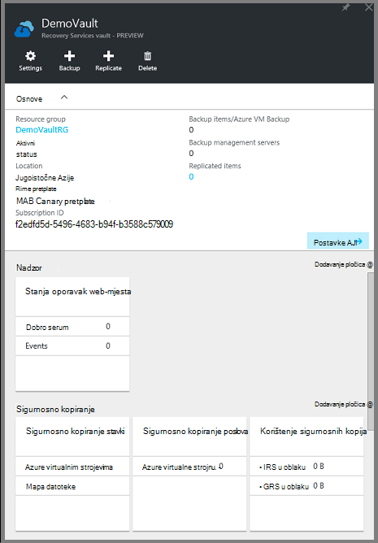

2. Na izborniku sigurnog nadzorne ploče kliknite **sigurnosnu kopiju** da biste otvorili plohu sigurnosnu kopiju.

    

    Kad se otvori u plohu, servis za sigurnosno kopiranje Traži sve nove VMs u pretplate.

    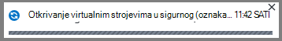

3. Na plohu sigurnosne kopije kliknite **cilj sigurnosnu kopiju** da biste otvorili plohu cilj sigurnosnu kopiju.

    

4. Na plohu sigurnosne kopije cilja postavite **gdje je svoje radno opterećenje pokrenut** na Azure i **što želite sigurnosno kopirati** da biste virtualnog računala, pa kliknite **u redu**.

    Zatvara plohu cilj sigurnosnu kopiju i otvara plohu pravila za sigurnosno kopiranje.

    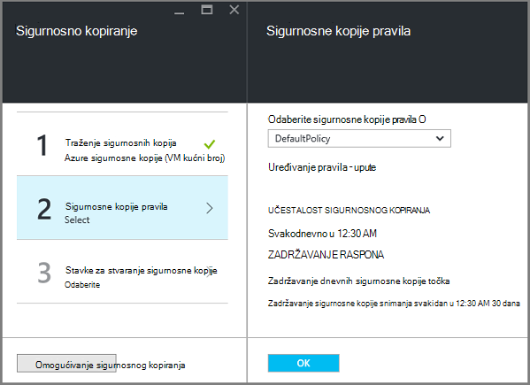

5. Na pravila plohu sigurnosno kopiranje odaberite sigurnosne kopije pravila koje želite primijeniti na sigurnog te kliknite **u redu**.

    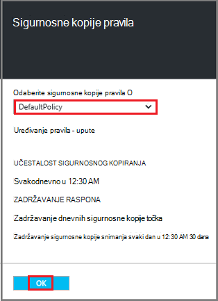

    Detalje o zadani pravilnik navedene su u odjeljku detalja. Upute za stvaranje novog pravila, odaberite **Stvori novo** na padajućem izborniku. Padajući izbornik nudi i mogućnost da biste se prebacili vrijeme kada je potrebno snimka za 7 Poslijepodne. Upute o definiranju sigurnosne kopije pravila potražite u članku [Definiranje sigurnosne kopije pravila](backup-azure-vms-first-look-arm.md#defining-a-backup-policy). Kada kliknete **u redu**, sigurnosne kopije pravila povezan je s na zbirke ključeva.

    Zatim odaberite VMs želite pridružiti na sigurnog.

6. Odaberite virtualnim strojevima za povezivanje s navedenim pravilima, a zatim kliknite **Odaberi**.

    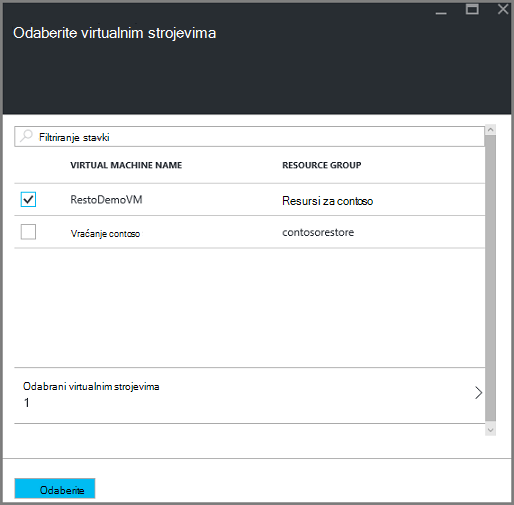

    Ako ne vidite željeni VM, provjerite postoji li na istom mjestu Azure kao sigurnog servise za oporavak.

7. Sad kad ste definirali sve postavke za sigurnog u plohu sigurnosne kopije kliknite **Omogući sigurnosne kopije** pri dnu stranice. To pravilo uvodi na sigurnog i na VMs.

    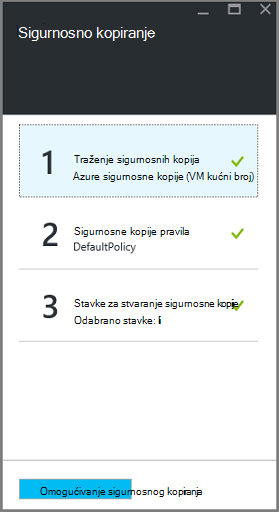

Sljedeće faze u Priprema instalira VM Agent ili provjerite VM Agent instaliran.


## <a name="install-the-vm-agent-on-the-virtual-machine"></a>Kliknite pločicu VM Agent virtualnog računala

Agent za Azure VM mora biti instaliran na Azure virtualnog računala za sigurnosno kopiranje nastavak rada. Ako je vaš VM stvorena iz galerije Azure, zatim VM Agent već se nalazi na virtualnog računala. Te su informacije navedene za situacije u kojima su *ne* pomoću programa VM stvorili iz galerije Azure – na primjer migrira se na VM iz programa lokalnog podatkovnog centra. U tom slučaju VM Agent potrebno je instalirati zaštitu virtualnog računala.

Informirajte se o [VM Agent](https://go.microsoft.com/fwLink/?LinkID=390493&clcid=0x409) i [kako se instalira VM Agent](../virtual-machines/virtual-machines-windows-classic-manage-extensions.md).

Ako imate problema s sigurnosno kopiranje Azure VM, provjerite je li Azure VM Agent pravilno instalirani na virtualnog računala (pogledajte tablicu u nastavku). Ako ste stvorili prilagođene VM, [Provjerite je li potvrđen okvir **Instalacija VM Agent** ](../virtual-machines/virtual-machines-windows-classic-agents-and-extensions.md) prije virtualnog računala je dodijeljena.

Sljedeća tablica sadrži dodatne informacije o VM Agent za Windows i Linux VMs.

| **Postupak** | **Windows** | **Linux** |
| --- | --- | --- |
| Instaliranje VM Agent | <li>Preuzmite i instalirajte [agent MSI](http://go.microsoft.com/fwlink/?LinkID=394789&clcid=0x409). Trebat će vam administratorske ovlasti da biste dovršili instalaciju. <li>Određivanje je li instaliran agenta [ažurirali svojstvo VM](http://blogs.msdn.com/b/mast/archive/2014/04/08/install-the-vm-agent-on-an-existing-azure-vm.aspx) . | <li> Instalirajte najnovije [Linux agent](https://github.com/Azure/WALinuxAgent) iz GitHub. Trebat će vam administratorske ovlasti da biste dovršili instalaciju. <li> Određivanje je li instaliran agenta [ažurirali svojstvo VM](http://blogs.msdn.com/b/mast/archive/2014/04/08/install-the-vm-agent-on-an-existing-azure-vm.aspx) . |
| Ažuriranje VM Agent | Ažuriranje VM Agent jednostavan je ponovno instalirati program [VM Agent binarne datoteke](http://go.microsoft.com/fwlink/?LinkID=394789&clcid=0x409). <br>Provjerite je li nijedna sigurnosne kopije operacija sustavom dok VM agent ažurira. | Slijedite upute o [ažuriranju Linux VM Agent ](../virtual-machines-linux-update-agent.md). <br>Provjerite je li nijedna sigurnosne kopije operacija sustavom dok VM Agent ažurira. |
| Provjera valjanosti instalacije VM Agent | <li>Dođite do mape u *C:\WindowsAzure\Packages* u Azure VM. <li>Trebali biste pronađete datoteku WaAppAgent.exe prezentacija.<li> Desnom tipkom miša kliknite datoteku, idite na **Svojstva**, a zatim odaberite karticu **Detalji** . Polje verziju proizvoda mora biti 2.6.1198.718 ili noviji. | N/D |


### <a name="backup-extension"></a>Proširenje sigurnosne kopije

Kada je na virtualnog računala instaliran VM Agent, servisa Azure sigurnosne kopije instalira sigurnosne kopije proširenje VM Agent. Servis za Azure sigurnosne kopije jednostavno nadograđuje i zakrpa sigurnosne kopije nastavak.

Servis za sigurnosno kopiranje sigurnosne kopije proširenje instalirao hoće li se izvodi na VM. Izvodi VM nudi maksimalnog izgledi početak točku aplikaciju dosljedan oporavak. Međutim, servisa Azure sigurnosnu kopiju i dalje sigurnosne kopije na VM čak i ako je isključena i nastavak nije moguće instalirati. To se naziva izvanmrežnom načinu rada VM. U ovom slučaju točke oporavak bit će *rušenje dosljedni*.


## <a name="network-connectivity"></a>Veza s mrežom

Da biste upravljali VM snimke, sigurnosno kopiranje proširenje mora veza s Azure javnu IP adrese. Bez desnom internetska veza virtualnog računala HTTP zatraži istek vremena i sigurnosne kopije operacija neće uspjeti. Ako implementaciju sustava ima ograničenja pristupa na mjestu (putem mreže sigurnosne grupe (NSG), na primjer), zatim odaberite neku od ovih mogućnosti za dohvat Očisti put za sigurnosne kopije promet:

- [Rasponi Whitelist Azure podatkovnog centra IP](http://www.microsoft.com/en-us/download/details.aspx?id=41653) - potražite u članku upute na način da biste whitelist na IP adrese.
- Implementacija HTTP proxy poslužitelj za usmjeravanje prometa.

Pri odabiru koju mogućnost da biste koristili u gubitke su između mogućnost upravljanja, zrnastog kontrole i trošak.

|Mogućnost|Prednosti|Nedostaci|
|------|----------|-------------|
|Whitelist IP rasponi| Bez dodatnih troškova.<br><br>Za otvaranje programa access u programa NSG, koristite cmdlet <i>Skup AzureNetworkSecurityRule</i> . | Složena da biste upravljali kao utjecati na IP rasponi mijenjaju tijekom vremena.<br><br>Omogućuje pristup cijeli od Azure, a ne samo za pohranu.|
|HTTP proxy| Zrnastog nad proxyju prostora za pohranu dopušteno URL-ova.<br>Pristup jednu točku Internet VMs.<br>Ne primjenjuje promjenama Azure IP adrese.| Dodatne troškove za pokretanje programa VM sa softverom za proxy poslužitelj.|

### <a name="whitelist-the-azure-datacenter-ip-ranges"></a>Rasponi IP Whitelist Azure podatkovnim centrom

Whitelist IP rasponi Azure podatkovnog centra potražite sustava [Azure web-mjesto](http://www.microsoft.com/en-us/download/details.aspx?id=41653) detalje na IP rasponi i upute.

### <a name="using-an-http-proxy-for-vm-backups"></a>Korištenje HTTP proxy sigurnosnih kopija VM
Kada sigurnosno kopiranje s VM, sigurnosne kopije nastavak na na VM šalje snimke upravljanje naredbe za pohranu Azure pomoću HTTPS API. Usmjeravanje prometa sigurnosne kopije proširenje HTTP proxy Budući da je to jedina komponenta konfigurirana za pristup Internetu javno.

>[AZURE.NOTE] Postoji nema preporuku za proxy softver koji želite koristiti. Provjerite je li odaberete proxy kompatibilan s konfiguracije korake u nastavku.

Primjer slici u nastavku prikazuje tri konfiguracijske korake potrebne da biste koristili HTTP proxy:

- Aplikacija VM usmjerava sve HTTP promet vezana za javne Internet kroz Proxy VM.
- Proxy VM dopušta promet iz VMs u virtualne mreže.
- Na mreži sigurnosnih grupa (NSG) pod nazivom NSF-zaključati da biste potrebno je sigurnost pravilo allowing izlaznog internetski promet iz Proxy VM.

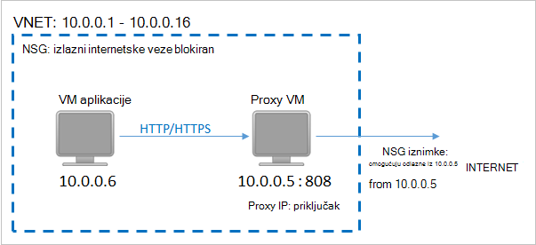

Da biste koristili HTTP proxy za komunikaciju javnog Interneta, slijedite ove korake:

#### <a name="step-1-configure-outgoing-network-connections"></a>Korak 1. Konfiguriranje izlazne mrežne veze

###### <a name="for-windows-machines"></a>Za računala za Windows
To će se instalacija konfiguracija proxy poslužitelja za lokalni račun sustava.

1. Preuzmite [PsExec](https://technet.microsoft.com/sysinternals/bb897553)
2. Sljedeća Naredba Pokreni s dodatnim upita

     ```
     psexec -i -s "c:\Program Files\Internet Explorer\iexplore.exe"
     ```
     Otvorit će se prozor za internet explorer.
3. Idi na Alati -> internetske mogućnosti -> veza -> Postavke LAN-a.
4. Provjerite postavke proxy poslužitelja za račun sustava. Postavljanje IP proxy poslužitelja i priključka.
5. Zatvorite Internet Explorer.

Postavit će strojno razini proxy konfiguracije te će se koristiti za sve odlazni promet HTTP/HTTPS.

Ako instalacijski program proxy poslužitelj na trenutni korisnički račun (ne lokalni sustav račun), koristite sljedeću skriptu da biste primijenili SYSTEMACCOUNT:

```
   $obj = Get-ItemProperty -Path Registry::”HKEY_CURRENT_USER\Software\Microsoft\Windows\CurrentVersion\Internet Settings\Connections"
   Set-ItemProperty -Path Registry::”HKEY_USERS\S-1-5-18\Software\Microsoft\Windows\CurrentVersion\Internet Settings\Connections" -Name DefaultConnectionSettings -Value $obj.DefaultConnectionSettings
   Set-ItemProperty -Path Registry::”HKEY_USERS\S-1-5-18\Software\Microsoft\Windows\CurrentVersion\Internet Settings\Connections" -Name SavedLegacySettings -Value $obj.SavedLegacySettings
   $obj = Get-ItemProperty -Path Registry::”HKEY_CURRENT_USER\Software\Microsoft\Windows\CurrentVersion\Internet Settings"
   Set-ItemProperty -Path Registry::”HKEY_USERS\S-1-5-18\Software\Microsoft\Windows\CurrentVersion\Internet Settings" -Name ProxyEnable -Value $obj.ProxyEnable
   Set-ItemProperty -Path Registry::”HKEY_USERS\S-1-5-18\Software\Microsoft\Windows\CurrentVersion\Internet Settings" -Name Proxyserver -Value $obj.Proxyserver
```

>[AZURE.NOTE] Ako "(407) provjera autentičnosti proxy poslužitelja potrebna" pridržavajte se u zapisniku proxy poslužitelj, provjerite svoje provjere autentičnosti Postava pravilno.

######<a name="for-linux-machines"></a>Za Linux računalima

Dodajte na sljedeći redak u ```/etc/environment``` datoteke:

```
http_proxy=http://<proxy IP>:<proxy port>
```

Dodajte sljedeće retke da biste na ```/etc/waagent.conf``` datoteke:

```
HttpProxy.Host=<proxy IP>
HttpProxy.Port=<proxy port>
```

#### <a name="step-2-allow-incoming-connections-on-the-proxy-server"></a>Korak 2. Dopusti dolazne veze na proxy poslužitelju:

1. Proxy poslužitelj, otvorite Vatrozid za Windows. Da biste pristupili vatrozida najjednostavnije da biste potražili Vatrozid za Windows s dodatnom sigurnošću.

    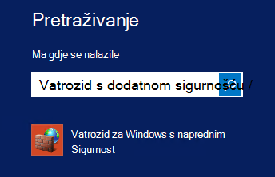

2. U dijaloškom okviru Vatrozid za Windows, desnom tipkom miša kliknite **Ulazna pravila** , a zatim kliknite **… Novo pravilo**.

    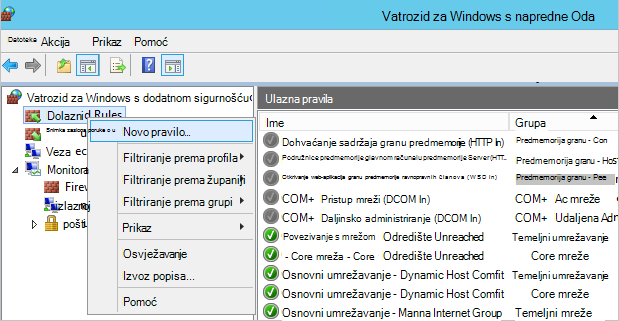

3. U **Novi dolazni Čarobnjak za pravila**odabrali mogućnost **Prilagođeni** **Vrste pravila** , a zatim kliknite **Dalje**.
4. Na stranici da biste odabrali **Program**, odaberite **Svi programi** , a zatim kliknite **Dalje**.

5. Na stranici **protokol i priključaka** unesite sljedeće podatke, a zatim kliknite **Dalje**:

    

    - za *vrstu protokol* odaberite *TCP*
    - *Lokalni priključak* odabrati *Određene priključke*, u polje ispod navesti na ```<Proxy Port>``` koji je konfiguriran.
    - *udaljeni priključak* odaberite *Svih priključaka*

    Do kraja čarobnjaka kliknite sve do završetka, a naziv ovog pravila.

#### <a name="step-3-add-an-exception-rule-to-the-nsg"></a>Korak 3. Dodajte pravilo iznimku na NSG:

U naredbeni redak programa Azure PowerShell unesite sljedeću naredbu:

Sljedeća naredba dodaje iznimku na NSG. Ova se iznimka omogućuje TCP promet iz bilo kojeg priključka na 10.0.0.5 sve internetsku adresu na priključak (HTTP) 80 i 443 (HTTPS). Ako tražite određeni priključak u javni Internet, obavezno da biste dodali te priključak na ```-DestinationPortRange``` kao i.

```
Get-AzureNetworkSecurityGroup -Name "NSG-lockdown" |
Set-AzureNetworkSecurityRule -Name "allow-proxy " -Action Allow -Protocol TCP -Type Outbound -Priority 200 -SourceAddressPrefix "10.0.0.5/32" -SourcePortRange "*" -DestinationAddressPrefix Internet -DestinationPortRange "80-443"
```


*U ovom primjeru ove korake koristite specifični nazivi i vrijednosti. Koristite nazive i vrijednosti za implementaciju prilikom unosa, ili izrezivanja i lijepljenja pojedinosti u kodu.*


Sad kad znate da je veza s mrežom, spremni ste za stvaranje sigurnosne kopije vaše VM. U odjeljku [sigurnosno kopiranje resursima implementiran VMs](backup-azure-arm-vms.md).

## <a name="questions"></a>Pitanja?
Ako imate pitanja ili ako postoji svih značajki koje želite da biste vidjeli sadrži, [Pošaljite nam povratnu informaciju](http://aka.ms/azurebackup_feedback).

## <a name="next-steps"></a>Daljnji koraci
Sad kad ste spremni okruženja za stvaranje sigurnosne kopije vaše VM, sljedeći logički je korak da biste stvorili sigurnosnu kopiju. U članku planiranje sadrži detaljne informacije o stvaranju sigurnosne kopije VMs.

- [Stvaranje sigurnosne kopije virtualnim strojevima](backup-azure-vms.md)
- [Planiranje preduvjete VM infrastrukture za sigurnosne kopije](backup-azure-vms-introduction.md)
- [Upravljanje sigurnosne kopije virtualnog računala](backup-azure-manage-vms.md)
