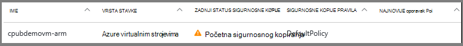
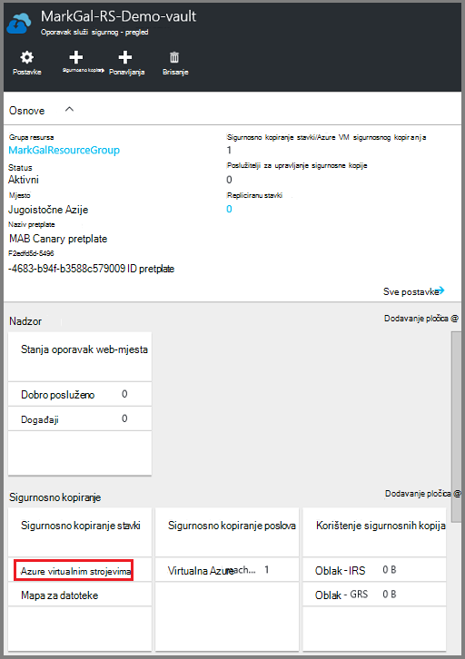
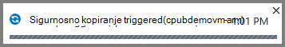
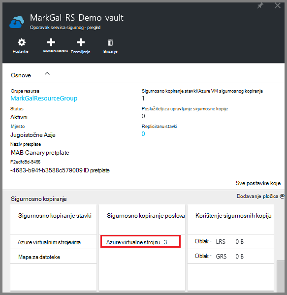
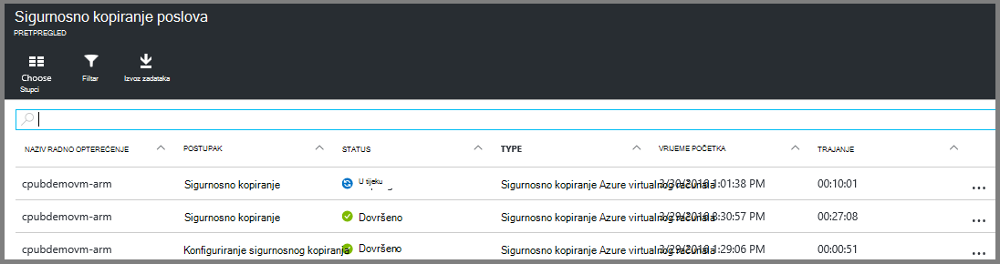

<properties
    pageTitle="Sigurnosno kopiranje Azure VMs za oporavak servisa sigurnog | Microsoft Azure"
    description="Otkrivanje, registrirati i sigurnosnu kopiju Azure virtualnim strojevima sigurnog na servise za oporavak s ove postupke za stvaranje sigurnosne kopije Azure virtualnog računala."
    services="backup"
    documentationCenter=""
    authors="markgalioto"
    manager="cfreeman"
    editor=""
    keywords="sigurnosno kopiranje virtualnog računala; Stvaranje sigurnosne kopije virtualnog računala; sigurnosno kopiranje i Izrada oporavak; sigurnosno kopiranje vm arm"/>

<tags
    ms.service="backup"
    ms.workload="storage-backup-recovery"
    ms.tgt_pltfrm="na"
    ms.devlang="na"
    ms.topic="article"
    ms.date="07/29/2016"
    ms.author="trinadhk; jimpark; markgal;"/>

# Stvaranje sigurnosne kopije Azure VMs za oporavak servisa sigurnog

> [AZURE.SELECTOR]
- [Sigurnosno kopiranje VMs za oporavak servisa sigurnog](backup-azure-arm-vms.md)
- [Sigurnosno kopiranje VMs za sigurnosno kopiranje zbirke ključeva](backup-azure-vms.md)

Ovaj članak sadrži postupak za sigurnosno kopiranje Azure VMs (Voditelj resursa implementiran i klasični implementiran) za oporavak servisa sigurnog. Većina posla za sigurnosno kopiranje VMs ulazi u Priprema. Prije no što sigurnosno kopiranje ili zaštita u VM, morate dovršiti [preduvjeti](backup-azure-arm-vms-prepare.md) za pripremu okruženja za zaštitu vaše VMs. Nakon što ste dovršili preduvjete, možete pokrenuti sigurnosno postupak da biste preuzeli snimke sustava VM.

>[AZURE.NOTE] Azure sadrži dvije implementacije modela za stvaranje i rad s resursima: [Voditelj resursa i Classic](../resource-manager-deployment-model.md). Voditelj resursa implementiran VMs i klasični VMs možete zaštititi s sefovi servise za oporavak. Potražite u članku [sigurnosno kopiranje Azure virtualnim strojevima](backup-azure-vms.md) dodatne informacije o radu s modelom klasični implementaciju VMs.

Dodatne informacije potražite u člancima [Planiranje preduvjete VM sigurnosne kopije infrastrukture u Azure](backup-azure-vms-introduction.md) i [Azure virtualnim računalima](https://azure.microsoft.com/documentation/services/virtual-machines/).

## Pokretanje sigurnosne kopije zadatka

Sigurnosne kopije pravila pridružene sigurnog servise za oporavak određuje koliko često i kada se pokreće postupak sigurnosnog kopiranja. Prema zadanim postavkama, prvi zakazano sigurnosno kopiranje je početna sigurnosnu kopiju. Dok se ne pojavljuje se početni sigurnosnog kopiranja, zadnje sigurnosne kopije Status na plohu **Sigurnosne kopije zadataka** prikazuje se kao **upozorenje (Početna sigurnosne kopije na čekanju)**.

Osim ako je rok da biste započeli uskoro vrlo je početna sigurnosnu kopiju, preporučuje se da pokrenete **sada sigurnosno kopiranje**. Sljedeći postupak započinje s sigurnog nadzorne ploče. Ovaj postupak služi za izvođenje početne sigurnosno kopiranje nakon što dovršite sve preduvjete. Ako je početna sigurnosno kopiranje već pokrenut, postupak nije dostupna. Pridruženi sigurnosne kopije pravila određuje sljedeće sigurnosno kopiranje.  

Da biste pokrenuli početne sigurnosno kopiranje:

1. Na nadzornoj ploči sigurnog, na pločici **sigurnosnog kopiranja** , kliknite **virtualnim računalima sustava Azure**.  
    

    Otvorit će se plohu **Sigurnosnu kopiju stavke** .

2. Na plohu **Sigurnosnu kopiju stavke** , desnom tipkom miša kliknite sigurnog koje želite sigurnosno kopirati pa kliknite **sigurnosnu kopiju**.

    

    Sigurnosno kopiranje posla se pokreće.  

    

3. Da biste pogledali da Početna sigurnosnu kopiju dovrši, na nadzornoj ploči sigurnog, na pločici **Sigurnosne kopije zadataka** kliknite **Azure virtualnih računala**.

    

    Otvorit će se plohu sigurnosne kopije zadataka.

4. U plohu **sigurnosne kopije zadataka** možete vidjeti status svih zadataka.

    

    >[AZURE.NOTE] U sklopu postupka sigurnosne kopije, servisa Azure sigurnosne kopije problemi naredbu za sigurnosne kopije datotečni nastavak u svakom virtualnog računala pražnjenje sve zapisivanja i stvorite dosljedan snimku.

    Po završetku sigurnosno kopiranje status je *Dovršeno*.

## Otklanjanje poteškoća
Ako naiđete na probleme pri stvaranju sigurnosnih kopija virtualnog računala, pročitajte [članak o otklanjanju poteškoća VM](backup-azure-vms-troubleshoot.md) pomoć.

## Daljnji koraci

Sad kad ste zaštićena vaša VM, pogledajte sljedeće članke za dodatne upravljanje zadaci koje možete učiniti s vašeg VMs i vraćanju VMs.

- [Upravljanje i nadzirati virtualnim strojevima](backup-azure-manage-vms.md)
- [Vraćanje virtualnim strojevima](backup-azure-arm-restore-vms.md)
