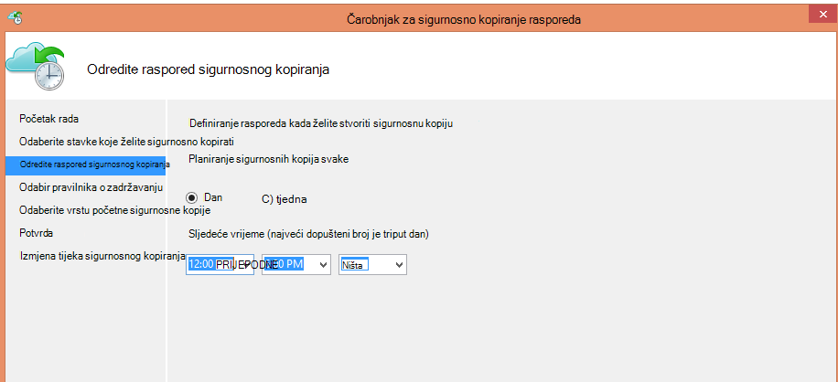
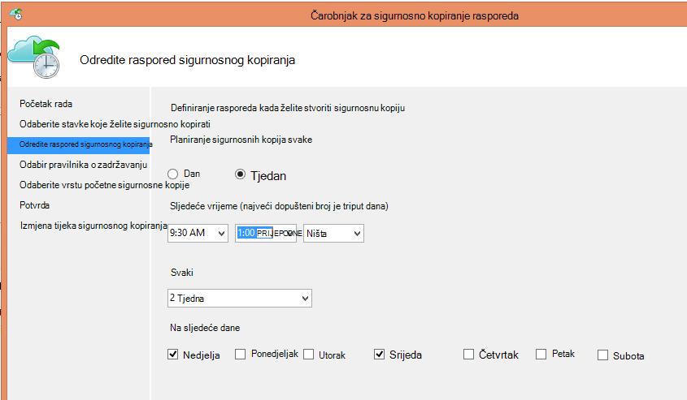
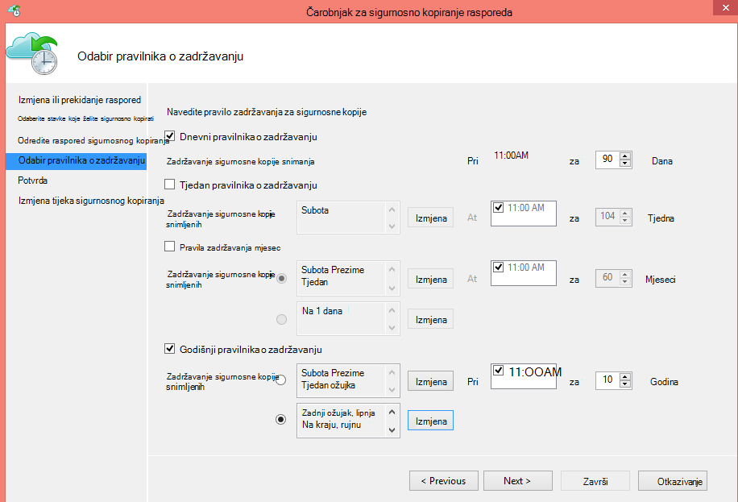
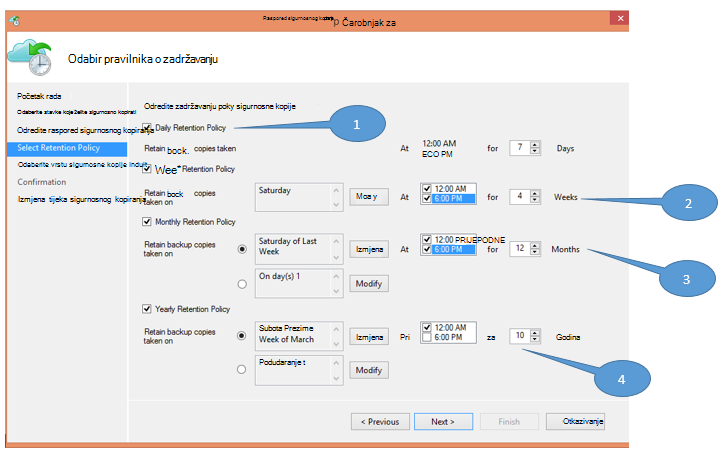
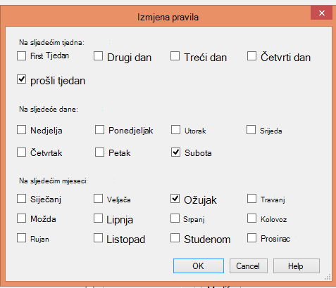

<properties
   pageTitle="Korištenje Azure sigurnosnu kopiju da biste zamijenili infrastruktura za vrpcu | Microsoft Azure"
   description="Saznajte kako Azure sigurnosne kopije nudi semantiku vrpcu nalik koji omogućuje sigurnosnog kopiranja i vraćanja podataka u Azure"
   services="backup"
   documentationCenter=""
   authors="trinadhk"
   manager="vijayts"
   editor=""/>
<tags
   ms.service="backup"
   ms.devlang="na"
   ms.topic="article"
   ms.tgt_pltfrm="na"
   ms.workload="storage-backup-recovery"
   ms.date="09/27/2016"
   ms.author="jimpark;trinadhk;markgal"/>

# Korištenje Azure sigurnosnu kopiju da biste zamijenili infrastruktura za vrpcu

Azure sigurnosnu kopiju i Upravitelj za zaštitu podataka u sustav centar za korisnike možete:

- Sigurnosno kopiranje podataka u raspored koji najbolje odgovaraju potrebama tvrtke ili ustanove.
- Zadržavanje sigurnosne kopije podataka za više razdoblja
- Provjerite Azure dio njihove Dugoročne zadržavanja mora (umjesto vrpcu).

U ovom se članku objašnjava kako korisnici mogu omogućiti pravila zadržavanja i sigurnosno kopiranje. Korisnici koji koriste vrpce adrese njihove long-term-zadržavanja sada mora imati Napredna i izgledna zamjenski dostupnosti značajka. Značajka je omogućena u najnovijem izdanju kopije Azure (koji je dostupan [u nastavku](http://aka.ms/azurebackup_agent)). Centar sustava DPM kupci morate ažurirati, barem DPM 2012 R2 UR5 prije korištenja DPM sa servisom Azure sigurnosnu kopiju.

## Što je raspored sigurnosne kopije?
Raspored sigurnosnog kopiranja označava učestalost postupak sigurnosnog kopiranja. Na primjer, postavke na sljedećem zaslonu pokazuju sigurnosne kopije uzimaju svakodnevno u 6 pm i od ponoći.

Korisnici mogu zakazivati i tjedni sigurnosnu kopiju. Ako, na primjer, postavke na sljedećem zaslonu označavaju da sigurnosne kopije uzimaju se svaki zamjenski nedjelja & srijeda pri 9:30 i 1:00 Prijepodne.

## Što je pravilnik zadržavanja?
Pravila zadržavanja određuje trajanje za koje se moraju pohraniti sigurnosnu kopiju. Umjesto samo određivanja "paušalni pravila" za sve točke sigurnosne kopije, korisnici možete odrediti različite zadržavanja na temelju ako je mjesto sigurnosne kopije. Na primjer, sigurnosno kopiranje točke snimljene dnevni, koje služi kao točku radu oporavak, zadržava se za 90 dana. Točke sigurnosne kopije snimljene na kraju tromjesečju svrhu nadzora zadržava se produljili trajanje.

Ukupan broj točaka"zadržavanja" navedeno u ovim pravilima je 90 (dnevnih točke) + 40 (jedan svaki kvartala za 10 godina) = 130.

## Primjer – oboje izgradnja

1. **Dnevni pravilnika o zadržavanju**: sigurnosne kopije snimljene svakodnevno pohranjuju sedam dana.
2. **Tjedni pravilnika o zadržavanju**: sigurnosne kopije snimljene svakodnevno ponoći i 6 PM subota zadržavaju za četiri tjedna
3. **Mjesečni pravilnika o zadržavanju**: sigurnosne kopije snimljene ponoći i 6 pm na zadnji subota svakog mjeseca će se sačuvati u roku od 12 mjeseci
4. **Godišnji pravilnika o zadržavanju**: sigurnosne kopije snimljene od ponoći na zadnji subota svaki ožujak zadržavaju za 10 godina

Ukupan broj točaka"zadržavanja" (točke iz kojeg klijenta možete vratiti podatke) u prethodnom dijagramu je izračunat kako slijedi:

- dvije točke dnevno sedam dana = 14 točaka oporavka
- dvije točke po tjednu za četiri tjedna = 8 oporavak točke
- dvije točke mjesečno 12 mjeseci = 24 točke oporavka
- jednu točku po godini po oporavak 10 godina = 10 točaka

Ukupan broj bodova oporavak je 56.

> [AZURE.NOTE] Azure sigurnosne kopije nema ograničenja na broj točaka za oporavak.

## Napredna konfiguracija
Tako da kliknete **Izmijeni** na prethodni zaslon, korisnici imaju dodatne fleksibilnosti pri navođenju rasporede zadržavanja.

## Daljnji koraci
Dodatne informacije o sigurnosne kopije Azure potražite u članku:

- [Uvod u Azure sigurnosnog kopiranja](backup-introduction-to-azure-backup.md)
- [Pokušajte Azure sigurnosnog kopiranja](backup-try-azure-backup-in-10-mins.md)
