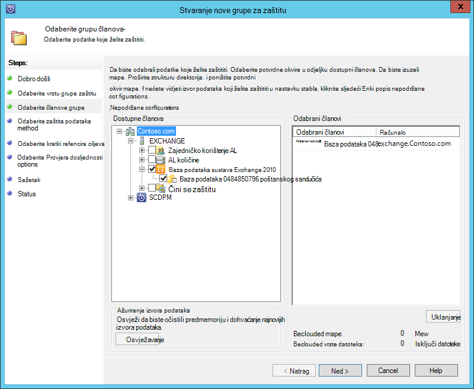
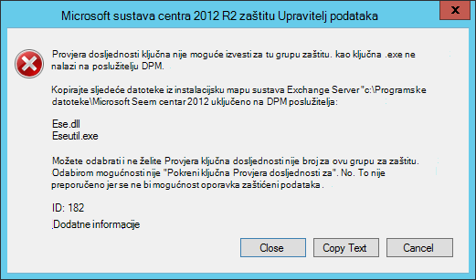
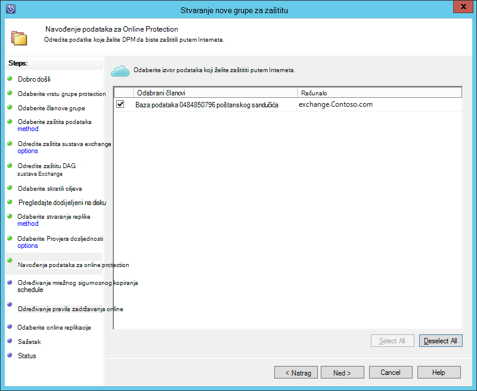
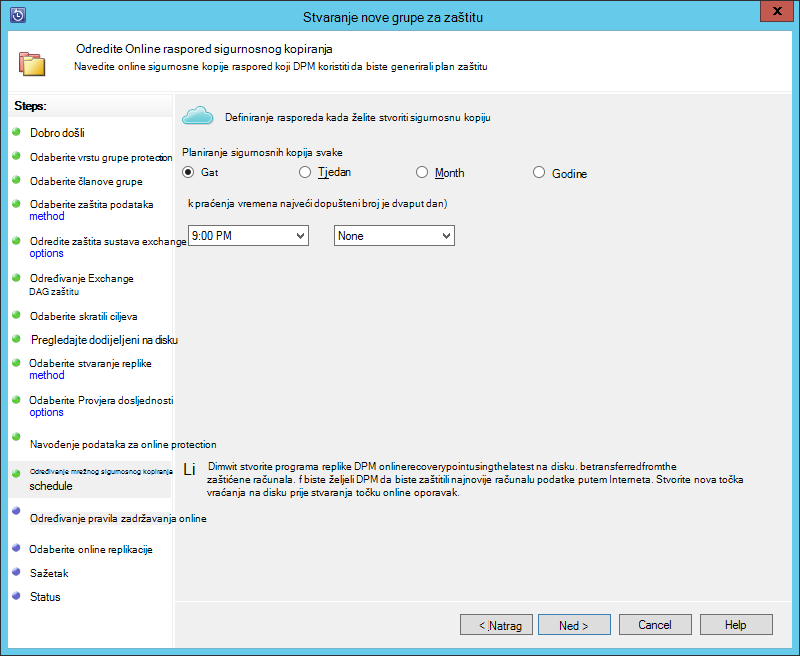
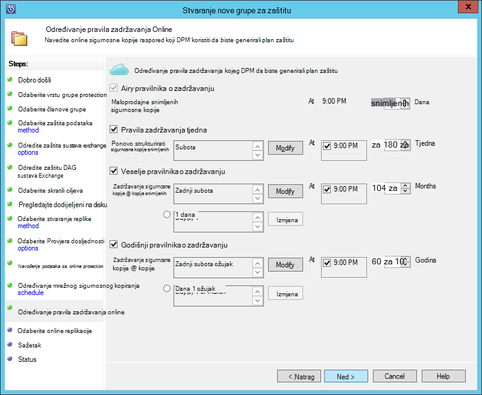
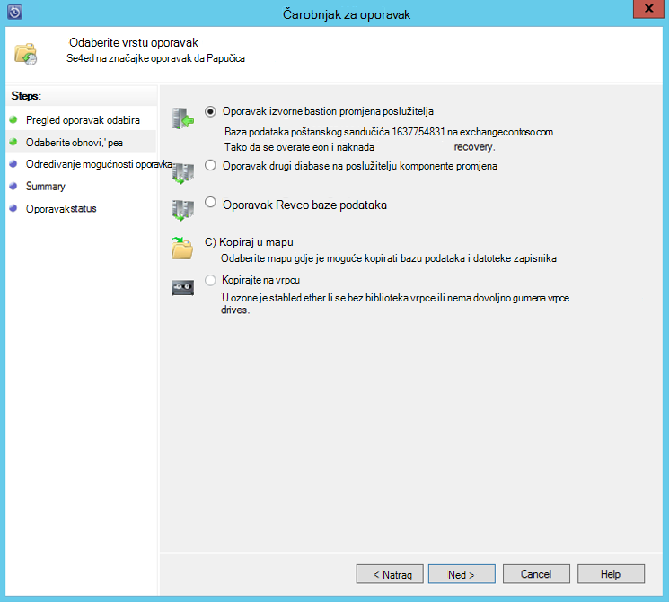

<properties
    pageTitle="Sigurnosno kopiranje sustava Exchange server Azure sigurnosno kopirati s sustava centra 2012 R2 DPM | Microsoft Azure"
    description="Saznajte kako želite sigurnosno kopirati Azure pomoću sustava centra 2012 R2 DPM sigurnosne kopije sustava Exchange server"
    services="backup"
    documentationCenter=""
    authors="MaanasSaran"
    manager="NKolli1"
    editor=""/>

<tags
    ms.service="backup"
    ms.workload="storage-backup-recovery"
    ms.tgt_pltfrm="na"
    ms.devlang="na"
    ms.topic="article"
    ms.date="08/15/2016"
    ms.author="anuragm;jimpark;delhan;trinadhk;markgal"/>

# Stvaranje sigurnosne kopije sustava Exchange server Azure sigurnosno kopirati s sustava centra 2012 R2 DPM
U ovom se članku objašnjava kako konfigurirati poslužiteljem sustava centra 2012 R2 podataka zaštitu Manager (DPM) da bi se sigurnosno kopiranje Microsoft Exchange server Azure sigurnosno kopirati.  

## Ažuriranja
Da biste uspješno registraciju poslužitelja DPM pomoću sigurnosnog kopiranja Azure, morate instalirati najnoviji paket ažuriranja za sustav centar 2012 R2 DPM i najnoviju verziju programa Azure Agent za sigurnosno kopiranje. Najnovije zbirna zatražite od [Microsoftova kataloga](http://catalog.update.microsoft.com/v7/site/Search.aspx?q=System%20Center%202012%20R2%20Data%20protection%20manager).

>[AZURE.NOTE] Za primjere u ovom članku, je instalirana verzija 2.0.8719.0 Azure Agent za sigurnosne kopije, a 6 Kumulativno ažuriranje je instaliran na sustav centar 2012 R2 DPM.

## Preduvjeti
Prije nego što nastavite, provjerite je li sve [preduvjete](backup-azure-dpm-introduction.md#prerequisites) za pomoću programa Microsoft Azure Backup radi zaštite radnih opterećenja zadovolje. Ovim preduvjetima obuhvaćaju sljedeće:

- Stvoreno je sigurnosno kopiranje zbirke ključeva Azure web-mjesta.
- Agent i sigurnog vjerodajnice preuzet s poslužiteljem DPM.
- Agenta je instalirana na poslužitelju DPM.
- Da biste registrirali DPM server koristi su vjerodajnice za zbirke ključeva.
- Ako su zaštite Exchange 2016, nadogradite DPM 2012 R2 UR9 ili noviji

## Agent za zaštitu DPM  
Da biste instalirali agent za zaštitu DPM sustava Exchange server, slijedite ove korake:

1. Provjerite jesu li u vatrozidima pravilno konfigurirani. U odjeljku [iznimke za konfiguriranje vatrozida za agenta](https://technet.microsoft.com/library/Hh758204.aspx).

2. Instalacija agenta u sustavu Exchange server tako da kliknete **Upravljanje > agenata > instalacija** u DPM administratorskoj konzoli. Potražite u članku [Instalacija agent za zaštitu DPM](https://technet.microsoft.com/library/hh758186.aspx?f=255&MSPPError=-2147217396) detaljne upute.

## Stvaranje grupe za zaštitu za Exchange server

1. DPM administratorskoj konzoli, kliknite **zaštitu**, a zatim **Novo** na vrpci alata da biste otvorili čarobnjak **Stvori novu grupu zaštitu** .

2. Na zaslonu **dobrodošlice** čarobnjaka kliknite **Dalje**.

3. Na zaslonu **Odaberite vrstu grupe zaštite** odaberite **poslužitelje** , a zatim kliknite **Dalje**.

4. Odaberite bazu podataka sustava Exchange server koji želite zaštititi, a zatim kliknite **Dalje**.

    >[AZURE.NOTE] Ako su zaštite Exchange 2013, potvrdite okvir [preduvjeti za Exchange 2013](https://technet.microsoft.com/library/dn751029.aspx).

    U sljedećem primjeru odabran Exchange 2010 bazu podataka.

    

5. Odaberite način za zaštitu podataka.

    Zaštita grupi dodijelite naziv, a zatim odaberite od sljedećih mogućnosti:

    - Želim da se kratkotrajni zaštitu pomoću diska.
    - Želim da se online protection.

6. Kliknite **Dalje**.

7. Ako želite provjeriti integritet baze podataka sustava Exchange Server, odaberite mogućnost **Pokretanje Eseutil da biste provjerili integritet podataka** .

    Nakon što ste odabrali ovu mogućnost, sigurnosno kopiranje dosljednost provjera će pokrenuti na poslužitelju DPM da biste izbjegli promet/i stvoreno tako da pokrenete naredbu **eseutil** u sustavu Exchange server.

    >[AZURE.NOTE]Da biste koristili tu mogućnost, morate kopirati datoteke Ese.dll i Eseutil.exe c:\Programske datoteke\Microsoft sustava centra 2012 R2\DPM\DPM\bin direktorij na poslužitelju DPM. U suprotnom se aktivira sljedeća pogreška:  
    

8. Kliknite **Dalje**.

9. Odaberite bazu podataka za **Stvaranje sigurnosnih kopija**, a zatim kliknite **Dalje**.

    >[AZURE.NOTE] Ako ste odabrali "Potpuno sigurnosno kopiranje" za barem jedan DAG kopiju baze podataka, zapisnika se će skratiti.

10. Konfiguriranje ciljeva za **kratkotrajni sigurnosnu kopiju**, a zatim kliknite **Dalje**.

11. Pregled dostupnog prostora, a zatim kliknite **Dalje**.

12. Odaberite vrijeme na kojoj se poslužitelj DPM će stvaranje početne replikacije, a zatim kliknite **Dalje**.

13. Odaberite željene mogućnosti Provjera dosljednosti, a zatim kliknite **Dalje**.

14. Odaberite bazu podataka koju želite sigurnosno kopirati Azure, a zatim kliknite **Dalje**. Ako, na primjer:

    

15. Definiranje rasporeda za **Azure sigurnosnu kopiju**, a zatim kliknite **Dalje**. Ako, na primjer:

    

    >[AZURE.NOTE] Imajte na umu Online oporavak točke temelje se na express Potpuna oporavak točke. Dakle, potrebno je zakazati točke online oporavak nakon vremena koje je navedeno za eksplicitnih cijelog oporavak pokažite.

16. Konfiguriranje pravila zadržavanja za **Azure sigurnosnu kopiju**, a zatim kliknite **Dalje**.

17. Odaberite mogućnost online replikacije, a zatim kliknite **Dalje**.

    Ako imate veliki baze podataka, može potrajati dugo početne sigurnosne kopije će biti stvoren putem mreže. Da biste izbjegli taj problem, možete stvoriti izvanmrežne sigurnosnu kopiju.  

    

18. Potvrdite postavke, a zatim kliknite **Stvori grupu**.

19. Kliknite **Zatvori**.

## Oporavak baze podataka sustava Exchange

1. Da biste vratili bazu podataka sustava Exchange, kliknite **oporavak** DPM administratorskoj konzoli.

2. Pronađite Exchange bazu podataka koju želite oporaviti.

3. Odaberite točku online oporavak *oporavku* padajućeg popisa.

4. Kliknite da biste pokrenuli **Čarobnjak za oporavak** **oporaviti** .

Za točke online oporavak postoji pet vrsti oporavak:

- **Vratiti na izvorno mjesto za Exchange Server:** Podaci će ih moći vratiti izvorne Exchange server.
- **Oporavak u drugu bazu podataka na poslužitelj sustava Exchange:** Podaci će ih moći vratiti u drugu bazu podataka na drugi poslužitelj sustava Exchange.
- **Oporavak oporavak baze podataka:** Da biste u sustavu Exchange oporavak baze podataka (RDB) će oporaviti podatke.
- **Kopiraj u mrežnu mapu:** Podaci će ih moći vratiti u mrežnu mapu.
- **Kopiraj na vrpcu:** Ako imate biblioteci vrpce ili pogon samostalnih vrpce priključeni i konfiguriran na poslužitelju DPM, točke oporavak kopirat će se besplatne vrpcu.

    

## Daljnji koraci

- [Najčešća pitanja o Azure sigurnosne kopije](backup-azure-backup-faq.md)
