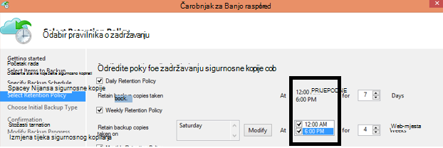

<properties
   pageTitle="Najčešća pitanja o Azure sigurnosne kopije | Microsoft Azure"
   description="Odgovori na najčešća pitanja o servis sigurnosne kopije, agent za sigurnosne kopije, sigurnosno kopiranje i zadržavanja, oporavak, sigurnost i druge najčešća pitanja o oporavak i Izrada sigurnosne kopije."
   services="backup"
   documentationCenter=""
   authors="markgalioto"
   manager="jwhit"
   editor=""
   keywords="sigurnosno kopiranje i Izrada oporavak; Servis za sigurnosne kopije"/>

<tags
   ms.service="backup"
   ms.workload="storage-backup-recovery"
     ms.tgt_pltfrm="na"
     ms.devlang="na"
     ms.topic="get-started-article"
     ms.date="10/21/2016"
     ms.author="trinadhk; giridham; arunak; markgal; jimpark;"/>

# <a name="azure-backup-service--faq"></a>Azure sigurnosne kopije servisa – najčešća Pitanja


Ovaj se članak odnosi popis od najčešćih pitanja (i odgovarajući odgovore) o servisu Azure sigurnosnu kopiju. Naš zajednice odgovori, a ako pitanje se od vas zatraži često, ne možemo ga dodati u ovom se članku. Odgovori na pitanja obično sadrže reference ili informacije o podršci. Možete postavljati pitanja o Azure sigurnosnu kopiju u odjeljku Disqus u ovom se članku ili povezane članka. Pitanja o servisu Azure sigurnosnog kopiranja možete objaviti i u na [forumu za raspravu](https://social.msdn.microsoft.com/forums/azure/home?forum=windowsazureonlinebackup).


## <a name="what-is-the-list-of-supported-operating-systems-from-which-i-can-back-up-to-azure-using-azure-backup-br"></a>Što je na popisu podržanih operacijskih sustava iz koje možete napraviti sigurnosnu kopiju da biste Azure pomoću sigurnosnog kopiranja Azure? <br/>
Sljedeći popis operacijske sustave podržava Azure Backup za mapu datoteke sigurnosne kopije, a zatim sigurnosno kopiranje aplikacije pomoću poslužitelj za Azure sigurnosne kopije i SCDPM.

| Operacijski sustav        | Platforme           | SKU  |
| :------------- |-------------| :-----|
| Windows 8 i najnovije SPs      | 64-bitni | Enterprise, Pro |
| Windows 7 i najnovije SPs      | 64-bitni | Ultimate, Enterprise, Professional, Home Premium Home Basic Starter |
| Windows 8.1 i najnovije SPs | 64-bitni      |    Enterprise, Pro |
| Windows 10      | 64-bitni | Enterprise, Pro, kućni |
|Windows Server 2012 R2 i najnovije SPs| 64-bitni| Standardna, podatkovnog centra, Foundation|
|Windows Server 2012 i najnovije SPs|    64-bitni| Standardna podatkovnog centra, Foundation,|
|Windows prostora za pohranu Server 2012 R2 i najnovije SPs  |64-bitni|    Standardna, radna grupa|
|Windows prostora za pohranu Server 2012 i najnovije SPs |64-bitni |Standardna, radna grupa
|Windows Server 2012 R2 i najnovije SPs  |64-bitni|    Ključna|
|Windows Server 2008 R2 SP1 |64-bitni|    Standard, Enterprise, podatkovnog centra, Foundation|
|Windows Server 2008 SP2    |64-bitni|    Standard, Enterprise, podatkovnog centra, Foundation|

Za Azure VM stvaranje sigurnosne kopije

- **Linux**: Azure sigurnosne kopije podržava [popis raspodjele koji su licencira po Azure](../virtual-machines/virtual-machines-linux-endorsed-distros.md) osim Core OS Linux.  Distribucija druge Premjesti-vaše – vlasnik – Linux možda sve dok se VM agent dostupna je na virtualnog računala i podrška za Python postoji.
- **Windows Server**: verzije starije od Windows Server 2008 R2 nisu podržane.

## <a name="where-can-i-download-the-latest-azure-backup-agent-br"></a>Gdje preuzeti najnovija agent za sigurnosno kopiranje Azure? <br/>
Možete preuzeti najnoviju agent za sigurnosno kopiranje Windows Server, DPM centar sustava ili klijenta sustava Windows, iz [ovdje](http://aka.ms/azurebackup_agent). Ako želite sigurnosno kopirati virtualnog računala, pomoću Agent VM (koji se automatski instalira proper kućni broj). Agent za VM već se nalazi na virtualnim strojevima stvorene iz galerije Azure.

## <a name="which-version-of-scdpm-server-is-supported-br"></a>Koju verziju sustava SCDPM server je podržano? <br/>
Preporučujemo da instalacija [najnovije](http://aka.ms/azurebackup_agent) Azure Backup agent na najnovije zbirna SCDPM (UR11 od kolovoz 2016)

## <a name="when-configuring-the-azure-backup-agent-i-am-prompted-to-enter-the-vault-credentials-do-vault-credentials-expire"></a>Prilikom konfiguriranja agent za sigurnosno kopiranje Azure, mogu se to od vas zatraži da biste unijeli vjerodajnice sigurnog. Učinite sigurnog vjerodajnice istječe?
Da, vjerodajnice sigurnog istječe nakon 48 sati. Ako datoteku istekne, prijavite se na portal za Azure i preuzimati datoteke vjerodajnice sigurnog iz vaše zbirke ključeva.

## <a name="is-there-any-limit-on-the-number-of-vaults-that-can-be-created-in-each-azure-subscription-br"></a>Postoji li ograničenje broja sefovi koje je moguće stvoriti u Azure pretplate? <br/>
Da. Od rujan 2016, možete stvoriti 25 sigurnosne kopije sefovi po pretplati. Možete stvoriti do 25 sefovi oporavak usluge po svakom podržanih regija kopije Azure po pretplati. Ako trebate više sefovi, stvorite novu pretplatu.

## <a name="are-there-any-limits-on-the-number-of-serversmachines-that-can-be-registered-against-each-vault-br"></a>Postoje li ograničenja broja poslužitelja/strojevima koji mogu biti registrirani protiv svake zbirke ključeva? <br/>
Da, registrirate do 50 strojeva po zbirke ključeva. Za Azure IaaS virtualnim strojevima je ograničenje 200 VMs po zbirke ključeva. Ako morate registrirati više računala, stvorite novi zbirke ključeva.

## <a name="how-do-i-register-my-server-to-another-datacenterbr"></a>Kako se registrirati Moj poslužitelj drugi podatkovnim centrom?<br/>
Sigurnosno kopiranje podataka se šalje Standard sigurnog na koji je registriran. Da biste promijenili s podatkovnim centrom najjednostavnije deinstalirati agenta i ponovno instalirajte agenta i registrirati nove zbirke ključeva koji pripada željeni podatkovnog centra.

## <a name="what-happens-if-i-rename-a-windows-server-that-is-backing-up-data-to-azurebr"></a>Što se događa ako promijenim naziv Windows server koji je sigurnosno kopirati podatke za Azure?<br/>
Kada promijenite naziv poslužitelja, sve trenutno konfigurirana sigurnosne kopije su zaustavljena.
Morate registrirati novi naziv poslužitelja s sigurnog sigurnosnu kopiju. Kada stvorite novu Registracija, prvi sigurnosne kopije operacija je potpunu sigurnosnu kopiju, a ne rastuće backup. Ako vam je potrebna oporaviti podatke koje ste prethodno sigurnosnu kopiju na sigurnog pod starim nazivom poslužitelja, možete oporaviti podatke koristeći [**drugi poslužitelj**](backup-azure-restore-windows-server.md#recover-to-an-alternate-machine) u čarobnjaku za **Oporavak podataka** .

## <a name="what-types-of-drives-can-i-backup-files-and-folders-from-br"></a>Koje vrste pogona se sigurnosno kopirajte datoteke i mape? <br/>
Sljedeći skup pogona/količine nije moguće dohvatiti sigurnosne kopije:

- Izmjenjivi medij: Pogon morate prijaviti kao fixed treba koristiti izvor stavka sigurnosne kopije.
- Samo za čitanje količine: jedinica mora biti snimanje za količinsko sjene Kopiraj servis (VSS) (opis funkcije).
- Izvanmrežna količine: Jedinica mora biti online za VSS funkciji.
- Zajedničkog mrežnog resursa: jedinica mora biti lokalni poslužitelj za sigurnosno kopiranje pomoću mrežnog sigurnosnog kopiranja.
- BitLocker zaštićeni količine: jedinica mora biti otključane prije nego što se može dogoditi sigurnosnu kopiju.
- Datoteke sustava identifikacijski: NTFS je samo podržana za tu verziju mrežni servis za sigurnosno kopiranje datotečnog sustava.

## <a name="what-file-and-folder-types-can-i-back-up-from-my-serverbr"></a>Koje vrste datoteka i mapa možete napraviti sigurnosnu kopiju moje poslužitelja?<br/>
Podržane su sljedeće:

- Šifrirana
- Sažeti
- Kratke
- Komprimirana + kratke
- Veza: Nije podržan, preskočeno
- Točka ponovnog rastavljanja: Nije podržan, preskočeno
- Šifrirana + spojene: Nije podržan, preskočeno
- Šifrirana + kratke: Nije podržan, preskočeno
- Komprimirana strujanje: Nije podržan, preskočeno
- Kratke strujanje: Nije podržan, preskočeno

## <a name="whats-the-minimum-size-requirement-for-the-cache-folder-br"></a>Što je obavezu Minimalna veličina mape predmemorije? <br/>
Veličina mape predmemorije određuje količinu podataka koji se sigurnosno kopiranje. Mape predmemorije mora biti 5% razmak potreban za pohranu podataka.

## <a name="if-my-organization-has-one-vault-how-can-i-isolate-one-servers-data-from-another-server-when-restoring-databr"></a>Ako Moja tvrtka ili ustanova ima jednu sigurnog, kako mogu li izdvajanja jedan poslužitelj podatke iz drugog poslužitelja pri vraćanju podataka?<br/>
Svim poslužiteljima registrirane isti sigurnog možete oporaviti podatke sigurnosnu kopiju druge poslužitelji *koje koriste isti pristupni izraz*. Ako imate poslužitelja čije sigurnosne kopije podataka koje želite izdvojiti iz poslužitelji u tvrtki ili ustanovi, koristite određenu pristupni izraz te poslužitelja. Ako, na primjer, ljudskih resursa poslužitelja koristiti jedan pristupni izraz šifriranja, računovodstvo poslužitelje drugi i poslužitelji za pohranu nekog drugog.

## <a name="can-i-migrate-my-backup-data-or-vault-between-subscriptions-br"></a>Mogu li "migrirati" Moje sigurnosne kopije podataka ili sigurnog između pretplate? <br/>
ne. Na sigurnog stvara se na razini pretplate i ne može se ponovno dodijeliti drugu pretplatu nakon stvaranja.

## <a name="does-the-azure-backup-agent-work-on-a-server-that-uses-windows-server-2012-deduplication-br"></a>Agent za sigurnosne kopije Azure funkcionira na poslužitelju koji koristi Windows Server 2012 Poništavanje duplikacije? <br/>
Da. Servis agenta pretvara deduplicated podataka u normalni podataka kada je Priprema postupak sigurnosnog kopiranja. Ga optimizira podataka za sigurnosno kopiranje, šifrira podatke i zatim šalje šifrirani podaci mrežni servis sigurnosne kopije.

## <a name="if-i-cancel-a-backup-job-once-it-has-started-is-the-transferred-backup-data-deleted-br"></a>Ako se sigurnosno kopiranje otkazati kada se pokrene, prenesene sigurnosne kopije podataka briše se? <br/>
ne. Sigurnosno kopiranje zbirke ključeva sprema sigurnosno kopirane podatke koje imali prenesene do točke o otkazivanju. Azure sigurnosne kopije koristi Kontrolna točka mehanizam povremeno dodati checkpoints sigurnosne kopije podataka tijekom sigurnosnu kopiju. Budući da checkpoints sigurnosne kopije podataka, sljedeći postupak sigurnosnog kopiranja možete provjeriti integritet datoteka. Sljedeće sigurnosno kopiranje pokrene bi rastuće nad podacima koji su imali prethodno sigurnosno. Rastuća sigurnosne kopije omogućuje bolje Upotreba propusnost, tako da ne morate više puta prijenos s istim podacima.

U slučaju Azure VM sigurnosnu kopiju, nakon otkazivanja posao zanemaruje se preneseni podataka i Osvježi sigurnosne kopije prenosi rastuće podataka iz prethodno uspješno sigurnosno kopiranje.

## <a name="why-am-i-seeing-the-warning-azure-backups-have-not-been-configured-for-this-server-even-though-i-had-scheduled-regular-backups-previously-br"></a>Zašto se prikazuju upozorenje "Azure sigurnosne kopije nisu konfigurirana za ovaj poslužitelj" čak i ako ste prethodno zakazano redovito sigurnosno kopiranje? <br/>
Ovo će se upozorenje pojaviti kada postavke raspored sigurnosnog kopiranja koja je spremljena na lokalni poslužitelj nisu jednaki postavke spremljene u sigurnosno kopiranje zbirke ključeva. Kada poslužitelj ili postavke ste je oporaviti poznati dobro stanje, sigurnosne kopije rasporedima mogu izgubiti sinkronizacije. Ako vam se prikaže ova upozorenja, [Konfigurirajte sigurnosne kopije pravila](backup-azure-manage-windows-server.md) , a zatim **Pokreni odmah stvori sigurnosne kopije** ponovno sinkroniziranje lokalni poslužitelj s Azure.

## <a name="what-firewall-rules-should-be-configured-for-azure-backup-br"></a>Što vatrozid pravila treba konfigurirati za sigurnosno kopiranje Azure? <br/>
Objedinjenog zaštita podataka na – lokalno-na-Azure i radno opterećenje Azure, preporučuje se dopustite vatrozida za komunikaciju sa sljedećim URL-ovima:

- www.msftncsi.com
- \*. Microsoft.com
- \*. WindowsAzure.com
- \*. microsoftonline.com
- \*. windows.net

##<a name="can-i-install-the-azure-backup-agent-on-an-azure-vm-already-backed-by-the-azure-backup-service-using-the-vm-extension-br"></a>Mogu li instalirati agent za sigurnosno kopiranje Azure na programa Azure VM već sigurnosno servis sigurnosne kopije Azure korištenje nastavka VM? <br/>
Apsolutno. Azure sigurnosne kopije nudi VM razinom sigurnosne kopije za Azure VMs korištenje nastavka VM. Agent za Azure sigurnosnog kopiranja možete instalirati na Windows OS za goste radi zaštite datoteka i mapa na goste OS.

## <a name="can-i-install-the-azure-backup-agent-on-an-azure-vm-to-back-up-files-and-folders-present-on-temporary-storage-provided-by-the-azure-vm-br"></a>Mogu li instalirati agent za sigurnosno kopiranje Azure na programa Azure VM sigurnosnu kopiju datoteke i mape izlaganje na privremenu pohranu koje ste dobili od Azure VM? <br/>
Možete instalirati agent za sigurnosno kopiranje Azure na Windows OS goste i sigurnosnu kopiju datoteke i mape da biste privremeno spremište. Međutim, uzmite u obzir sigurnosne kopije uspjeti kada Privremena pohrana podataka provodi brisanje. Osim toga, ako je izbrisana je Privremena pohrana podataka, možete vratiti samo za pohranu koji nije uklonjiv.

## <a name="i-have-installed-azure-backup-agent-to-protect-my-files-and-folders-can-i-now-install-scdpm-to-work-with-azure-backup-agent-to-protect-on-premises-applicationvm-workloads-to-azure-br"></a>Mogu imati instaliran program agent Azure sigurnosnu kopiju da biste zaštitili datoteke i mape. Mogu li sada instalirati SCDPM za rad s Azure Backup agent za zaštitu radnih opterećenja lokalnog računala/VM za Azure? <br/>
Da biste koristili sigurnosne kopije Azure s SCDPM, on je svakako da biste instalirali SCDPM prvi put, a zatim samo da biste instalirali Azure Backup agent. Time se osigurava objedinjenog Integracija agent za sigurnosno kopiranje Azure s SCDPM i omogućuje zaštitu datoteka/mapa, aplikacija opterećenjem i VMs za Azure, izravno iz konzolu za upravljanje SCDPM. Instaliranje SCDPM nakon instalacije sigurnosnog kopiranja Azure agent za potrebe prethodno navedenim nije svakako ili podržane.

## <a name="what-is-the-length-of-file-path-that-can-be-specified-as-part-of-azure-backup-policy-using-azure-backup-agent-br"></a>Što je duljinu put datoteke koje se navedenom u sklopu Azure sigurnosne kopije pravila pomoću agent za sigurnosno kopiranje Azure? <br/>  
Azure Backup agent ovisi o NTFS. Na [filepath duljine specifikacija ograničen Windows API](https://msdn.microsoft.com/library/aa365247.aspx#fully_qualified_vs._relative_paths). U slučaju sigurnosno kopiranje datoteka veća od njih tako da Windows API duljine put datoteke, korisnici možete odabrati za sigurnosno kopiranje nadređenu mapu ili pogon diska datoteka sigurnosne kopije.  

## <a name="what-characters-are-allowed-in-file-path-of-azure-backup-policy-using-azure-backup-agent-br"></a>Znakovi dopušteni u put datoteke sigurnosne kopije Azure pravila pomoću Azure Backup agent? <br>  
 Azure Backup agent ovisi o NTFS. Omogućuje [NTFS podržava znakove](https://msdn.microsoft.com/library/aa365247.aspx#naming_conventions) kao dio datoteke specifikacija.  

## <a name="can-i-use-azure-backup-server-to-create-a-bare-metal-recovery-bmr-backup-for-a-physical-server-br"></a>Mogu li koristiti poslužitelj za Azure sigurnosne kopije da biste stvorili sigurnosnu kopiju Gola Metal oporavak (BMR) za fizičke server? <br/>
Da.

## <a name="can-i-configure-the-backup-service-to-send-mail-if-a-backup-job-fails-br"></a>Ću konfigurirati servis za sigurnosno kopiranje slanja e-pošte ne uspijete sigurnosno kopiranje? <br/>
Da, servis za sigurnosno kopiranje ima nekoliko događaj upozorenja temeljenih na koje je moguće koristiti s skriptu PowerShell. Opis cijelog potražite u članku [upozorenja](backup-azure-manage-vms.md#alert-notifications)

## <a name="is-there-a-limit-on-the-size-of-each-data-source-being-backed-up-br"></a>Postoji li ograničenje veličine svaki izvor podataka koji se sigurnosno? <br/>
Dok je na razini zbirke ključeva nema ograničenja na količinu podataka može sigurnosno kopirati, Azure sigurnosne kopije nametnuti ograničenja (sve praktične svrhe, ta ograničenja su vrlo visoka) na maksimalne veličine izvora podataka. Od 2015 kolovoz maksimalne veličine izvora podataka za podržani operacijski sustavi je:

|S.No | Operacijski sustav |  Maksimalna veličina izvora podataka |
| :-------------: |:-------------| :-----|
|1| Windows Server 2012 ili noviji| 54400 GB|
|2| Windows 8 ili noviji| 54400 GB|
|3| Windows Server 2008, Windows Server 2008 R2 | 1700 GB|
|4| Windows 7 | 1700 GB|

U sljedećoj su tablici objašnjavaju kako se određuje svaki veličina izvora podataka.

|   Izvor podataka  |   Pojedinosti |
| :-------------: |:-------------|
|Jedinica |Količinu podataka koji se sigurnosno s jednom jedinice poslužitelja ili klijentskog računala|
|Hyper-V virtualnog računala | Zbrajanje podataka VHDs virtualnog računala stvara sigurnosnu kopiju|
|Baza podataka Microsoft SQL Server | Veličina jedan Veličina baze podataka SQL stvara sigurnosnu kopiju |
|Microsoft SharePoint |Zbroj sadržaja i konfiguraciji baze podataka u farmi sustava SharePoint stvara sigurnosnu kopiju|
|Microsoft Exchange |Zbraja sve baze podataka sustava Exchange u sustava Exchange server stvara sigurnosnu kopiju|
|Stanje BMR/sustava |Svaki pojedinačne kopiju BMR ili sustav stanje računala stvara sigurnosnu kopiju|

## <a name="are-there-limits-on-the-number-of-times-a-backup-job-can-be-scheduled-per-daybr"></a>Postoje li ograničenja na koliko je puta sigurnosno kopiranje može se zakazati dnevno?<br/>
Da, možete pokrenuti sigurnosne kopije zadataka na Windows Server i Windows klijenta do tri puta / dan. Sigurnosne kopije zadataka možete pokrenuti na DPM centar sustava do dva dana. Možete pokrenuti sigurnosno kopiranje za IaaS VMs jednom dnevno.

## <a name="is-there-a-difference-between-the-scheduling-policy-for-dpm-and-windows-server-ie-on-windows-server-without-dpm-br"></a>Je li razlika između rasporeda pravila za DPM i Windows Server (odnosno sustavu Windows Server bez DPM)? <br/>
Da. Korištenje DPM, možete odrediti dnevno, tjedno, mjesečno i godišnje rasporeda. Windows Server (bez DPM) omogućuje vam da navedete samo dnevno i tjedno rasporeda.

## <a name="is-there-a-difference-between-the-retention-policy-for-dpm-and-windows-serverclient-ie-on-windows-server-without-dpmbr"></a>Je li razlika između pravila zadržavanja za DPM i Windows Server/klijenta (odnosno sustavu Windows Server bez DPM)?<br/>
Ne, oba DPM i Windows Server/klijent imati dnevno, tjedno, mjesečno, godišnje zadržavanje i pravila.

## <a name="can-i-configure-my-retention-policies-selectively--ie-configure-weekly-and-daily-but-not-yearly-and-monthlybr"></a>Ću konfigurirati Moje zadržavanja pravila selektivno – odnosno konfiguriranje tjednih i dnevnu, ali ne godišnje i mjesečno?<br/>
Da, zadržavanja strukturu sigurnosne kopije Azure omogućuje vam potpunu fleksibilnost prilikom definiranja pravila zadržavanja u skladu sa svojim potrebama.

## <a name="can-i-schedule-a-backup-at-6pm-and-specify-retention-policies-at-a-different-timebr"></a>Možete li se "zakazivanje sigurnosnu kopiju" pri 6 pm i odredite "pravilnika o zadržavanju" na različite vremenske?<br/>
ne. Pravila zadržavanja se mogu primijeniti samo sigurnosne kopije točke. Na sljedećoj slici pravila zadržavanja navedena je sigurnosnih kopija izvedena na 12 prijepodne i poslijepodne 6. <br/>


<br/>

## <a name="is-an-incremental-copy-transferred-for-the-retention-policies-scheduled-br"></a>Rastuća Kopiraj prenose za pravila zadržavanja zakazano? <br/>
Ne, rastuće Kopiraj šalje se na temelju na vrijeme navedeno na stranici raspored sigurnosnog kopiranja. Točke koje mogu biti zadržani određuje na temelju pravila zadržavanja.

## <a name="if-a-backup-is-retained-for-a-long-duration-does-it-take-more-time-to-recover-an-older-data-point-br"></a>Ako sigurnosnu kopiju zadržava se dugo vrijeme, traje dulje da biste vratili stariju točke podataka? <br/>
 Ne – vrijeme da biste oporavili najstarijim ili točke najnovija je ista. Svaka točka oporavak ponaša se kao puni zareza.

## <a name="if-each-recovery-point-is-like-a-full-point-does-it-impact-the-total-billable-backup-storagebr"></a>Ako je svaka točka oporavak kao što je cijeli zareza, ne je utječe na ukupni naplatu sigurnosne kopije prostora za pohranu?<br/>
Uobičajeni Dugoročne proizvodi zadržavanja točke spremanje sigurnosne kopije podataka kao puni točke. Potpuna točke su za pohranu *neučinkovito* , ali su i ubrzava da biste vratili. Rastuća kopije su prostora za pohranu *učinkovitog* , ali je potrebno da biste vratili lanac podataka koje utječe vremenom oporavak. Azure arhitektura za pohranu za sigurnosno kopiranje vam najbolje oba svijetu optimalnog spremanje podataka za brzo vraća i povećavanja troškove malo prostora za pohranu. Taj se način pohrane podataka osigurava da su propusnosti vaše ingress i izlazne učinkovito koristi. Količinu prostora za pohranu podataka i vrijeme potrebno da biste oporavili podatke, čuva se na najmanje. Saznajte više o kako se sprema [rastuće sigurnosne kopije](https://azure.microsoft.com/blog/microsoft-azure-backup-save-on-long-term-storage/) učinkovitog.

## <a name="is-there-a-limit-on-the-number-of-recovery-points-that-can-be-createdbr"></a>Postoji li ograničenje broja oporavak točke koje je moguće stvoriti?<br/>
ne. Ne možemo ste ukloniti ograničenja oporavak točke. Možete stvoriti po volji proizvoljan broj oporavak točke.

## <a name="why-is-the-amount-of-data-transferred-in-backup-not-equal-to-the-amount-of-data-i-backed-upbr"></a>Zašto se prenose količinu podataka u sigurnosne kopije nije jednako količinu podataka, a mogu se sigurnosno?<br/>
 Sve podatke koje se sigurnosno iz Azure Backup Agent ili SCDPM ili poslužitelj za Azure sigurnosne kopije, se komprimiraju i šifrirane prije nego što se prenose. Kada se primjenjuje sažimanja i šifriranje, podaci iz sigurnosnih kopija sigurnog je 30 40% manje.

## <a name="is-there-a-way-to-adjust-the-amount-of-bandwidth-used-by-the-backup-servicebr"></a>Postoji način da biste prilagodili količinu propusnosti servis za sigurnosno kopiranje koristi?<br/>
 Da, pomoću mogućnosti **Promjena svojstava** u Agent za sigurnosno kopiranje prilagodite propusnosti. Prilagodite količinu propusnost i vrijeme kada koristite tu propusnost. Dodatne informacije potražite [Ograničavanje mreže](../backup-configure-vault.md#enable-network-throttling).

## <a name="my-internet-bandwidth-is-limited-for-the-amount-of-data-i-need-to-back-up-is-there-a-way-i-can-move-data-to-a-certain-location-with-a-large-network-pipe-and-push-that-data-into-azure-br"></a>Moje propusnosti internetske ograničen je iznos podataka morate sigurnosno kopiranje. Postoji li način možete premjestiti podatke na određenim mjesto s velikom mrežom kanala i automatske tih podataka u Azure? <br/>
Možete sigurnosno kopiranje podataka u Azure putem standardne online postupak sigurnosnog kopiranja, ili pomoću servisa Azure uvoz/izvoz možete prenijeti podatke bloba pohranom na servisu Azure. Postoje bez Dodatni načini početka sigurnosno kopiranje datum u Azure prostora za pohranu. Informacije o korištenju servisa Azure uvoz/izvoz pomoću sigurnosnog kopiranja Azure potražite u članku [tijek rada izvanmrežno sigurnosnu kopiju](backup-azure-backup-import-export.md) .

## <a name="how-many-recoveries-can-i-perform-on-the-data-that-is-backed-up-to-azurebr"></a>Koliko recoveries može izvoditi na podatke koje se sigurnosno Azure?<br/>
Nema ograničenja broja recoveries iz sigurnosne kopije Azure.

## <a name="do-i-have-to-pay-for-the-egress-traffic-from-azure-data-center-during-recoveriesbr"></a>Imati platiti za izlazne promet iz centra za Azure podataka tijekom recoveries?<br/>
 ne. Jesu li vaše recoveries besplatne i vam se naplatiti za izlazne promet.

## <a name="is-the-data-sent-to-azure-encrypted-br"></a>Podaci šalju se u Azure šifrirane? <br/>
Da. Šifrirana podataka na računalu klijentskog/poslužitelja/SCDPM lokalnog pomoću AES256, a podaci se šalju putem sigurne HTTP vezu.

## <a name="is-the-backup-data-on-azure-encrypted-as-wellbr"></a>Je li sigurnosno kopiranje podataka na Azure šifrirane kao i?<br/>
 Da. Podataka koji se šalju za Azure ostaje šifrirane (pri rest). Microsoft dešifrirati sigurnosne kopije podataka u bilo kojem trenutku. Azure VM sigurnosnu kopiju, Azure sigurnosne kopije ovisi šifriranje virtualnog računala odnosno ako vaš VM šifriran pomoću Azure šifriranje ili neke druge tehnologija šifriranja, Azure sigurnosne kopije koristi taj šifriranje radi zaštite vaše podatke.

## <a name="what-is-the-minimum-length-of-encryption-key-used-to-encrypt-backup-data-br"></a>Što je minimalnu duljinu ključa za šifriranje šifrirali sigurnosne kopije podataka? <br/>
 Ključ za šifriranje mora biti najmanje 16 znakova.

## <a name="what-happens-if-i-misplace-the-encryption-key-can-i-recover-the-data-or-can-microsoft-recover-the-data-br"></a>Što se događa ako se misplace ključa za šifriranje? Mogu li se oporaviti podatke (ili) može Microsoft oporaviti podatke? <br/>
Ključ za šifriranje sigurnosne kopije podataka postoji samo lokalno klijenta. Microsoft održavati kopiju u Azure i imaju pristup ključu. Ako je korisnik odabrao misplaces tipku, Microsoft nije moguće vratiti sigurnosne kopije podataka.

## <a name="how-do-i-change-the-cache-location-specified-for-the-azure-backup-agentbr"></a>Kako promijeniti mjesto predmemorije za agent za sigurnosno kopiranje Azure?<br/>
 Proći sekvencijalno u nastavku da biste promijenili mjesto predmemorije popis s grafičkim oznakama.
- Da biste prestali modul sigurnosne kopije izvršavanjem sljedeće naredbe u dodatnim naredbeni redak:

  ```PS C:\> Net stop obengine```

- Premještanje datoteke. Umjesto toga, kopirajte mapu prostora predmemorije neki drugi pogon s dovoljno prostora. Nakon potvrde sigurnosnih kopija radite novi prostor za predmemorije moguće ukloniti izvorni predmemorije prostora.

- Ažurirajte sljedeće stavke registra putom do nove mape predmemorije prostora.<br/>

|Put registra | Ključ registra | Vrijednost |
| ------ | ------- | ------|
| `HKEY_LOCAL_MACHINE\SOFTWARE\Microsoft\Windows Azure Backup\Config` | ScratchLocation | *Novo mjesto mape predmemorije* |
| `HKEY_LOCAL_MACHINE\SOFTWARE\Microsoft\Windows Azure Backup\Config\CloudBackupProvider` | ScratchLocation | *Novo mjesto mape predmemorije* |

- Ponovno pokretanje modula za sigurnosne kopije izvršavanjem sljedeće naredbe u dodatnim naredbeni redak:

  ```PS C:\> Net start obengine```

  Kada je na novo mjesto predmemorije uspješnom dovršetku sigurnosnog kopiranja stvaranja, možete ukloniti izvornu mapu predmemorije.

## <a name="where-can-i-put-the-cache-folder-for-the-azure-backup-agent-to-work-as-expectedbr"></a>Gdje možete pohraniti u mapu predmemorije za Backup Agent Azure očekivano funkcionirati?<br/>
Na sljedećim mjestima za mapu predmemorije ne preporučuje se:

- Mreže za zajedničko korištenje ili izmjenjivi medij: mapu predmemorije mora biti lokalni poslužitelj koji je potrebno sigurnosno mrežno sigurnosno kopiranje. Mrežna mjesta ili izmjenjivi medij kao što je USB pogoni nisu podržani.
- Izvanmrežna količine: Mapu predmemorije mora biti online za korištenje Azure Agent za sigurnosne kopije očekivani sigurnosnu kopiju.

## <a name="are-there-any-attributes-of-the-cache-folder-that-are-not-supportedbr"></a>Postoje li sve atribute mapu predmemorije koji nisu podržani?<br/>
 Sljedećim atributima ili njihove kombinacije nije podržana za mapu predmemorije:

- Šifrirana
- Uklanjanje duplikata
- Sažeti
- Kratke
- Točka ponovnog rastavljanja

Preporučuje se da mapu predmemorije ni metapodatke VHD atributima iznad za očekivani radi agent za Azure sigurnosnu kopiju.
