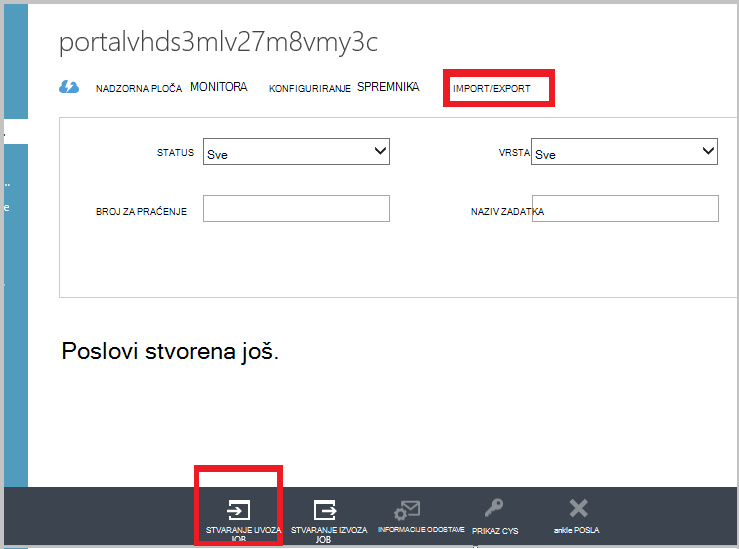

<properties
   pageTitle="Azure sigurnosne kopije - izvanmrežne sigurnosno kopiranje ili početnog seeding pomoću servisa Azure uvoz/izvoz | Microsoft Azure"
   description="Saznajte kako sigurnosne kopije Azure omogućuje slanje podataka izvan mreže pomoću servisa Azure uvoz/izvoz. U ovom se članku objašnjava izvanmrežne seeding početne sigurnosne kopije podataka pomoću servisa Azure uvoz izvoz."
   services="backup"
   documentationCenter=""
   authors="saurabhsensharma"
   manager="shivamg"
   editor=""/>
<tags
   ms.service="backup"
   ms.devlang="na"
   ms.topic="article"
   ms.tgt_pltfrm="na"
   ms.workload="storage-backup-recovery"
   ms.date="08/16/2016"
   ms.author="jimpark;saurabhsensharma;nkolli;trinadhk"/>

# Izvanmrežna sigurnosne kopije tijek rada u Azure sigurnosne kopije
Azure sigurnosne kopije ima nekoliko ugrađenih učinkovitosti koji troškova mreža i pohranu tijekom početne cijelog sigurnosne kopije podataka za Azure. Početna cijelog sigurnosne kopije obično prenose velike količine podataka i zahtijeva više propusnost mreže pri usporedbi sa sljedećim sigurnosne kopije prijenos samo deltas/incrementals. Azure sigurnosne kopije komprimira početne sigurnosne kopije. Kroz postupak izvanmrežne seeding Azure sigurnosnog kopiranja možete koristiti diskova da biste prenijeli Komprimirana početne sigurnosne kopije podataka izvanmrežno Azure.  

Proces izvanmrežnog seeding kopije Azure usko je pomoću [servisa Azure uvoz/izvoz](../storage/storage-import-export-service.md) omogućuje prijenos podataka za Azure pomoću diskova. Ako imate terabajta (TBs) početne sigurnosne kopije podataka koje je potrebno prenijeti putem mreže visoke Latencija i niske propusnosti, možete koristiti izvanmrežno seeding tijeka rada za isporuku početne sigurnosne kopije na jednu ili više tvrdog diska Azure podatkovnim centrom. Ovaj članak sadrži pregled koraka koji dovršili ovaj tijek rada.

## Pregled

S mogućnošću izvanmrežne seeding Azure sigurnosnu kopiju i Azure uvoz/izvoz je jednostavno prenijeti podatke izvanmrežno u Azure pomoću diskova. Umjesto prijenos izvornu kopiju cijelog putem mreže, sigurnosne kopije podataka zapisuje se na *pripremna mjesto*. Po dovršetku Kopiraj pripremna mjesto pomoću alata za uvoz/izvoz Azure te podatke zapisuje jedan ili više pogona SATA, ovisno o količinu podataka. Ti pogoni ipak su poslane s najbližim podatkovnim centrom Azure.

[Ažuriranje kolovoz 2016 kopije Azure (i noviji)](http://go.microsoft.com/fwlink/?LinkID=229525) obuhvaća *Alat za pripremu Azure Disk*, pod nazivom AzureOfflineBackupDiskPrep, koji:

   - Pomaže vam Priprema pogonima za uvoz Azure pomoću alata za Azure uvoz/izvoz.
   - Automatski stvara posao uvoza Azure servisa Azure uvoz/izvoz [Azure klasični portal](https://manage.windowsazure.com) umjesto stvaranja isti ručno sa starijim verzijama programa Azure sigurnosnu kopiju.

Nakon završetka prijenosa sigurnosne kopije podataka za Azure Azure sigurnosne kopije kopira sigurnosne kopije podataka za sigurnosno kopiranje zbirke ključeva i zakazani rastuća sigurnosne kopije.

  > [AZURE.NOTE] Da biste koristili alat za pripremu Azure Disk, provjerite imate instaliran ažuriranja za kolovoz 2016 kopije Azure (ili noviji), a sve korake tijeka rada s njom. Ako koristite stariju verziju programa Azure sigurnosne kopije, možete pripremiti pogon SATA pomoću alata za uvoz/izvoz Azure kao detaljne u noviji sekcijama ovog članka.

## Preduvjeti

- [Upoznajte se s tijekom rada Azure uvoz/izvoz](../storage/storage-import-export-service.md).
- Prije pokretanja tijeka rada, provjerite sljedeće:
    - Stvoreno je programa Azure sigurnosno kopiranje zbirke ključeva.
    - Vjerodajnice sigurnog preuzet.
    - Agent za sigurnosne kopije Azure je instaliran na poslužitelju Windows Windows klijent ili poslužitelj za upravitelja za zaštitu podataka centar sustava, a na računalu je registriran za sigurnosno kopiranje Azure sigurnog.
- [Preuzimanje datoteke postavke Azure objavljivanja](https://manage.windowsazure.com/publishsettings) na računalu s kojeg planirate sigurnosno kopirati podatke.
- Priprema pripremna mjesto, što može biti zajedničkog mrežnog resursa i dodatnih pogon na računalu. Pripremna mjesto je tranzitne prostora za pohranu i koristi privremeno tijekom ovaj tijek rada. Pripremna mjesto provjerite ima li dovoljno prostora na disku na čuvanje izvornu kopiju. Ako, na primjer, ako želite sigurnosno kopirati 500 GB datotečnom poslužitelju, provjerite je li područje pripremna najmanje 500 GB. (Manje iznos služi zbog sažimanja.)
- Provjerite koristite li podržanu pogon. Samo 3.5-inčni SATA II III tvrdog diska podržani su za korištenje sa servisom za uvoz/izvoz. Veća od 8 TB tvrdog diska nisu podržani. Možete priložiti na disku SATA II III vanjsko na većini računala pomoću USB II/III SATA prilagodnika. Najnovije skup pogona koji podržava servis potražite u dokumentaciji Azure uvoz/izvoz.
- Omogućite BitLocker na računalu s kojim je povezan pogon writer SATA.
- [Preuzmite alat Azure uvoz/izvoz](http://go.microsoft.com/fwlink/?LinkID=301900&clcid=0x409) na računalu na koje se SATA pogona writer priključen. Ovaj korak nije potrebna ako ste preuzeli i instalirali ažuriranja za kolovoz 2016 kopije Azure (ili noviji).

## Tijek rada
Informacije u ovom odjeljku pomaže vam je dovršavanje tijeka rada izvanmrežne sigurnosne kopije tako da podaci mogu isporučena Azure podatkovnim centrom i prenijeli Azure prostora za pohranu. Ako imate pitanja o servis za uvoz sustava ili bilo kojeg dijela postupka, potražite u dokumentaciji [Pregled servisa za uvoz](../storage/storage-import-export-service.md) koja je prethodno navedena.

### Pokretanje izvanmrežne sigurnosnog kopiranja

1. Kada zakazujete sigurnosnu kopiju, potražite na sljedećem zaslonu (u Windows Server, Windows klijenta ili upravitelja za zaštitu podataka centar sustava).

    

    Evo odgovarajuće zaslona u sustavu centar za zaštitu Upravitelj podataka:  
    

    Opis ulaza je na sljedeći način:

    - **Pripremna lokacije**: mjesto za privremenu pohranu napisan početne sigurnosnu kopiju. To može biti na zajednički mrežni resurs ili na lokalnom računalu. Ako se na kopiju i izvor računalo razlikuju, preporučujemo da navedete cijelog mrežnog puta pripremna lokacije.
    - **Naziv posla uvoza Azure**: jedinstveni naziv tako da koje Azure uvoz servisa i sigurnosno kopiranje Azure praćenje prijenos podataka koji se šalju na diskova Azure.
    - **Postavke objavljivanja Azure**: XML datoteku koja sadrži informacije o vašem profilu pretplate. Sadrži i sigurne vjerodajnica koje su vezane uz pretplatu. Možete [preuzeti datoteku](https://manage.windowsazure.com/publishsettings). Navedite lokalni put do datoteke postavke objavljivanja.
    - **ID pretplate Azure**: ID pretplate na Azure za pretplatu na kojoj namjeravate pokrenuti posao uvoza Azure. Ako imate više pretplata Azure, koristite ID pretplatu u koju želite povezati s posla uvoza.
    - **Račun za pohranu Azure**: račun za pohranu klasični vrsta u navedeni Azure pretplatu koja će biti povezan s posla uvoza Azure.
    - **Spremnik za pohranu Azure**: naziv odredište prostora za pohranu blobova platforme Azure prostora za pohranu računa gdje uvoza podataka za taj zadatak.

    > [AZURE.NOTE] Ako registriranih poslužitelj za programa Azure oporavak servisa sigurnog s [Azure portal](https://portal.azure.com) za sigurnosne kopije i se ne nalaze na pretplatu oblaka rješenje davatelj (CSP), možete i dalje stvorite račun za pohranu klasični vrsta s portala za Azure i koristite za tijek rada izvanmrežne sigurnosnu kopiju.

    Spremite sve te informacije jer ćete morati ponovno unesite u korake u nastavku. Samo na *pripremna mjesto* potreban je ako ste koristili alat za pripremu Azure Disk da biste se pripremili za diskova.    

2. Dovršavanje tijeka rada, a zatim odaberite **Odmah stvori sigurnosne kopije** u Azure sigurnosne konzoli za upravljanje da biste započeli Kopiraj izvanmrežne sigurnosnu kopiju. Početna sigurnosne kopije zapisuje u područje pripremna kao dio ovaj korak.

    

    Da biste dovršili odgovarajuće tijeka rada u sustavu centar za zaštitu Upravitelj podataka, desnom tipkom miša kliknite **Grupu zaštitu**, a zatim odaberite mogućnost **Stvori oporavak pokažite** . Zatim odaberite željenu mogućnost **Online Protection** .

    

    Po završetku postupka pripremna mjesto spreman je za pripremu disk.

    

### Priprema SATA pogon i stvaranje posao uvoza Azure pomoću alata za pripremu Azure na disku
Alat za pripremu Disk Azure dostupna je u direktorij instalacije agent za oporavak Services (ažuriranja za kolovoz 2016 i novijim verzijama) u sljedeći put.

   *\Microsoft* *Azure* *Oporavak* *Usluge* * Agent\Utils\*

1. Idite na imenik i kopirajte direktorija **AzureOfflineBackupDiskPrep** Kopiraj računalo na kojem su postavljeni pogona da biste se pripremili. Provjerite sljedeće s obzirom na računalu kopiju:

      - Kopiraj računalu mogu pristupati pripremna mjesto za tijek rada za izvanmrežne seeding pomoću isti mrežni put koju ste dobili u tijeku rada za **pokretanje izvanmrežne sigurnosnu kopiju** .

      - BitLocker je omogućena na računalu.

      - Portalu za Azure možete pristupiti s računala.

      Ako je potrebno, Kopiraj računalo može biti jednaki izvornog računala.

2. Da biste otvorili višom naredbeni redak na računalu kopiju s direktorijem alat za pripremu Disk Azure kao trenutnog direktorija i pokrenite sljedeću naredbu:

      *.\AzureOfflineBackupDiskPrep.exe* s: <*Put mjesta pripremna*> [h datoteka: <*put do PublishSettingsFile*>]

| Parametar | Opis
|-------------|-------------|
|s: <*Put mjesta pripremna*> | Obavezan unos koji se koristi za Navedite put do pripremna mjesto koje ste unijeli u tijeku rada za **pokretanje izvanmrežne sigurnosnu kopiju** . |
|h datoteka: <*put do PublishSettingsFile*> | Neobavezni unos koji se koristi za Navedite put do datoteke **Postavke objavljivanja Azure** koje ste unijeli u tijeku rada za **pokretanje izvanmrežne sigurnosnu kopiju** . |

> [AZURE.NOTE] Na &lt;put do PublishSettingFile&gt; vrijednost je obavezna kada se razlikuju u kopiju i računalo izvora.

Kada pokrenete naredbu, alat za zahtjeva za odabir posao uvoza Azure koji odgovara pogona koje je potrebno da bi se pripremite. Ako samo jedan uvoz posao pridružena navedeni pripremna mjesto, vidjet ćete na zaslon poput onoga koji slijedi.

     
3. Unesite slovo bez završne dvotočka postavljenu disk koji želite da biste se pripremili za prijenos Azure. Navedite potvrdu za oblikovanje pogon kada se to od vas zatraži.

Alat za zatim započinje da biste pripremili disk sa sigurnosnim podacima. Možda ćete morati priložiti dodatnih diskova kada se to zatraži alat za slučaj da navedeni disku nema dovoljno prostora za sigurnosne kopije podataka.  

Na kraju uspješno izvođenja alata za jedan ili više diskova koju ste naveli pripremljeni su za dostavu za Azure. Uz to, posao uvoza s nazivom vode tijeka rada za **pokretanje izvanmrežne sigurnosne kopije** se stvara na portalu Azure klasični. Na kraju, alat prikazuje adresu dostave Azure podatkovnim centrom kojima se diskova morati biti isporučeni i vezu da biste pronašli posao uvoza Azure portala za klasični.

    
4. Isporuka diskova adresu na kojemu se alat i zadržati broja za praćenje za buduću upotrebu. 
5. Kada se povežete s vezom na koji je prikazan alat, vidjet ćete račun za Azure prostora za pohranu koji ste naveli u tijeku rada za **pokretanje izvanmrežne sigurnosnu kopiju** . Ovdje možete vidjeti posao novostvorenu uvoza na kartici **UVOZ/IZVOZ** računa za pohranu.

    
6. Kliknite **DOSTAVU informacije** pri dnu stranice ažuriranje podataka o kontaktima, kao što je prikazano na sljedećem zaslonu. Microsoft koristi informacije za isporuku vaše diskova natrag nakon dovršetka posla uvoza.

    
7. Unesite detalje dostave na sljedećem zaslonu. Sadrže **Prijenosni isporuke** i **Broj za praćenje** pojedinosti koje odgovaraju diskova otpremljene Azure podatkovnog centra.

    

### Dovršavanje tijeka rada
Po završetku posla uvoza početne sigurnosne kopije podataka dostupna je u račun za pohranu. Agent za oporavak Services zatim kopije sadržaj podatke s ovog računa za sigurnosno kopiranje zbirke ključeva ili usluge za oporavak vault, ovisno o tome što se može primijeniti. Agent za sigurnosne kopije Azure izvodi rastuća sigurnosnu kopiju sljedeće zakazano sigurnosne kopije vrijeme putem početnog sigurnosnu kopiju.

> [AZURE.NOTE] U sljedećim se odjeljcima primjenjuju se na korisnicima prethodnih verzija kopije Azure koji imaju pristup alat za pripremu Azure Disk.

### Priprema SATA pogona

1. [Uvoz/izvoz alata za Microsoft Azure](http://go.microsoft.com/fwlink/?linkid=301900&clcid=0x409) preuzmete na računalo Kopiraj. Provjerite je li pripremna mjesto moguće pristupiti s računala u kojoj namjeravate pokrenuti na sljedeći niz naredbi. Ako je potrebno, Kopiraj računalo može biti jednaki izvornog računala.

2. Raspakiraj WAImportExport.zip datoteku. Pokrenite alat WAImportExport oblikuje pogon SATA, zapisuje sigurnosne kopije podataka na pogon SATA i šifrira je. Prije nego što pokrenite sljedeću naredbu, provjerite je li na računalu omogućen BitLocker.  

    *.\WAImportExport.exe PrepImport /j: <* JournalFile*> .jrn /id: <*ID sesije*> /sk: <*StorageAccountKey*> /BlobType:**PageBlob* * /t: <*TargetDriveLetter*>/Oblikovanje / šifriranje /srcdir: <*pripremna mjesto*> /dstdir: <*DestinationBlobVirtualDirectory*>/*

    > [AZURE.NOTE] Ako ste instalirali ažuriranja za kolovoz 2016 kopije Azure (ili noviji), provjerite je li pripremna mjesto koje ste unijeli nije jednak onome na zaslonu **Odmah stvori sigurnosne kopije** i sadrži AIB i osnovni Blob datoteke.

| Parametar | Opis
|-------------|-------------|
| /j: <*JournalFile*>| Put do datoteke dnevnika. Svaki pogon mora imati točno jedne datoteke dnevnika. Dnevnik datoteka ne smije biti na disku cilj. Datotečni nastavak dnevnika je .jrn i stvara kao dio izvođenja ove naredbe.|
|/ID: <*ID sesije*> | ID sesije označava sesije Kopiraj. Koristi se za Provjerite točnost oporavak sesiju neprekinuto Kopiraj. Datoteke koje se kopiraju u sesiji Kopiraj spremaju se u direktoriju nakon ID sesije na disku cilj.|
| /Sk: <*StorageAccountKey*> | Ključ računa za račun za pohranu uvoza podataka. Ključ mora biti isti kao što je unesen tijekom stvaranja grupe sigurnosne kopije pravila/zaštitu.|
| / BlobType | Vrsta blob. Ovaj tijek rada uspješnog samo ako je naveden **PageBlob** . To je zadana mogućnost i mora biti navedeno u toj naredbi. |
|/ t: <*TargetDriveLetter*> | Slovo bez završne dvotočka cilj tvrdog diska na trenutnu sesiju Kopiraj.|
|/format | Mogućnost da biste oblikovali pogon. Odredite taj parametar kada treba će se oblikovati u suprotnom, izostavite ga. Prije nego što alat oblikuje pogon, upitima vezanima uz potvrdu konzoli sustava. Izostavlja potvrdu, navedite parametar /silentmode.|
|/ šifriranje | Mogućnost za šifriranje pogona. Navedite taj parametar kada pogon nije još zaštićenu značajkom BitLocker i mora biti šifrirane alat. Ako pogon već šifriran pomoću BitLocker, izostavite taj parametar, parametar /bk i pošaljite postojeće BitLocker ključ. Ako navedete parametar /format, morate navesti na / šifriranje parametar. |
|/srcdir: <*SourceDirectory*> | Izvorišni direktorij koja sadrži datoteke koje želite kopirati na pogon cilj. Provjerite imaju li naziv navedeni direktorij cijelog umjesto relativni put.|
|/dstdir: <*DestinationBlobVirtualDirectory*> | Put do odredišne virtualni direktorij na vašem računu Azure prostora za pohranu. Obavezno upišite nazive valjanog spremnika kada navedete odredište virtualne direktorije ili blob-ova. Imajte na umu spremnik nazivi moraju biti mala slova.  Ovaj spremnik naziv mora biti ona koju ste unijeli tijekom stvaranja grupe sigurnosne kopije pravila/zaštitu.|

  > [AZURE.NOTE] Datoteke dnevnika možete stvoriti u WAImportExport mapu u kojoj se pohranjuju podaci za cijelu tijeka rada. Kada stvorite posao uvoza na portalu za Azure morate tu datoteku.

  

### Stvaranje posao uvoza na portalu za Azure
1. Idite na račun za pohranu za [Azure klasični portal](https://manage.windowsazure.com/), kliknite **Uvoz/izvoz**, a zatim **Stvorite zadatak uvoza** u oknu zadatka.

    

2. U koraku 1 čarobnjaka označiti da ste pripremili na pogon i imate dostupne pogon dnevnik datoteku.
3. U koraku 2 čarobnjaka za navođenje podataka za kontakt za osobu koja je zadužen za posao uvoza.
4. U koraku 3, prenesite datoteke dnevnika pogon koje ste nabavili u prethodnom odjeljku.
5. U koraku 4, unesite opisni naziv za posao uvoza koje ste unijeli tijekom stvaranja grupe sigurnosne kopije pravila/zaštitu. Ime koje unesete mogu sadržavati samo mala slova, brojeve, crtice, a podvlake, morate pokrenuti slovom, a ne smiju sadržavati razmake. Ime koje ste odabrali koristi se za praćenje poslova dok su u tijeku i nakon što su napravljeni.
6. Nakon toga odaberite regiju podatkovnog centra s popisa. Područje podatkovnog centra naznačuje podatkovnog centra i adresa koji moraju postaviti pakiranju.

    

7. U koraku 5, odaberite svoje povrata prijenosni s popisa pa unesite broj računa prijenosni. Microsoft koristi taj račun za isporuku pogonima natrag nakon dovršetka posla uvoza.

8. Isporuka disk, a zatim unesite broj za praćenje za praćenje stanja za isporuku. Kad stigne na disku u s podatkovnim centrom kopira se na račun za pohranu, a ažurira se status.

    

### Dovršavanje tijeka rada
Nakon početnog sigurnosne kopije podataka dostupna je na računu za pohranu, agent servisa Microsoft Azure oporavak Services kopira sadržaj podatke s tog računa sigurnog sigurnosno kopiranje ili oporavak servisa sigurnog, ovisno o tome što se može primijeniti. Agent za Azure sigurnosne kopije izvodi rastuće sigurnosne kopije raspored sigurnosne kopije sljedećem, putem početnog sigurnosnu kopiju.

## Daljnji koraci
- Pitanja na tijeka rada za Azure uvoz/izvoz, potražite [pomoću servisa Microsoft Azure uvoz/izvoz da biste prenijeli podatke sa spremištem blobova](../storage/storage-import-export-service.md).
- Pogledajte odjeljak izvanmrežne sigurnosne kopije Azure sigurnosne kopije [Najčešća pitanja vezana uz](backup-azure-backup-faq.md) za pitanja o tijeku rada.
