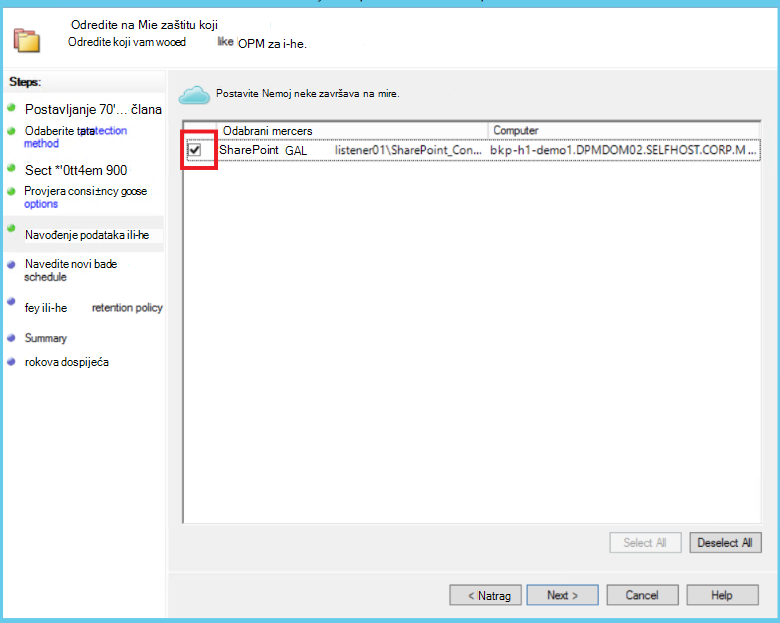

<properties
    pageTitle="Zaštita poslužitelja DPM/Azure sigurnosne kopije farme sustava SharePoint za Azure | Microsoft Azure"
    description="Ovaj članak sadrži pregled zaštita poslužitelja DPM/Azure sigurnosne kopije farme sustava SharePoint za Azure"
    services="backup"
    documentationCenter=""
    authors="adigan"
    manager="Nkolli1"
    editor=""/>

<tags
    ms.service="backup"
    ms.workload="storage-backup-recovery"
    ms.tgt_pltfrm="na"
    ms.devlang="na"
    ms.topic="article"
    ms.date="09/29/2016"
    ms.author="adigan;giridham;jimpark;trinadhk;markgal"/>

# Stvaranje sigurnosne kopije farmi sustava SharePoint za Azure
Koje se sigurnosne kopije farmi sustava SharePoint Microsoft Azure pomoću sustava centra podataka zaštitu Manager (DPM) u mnogo na isti način kao sigurnosnu kopiju drugih izvora podataka. Azure sigurnosne kopije pruža fleksibilnost u raspored sigurnosnog kopiranja da biste stvorili svakodnevno, tjedno, mjesečno ili godišnje sigurnosne kopije točke te vam nudi mogućnosti pravilnika o zadržavanju za različite sigurnosne kopije točke. DPM pruža mogućnost za spremanje kopije na lokalnom disku za brzi oporavak vrijeme ciljevi (RTO), a da biste pohranili primjeraka Azure za najekonomičniji, Dugoročne zadržavanja.

## SharePoint podržane verzije i povezane scenariji za zaštitu
Azure sigurnosne kopije za DPM podržava sljedeće scenarije:

| Radno opterećenje | Verzija | Implementacija sustava SharePoint | Vrsta DPM implementacije | DPM - sustava centra 2012 R2 | Zaštita i oporavak |
| -------- | ------- | --------------------- | ------------------- | --------------------------- | ----------------------- |
| SharePoint | SharePoint 2013, sustava SharePoint 2010, SharePoint 2007 SharePoint 3.0 | SharePoint u uveden kao fizičkim poslužitelja ili Hyper-V/VMware virtualnog računala   --------------   SQL AlwaysOn | Fizička poslužitelju ili na lokalnim Hyper-V virtualnog računala | Podržava sigurnosnu kopiju za Azure od 5 Kumulativno ažuriranje | Zaštita mogućnosti za oporavak farme sustava SharePoint: oporavak farmi, baze podataka i datoteke ili stavke popisa s diska oporavak točke.  Oporavak farmi i baze podataka iz Azure oporavak točke. |

## Prije početka
Morate potvrditi sigurnosne kopije farme sustava SharePoint za Azure na nekoliko stvari.

### Preduvjeti
Prije nego što nastavite, provjerite je li ispunjenim sve [preduvjeti za korištenje sustava Microsoft Azure Backup](backup-azure-dpm-introduction.md#prerequisites) radi zaštite radnih opterećenja. Sadrže neke zadatke za preduvjeti: Stvaranje sigurnosne kopije sigurnog, preuzimanju vjerodajnica sigurnog, instalirajte Azure Agent za sigurnosne kopije i morate registrirati DPM/Azure poslužitelj za sigurnosne kopije na sigurnog.

### Agent za DPM
Agent za DPM mora biti instaliran na poslužitelju sa sustavom SharePoint, poslužiteljima sa sustavom SQL Server i sve poslužitelje koji su dio farme sustava SharePoint. Dodatne informacije o postavljanju agent za zaštitu potražite u članku [Instalacijski program Agent za zaštitu](https://technet.microsoft.com/library/hh758034(v=sc.12).aspx).  Jednu iznimku je agenta instalirati samo na poslužitelju sučelja (WFE) Jednostruko web-mjesto. DPM mora agent na jednom poslužitelju WFE samo da bi služio kao točku unosa za zaštitu.

### Farme sustava SharePoint
Za svaku milijuna 10 stavki na farmi poslužitelja mora imati najmanje 2 GB prostora na glasnoće na kojem se nalazi mapa DPM. Taj prostor potreban je za generiranje kataloga. Za DPM da biste oporavili određene stavke (zbirke web-mjesta, web-mjesta, popisa, biblioteka dokumenata, mapa, pojedinačnih dokumenata i stavki popisa) kataloga generacije stvara popis URL-ovi koje se nalaze u svakom baze podataka sadržaja. U oknu koje se mogu vratiti stavke u područje zadatka **oporavak** DPM administratorskoj konzoli možete vidjeti na popisu URL-ova.

### SQL Server
DPM se izvodi kao račun LocalSystem. Da biste sigurnosnu kopiju baze podataka sustava SQL Server, DPM mora sustava ovlasti za taj račun za poslužitelj sa sustavom SQL Server. Postavite NT AUTHORITY\SYSTEM na *sustava* na poslužitelju na kojem se izvodi SQL Server prije sigurnosno kopiranje.

Ako je farme sustava SharePoint baze podataka SQL Server konfiguriranih pomoću pseudonima SQL Server, instalirajte klijentske komponente SQL Server na pristupnom web-poslužitelju koji ćete zaštititi DPM.

### SharePoint Server
Dok performanse ovisi o mnogo je čimbenika kao što su veličina farme sustava SharePoint, kao opće smjernice jednog DPM poslužitelja možete zaštititi farmi sustava SharePoint 25 TB.

### Kumulativno ažuriranje DPM 5
Da biste započeli zaštite farme sustava SharePoint za Azure, morate instalirati DPM zbirna 5 ili noviji. Kumulativno ažuriranje 5 omogućuje zaštitu farme sustava SharePoint za Azure ako na farmi poslužitelja nije konfiguriran pomoću SQL AlwaysOn.
Dodatne informacije potražite u članku na blogu objavu koja predstavlja [DPM Update Rollup 5]( http://blogs.technet.com/b/dpm/archive/2015/02/11/update-rollup-5-for-system-center-2012-r2-data-protection-manager-is-now-available.aspx)

### Što nije podržano
- DPM koji štiti farme sustava SharePoint ne štite indeksa pretraživanja ili baza podataka servisne aplikacije. Morat ćete zasebno konfiguriranje zaštitu te baze podataka.
- DPM ne nudi sigurnosnu kopiju baze podataka SQL Server sustava SharePoint koji se nalaze na skaliranje iz mrežna server (SOFS).

## Konfiguriranje zaštita sustava SharePoint
Prije korištenja DPM da biste zaštitili sustava SharePoint, morate konfigurirati servis vss program sustava SharePoint (WSS Writer servis) pomoću **ConfigureSharePoint.exe**.

**ConfigureSharePoint.exe** možete pronaći u mapi \bin [put instalacije DPM] na pristupnim web-poslužitelj. Ovaj alat sadrži agent za zaštitu s vjerodajnicama za farme sustava SharePoint. To se izvoditi na jednom WFE poslužitelju. Ako imate više WFE poslužitelja, odaberite samo jednu prilikom konfiguriranja grupu za zaštitu.

### Konfiguriranje usluge vss program sustava SharePoint
1. Na poslužitelju WFE naredbeni redak, idite na \bin\ [mjesto instalacije DPM]
2. Unesite ConfigureSharePoint - EnableSharePointProtection.
3. Unesite vjerodajnice administratora farme. Ovaj račun mora biti član lokalne grupe administratora na poslužitelju WFE. Ako administrator farme nije lokalni administrator dati sljedeće dozvole na poslužitelju WFE:
  - Dodijelite u WSS_Admin_WPG grupi Potpuna kontrola u mapu DPM (% Program Files%\Microsoft podataka zaštitu Manager\DPM).
  - Dozvolite pristup WSS_Admin_WPG grupe čitanje ključa registra DPM (HKEY_LOCAL_MACHINE\SOFTWARE\Microsoft\Microsoft Upravitelj zaštite podataka).

>[AZURE.NOTE] Morat ćete ponovno pokrenite ConfigureSharePoint.exe kad god promjene u administratorske vjerodajnice farme sustava SharePoint.

## Stvaranje sigurnosne kopije farmi sustava SharePoint pomoću DPM
Nakon što ste konfigurirali DPM i farme sustava SharePoint kao što je prethodno opisano, sustava SharePoint možete zaštićen DPM.

### Da biste zaštitili farme sustava SharePoint
1. Na kartici **Zaštita** DPM administratorskoj konzoli kliknite **Novo**.
    

2. Na stranici **Odabir vrste grupi zaštita** čarobnjaka za **Stvaranje nove grupe za zaštitu** odaberite **poslužitelje**, a zatim kliknite **Dalje**.

    

3. Na zaslonu **Odaberite članove grupe** , odaberite potvrdni okvir za poslužitelj sustava SharePoint koje želite zaštititi, a zatim kliknite **Dalje**.

    

    >[AZURE.NOTE] Uz instaliran agent DPM možete vidjeti poslužitelja u čarobnjaku. DPM prikazuje i njenu strukturu. Jer ste pokrenuli ConfigureSharePoint.exe, DPM komunicira s servis vss program sustava SharePoint i njegov odgovarajuću SQL Server i prepoznaje struktura farme sustava SharePoint, pridružene baze podataka sadržaja i sve odgovarajuće stavke.

4. Na stranici **Odaberite način za zaštitu podataka** unesite naziv **Grupe zaštitu**i odaberite željeni *metoda zaštite*. Kliknite **Dalje**.

    

    >[AZURE.NOTE] Metoda zaštite diska pomaže da bi odgovarao kratki ciljevi za oporavak vremena. Azure je programa cilj najekonomičniji, Dugoročne zaštite u usporedbi s vrpce. Dodatne informacije potražite u članku [Korištenje sigurnosne kopije Azure da biste zamijenili infrastruktura za vrpcu](https://azure.microsoft.com/documentation/articles/backup-azure-backup-cloud-as-tape/)

5. Na stranici **Određivanje ciljeva Short-Term** odaberite željeni **raspon zadržavanja** i odredite kada želite da sigurnosno kopiranje obavlja.

    

    >[AZURE.NOTE] Budući da oporavak najčešće potrebni za podatke koji su manji od pet dana, ne možemo odabrali raspon zadržavanja pet dana na disku i ensured da sigurnosno kopiranje događa tijekom koje nisu radnog vremena, u ovom primjeru.

6. Pregled prostora za pohranu skup prostora na disku dodijeljenog grupi Zaštita, a zatim kliknite **Dalje**.

7. Za svaku grupu zaštitu DPM dodjeljuje prostora za pohranu i upravljanje replike. U ovom trenutku DPM morate stvoriti kopiju odabranih podataka. Odaberite kako i kada želite replike stvorili, a zatim kliknite **Dalje**.

    

    >[AZURE.NOTE] Da biste provjerili je li mrežni promet ne effected, odaberite vrijeme izvan radnog vremena.

8. DPM osigurava cjelovitosti podataka pomoću provjere dosljednosti na replike. Dvije su dostupne mogućnosti. Možete odrediti raspored za pokretanje provjere dosljednosti ili DPM možete pokrenuti Provjera dosljednosti automatski na replike kad god postaje koje nisu usklađene. Odaberite željenu mogućnost, a zatim kliknite **Dalje**.

    

9. Na stranici **Određivanje Online podaci o zaštiti** odaberite farme sustava SharePoint koje želite zaštititi, a zatim kliknite **Dalje**.

    

10. Na stranici **Određivanje Online raspored sigurnosno kopiranje** odaberite željeni raspored, a zatim kliknite **Dalje**.

    

    >[AZURE.NOTE] DPM daje najviše dva dnevnih sigurnosne kopije Azure različite vrijeme. Azure sigurnosnog kopiranja možete upravljati i iznos WAN propusnost koje je moguće koristiti sigurnosnih kopija u Vršna i sati slabog opterećenja Budući pomoću [Azure sigurnosne kopije mreže ograničavanje](https://azure.microsoft.com/en-in/documentation/articles/backup-configure-vault/#enable-network-throttling).

11. Ovisno o sigurnosne kopije raspored koji ste odabrali, na stranici **Određivanje Online pravilnika o zadržavanju** odaberite pravila zadržavanja za dnevno, tjedno, mjesečno i godišnje sigurnosne kopije točke.

    

    >[AZURE.NOTE] DPM koristi shemu zadržavanja grandfather očeva sin u kojem možete odabrati neko drugo pravilo zadržavanja za različite sigurnosne kopije točke.

12. Slično kao na disku, do početne reference točke replike treba stvoriti u Azure. Odaberite željenu mogućnost da biste stvorili početni sigurnosne kopije za Azure, a zatim kliknite **Dalje**.

    

13. Pregledajte postavke odabrane na stranici **Sažetak** , a zatim kliknite **Stvori grupu**. Vidjet ćete poruku za uspjeh nakon stvaranja grupe zaštitu.

    

## Pomoću DPM vratiti stavku sustava SharePoint s diska
U sljedećem primjeru *stavka Obnova sustava SharePoint* slučajno izbriše i potrebno je moguće oporaviti.

1. Otvorite **DPM administratorskoj konzoli**. Na kartici **Zaštita** prikazane su sve farmama sustava SharePoint koji su zaštićeni po DPM.

    

2. Da biste započeli da biste vratili stavku, odaberite karticu **oporavak** .

    

3. SharePoint možete potražiti *stavka Obnova sustava SharePoint* pomoću pretraživanja utemeljen na zamjenskih znakova u rasponu oporavak točke.

    

4. Odaberite odgovarajući oporavak točke u rezultatima pretraživanja, desnom tipkom miša kliknite stavku, a zatim odaberite **oporavak**.

5. Pregledali različite točke oporavak i odabir baze podataka ili stavke da biste oporavili. Odaberite **Datum > oporavku**, a zatim odaberite ispravno **baze podataka > farme sustava SharePoint > točka vraćanja > stavke**.

    

6. Desnom tipkom miša kliknite stavku, a zatim odaberite **oporavak** da biste otvorili **Čarobnjak za oporavak**. Kliknite **Dalje**.

    

7. Odaberite vrstu oporavak koju želite izvesti, a zatim kliknite **Dalje**.

    

    >[AZURE.NOTE] Odabir **oporavak izvorno** u primjeru oporavlja stavku izvornog web-mjesta sustava SharePoint.

8. Odaberite **Oporavak postupak** koji želite koristiti.
    - Ako farme sustava SharePoint nije promijenio te je isti kao točka vraćanja koje se vraćaju, odaberite **oporavak bez korištenja oporavak farme** .
    - Ako farme sustava SharePoint promijenjena nakon stvaranja točke oporavak, odaberite **oporavak pomoću oporavak farme** .

    

9. Pripremna mjesto instancu sustava SQL Server da biste privremeno vratili bazu podataka i ponuditi pripremna zajedničko korištenje datoteka na poslužitelju DPM i poslužitelja sa sustavom SharePoint da biste vratili stavku.

    

    DPM pridružuje baze podataka sadržaja koji se nalazi stavka sustava SharePoint da biste privremeno instancu sustava SQL Server. Iz baze podataka sadržaja poslužitelj DPM oporavlja stavke i stavlja pripremna mjesto datoteke na poslužitelju DPM. Oporavljene stavke koja se nalazi na pripremna mjesto poslužitelja DPM sada mora biti izvezeni pripremna mjesto na farmi sustava SharePoint.

    

10. Odaberite **Mogućnosti za oporavak navedite**i primijeniti sigurnosne postavke farme sustava SharePoint ili primijenite sigurnosne postavke točka vraćanja. Kliknite **Dalje**.

    

    >[AZURE.NOTE] Možete odabrati throttle korištenja propusnosti mreže. Time se smanjuje utjecaj na poslužitelj za proizvodnju tijekom radnog vremena.

11. Pregledajte sažetak informacija, a zatim kliknite **Oporavi** da biste započeli oporavak datoteke.

    

12. Sada odaberite karticu **praćenja** **DPM administratorskoj konzoli** za prikaz **statusa** oporavka.

    

    >[AZURE.NOTE] Datoteka je sada obnovljena. Web-mjesta sustava SharePoint da biste provjerili vraćene datoteke možete osvježiti.

## Vraćanje baze podataka sustava SharePoint s Azure pomoću DPM

1. Da biste oporavili baze podataka sadržaja sustava SharePoint, pregledali različite oporavak točaka (kao što je prikazano na prethodno) pa odaberite točka vraćanja koju želite vratiti.

    

2. Dvokliknite točku oporavka sustava SharePoint da biste prikazali dostupne podatke kataloga sustava SharePoint.

    > [AZURE.NOTE] Jer je za Dugoročne zadržavanja u Azure knjiga zaštićena farme sustava SharePoint, bez kataloga informacije (metapodaci) dostupna je na poslužitelju DPM. Zbog toga kad god točke u vrijeme sustava SharePoint baze podataka sadržaja potrebno je moguće oporaviti, morate ponovno kataloga farme sustava SharePoint.

3. Kliknite **ponovno kataloga**.

    

    Otvorit će se prozor stanja **Recatalog oblaka** .

    

    Nakon što se Katalogiziranje završi, status mijenja se u *uspješno*. Kliknite **Zatvori**.

    

4. Kliknite objekt sustava SharePoint koji se prikazuju na kartici DPM **oporavak** da biste dobili strukture baze podataka sadržaja. Desnom tipkom miša kliknite stavku, a zatim **Oporavi**.

    

5. Sada, slijedite [korake za oporavak ranije u ovom članku](#restore-a-sharepoint-item-from-disk-using-dpm) da biste oporavili baze podataka sadržaja sustava SharePoint s diska.

## Najčešća pitanja
P: koje verzije DPM podržavaju 2014 SQL Server i SQL 2012 (SP2)? 
A: DPM 2012 R2 sa 4 Kumulativno ažuriranje podržava oba.

P: mogu li vratiti stavku sustava SharePoint na izvorno mjesto ako SharePoint je konfiguriran pomoću SQL AlwaysOn (zaštitu na disku)? 
A: da, stavku možete oporaviti na izvorno web-mjesto sustava SharePoint.

P: mogu li vratiti bazom podataka sustava SharePoint na izvorno mjesto ako sustava SharePoint nije konfiguriran pomoću SQL AlwaysOn? 
A: jer su baze podataka sustava SharePoint konfigurirane u SQL AlwaysOn, oni ne mogu mijenjati osim u slučaju da je uklonjena grupe dostupnosti. Zbog toga DPM nije moguće vratiti bazu podataka na izvorno mjesto. Možete oporaviti baze podataka SQL Server na drugu instancu sustava SQL Server.

## Daljnji koraci
- Dodatne informacije o DPM Zaštita SharePoint – pogledajte [Videozapis niz - DPM zaštita sustava SharePoint](http://channel9.msdn.com/Series/Azure-Backup/Microsoft-SCDPM-Protection-of-SharePoint-1-of-2-How-to-create-a-SharePoint-Protection-Group)
- Pregledajte [Napomene za 2012 centar sustava – Upravitelj za zaštitu podataka](https://technet.microsoft.com/library/jj860415.aspx)
- Pregledajte [Napomene za zaštitu Upravitelj podataka u sustavu centar 2012 SP1](https://technet.microsoft.com/library/jj860394.aspx)
