<properties
    pageTitle="Azure sigurnosna kopija radnih opterećenja sustava SQL Server pomoću DPM | Microsoft Azure"
    description="Uvod u stvaranje sigurnosne kopije baze podataka SQL Server pomoću servisa Azure sigurnosnog kopiranja"
    services="backup"
    documentationCenter=""
    authors="adigan"
    manager="Nkolli1"
    editor=""/>

<tags
    ms.service="backup"
    ms.workload="storage-backup-recovery"
    ms.tgt_pltfrm="na"
    ms.devlang="na"
    ms.topic="article"
    ms.date="09/27/2016"
    ms.author="adigan;giridham; jimpark;markgal;trinadhk"/>

# Azure sigurnosna kopija radnih opterećenja sustava SQL Server pomoću DPM

U ovom se članku će vas voditi kroz navedeni koraci za konfiguraciju za sigurnosnu kopiju baze podataka SQL Server pomoću Azure sigurnosne kopije.

Da biste sigurnosnu kopiju baze podataka SQL Server Azure, potreban vam je račun za Azure. Ako nemate račun, možete stvoriti besplatnu probnu računa u samo nekoliko minuta. Detalje potražite u članku [Azure besplatnu probnu verziju](https://azure.microsoft.com/pricing/free-trial/).

Upravljanje sigurnosnu kopiju baze podataka SQL Server Azure i oporavak iz Azure obuhvaća tri koraka:

1. Stvaranje sigurnosne kopije pravila za zaštitu baze podataka SQL Server za Azure.
2. Stvaranje sigurnosne kopije na zahtjev za Azure.
3. Oporavak bazu podataka iz Azure.

## Prije početka
Prije početka, provjerite je li sve [preduvjete](../backup-azure-dpm-introduction.md#prerequisites) za pomoću programa Microsoft Azure Backup radi zaštite radnih opterećenja zadovolje. Preduvjete pokrivaju zadatke kao što su: Stvaranje sigurnosne kopije sigurnog, preuzimanje sigurnog vjerodajnice, instalaciju Azure Agent za sigurnosne kopije i Registracija poslužitelja s na zbirke ključeva.

## Stvaranje sigurnosne kopije pravila za zaštitu baze podataka SQL Server za Azure

1. Na poslužitelju DPM kliknite **Zaštita** radnog prostora.

2. Na vrpci alata kliknite **Novo** da biste stvorili novu grupu za zaštitu.

    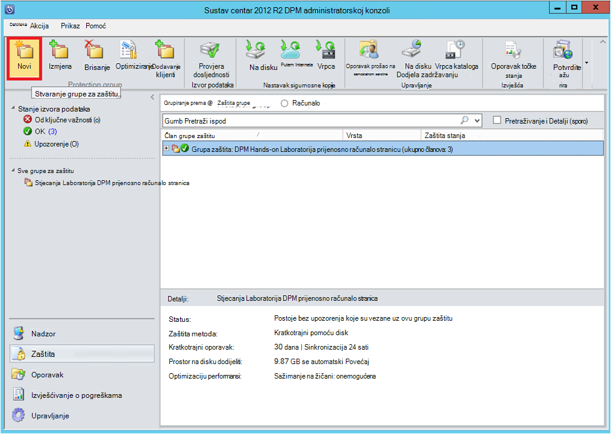

3. DPM prikazuje početni zaslon s navedene upute o stvaranju **Grupe za zaštitu**. Kliknite **Dalje**.

4. Odaberite **poslužitelje**.

    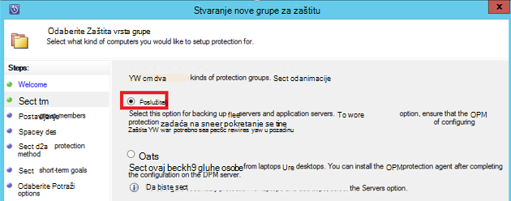

5. Proširite SQL Server računalu gdje su prisutne baze podataka za sigurnosno kopiranje. DPM prikazuje različite izvore podataka koje se sigurnosno s njega. Proširite **Sve SQL dionice** i odaberite baze podataka (u ovom slučaju ne možemo odabrano ReportServer$ MSDPM2012 i ReportServer$ MSDPM2012TempDB) za sigurnosno kopiranje. Kliknite **Dalje**.

    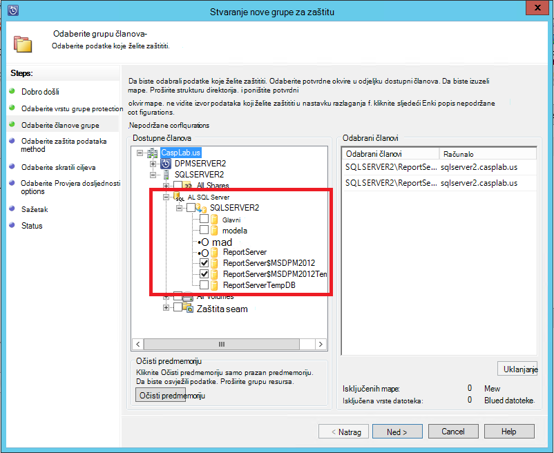

6. Navedite naziv za grupu za zaštitu, a zatim odaberite potvrdni okvir **želim online Protection** .

    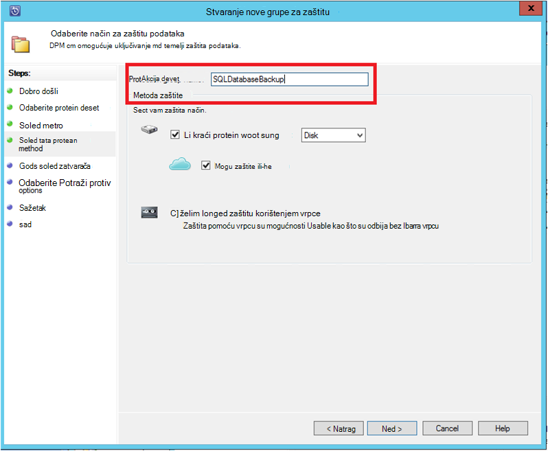

7. Na zaslonu **Navedite ciljeva Short-Term** obuhvaćaju ulaza potrebne za stvaranje sigurnosne kopije upućuje na disku.

    Ovdje možemo vidjeti da **raspon zadržavanja** postavljen na *5 dana*, **učestalost sinkronizacije** postavljen na jednom svakih *15 minuta* koji je učestalost uzeti sigurnosnu kopiju. **Express potpuno sigurnosno kopiranje** postavljen je na *8:00 P.M*.

    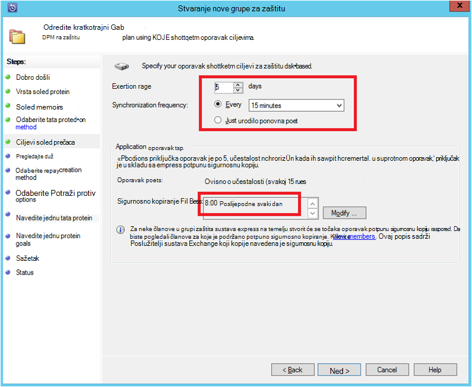

    >[AZURE.NOTE] Pri 8:00 PM (prema unos zaslona) točku sigurnosne kopije je stvorio svakodnevno prijenos podataka koji je izmijenjena iz sigurnosne kopije točke 8:00 PM za prethodni dan. To se naziva **Express potpuno sigurnosno kopiranje**. Tijekom transakcije sinkroniziraju se zapisnici svakih 15 minuta, ako je potrebno da biste vratili bazu podataka na 9:00 PM – a zatim točke stvorio replaying zapisnike posljednjeg express potpunu sigurnosnu kopiju točku (8 pm u ovom slučaju).

8. Kliknite **Dalje**

    DPM prikazuje cjelokupni dostupan prostor za pohranu i potencijalne Upotreba prostora na disku.

    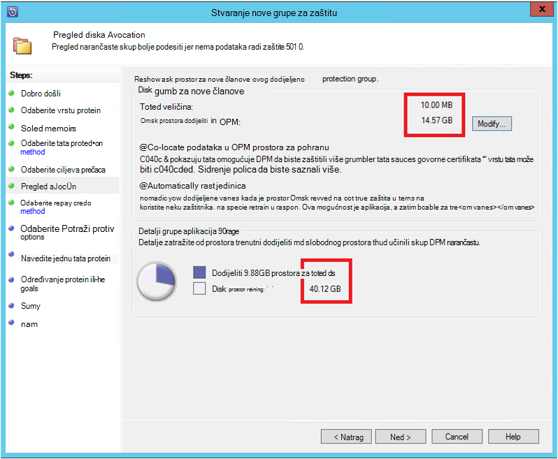

    Prema zadanim postavkama DPM stvara jedna jedinica po izvoru podataka (baza podataka sustava SQL Server) koji se koristi za početne sigurnosnu kopiju. Koristite ovaj pristup, logičke Disk Manager (LDM) ograničenjima DPM zaštitu izvorima 300 podataka (baza podataka sustava SQL Server). Da biste zaobišli to ograničenje, odaberite na **Suradnja pronalaženje podataka u DPM prostora za pohranu**, mogućnost. Ako koristite tu mogućnost, DPM koristi jedna jedinica za više izvora podataka, koji omogućuje DPM da biste zaštitili do 2000 baze podataka SQL.

    Ako je odabrana mogućnost **automatski Povećaj jedinice** , DPM računa možete povećana sigurnosne kopije jedinice kao rastom podataka radnog. Ako se **automatski Povećaj jedinice** mogućnost nije odabrana, DPM ograničenjima prostora za pohranu sigurnosne kopije za izvore podataka u grupi zaštita.

9. Administratori imaju odabir prijenos ovu početne sigurnosnu kopiju ručno (izvan mreže) da biste izbjegli propusnosti zagušenja ili putem mreže. Također možete konfigurirati vrijeme u kojem se može dogoditi početne prijenos. Kliknite **Dalje**.

    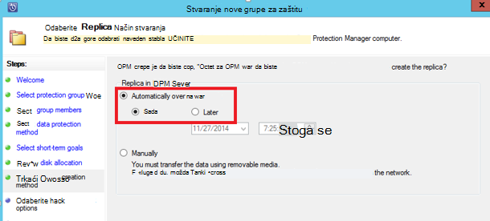

    Početna sigurnosne kopije potreban je prijenos izvora cijelu podataka (baza podataka sustava SQL Server) iz radnog server (SQL Server stroj) DPM poslužitelja. Ove podatke možda velike i prijenos podataka putem mreže može biti dulji od propusnosti. Zbog toga administratori možete odabrati prijenos početne sigurnosne kopije: **ručno** (pomoću izmjenjivi medij) da biste izbjegli propusnosti zagušenja ili **automatski putem mreže** (u određeno vrijeme).

    Nakon dovršetka početne sigurnosnog kopiranja, ostatak sigurnosnih kopija su rastuće sigurnosnih kopija na početni sigurnosnu kopiju. Rastuća sigurnosne kopije obično small i jednostavno prenijeti putem mreže.

10. Odaberite kada želite da se provjera dosljednosti da biste pokrenuli i kliknite **Dalje**.

    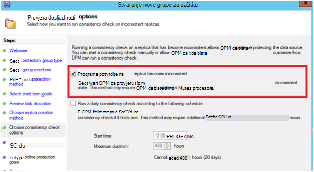

    DPM možete izvesti u dosljednosti potvrdite da potvrdite integritet točke sigurnosne kopije. Izračunava kontrolni zbroj datoteku sigurnosne kopije na poslužitelj proizvodnje (SQL Server stroj u ovom scenariju) i sigurnosno kopirane podatke te datoteke na servisu DPM. U slučaju sukoba, pretpostavlja se da je datoteka sigurnosne kopije na DPM oštećena. DPM rectifies sigurnosno kopirane podatke slanjem blokove koje odgovaraju na pogrešni. Provjera dosljednosti je operacije na performanse ćete morati usko, administratori imaju mogućnost raspored Provjera dosljednosti ili automatskog pokretanja.

11. Da biste odredili online protection na datasources, odaberite baze podataka da bi biti zaštićene za Azure, a zatim kliknite **Dalje**.

    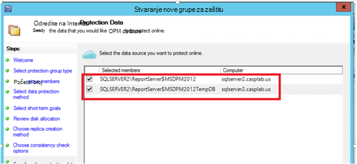

12. Administratori mogu odabrati sigurnosne kopije rasporede i pravilnika o zadržavanju koji odgovaraju pravila svoje tvrtke ili ustanove.

    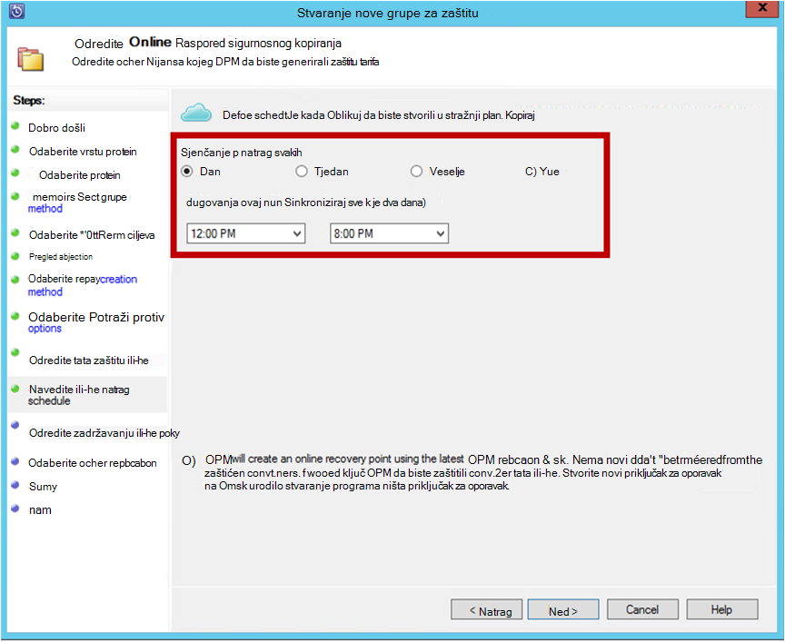

    U ovom primjeru sigurnosne kopije uzimaju se jednom dnevno na 12:00 Prikazano i Poslijepodne 8 (donjem dijelu zaslona)

    >[AZURE.NOTE] Je dobro imati nekoliko kratkotrajni oporavak upućuje na disku za brzi oporavak. Ove činjenice oporavak se koriste za "radu oporavak". Azure služi kao mjesto dobar teren s veći SLA i zajamčena dostupnost.

    **Najbolja praksa**: Provjerite je li nakon dovršetka sigurnosnih kopija na lokalnom disku pomoću DPM zakazani Azure sigurnosne kopije. Time se omogućuje zadnje sigurnosne kopije na disku za kopiranje Azure.

13. Odaberite raspored pravila zadržavanja. Detalje o funkcioniranje pravila zadržavanja navedeni su na [Sigurnosnu kopiju Azure koristite da biste zamijenili svoj članak infrastrukture vrpcu](backup-azure-backup-cloud-as-tape.md).

    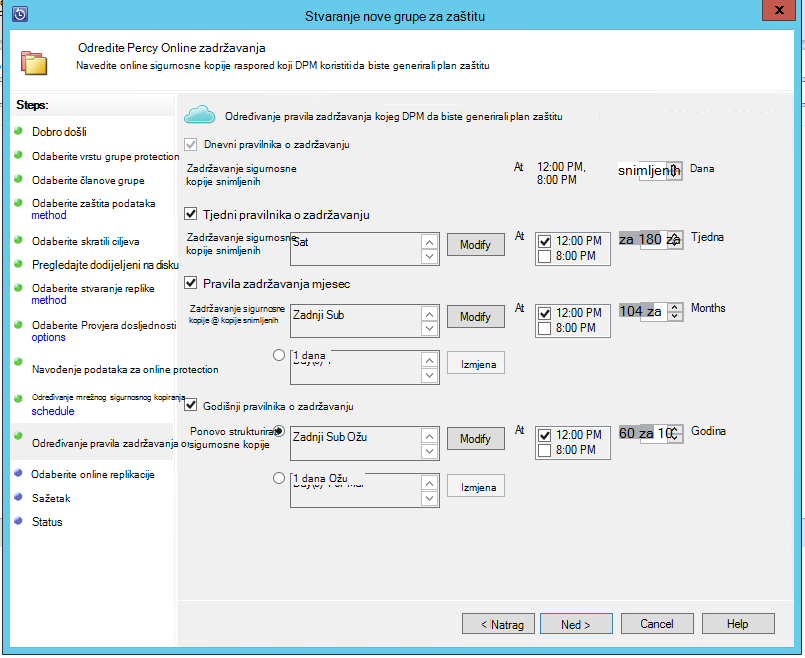

    U ovom primjeru:

    - Sigurnosno kopiranje uzimaju se jednom dnevno na 12:00 Prikazano i Poslijepodne 8 (donjem dijelu zaslona) te se zadržavaju 180 dana.
    - Sigurnosna kopija na subote u 12:00 poslije podne. zadržava se za 104 tjedna
    - Sigurnosna kopija na zadnji subote u 12:00 poslije podne. zadržava se 60 mjeseca
    - Sigurnosna kopija na zadnji subota ožujak pri 12:00 poslije podne. zadržava se za 10 godina

14. Kliknite **Dalje** , a zatim odaberite odgovarajuću mogućnost za prijenos početne sigurnosne kopije Azure. Možete odabrati da se **automatski putem mreže** ili **Izvanmrežno sigurnosnu kopiju**.

    - **Automatski putem mreže** prenosi sigurnosne kopije podataka Azure po raspored za sigurnosno kopiranje.
    - Objašnjenje funkcioniranje **Izvanmrežno sigurnosne kopije** na [izvanmrežno sigurnosne kopije tijeka rada koji se sigurnosno kopiranje Azure](backup-azure-backup-import-export.md).

    Odaberite odgovarajuću prijenos mehanizam početne sigurnosnu kopiju poslati Azure, a zatim kliknite **Dalje**.

15. Nakon što ste pregledali detalje pravila na zaslonu **Sažetak** , kliknite gumb **Stvori grupu** za dovršavanje tijeka rada. Možete kliknite gumb **Zatvori** i praćenje napretka posla u radnom prostoru za nadzor.

    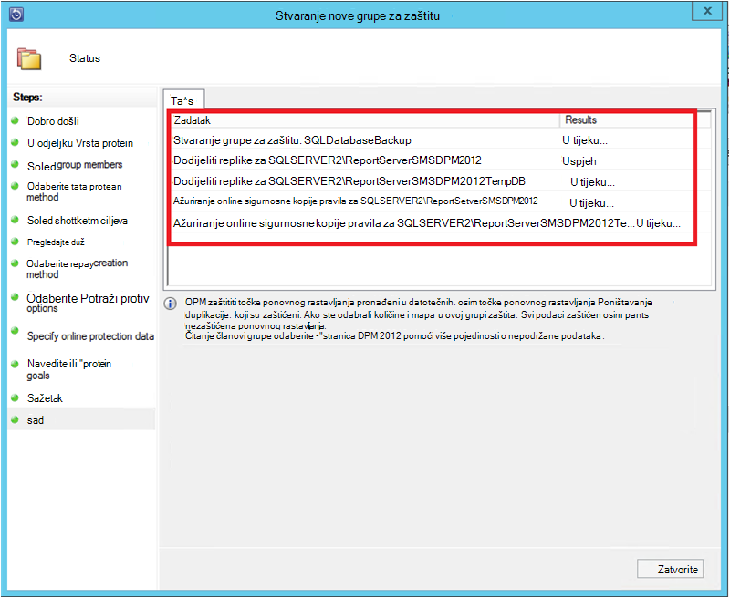

## Na zahtjev sigurnosnu kopiju baze podataka SQL Server
Dok se pomoću prethodnih koraka stvara sigurnosnu kopiju pravila, "oporavak točku" stvara se samo kada se pojavi prvo sigurnosno kopiranje. Umjesto čekanja za raspored da biste pokrenuli korake u nastavku okidača stvaranja na oporavak ručno pokažite.

1. Pričekajte dok se ne za zaštitu grupe status prikazana vrijednost **u redu** za bazu podataka prije stvaranja točke za oporavak.

    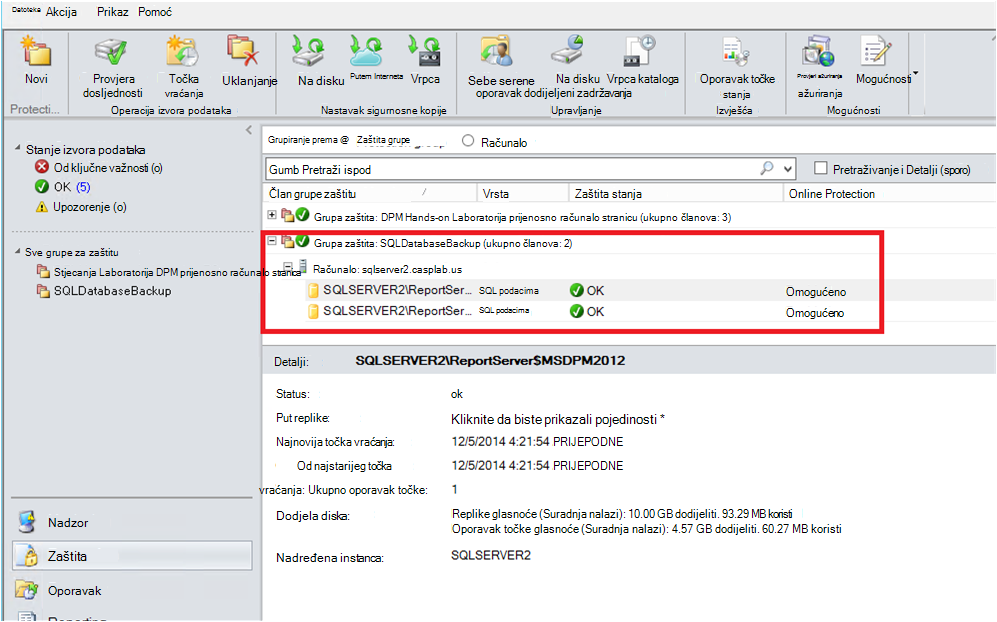

2. Desnom tipkom miša kliknite bazu podataka, a zatim odaberite **Stvori točka vraćanja**.

    

3. Na padajućem izborniku odaberite **Online Protection** i kliknite **u redu**. Pokreće se stvaranje točka vraćanja na servisu Azure.

    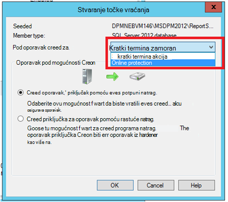

4. Možete pogledati tijek zadatka u radnom prostoru **praćenja** nalaze u tijeku zadatka kao što je onaj koji se na sljedeći slici.

    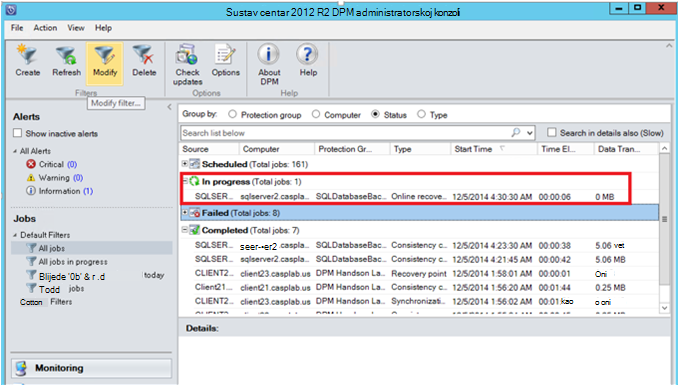

## Oporavak baze podataka SQL Server Azure
Sljedeći koraci moraju se može oporaviti zaštićeni entitet (baza podataka sustava SQL Server) iz Azure.

1. Otvorite DPM server Management Console. Dođite do gdje možete vidjeti poslužitelje sigurnosnu kopiju DPM prostor za **oporavak** . Pronađite potrebne baze podataka (u ovom slučaju ReportServer$ MSDPM2012). Odaberite vrijeme **oporavak iz** koji završava s **Online**.

    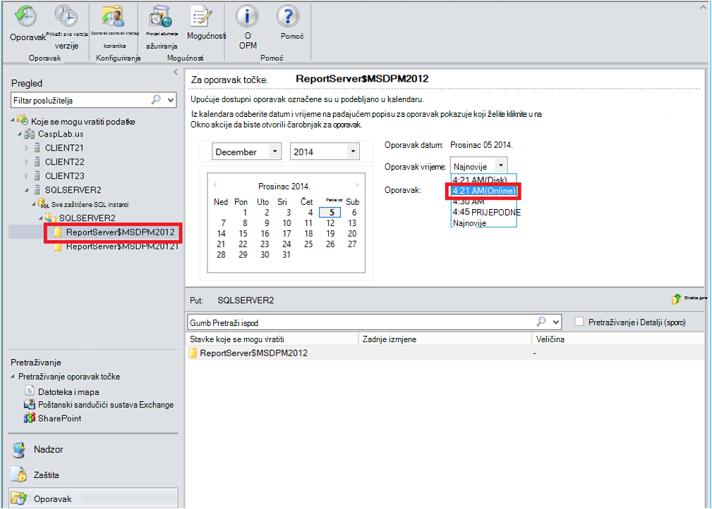

2. Desnom tipkom miša kliknite naziv baze podataka, a zatim kliknite **Oporavi**.

    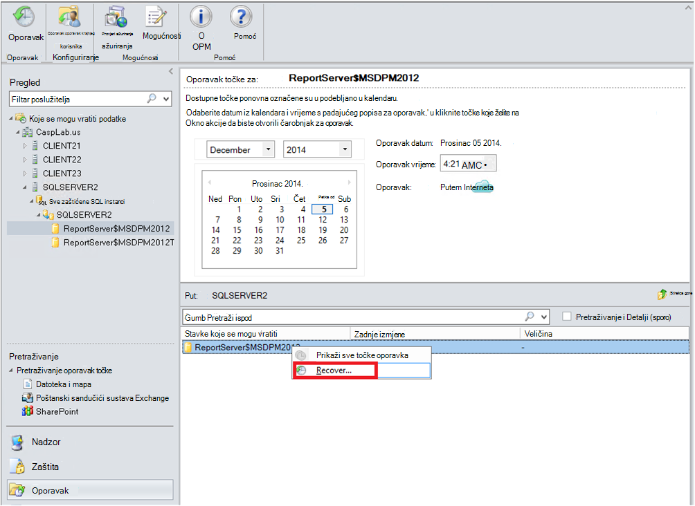

3. DPM prikazuje detalje o točka vraćanja. Kliknite **Dalje**. Da biste prebrisali bazu podataka, odaberite vrstu oporavak **vratiti izvorne instancu sustava SQL Server**. Kliknite **Dalje**.

    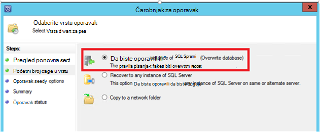

    U ovom primjeru DPM omogućuje oporavak baze podataka na drugu instancu sustava SQL Server ili samostalnu mrežnu mapu.

4. Na zaslonu **Mogućnosti odredite oporavka** možete odabrati mogućnosti za oporavak kao što su Ograničavanje korištenja propusnosti mreže da biste throttle propusnosti koristi oporavak. Kliknite **Dalje**.

5. Na zaslonu **Sažetak** vidite sve navedene dosad konfiguracije za oporavak. Kliknite **Oporavi**.

    Status oporavak prikazuje obnavljaju bazu podataka. Kliknite **Zatvori** da biste zatvorili čarobnjak i prikaz tijeka u radnom prostoru za **nadzor** .

    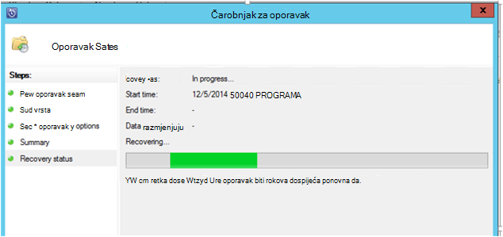

    Nakon dovršetka oporavka vraćenu bazu podataka je aplikacija dosljedni.

### Sljedeće korake:

• [Azure sigurnosne kopije najčešća Pitanja](backup-azure-backup-faq.md)
