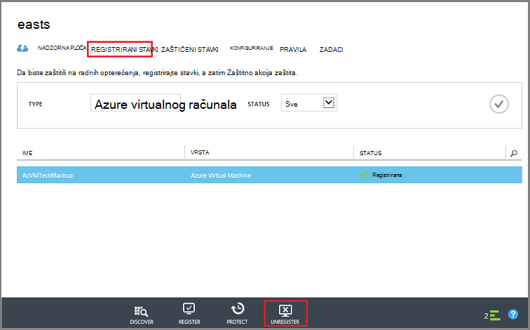
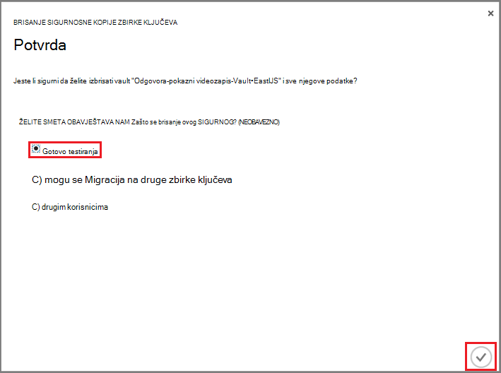

<properties
   pageTitle="Brisanje programa Azure sigurnosno kopiranje zbirke ključeva | Microsoft Azure"
   description="Kako izbrisati programa Azure sigurnosno kopiranje zbirke ključeva. Otklanjanje poteškoća Zašto nije moguće izbrisati sigurnosno kopiranje zbirke ključeva. "
   services="service-name"
   documentationCenter="dev-center-name"
   authors="markgalioto"
   manager="cfreeman"
   editor=""/>

<tags
   ms.service="backup"
   ms.devlang="na"
   ms.topic="article"
   ms.tgt_pltfrm="na"
   ms.workload="storage-backup-recovery"
   ms.date="08/29/2016"
   ms.author="markgal;trinadhk"/>

# Brisanje programa Azure sigurnosno kopiranje zbirke ključeva

Servis za sigurnosno kopiranje Azure omogućuje dvije vrste sefovi - sigurnog sigurnosnu kopiju i sigurnog servise za oporavak. Sigurnosno kopiranje sigurnog bio prvi. Zatim oporavak servisa sigurnog isporučen za podršku prošireno implementacijama Voditelj resursa. Zbog proširene mogućnosti i ovisnosti informacije koje se moraju se pohraniti na sigurnog, brisanje oporavak servisa sigurnog možete čini teže nego što on mora biti.

|**Vrsta implementacije**|**Portal**|**Naziv zbirke ključeva**|
|--------------|----------|---------|
|Klasični|Klasični|Sigurnosno kopiranje zbirke ključeva|
|Voditelj resursa|Azure|Oporavak servisa sigurnog|

> [AZURE.NOTE] Sigurnosno kopiranje sefovi nije moguće zaštititi resursima implementiran rješenja. Međutim, oporavak servisa sigurnog možete koristiti da biste zaštitili classically distribuiranih poslužitelje te VMs.  

U ovom se članku koristimo termina, zbirke ključeva za upućivanje na obrascu generički sigurnog sigurnosno kopiranje ili oporavak servisa sigurnog. Koristimo formalno ime, sigurnosno kopiranje zbirke ključeva ili oporavak servisa sigurnog, kada je potrebno da biste razlikovali sefova.

## Brisanje oporavak servisa sigurnog

Brisanje oporavak servisa sigurnog je postupak one-step - *navedene u sigurnog ne sadrže nikakve resurse*. Da biste izbrisali oporavak servisa sigurnog, morate ukloniti ili izbrisati sve resursa u na sigurnog. Ako pokušate izbrisati sigurnog koja sadrži resurse se pogreška poput na sljedećoj slici.

  

Dok očistiti resurse iz na sigurnog klikom **ponovite** daje iste pogreške. Ako vam se zamrzne u fazi ovu poruku o pogrešci, kliknite **Odustani** i slijedite korake u nastavku da biste izbrisali resursa u oporavak servisa sigurnog.

### Uklanjanje stavke iz sigurnog zaštita u VM

Ako već imate oporavak servisa sigurnog otvorite, prijeđite na drugi korak.

1.  Otvorite portal sustava Azure pa na nadzornoj ploči otvorite zbirke ključeva koji želite izbrisati.

    Ako nemate oporavak servisa sigurnog prikvačiti na nadzornoj ploči na izborniku koncentrator kliknite **Više servise** , a na popisu resursi upišite **Servise za oporavak**. Kao što počnete pisati, filtri popisa koji se temelji na unos. Kliknite **sefovi servise za oporavak**.

      

    Prikazat će se popis sefovi servise za oporavak. Na popisu odaberite sigurnog koju želite izbrisati.

    

2. U prikazu sigurnog pogledajte u oknu **Essentials** . Da biste izbrisali na sigurnog, ne može bilo koje zaštićene stavke. Ako vam se prikazuje broj koji nije nula, u odjeljku **Sigurnosno kopiranje stavki** ili **poslužitelji za upravljanje sigurnosnu kopiju**, morate ukloniti te stavke prije brisanja na zbirke ključeva.

    

    VMs datoteka/mapa smatraju sigurnosnu kopiju stavke i nalaze se u području **Sigurnosno kopiranje stavki** u oknu Essentials. DPM poslužitelja nalazi se u području **Sigurnosno kopiranje poslužitelju za upravljanje** okna Essentials. **Stavke replicirati** odnose se na servis za oporavak Azure web-mjesta.

3. Da biste započeli uklanjanjem zaštićeni stavki u sigurnog, pronađite stavke u na zbirke ključeva. Na nadzornoj ploči sigurnog kliknite **Postavke**, a zatim **sigurnosno kopiranje stavke** da biste otvorili tu plohu.

    

    **Sigurnosno kopiranje stavki** plohu sadrži zasebna popisa, ovisno o vrsti stavke: virtualnim računalima sustava Azure ili datotečne mape (pogledajte sliku). Zadani popis vrsta stavke prikazano je virtualnim računalima sustava Azure. Da biste pogledali popis stavki mapa za datoteke na sigurnog, na padajućem izborniku odaberite **Mapa za datoteke** .

4. Prije nego što izbrišete neku stavku iz zbirke ključeva zaštita u VM, morate zaustaviti stavke sigurnosno kopiranje i brisanje točke podataka za oporavak. Za svaku stavku u sigurnog, slijedite ove korake:

    na. Na plohu **Sigurnosnu kopiju stavke** desnom tipkom miša kliknite stavku, a zatim na kontekstnom izborniku odaberite **Zaustavi sigurnosno kopiranje**.

    

    Otvorit će se plohu Zaustavi sigurnosnu kopiju.

    b. Na **Zaustavi sigurnosne kopije** plohu s izbornika **Odaberite mogućnost** odaberite **Brisanje sigurnosne kopije podataka** > upišite naziv stavke > i kliknite **Zaustavi sigurnosno kopiranje**.

      Upišite naziv stavke da biste potvrdili da želite izbrisati. Gumb **Zaustavi sigurnosno kopiranje** nije se aktivirati dok ne provjerite stavku da biste zaustavili. Ako ne vidite dijaloški okvir upišite naziv sigurnosne kopije stavke, ste odabrali mogućnost **Zadržati sigurnosne kopije podataka** .

    

      Po želji možete unijeti razloga zašto brisanja podataka i dodavanje komentara. Nakon što kliknete **Zaustavi sigurnosne kopije**, omogućuju posla brisanja da biste dovršili prije brisanja na sigurnog. Da biste provjerili zadatak dovršen, Provjera poruka Azure .  
   Nakon dovršetka posla, primit ćete poruku koja govori zaustavljena postupak sigurnosnog kopiranja i sigurnosne kopije podataka izbrisana za tu stavku.

    c. Nakon brisanja stavke na popisu, na izborniku **Sigurnosnu kopiju stavke** kliknite **Osvježi** da biste vidjeli ostale stavki u zbirke ključeva.

      

      Kada nema stavki na popisu, pomaknite se do okno **Essentials** u sigurnog plohu sigurnosnu kopiju. Bi trebalo postojati sve **stavke sigurnosne kopije**, **poslužitelji za upravljanje sigurnosno kopiranje**ili **Replicated stavki** na popisu. Ako stavke i dalje prikazuju na sigurnog, vratite se korak tri iznad i odaberite popis vrsta drugu stavku.  

5. Kada na alatnoj traci sigurnog nema više stavki, kliknite **Izbriši**.

    

6. Kada se od vas zatraži da biste potvrdili da želite izbrisati u sigurnog, kliknite **da**.

    Na sigurnog se briše i portalu vraća servisa izborniku **Novo** .

## Što ako mi prekinuli postupak sigurnosnog kopiranja, ali zadržavaju podatke?

Ako prekinuli postupak sigurnosnog kopiranja, no slučajno *zadržavaju* podatke, morate izbrisati sigurnosne kopije podataka da biste izbrisali na zbirke ključeva. Da biste izbrisali sigurnosne kopije podataka:

1. Na plohu **Sigurnosnu kopiju stavke** desnom tipkom miša kliknite stavku, a zatim na kontekstnom izborniku kliknite **Izbriši sigurnosne kopije podataka**.

    

    Otvorit će se plohu **Brisanje sigurnosne kopije podataka** .

2. Na plohu **Brisanje sigurnosne kopije podataka** upišite naziv stavke, a zatim kliknite **Izbriši**.

    

    Nakon što ste izbrisali podatke, idite na korak 4c iznad i nastavak postupka.

## Brisanje sigurnog koristi za zaštitu DPM poslužitelja

Prije brisanja sigurnog koristi za zaštitu DPM poslužitelj, očistite sve točke oporavka koje su stvorene, a unregister poslužitelja iz na zbirke ključeva.

Da biste izbrisali podatke povezane s grupom zaštite:

1. DPM administratorskoj konzoli, kliknite **zaštitu**, odaberite grupu za zaštitu, odaberite člana grupe za zaštitu i na vrpci alata kliknite **Ukloni**. Odaberite člana za gumb **Ukloni** da se prikazuje na vrpci alata. U ovom primjeru član koji je **dummyvm9**. Ako postoji više članova u grupi Zaštita, pritisnite i držite pritisnutu tipku Ctrl da biste odabrali više članova.

    

    Otvorit će se dijaloški okvir **Zaustavi zaštitu** .

2. U dijaloškom okviru **Prekini zaštitu** odaberite **Izbriši zaštićeni podataka**, a zatim kliknite **Zaustavi zaštitu**.

    

    Ne želite zadržati zaštićeni podataka jer je potrebno da biste očistili na sigurnog da biste ga izbrisali. Ovisno o tome koliko oporavak točke i koliko podaci u grupi Zaštita, možda će trebati bilo kojeg mjesta iz nekoliko sekundi da nekoliko minuta da biste izbrisali podatke. Dijaloški okvir **Prekini zaštitu** prikazuje status kada je zadatak dovršen.

    

3. Da biste nastavili postupak za sve članove u svim grupama za zaštitu.

    Morate ukloniti sve zaštićene podatke i zaštitu grupe.

4. Kada izbrišete sve članove iz grupe zaštitu, prebacite se na portal za Azure. Otvorite nadzornu ploču sigurnog pa provjerite da nema **Stavki sigurnosne kopije**, **poslužitelji za upravljanje sigurnosno kopiranje**ili **Replicated stavke**. Na alatnoj traci sigurnog kliknite **Izbriši**.

    

    Ako postoje registrirana na sigurnog poslužitelji za upravljanje sigurnosnu kopiju, nećete moći izbrisati na sigurnog čak i ako nema podataka u zbirke ključeva. Ako ste mislili koji ste izbrisali poslužitelji za upravljanje sigurnosne kopije pridružene na sigurnog, ali su još uvijek poslužitelji koji se prikazuje u oknu **Essentials** , potražite u članku [Pronalaženje poslužitelji za upravljanje sigurnosne kopije registrirana na zbirke ključeva](backup-azure-delete-vault.md#find-the-backup-management-servers-registered-to-the-vault).

5. Kada se od vas zatraži da biste potvrdili da želite izbrisati u sigurnog, kliknite **da**.

    Na sigurnog se briše i portalu vraća servisa izborniku **Novo** .

## Brisanje sigurnog koristi za zaštitu radnog poslužitelja

Prije brisanja sigurnog koristi za zaštitu radnog poslužitelju, morate izbrisati ili unregister poslužitelja iz na zbirke ključeva.

Da biste izbrisali poslužitelja radnog pridružene na sigurnog:

1. Na portalu Azure otvorite nadzornu ploču sigurnog i kliknite **Postavke** > **Infrastruktura za sigurnosno kopiranje** > **Proizvodne poslužitelje**.

    

    **Proizvodne poslužitelje** plohu otvorit će se i popise poslužiteljima proizvodnje u na sigurnog.

    

2. Na plohu **Proizvodne poslužitelje** desnom tipkom miša kliknite na poslužitelju i pritisnite **Izbriši**.

    

    Otvorit će se **izbrisati** plohu.

    

3. Na plohu **Brisanje** provjerite naziv poslužitelja da biste izbrisali i pritisnite **Izbriši**. Pravilno morate unijeti naziv poslužitelja da biste aktivirali gumb **Izbriši** .

    Kada u sigurnog izbrisan, primit ćete poruku koja govori u zbirke ključeva koji je izbrisan. Nakon brisanja svim poslužiteljima u sigurnog, pomaknite se natrag u oknu Essentials na nadzornoj ploči zbirke ključeva.

4. Na nadzornoj ploči sigurnog Provjerite nema **Sigurnosnu kopiju stavke**, **poslužitelji za upravljanje sigurnosno kopiranje**ili **Replicated stavke**. Na alatnoj traci sigurnog kliknite **Izbriši**.

5. Kada se od vas zatraži da biste potvrdili da želite izbrisati u sigurnog, kliknite **da**.

    Na sigurnog se briše i portalu vraća servisa izborniku **Novo** .

## Brisanje zbirke ključeva sigurnosnog kopiranja

Sljedeće upute su za brisanje sigurnosne kopije sigurnog klasični portalu. Sigurnosno kopiranje zbirke ključeva i oporavak servisa sigurnog jednake: prije brisanja na sigurnog brisati stavke i zadržava se podataka.

1. Otvorite portal klasični.

2. Na popisu sigurnosne kopije sefovi odaberite sigurnog koju želite izbrisati.

    

    Otvorit će se na nadzornoj ploči zbirke ključeva. Pogledajte broj poslužiteljima sustava Windows i/ili Azure virtualnim strojevima pridružene na zbirke ključeva. Osim toga, pogledajte ukupan prostor za pohranu potrošnju Azure. Morat ćete da biste prekinuli sve sigurnosne kopije zadataka i brisanje postojeće podatke prije brisanja na zbirke ključeva.

3. Kliknite karticu **Zaštićeni stavke** , a zatim **Prekini zaštitu**

    

    Pojavit će se dijaloški okvir **Prekini zaštitu 'vaše zbirke ključeva'** .

4. U dijaloškom okviru **Prekini zaštitu 'vaše zbirke ključeva'** potvrdite **Brisanje pridruženih sigurnosne kopije podataka** a zatim kliknite .  
   Po želji odaberite razlog za zaustavljanje zaštitu i navedite komentar.

    

    Nakon brisanja stavki u sigurnog na sigurnog bit će prazan.

    

5. Na popisu kartice kliknite **Registrirane stavke**. Za svaku stavku u na sigurnog, odaberite stavku pa kliknite **neregistriranja**.

    

6. Na popisu kartice kliknite **nadzorna ploča** za otvaranje kartice. Provjerite nema registrirani poslužitelja ili Azure virtualnim računalima sustava zaštitu u oblak. Osim toga, provjerite je li nema podataka u prostor za pohranu. Kliknite **Izbriši** da biste izbrisali na zbirke ključeva.

    

    Otvorit će se zaslon za potvrdu brisanje sigurnosne kopije zbirke ključeva. Odaberite mogućnost Zašto se brisanje na sigurnog te kliknite .  

    

    Izbriše s sigurnog pa se vratite na klasični portala nadzorne ploče.

### Pronalaženje registrirana na sigurnog poslužitelji za upravljanje sigurnosnog kopiranja

Ako imate više poslužitelja registrirana na sigurnog, može biti teško ih zapamtiti. Da biste vidjeli poslužitelje registrirana na sigurnog, i njihovo brisanje:

1. Otvorite nadzornu ploču zbirke ključeva.

2. U oknu **Essentials** kliknite **Postavke** da biste otvorili tu plohu.

    

3. Na **plohu postavke**kliknite **Infrastruktura za sigurnosno kopiranje**.

4. Na plohu **Infrastruktura za sigurnosno kopiranje** kliknite **Poslužitelji za upravljanje sigurnosnu kopiju**. Otvorit će se plohu poslužitelji za upravljanje sigurnosnu kopiju.

    

5. Da biste izbrisali poslužitelju s popisa, desnom tipkom miša kliknite naziv poslužitelja, a zatim kliknite **Izbriši**.
    Otvorit će se **izbrisati** plohu.

6. Na plohu **Brisanje** Navedite naziv poslužitelja. Ako je dugačak naziv, možete kopirati i zalijepiti s popisa poslužitelji za upravljanje sigurnosnu kopiju. Zatim kliknite **Izbriši**.  
