<properties
    pageTitle="Uvod u sigurnosne kopije Azure DPM | Microsoft Azure"
    description="Uvod u sigurnosno kopiranje DPM poslužitelje pomoću servisa Azure sigurnosnog kopiranja"
    services="backup"
    documentationCenter=""
    authors="Nkolli1"
    manager="shreeshd"
    editor=""
    keywords="Sustava centar za zaštitu Upravitelj podataka, Upravitelj zaštite podataka, dpm sigurnosnog kopiranja"/>

<tags
    ms.service="backup"
    ms.workload="storage-backup-recovery"
    ms.tgt_pltfrm="na"
    ms.devlang="na"
    ms.topic="article"
    ms.date="08/08/2016"
    ms.author="trinadhk;giridham;jimpark;markgal;adigan"/>

# Priprema za sigurnosno kopiranje radnih opterećenja za Azure s DPM

> [AZURE.SELECTOR]
- [Poslužitelj za Azure sigurnosne kopije](backup-azure-microsoft-azure-backup.md)
- [SCDPM](backup-azure-dpm-introduction.md)
- [Poslužitelj za Azure sigurnosne kopije (Classic)](backup-azure-microsoft-azure-backup-classic.md)
- [SCDPM (Classic)](backup-azure-dpm-introduction-classic.md)

Ovaj članak sadrži Uvod u korištenje Microsoft Azure Backup da biste zaštitili poslužitelje sustava centra podataka zaštitu Manager (DPM) i radnih opterećenja. Tako da pročitate, ćete razumjeli:

- Kako funkcionira sigurnosne kopije server Azure DPM
- Preduvjeti za postizanje izglađenim sučelje za sigurnosne kopije
- Uobičajene pogreške i kako ih baviti
- Podržani scenariji

> [AZURE.NOTE] Azure sadrži dvije implementacije modela za stvaranje i rad s resursima: [Voditelj resursa i classic](../resource-manager-deployment-model.md). Ovaj članak sadrži informacije i postupci za vraćanje VMs implementiran pomoću modela Voditelj resursa.

Centar za sustav DPM sigurnosno podatkovne datoteke i aplikacije. Podataka sigurnosno DPM može biti pohranjene na vrpci na disku ili sigurnosnu kopiju na Azure pomoću sigurnosnog kopiranja Microsoft Azure. DPM stupi u interakciju s Azure sigurnosne kopije na sljedeći način:

- **DPM uveden kao fizičke poslužitelju ili na lokalnim virtualnog računala** – ako DPM je uveden kao fizičke poslužitelju ili na lokalnim Hyper-V virtualnog računala možete sigurnosno kopirate podatke za oporavak servisa sigurnog osim na disku i vrpcu sigurnosne kopije.
- **DPM u uveden kao Azure virtualnog računala** – iz sustava centra 2012 R2 ažuriranje 3, DPM može uvesti kao Azure virtualnog računala. Ako je DPM implementiran kao Azure virtualnog računala možete sigurnosno kopiranje podataka za Azure diskova priložena DPM Azure virtualnog računala ili prostora za pohranu podataka možete offload sigurnosnim najviše oporavak servisa sigurnog.

## Zašto sigurnosno kopirati iz DPM za Azure?

Tvrtke prednosti korištenja Azure sigurnosne kopije za sigurnosno kopiranje DPM poslužitelje obuhvaćaju sljedeće:

- Za lokalnu implementaciju DPM, možete koristiti Azure kao zamjena za Dugoročne implementacije na vrpcu.
- U slučaju DPM implementacije u Azure sigurnosne kopije Azure omogućuje offload prostora za pohranu s diska Azure omogućujući vam skaliranja spremanjem starijim podacima u oporavak servisa sigurnog i nove podatke na disku.

## Preduvjeti
Priprema Azure sigurnosnu kopiju za sigurnosno kopiranje podataka DPM na sljedeći način:

1. **Stvaranje oporavak servisa sigurnog** – stvaranje na sigurnog Azure portalu.
2. **Preuzimanje sigurnog vjerodajnice** – preuzimanju vjerodajnica koje koristite za registraciju DPM poslužitelja za oporavak servisa sigurnog.
3. **Instalacija Azure Backup Agent** – iz sigurnosne kopije Azure, instalirajte agenta na svakom DPM poslužitelju.
4. **Registraciju poslužitelja** – registraciju DPM poslužitelja za oporavak servisa sigurnog.

### 1. stvaranje sigurnog za usluge oporavak
Da biste stvorili sigurnog za usluge oporavak:

1. Prijavite se na [portal za Azure](https://portal.azure.com/).

2. Na izborniku koncentrator kliknite **Pregledaj** , a zatim na popisu resursi upišite **Servise za oporavak**. Kao što počnete pisati, na popisu će filtrirati na temelju unos. Kliknite **zbirke ključeva servisa za oporavak**.

    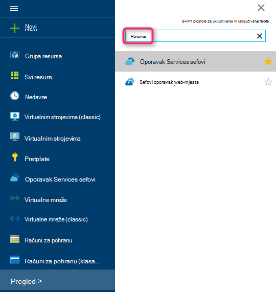

    Prikazat će se popis sefovi servise za oporavak.

3. Na izborniku **sefovi oporavak servisi** kliknite **Dodaj**.

    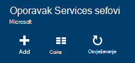

    Otvorit će se sigurnog plohu oporavak servise koje možete unijeti **naziv**, **pretplatu**, **grupa resursa**i **mjesto**pitanja.

    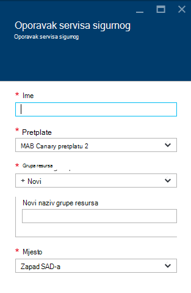

4. U odjeljku **naziv**unesite neslužbeni naziv da biste odredili na zbirke ključeva. Naziv mora biti jedinstvena za Azure pretplatu. Upišite naziv koji sadrži od 2 do 50 znakova. Morate pokrenuti slovom i mogu sadržavati samo slova, brojeve i spojnice.

5. Kliknite **pretplatu** da biste vidjeli dostupne popis pretplata. Ako niste sigurni koju pretplatu za korištenje, koristite zadanu (ili predložena) pretplate. Pojavit će se više mogućnosti samo ako je povezan s više pretplata Azure računa tvrtke ili ustanove.

6. Kliknite **grupu resursa** da biste vidjeli popis dostupnih grupa resursa ili **Novo** da biste stvorili novu grupu resursa. Potpune informacije o grupama resursa potražite u članku [Pregled upravljanja resursima za Azure](../azure-resource-manager/resource-group-overview.md)

7. Kliknite **mjesto** da biste odabrali regiji u zbirke ključeva.

8. Kliknite **Stvori**. Može potrajati neko vrijeme za oporavak servisa sigurnog će biti stvoren. Praćenje obavijesti o statusu u gornjem desnom području na portalu.
Nakon stvaranja vaše zbirke ključeva otvara se na portal.

### Postavljanje ponavljanja prostora za pohranu

Mogućnost replikacije pohrane omogućuje odabir između zemlj suvišnih prostora za pohranu i lokalno suvišnih prostora za pohranu. Prema zadanim postavkama vašeg sigurnog ima zemlj suvišnih prostora za pohranu. Ostavite mogućnost postaviti zemlj suvišnih prostora za pohranu ako je primarni sigurnosnu kopiju. Ako želite da se jeftinijim mogućnost koja nije baš kao i durable, odaberite lokalno suvišnih prostora za pohranu. Dodatne informacije o [zemlj suvišne](../storage/storage-redundancy.md#geo-redundant-storage) i [lokalno suvišne](../storage/storage-redundancy.md#locally-redundant-storage) mogućnosti pohrane u [Pregled replikacije Azure prostora za pohranu](../storage/storage-redundancy.md).

Da biste uredili replikacije postavku za pohranu:

1. Odaberite vaše zbirke ključeva da biste otvorili na nadzornoj ploči sigurnog i plohu postavke. Ako ne možete otvoriti plohu **Postavke** , kliknite **sve postavke** na nadzornoj ploči zbirke ključeva.

2. Na plohu **Postavke** kliknite **Sigurnosno kopiranje infrastrukture** > **Konfiguracije sigurnosnu kopiju** da biste otvorili plohu **Konfiguracije sigurnosnu kopiju** . Na plohu **Sigurnosne kopije konfiguracije** odaberite mogućnost replikacije prostora za pohranu za vaše zbirke ključeva.

    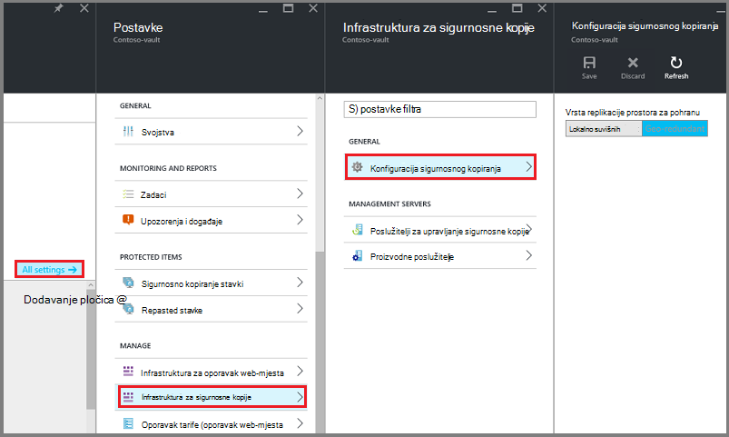

    Nakon odabira mogućnosti prostora za pohranu za vaše zbirke ključeva, spremni ste za pridruživanje s VM na sigurnog. Da biste započeli pridruživanja, otkrivanje i registrirati Azure virtualnih računala.

### 2. preuzimanju vjerodajnica zbirke ključeva

Datoteka vjerodajnice sigurnog je certifikat koji je generirao portal za svaki sigurnosno kopiranje zbirke ključeva. Na portalu zatim prenosi javni ključ da biste u Access kontrola servisa (ACS). Privatni ključ certifikata postane dostupna korisniku u sklopu tijeka rada koji je zadan kao ulaz u tijeku rada za registraciju računala. To potvrđuje računala da biste poslali sigurnosne kopije podataka identificirani sigurnog u servisu Azure sigurnosne kopije.

Samo tijekom tijeka rada za registraciju koristi se vjerodajnica zbirke ključeva. To je odgovornosti korisnika da biste bili sigurni vjerodajnice datoteke sigurnog ne ugrožena. Ako se nalaze u ruke bilo koji rogue korisnik, datoteka vjerodajnice sigurnog mogu se registrirati druga računala na temelju isti sigurnog. Međutim, kao što je sigurnosne kopije podataka šifriran pomoću pristupni izraz koji pripada klijent, postojeće sigurnosne kopije podataka ne može biti ugrožena. Da biste smanjili ovaj problem, sigurnog vjerodajnice su postavljene isteći u 48hrs. Možete preuzeti vjerodajnice sigurnog oporavak servisa više puta –, ali samo najnovije sigurnog vjerodajnica datoteka je primjenjivo tijekom tijeka rada za registraciju.

Putem sigurnog kanala na portalu Azure preuzimanja datoteke sigurnog vjerodajnica. Servisa Azure sigurnosne kopije je ostalog privatnog ključa certifikat i privatni ključ je ista i na portalu ili servisima sustava. Poduzmite sljedeće korake da biste preuzeli datoteke vjerodajnica sigurnog na lokalno računalo.

1. Prijavite se na [portal za Azure](https://portal.azure.com/).

2. Otvaranje oporavak servisa sigurnog kojoj na kojem želite da biste registrirali DPM na računalu.

3. Prema zadanim postavkama, otvorit će se postavke plohu prema gore. Ako je zatvoren, kliknite **Postavke** na nadzornoj ploči sigurnog da biste otvorili plohu postavke. U postavkama plohu, kliknite **Svojstva**.

    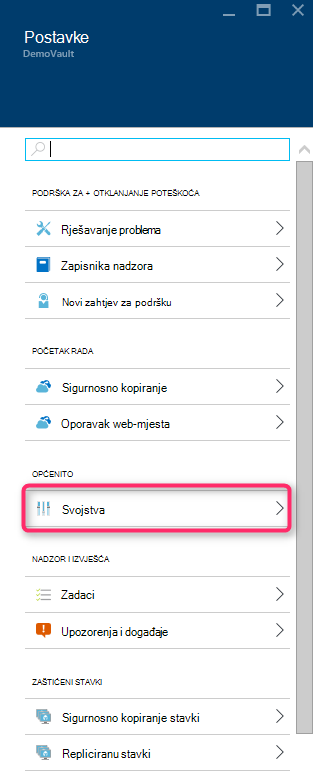

4. Na stranici svojstva u odjeljku **Vjerodajnice sigurnosne kopije**kliknite **Preuzmi** . Na portalu stvara datoteku sigurnog vjerodajnica koje postane dostupna za preuzimanje.

    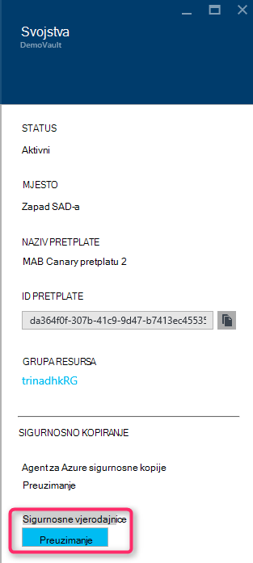

Na portalu generirat će sigurnog vjerodajnica pomoću kombinacije naziv sigurnog i trenutni datum. Kliknite **Spremi** da biste preuzeli sigurnog vjerodajnica za lokalni račun preuzimanja mape ili odaberite Spremi kao na izborniku Spremi da biste odredili mjesto za vjerodajnice zbirke ključeva. Trebat će minutu datoteke generiranje.

### Napomena
- Provjerite jesu li vjerodajnice datoteke sigurnog spremljene u na mjesto na kojem se može pristupiti s računala. Ako je pohranjen u datoteci zajedničko korištenje/SMB, provjerite dozvole za pristup.
- Datoteka vjerodajnice sigurnog koristi se samo tijekom tijeka rada za registraciju.
- Datoteka vjerodajnice sigurnog istječe nakon 48hrs i može se preuzeti s portala sustava.

### 3. Instalirajte Agent za sigurnosne kopije

Kada stvorite sigurnosnu kopiju Azure sigurnog, agent trebala biti instalirana na svim sustava Windows strojeva (Windows Server, Windows klijent, upravitelja za zaštitu podataka centar sustava poslužitelja ili pokrenite poslužitelj za Azure sigurnosne kopije) koja omogućuje sigurnosno kopiranje podataka i aplikacijama Azure.

1. Otvaranje oporavak servisa sigurnog kojoj na kojem želite da biste registrirali DPM na računalu.

2. Prema zadanim postavkama, otvorit će se postavke plohu prema gore. Ako je zatvoren, kliknite **Postavke** da biste otvorili plohu postavke. U postavkama plohu, kliknite **Svojstva**.

    

3. Na stranici Postavke u odjeljku **Azure Agent za sigurnosne kopije**kliknite **Preuzmi** .

    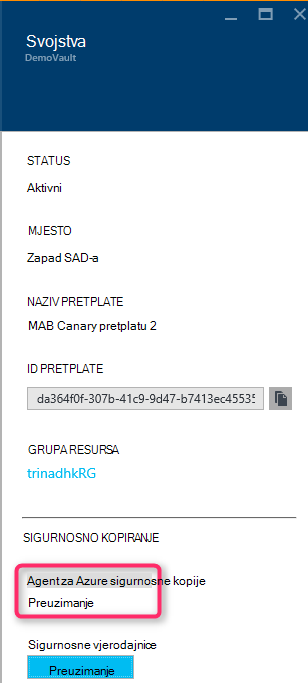

   Kada preuzmete agenta, dvaput pritisnite MARSAgentInstaller.exe da biste pokrenuli instalaciju agent za Azure sigurnosnu kopiju. Odaberite instalacijsku mapu i privremeno mape potreban za agenta. Mjesto predmemorije naveden, morate imati slobodnog prostora koji je barem 5% sigurnosne kopije podataka.

4.  Ako koristite proxy poslužitelj za povezivanje s Internetom, na zaslonu za **konfiguraciju Proxy** unesite detalje proxy poslužitelj. Ako koristite čija je autentičnost provjerena proxy poslužitelj, unesite korisničko ime i lozinku pojedinosti u ovaj zaslon.

5.  Agent za sigurnosne kopije Azure instalira .NET Framework 4,5 i komponente Windows PowerShell (ako ona još nije dostupan) da biste dovršili instalaciju.

6.  Nakon instalacije agenta **Zatvaranje** prozora.

    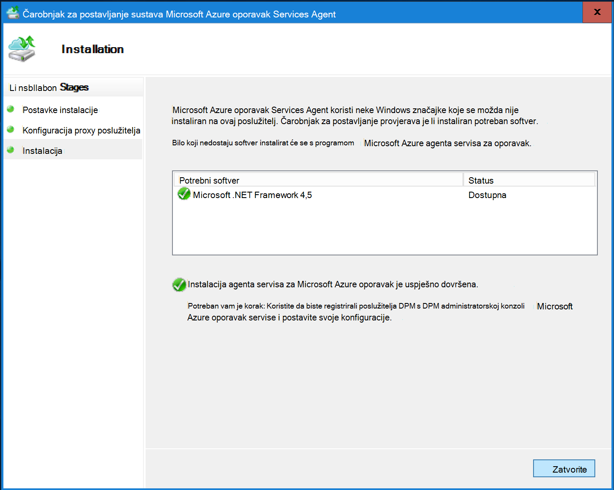

7. Za **registraciju poslužitelja DPM** sigurnog, na kartici **Upravljanje** kliknite na **mreži**. Zatim odaberite **registrirajte**. Otvorit će se registrirati Čarobnjak za postavljanje.

8. Ako koristite proxy poslužitelj za povezivanje s Internetom, na zaslonu za **konfiguraciju Proxy** unesite detalje proxy poslužitelj. Ako koristite čija je autentičnost provjerena proxy poslužitelj, unesite korisničko ime i lozinku pojedinosti u ovaj zaslon.

    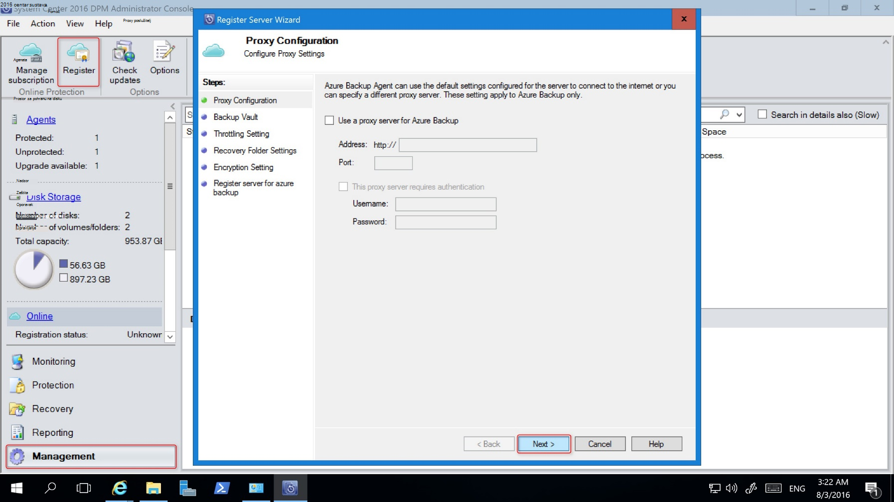

9. Na zaslonu za vjerodajnice sigurnog pronađite i odaberite datoteku vjerodajnice sigurnog koja već preuzeli.

    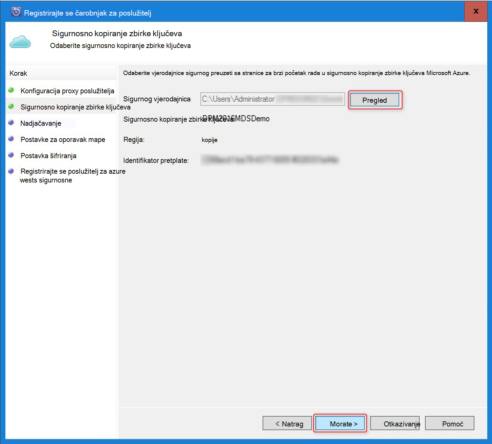

    Datoteka vjerodajnice sigurnog vrijedi samo za 48 sati (nakon preuzimanja s portala sustava). Ako naiđete na sve pogreške u ovaj zaslon (na primjer, "sigurnog vjerodajnica navedena datoteka istekla"), prijavite se na Azure portal i preuzimanje vjerodajnice sigurnog ponovno datoteke.

    Provjerite je li datoteka vjerodajnice sigurnog dostupna na mjestu na kojem se može pristupiti putem aplikacije za postavljanje. Ako naiđete na pristup povezane pogreške, kopirajte sigurnog vjerodajnice datoteku da biste privremeno mjesto u ovom računalu, a zatim ponovite postupak.

    Ako naiđete na pogrešku vjerodajnica koji nisu valjani sigurnog (na primjer, "koji nisu valjani sigurnog vjerodajnice navedene") datoteka je oštećena ili ne ne ste najnovije vjerodajnice povezali sa servisom za oporavak. Ponovite operaciju nakon preuzimanja nove zbirke ključeva vjerodajnica na portalu. Ta se pogreška obično je vidjeti ako korisnik klikne na mogućnost **preuzimanja sigurnog vjerodajnica** Azure portalu brzi redom. U ovom slučaju samo drugi sigurnog vjerodajnica datoteka je valjan.

10. Da biste odredili korištenje propusnost mreže tijekom rada i koje nisu radno vrijeme, na zaslonu za **Ograničavanje postavku** možete postaviti ograničenja korištenja propusnosti i definirati rad i koje nisu posla sati.

    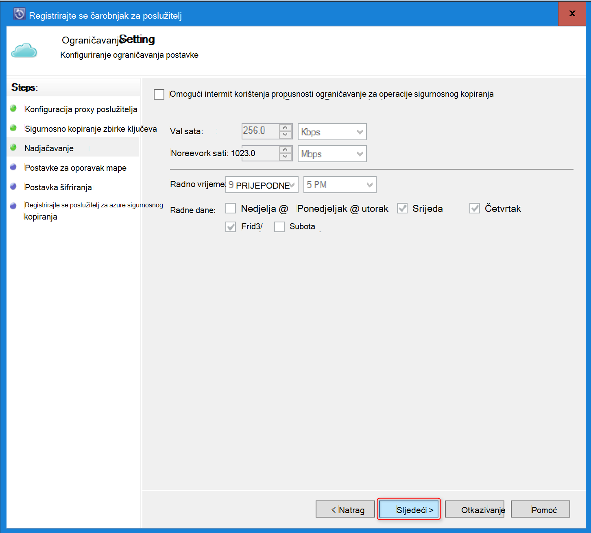

11. Na zaslonu za **Oporavak postavka mape** pronađite mapu u kojoj datoteke preuzete iz Azure će biti privremeno kopirana bez postavljanja.

    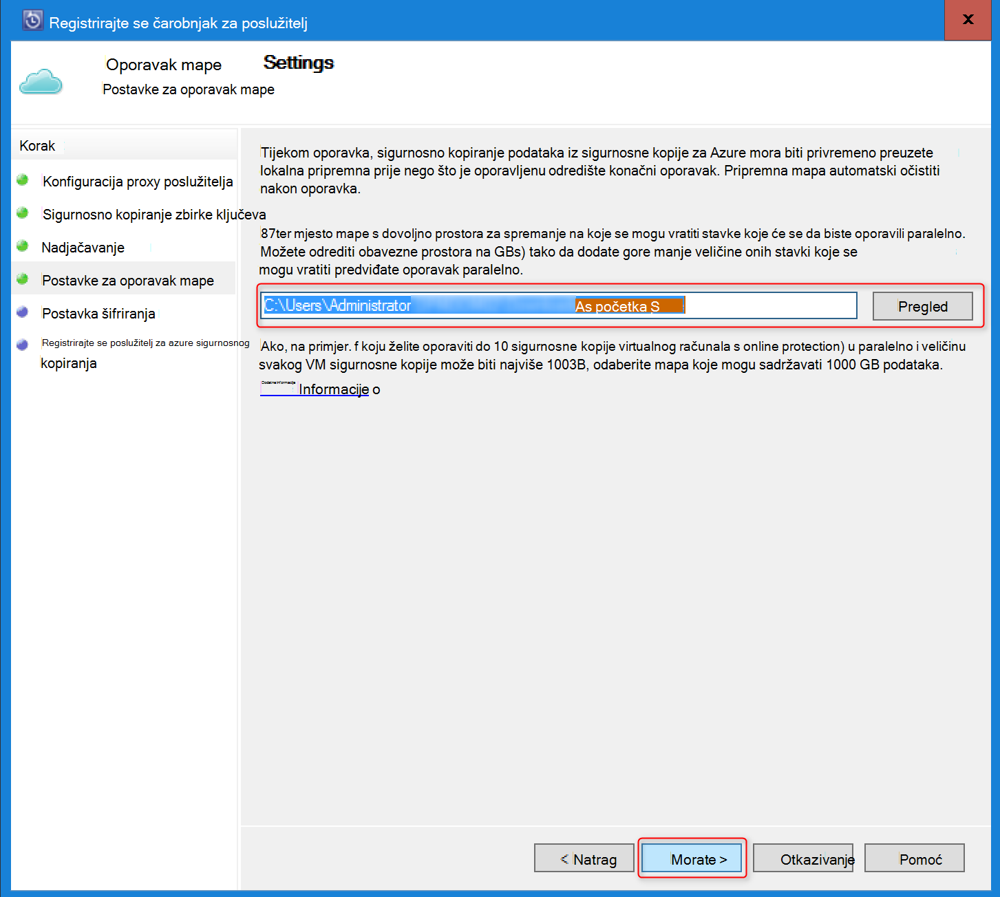

12. Na zaslonu **Postavke šifriranja** možete generirati pristupni izraz ili pružaju pristupni izraz (najmanje 16 znakova). Imajte na umu da biste spremili pristupni izraz u sigurnom mjestu.

    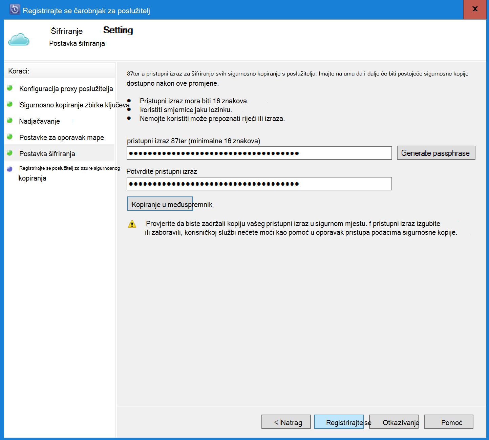

    > [AZURE.WARNING] Ako izgubite ili zaboravili; pristupni izraz Microsoft ne može pomoći u oporavak sigurnosne kopije podataka. Krajnji korisnik vlasništvu pristupni izraz za šifriranje i Microsoft nema uvid u pristupni izraz koristi krajnjeg korisnika. Spremite datoteku na sigurnom mjestu kao što je potrebno tijekom operacije za oporavak.

13. Kada kliknete gumb **registrirati** , na računalu uspješno je registrirana na sigurnog i sada ste spremni za početak sigurnosnom do Microsoft Azure.

14. Kada koristite Upravitelj zaštite podataka, možete izmijeniti postavke određene tijekom tijeka rada za registraciju klikom na mogućnost **Konfiguracija** tako da odaberete **Online** na kartici **Upravljanje** .

## Preduvjeti (i ograničenja)

- DPM možete imati kao fizičke poslužitelja ili virtualni stroj Hyper-V instaliran na web-mjesto sustava centra 2012 SP1 ili u okvir za sustav centar 2012 R2. Mogu se izvoditi i kao Azure virtualnog računala sustavom 2012 R2 centar sustava s najmanje 3 Kumulativno ažuriranje za DPM 2012 R2 ili Windows virtualnog računala u VMWare koji se izvode na 2012 R2 centar sustava s najmanje Update Rollup 5.
- Ako koristite DPM sustava centra 2012 SP1 s instalirajte ažuriranje stariju verziju gore 2 za sustav centar Upravitelj zaštite podataka SP1. To je potrebno da biste mogli instalirati Azure Backup Agent.
- Poslužitelj DPM mora imati komponente Windows PowerShell i .net Framework 4,5 instaliran.
- DPM može sigurnosno kopirati Većina radnih opterećenja Azure sigurnosno kopirati. Što je podržano pogledajte cijeli popis Azure sigurnosne kopije za podršku ispod stavke.
- S mogućnošću "Kopiraj na vrpcu" nije moguće oporaviti podatke pohranjene u Azure sigurnosnu kopiju.
- Morat ćete račun za Azure s omogućena značajka Azure sigurnosnu kopiju. Ako nemate račun, možete stvoriti besplatnu probnu računa u samo nekoliko minuta. Saznajte više o [sigurnosne kopije Azure cijene](https://azure.microsoft.com/pricing/details/backup/).
- Korištenje sigurnosnih kopija Azure zahtijeva Azure Backup Agent za instalaciju na poslužiteljima na kojima želite sigurnosno kopirati. Svaki poslužitelj, morate imati barem 5% veličina podataka koje se stvara sigurnosnu kopiju, dostupni kao lokalne besplatnog prostora za pohranu. Ako, na primjer, sigurnosno kopiranje 100 GB podataka potreban je najmanje 5 GB slobodnog prostora na prazno mjesto.
- Podaci će se pohranjuju u Azure sigurnog spremišta. Nema ograničenja za količinu podataka koje možete spremiti sigurnosnu kopiju sigurnosne kopije programa Azure vault, ali veličinu izvora podataka (primjerice virtualnog računala ili baze podataka) bi trebalo biti dulji od 54400 GB.

Ove vrste datoteka podržane su za spremiti sigurnosnu kopiju Azure:

- Šifrirana (Potpuna izrade sigurnosnih kopija samo)
- Sažeti (rastuće sigurnosne kopije podržan)
- Kratke (rastuće sigurnosne kopije podržan)
- Komprimirana i kratke (tretira kao Sparse)

I to nisu podržani:

- Poslužitelje na velika i mala slova datotečnih nisu podržane.
- Veza (preskočene)
- Reparse točaka (preskočene)
- Šifrirana i sažeti (preskočene)
- Šifrirana i kratke (preskočiti)
- Komprimirana strujanje
- Kratke strujanje

>[AZURE.NOTE] Iz u sustavu centar 2012 DPM sa servisnim paketom SP1 nadalje sigurnosno kopirajte gore radnih opterećenja zaštićen DPM za Azure pomoću Microsoft Azure sigurnosne kopije.
