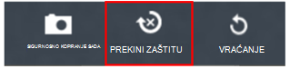

<properties
    pageTitle="Upravljanje i nadzirati sigurnosne kopije Azure virtualnog računala | Microsoft Azure"
    description="Saznajte kako upravljati i praćenje sigurnosne kopije programa Azure virtualnog računala"
    services="backup"
    documentationCenter=""
    authors="trinadhk"
    manager="shreeshd"
    editor=""/>

<tags
    ms.service="backup"
    ms.workload="storage-backup-recovery"
    ms.tgt_pltfrm="na"
    ms.devlang="na"
    ms.topic="article"
    ms.date="08/31/2016"
    ms.author="trinadhk; jimpark; markgal;"/>

# <a name="manage-and-monitor-azure-virtual-machine-backups"></a>Upravljanje i nadzirati sigurnosne kopije Azure virtualnog računala

> [AZURE.SELECTOR]
- [Upravljanje Azure VM sigurnosne kopije](backup-azure-manage-vms.md)
- [Upravljanje klasični VM sigurnosne kopije](backup-azure-manage-vms-classic.md)

Ovaj članak sadrži informacije o uobičajenih upravljanje i nadzor zadaci za klasični modela virtualnim strojevima zaštićene u Azure.  

>[AZURE.NOTE] Azure sadrži dvije implementacije modela za stvaranje i rad s resursima: [Voditelj resursa i Classic](../resource-manager-deployment-model.md). Detalje o radu s modelom implementacije klasični VMs potražite u odjeljku [Priprema vaše okruženje za sigurnosno kopiranje Azure virtualnih računala](backup-azure-vms-prepare.md) .

## <a name="manage-protected-virtual-machines"></a>Upravljanje zaštićeni virtualnim strojevima

Da biste upravljali zaštićeni virtualnim računalima sustava:

1. Prikaz i upravljanje sigurnosne postavke za virtualnog računala kliknite karticu **Zaštićeni stavke** .

2. Kliknite naziv zaštićeni stavke da biste vidjeli karticu **Detalji sigurnosnog kopiranja** , koja se prikazuje informacije o zadnje sigurnosne kopije.

    

3. Prikaz i upravljanje pravilima za sigurnosne postavke za virtualnog računala kliknite karticu **pravila** .

    

    Na kartici **Sigurnosne kopije pravila** prikazuje postojeće pravilo. Možete izmijeniti prema potrebi. Ako vam je potrebna za stvaranje novog pravila kliknite **Stvori** na stranici **pravila** . Imajte na umu da ako želite ukloniti pravilo ga bi trebalo imati sve virtualnim strojevima pridružen.

    

4. Dodatne informacije o akcije ili status možete dobiti za virtualnog računala na stranici **Zadaci** . Kliknite zadatak na popisu da biste vidjeli dodatne detalje ili filtrirati zadatke za određene virtualnog računala.

    

## <a name="on-demand-backup-of-a-virtual-machine"></a>Na zahtjev sigurnosnu kopiju virtualnog računala
Programa osvježavati može potrajati sigurnosnu kopiju virtualnog računala kada je konfiguriran za zaštitu. Ako je početna sigurnosne kopije na čekanju za virtualnog računala sigurnosne kopije na zahtjev ćete stvoriti cijelu kopiju virtualnog računala u Azure sigurnosno kopiranje zbirke ključeva. Ako prvo sigurnosno kopiranje dovrši, na zahtjev sigurnosne kopije će samo za slanje promjene iz prethodne sigurnosne kopije Azure sigurnosne kopije vault odnosno je uvijek je rastuća.

>[AZURE.NOTE] Zadržavanje raspona sigurnosnu kopiju sustava na zahtjev je postavljeno na zadržavanja vrijednost navedena za dnevni zadržavanja sigurnosne kopije pravila koja odgovara na VM.  

Da bi se na zahtjev sigurnosnu kopiju virtualnog računala:

1. Idite na stranicu **Zaštićeni stavki** odaberite **Azure virtualnog računala** kao **vrstu** (Ako već nije odabrano) i kliknite gumb **Odaberi** .

    

2. Odaberite virtualnog računala na kojem želite da biste snimili programa osvježavati sigurnosne kopije i kliknite **Sigurnosno kopiranje sada** gumba pri dnu stranice.

    

    To će stvoriti sigurnosno kopiranje na odabrani virtualnog računala. Zadržavanje raspona točka vraćanja stvorene pomoću ovaj zadatak bit će isti kao naveden u pravilima pridružene virtualnog računala.

    

    >[AZURE.NOTE] Da biste pogledali pravila pridružene virtualnog računala, kroz razine naniže u virtualnog računala na stranici **Zaštićeni stavke** i idite na karticu sigurnosne kopije pravila.

3. Nakon stvaranja posla, možete kliknuti gumb **Prikaz zadatka** na traci skočnoj da biste vidjeli odgovarajuće zadatka na stranici zadaci.

    

4. Nakon uspješan dovršetak zadatka Oporavak točke stvorit će se koju možete koristiti da biste vratili virtualnog računala. To će i povećajte vrijednost stupca točke za oporavak 1 u **Zaštićeni stavke** stranice.

## <a name="stop-protecting-virtual-machines"></a>Zaustavi zaštitu virtualnim strojevima
Možete odabrati da biste prestali buduće sigurnosne kopije virtualnog računala pomoću sljedećih mogućnosti:

- Zadržavanje sigurnosne kopije podataka povezanih s virtualnog računala u Azure sigurnosno kopiranje zbirke ključeva
- Brisanje sigurnosne kopije podataka povezanih s virtualnog računala

Ako ste odabrali da biste zadržali sigurnosne kopije podataka povezanih s virtualnog računala, možete koristiti sigurnosne kopije podataka da biste vratili virtualnog računala. Za cijene detalje o takve virtualnim strojevima, kliknite [ovdje](https://azure.microsoft.com/pricing/details/backup/).

Da biste prestali zaštitu virtualnog računala:

1. Idite na stranicu **Zaštićeni stavki** odaberite **Azure virtualnog računala** kao vrstu filtra (Ako već nije odabrano) i kliknite gumb **Odaberi** .

    

2. Odaberite virtualnog računala i kliknite **Prekini zaštitu** pri dnu stranice.

    

3. Prema zadanim postavkama Azure sigurnosne kopije ne briše sigurnosne kopije podataka povezanih s virtualnog računala.

    

    Ako želite da biste izbrisali sigurnosne kopije podataka, odaberite potvrdni okvir.

    

    Odaberite razlog za zaustavljanje sigurnosnu kopiju. Dok ovo nije obavezno, koja omogućuje razlog će vam pomoći Azure sigurnosnu kopiju za rad na povratne informacije i odredite im prioritet scenariji za klijenta.

4. Kliknite gumb **Pošalji** da biste poslali posao **Prekini zaštitu** . Kliknite **Prikaz zadatka** da biste vidjeli odgovara zadatka na stranici **Zadaci** .

    

    Ako niste odabrali mogućnost **Brisanje pridruženih sigurnosne kopije podataka** tijekom **Prekini zaštitu** čarobnjak, a zatim Objavi dovršetka posla, zaštitu status će se mijenja u **Zaustavi zaštitu**. Podaci ostaju pomoću sigurnosnog kopiranja Azure do izričito brisanja. Uvijek možete izbrisati podatke tako da odaberete virtualnog računala na stranici **Zaštićeni stavke** i pritisnete **Izbriši**.

    

    Ako ste odabrali mogućnost **Izbriši pridruženih sigurnosne kopije podataka** , virtualnog računala neće biti dio stranice **Zaštićeni stavke** .

## <a name="re-protect-virtual-machine"></a>Ponovno zaštitite virtualnog računala
Ako niste odabrali mogućnost **Izbriši Pridruži sigurnosne kopije podataka** u **Prekini zaštitu**, ponovno možete zaštititi virtualnog računala slijedeći korake slično sigurnosno kopiranje registrirani virtualnim računalima. Kad zaštićena, ovaj virtualni stroj imat će sigurnosne kopije podataka zadržavaju prije Prekini zaštitu i oporavak točke stvorene nakon ponovnog zaštititi.

Nakon što ponovno zaštitili, status zaštite virtualnog računala promijenit će se u **zaštićenom** ako postoje oporavak točke prije **Prekini zaštitu**.

  

>[AZURE.NOTE] Kada ponovno zaštite virtualnog računala, možete odabrati različite pravila od pravila kojima virtualnog računala je zaštićen prethodno.

## <a name="unregister-virtual-machines"></a>Unregister virtualnim strojevima

Ako želite ukloniti virtualnog računala iz sigurnosne kopije zbirke ključeva:

1. Kliknite gumb **NEREGISTRIRANJA** pri dnu stranice.

    

    Pri dnu zaslona Zatraži potvrdu prikazat će se skočnoj obavijesti. Kliknite **da** da biste nastavili.

    

## <a name="delete-backup-data"></a>Brisanje sigurnosne kopije podataka
Možete izbrisati sigurnosne kopije podataka povezan s virtualnog računala na jedan od sljedećih načina:

- Tijekom Prekini zaštitu zadatka
- Nakon Prekini zaštitu posla obavljeno virtualnog računala

Da biste izbrisali sigurnosne kopije podataka na virtualnog računala koja je u stanju *Zaustavi zaštitu* objavljuju uspješan dovršetak **Zaustavi sigurnosno** kopiranje:

1. Idite na stranicu **Zaštićeni stavke** kao *vrstu* odaberite **Azure virtualnog računala** i kliknite gumb **Odaberi** .

    

2. Odaberite virtualnog računala. Virtualnog računala bit će u stanju **Zaustavi zaštitu** .

    

3. Kliknite gumb **Izbriši** pri dnu stranice.

    

4. U čarobnjaku za **Brisanje sigurnosne kopije podataka** odaberite razlog za brisanje sigurnosne kopije podataka (se preporučuje se), a zatim kliknite **Pošalji**.

    

5. To će stvoriti zadatak da biste izbrisali sigurnosne kopije podataka odabranog virtualnog računala. Kliknite **Prikaz zadatka** da biste vidjeli odgovarajuće zadatka na stranici zadaci.

    

    Nakon dovršetka posla stavku odgovara virtualnog računala bit će uklonjen s **zaštićenog stavke** stranice.

## <a name="dashboard"></a>Nadzorna ploča
Na stranici **nadzornu ploču** možete pregledati informacije o Azure virtualnim strojevima, njihove prostora za pohranu i zadatke povezane s njima u zadnja 24 sata. Možete pogledati statusa sigurnosne kopije i sve povezane sigurnosne kopije pogreške.


>[AZURE.NOTE] Vrijednosti na nadzornoj ploči osvježavaju se svaka 24 sata.

## <a name="auditing-operations"></a>Nadzor operacije
Azure backup omogućuje pregled "operacija zapisnici" operacije sigurnosnog kopiranja koji se prikazuje kada je korisnik odabrao jednostavno potražite u članku točno su koje operacija upravljanja izvesti na sigurnosno kopiranje zbirke ključeva. Operacije zapisnika omogućite sjajno objavu mortem i nadzor podrška za operacije sigurnosnog kopiranja.

U zapisnicima operacija zapisat će se sljedeće postupke:

- Registrirajte se
- Poništavanje registracije
- Konfiguriranje zaštitu
- Sigurnosno kopiranje (obje zakazano kao i sigurnosna kopija na zahtjev putem BackupNow)
- Vraćanje
- Prekini zaštitu
- Brisanje sigurnosne kopije podataka
- Dodavanje pravila
- Brisanje pravila
- Ažuriranje pravila
- Otkazivanje posla

Da biste pogledali zapisnike operacija koja odgovara sigurnosno kopiranje zbirke ključeva:

1. Dođite do **Management services** Azure portalu, a zatim na kartici **Zapisnici operacija** .

    

2. Filtre, kao *vrstu* odaberite **sigurnosne kopije** i navedite naziv sigurnosne kopije sigurnog u *Naziv usluge* i kliknite **Pošalji**.

    

3. U zapisnicima operacija odaberite sve operacije, a zatim kliknite **Detalji** da biste vidjeli detalje odgovara postupak.

    

    **Čarobnjak za pojedinosti** sadrži informacije o operacija pokrene, posao ID-a, resursa na koji ovaj postupak aktivira i početak operacije.

    

## <a name="alert-notifications"></a>Upozorenja
Prilagođena upozorenja za poslove možete dobiti na portalu. To možete učiniti tako da koji definira PowerShell upozorenja pravila na radu zapisnika događaja. Preporučujemo korištenje *PowerShell verzije 1.3.0 ili noviji*.

Da biste odredili prilagođene obavijest upozorenja za sigurnosne kopije pogreške, naredbe uzorak će izgledati:

```
PS C:\> $actionEmail = New-AzureRmAlertRuleEmail -CustomEmail contoso@microsoft.com
PS C:\> Add-AzureRmLogAlertRule -Name backupFailedAlert -Location "East US" -ResourceGroup RecoveryServices-DP2RCXUGWS3MLJF4LKPI3A3OMJ2DI4SRJK6HIJH22HFIHZVVELRQ-East-US -OperationName Microsoft.Backup/backupVault/Backup -Status Failed -TargetResourceId /subscriptions/86eeac34-eth9a-4de3-84db-7a27d121967e/resourceGroups/RecoveryServices-DP2RCXUGWS3MLJF4LKPI3A3OMJ2DI4SRJK6HIJH22HFIHZVVELRQ-East-US/providers/microsoft.backupbvtd2/BackupVault/trinadhVault -Actions $actionEmail
```

**ResourceId**: to možete dobiti operacije zapisnika skočnog opisan u odjeljku. ResourceUri u pojedinosti skočni prozor operacije je ResourceId da biste biti navedena za ovaj cmdlet.

**OperationName**: ta će se u obliku "Microsoft.Backup/backupvault/<EventName>" gdje je EventName jedan je od Register, neregistriranja, ConfigureProtection, sigurnosno kopirati, vraćanje StopProtection, DeleteBackupData, CreateProtectionPolicy, DeleteProtectionPolicy, UpdateProtectionPolicy

**Status**: podržane vrijednosti su koraci je uspjelo i nije uspjelo.

**ResourceGroup**: ResourceGroup resursa na kojem se pokreće postupak. To možete dobiti od ResourceId vrijednosti. Između polja */resourceGroups/* i */providers/* ResourceId vrijednost je vrijednost za ResourceGroup.

**Naziv**: naziv upozorenja pravila.

**CustomEmail**: odredite na prilagođenu adresu e-pošte na koju želite poslati upozorenje

**SendToServiceOwners**: tu mogućnost šalje upozorenje svim administratorima i dodatnih administratora pretplate. Može se koristiti u cmdleta **New AzureRmAlertRuleEmail**

### <a name="limitations-on-alerts"></a>Ograničenja vezana uz upozorenja
Upozorenja temeljenih na događaj trpi su na sljedeća ograničenja:

1. Upozorenja aktiviraju se na svim računalima virtualne u sigurnosno kopiranje zbirke ključeva. Ne možete prilagoditi da biste dobili upozorenja za određeni skup virtualnim strojevima u sigurnosno kopiranje zbirke ključeva.
2. Ta je značajka u pretpregledu. [uči više](../monitoring-and-diagnostics/insights-powershell-samples.md#create-alert-rules)
3. Primit ćete obavijesti o iz "alerts-noreply@mail.windowsazure.com". Trenutno ne možete mijenjati pošiljatelja e-pošte.

## <a name="next-steps"></a>Daljnji koraci

- [Vraćanje Azure VMs](backup-azure-restore-vms.md)
