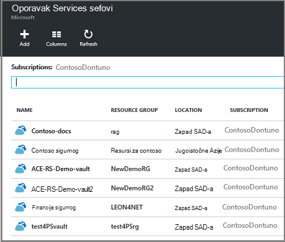
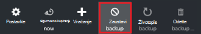

<properties
    pageTitle="Upravljanje resursima implementiran virtualnog računala kopija | Microsoft Azure"
    description="Saznajte kako upravljati i praćenje sigurnosne kopije resursima implementiran virtualnog računala"
    services="backup"
    documentationCenter=""
    authors="trinadhk"
    manager="shreeshd"
    editor=""/>

<tags
    ms.service="backup"
    ms.workload="storage-backup-recovery"
    ms.tgt_pltfrm="na"
    ms.devlang="na"
    ms.topic="article"
    ms.date="08/11/2016"
    ms.author="jimpark; markgal; trinadhk"/>

# Upravljanje sigurnosne kopije Azure virtualnog računala

> [AZURE.SELECTOR]
- [Upravljanje Azure VM sigurnosne kopije](backup-azure-manage-vms.md)
- [Upravljanje klasični VM sigurnosne kopije](backup-azure-manage-vms-classic.md)

Ovaj članak sadrži smjernice o upravljanju VM sigurnosne kopije i objašnjava sigurnosne kopije upozorenja informacije dostupne u portala nadzorne ploče. Upute u ovom članku odnose se na VMs pomoću servisa oporavak sefovi. Ovaj članak obuhvaća stvaranje virtualnim strojevima niti ne objašnjavaju kako zaštititi virtualnih računala. Primer o zaštiti Voditelj resursa Azure implementiran VMs u Azure s oporavak servisa sigurnog, potražite u članku [najprije izgledati: sigurnosno kopiranje VMs za oporavak servisa sigurnog](backup-azure-vms-first-look-arm.md).

## Upravljanje sefovi i zaštićene virtualnog računala

Na portalu Azure na nadzornoj ploči za oporavak servisa sigurnog omogućuje pristup informacije o uključivanju sigurnog:

- zadnje sigurnosne kopije snimke, koji je najnovije točke vraćanja < br\>
- sigurnosne kopije pravila < br\>
- ukupne veličine sve sigurnosne kopije snimke < br\>
- broj virtualnim strojevima koji su zaštićeni na sigurnog < br\>

Mnoge zadatke upravljanja pomoću sigurnosnog kopiranja virtualnog računala započnite s otvaranjem na sigurnog na nadzornoj ploči. Međutim, jer sefovi može koristiti da biste zaštitili više stavki (ili više VMs) da biste pogledali detalje o određenom VM, otvorite sigurnog stavke nadzorne ploče. Sljedeći postupak prikazuje kako otvoriti *sigurnog nadzorne ploče* i prijeđite na *nadzornu ploču sigurnog stavke*. Postoje "Savjeti" u oba postupaka koji pokazuju kako dodati na sigurnog i sigurnog stavke Azure nadzorne ploče pomoću Prikvači na naredba nadzorne ploče. Prikvači na nadzornoj ploči je način stvaranja prečaca sigurnog ili stavku. Uobičajene naredbe možete izvršiti i s prečaca.

>[AZURE.TIP] Ako imate više nadzornih ploča i otvorite blades, pomoću klizača tamno plava pri dnu prozora slajda Azure nadzornu ploču natrag i naprijed.

### Otvorite oporavak servisa sigurnog na nadzornoj ploči:

1. Prijavite se na [portal za Azure](https://portal.azure.com/).

2. Na izborniku koncentrator kliknite **Pregledaj** , a zatim na popisu resursi upišite **Servise za oporavak**. Kao što počnete pisati, filtri popisa koji se temelji na unos. Kliknite **zbirke ključeva servisa za oporavak**.

      

    Prikazuju se na popisu sefovi servise za oporavak.

      

    >[AZURE.TIP] Ako vežete sigurnog Azure nadzorne ploče, kada otvorite portal za Azure odmah dostupna je taj zbirke ključeva. Da biste prikvačili sigurnog na nadzornu ploču na popisu sigurnog, desnom tipkom miša kliknite na sigurnog pa odaberite **Prikvači na nadzornoj ploči**.

3. Na popisu sefovi odaberite sigurnog da biste otvorili njegov nadzorne ploče. Kad odaberete u sigurnog, na nadzornoj ploči sigurnog i **Postavke** plohu otvoriti. Na nadzornoj ploči **Contoso sigurnog** istaknuta je na sljedećoj slici.

    

### Otvorite sigurnog stavke nadzorne ploče

Iz prethodnog postupka otvoriti na nadzornoj ploči zbirke ključeva. Da biste otvorili sigurnog stavke nadzorne ploče:

1. Na nadzornoj ploči sigurnog, na pločici **Sigurnosnu kopiju stavke** kliknite **virtualnim računalima sustava Azure**.

    

    **Sigurnosno kopiranje stavki** plohu popis Zadnje sigurnosno kopiranje za svaku stavku. U ovom primjeru postoji jedan virtualnog računala, demovm markgal zaštićen ovaj sigurnog.  

    

    >[AZURE.TIP] Za olakšani pristup, možete prikvačiti sigurnog stavke na nadzornu ploču Azure. Da biste prikvačili stavku sigurnog sigurnog stavku popisa, desnom tipkom miša kliknite stavku, a zatim odaberite **Prikvači na nadzornoj ploči**.

2. Plohu **Sigurnosnu kopiju stavke** , kliknite stavku da biste otvorili sigurnog stavke nadzorne ploče.

    

    Nadzorna ploča za stavku sigurnog i njegove **Postavke** plohu otvoriti.

    

    Na sigurnog stavke nadzornoj ploči koje možete izvršiti mnoge zadatke upravljanja ključem, kao što su:

    - Promjena pravila i stvaranje novog sigurnosne kopije pravila < br\>
    - Pregled točke vraćanja, i njihovo stanje dosljednost < br\>
    - na zahtjev sigurnosnu kopiju virtualnog računala < br\>
    - Zaustavi zaštitu virtualnim strojevima < br\>
    - nastavak zaštitu virtualnog računala < br\>
    - Brisanje sigurnosne kopije podataka (ili točka vraćanja) < br\>
    - [Vraćanje sigurnosne kopije (ili oporavak točke)](./backup-azure-arm-restore-vms.md#restore-a-recovery-point) < br\>

Sljedećih postupaka polazište je sigurnog stavke nadzorne ploče.

## Upravljanje pravilnicima za sigurnosne kopije

1. Na [nadzornu ploču sigurnog stavke](backup-azure-manage-vms.md#open-a-vault-item-dashboard)kliknite **Sve postavke** da biste otvorili plohu **Postavke** .

    

2. Na plohu **Postavke** kliknite **sigurnosne kopije pravila** da biste otvorili tu plohu.

    Na plohu, prikazuju se sigurnosno kopiranje učestalost i zadržavanje raspona detalje.

    

3. Na izborniku **Odaberite sigurnosne kopije pravila** :
    - Da biste promijenili pravila, odaberite drugu pravila, a zatim kliknite **Spremi**. Novog pravilnika odmah primjenjuje se na zbirke ključeva. < br\>
    - Da biste stvorili pravilo, odaberite **Stvori novo**.

    

    Upute za stvaranje sigurnosne kopije pravila potražite u članku [Definiranje sigurnosne kopije pravila](backup-azure-manage-vms.md#defining-a-backup-policy).

[AZURE.INCLUDE [backup-create-backup-policy-for-vm](../../includes/backup-create-backup-policy-for-vm.md)]

## Na zahtjev sigurnosnu kopiju virtualnog računala
Programa osvježavati može potrajati sigurnosnu kopiju virtualnog računala kada je konfiguriran za zaštitu. Ako je početna sigurnosne kopije na čekanju sigurnosne kopije na zahtjev stvara cijelu kopiju virtualnog računala u sigurnog servise za oporavak. Ako početni sigurnosno kopiranje dovrši, sigurnosnu kopiju sustava na zahtjev će samo poslati promjene iz prethodne snimke sigurnog servise za oporavak. To je kasnije sigurnosne kopije uvijek su rastuće.

>[AZURE.NOTE] Raspon zadržavanja za sigurnosnu kopiju sustava na zahtjev je navedena dnevnih sigurnosne kopije točke u pravilnik zadržavanja vrijednost. Ako je odabrana bez zareza dnevni sigurnosne kopije, koristi se točke tjedni sigurnosne kopije.

Da biste pokrenuli osvježavati kopija virtualnog računala:

- Na [nadzornu ploču sigurnog stavku](backup-azure-manage-vms.md#open-a-vault-item-dashboard), kliknite **sigurnosnu kopiju**.

    

    Na portalu provjerava nije li koji želite pokrenuti na zahtjev sigurnosno kopiranje. Kliknite **da** da biste pokrenuli sigurnosno kopiranje.

    

    Sigurnosno kopiranje stvara točku oporavak. Raspon zadržavanja točke oporavak je isti kao zadržavanja raspona koji je naveden u pravilima pridružene virtualnog računala. Da biste pratili tijek zadatka na nadzornoj ploči sigurnog kliknite pločicu **Sigurnosne kopije zadataka** .  

## Zaustavi zaštitu virtualnim strojevima
Ako odaberete da biste prestali zaštita virtualnog računala, vas se upita želite li zadržati točke za oporavak. Da biste zaustavili zaštita virtualnim strojevima na dva načina:
- Zaustavljanje svih budućih zadataka sigurnosne kopije i izbrisati sve točke oporavka ili
- Zaustavljanje svih budućih zadataka sigurnosne kopije, ali ne i oporavak točke  

Postoji trošak povezan s ostavite točke za oporavak u prostor za pohranu. Prednost ostavite točke oporavak je virtualnog računala možete vratiti kasnije, po želji. Informacije o trošak ostavite točke oporavak, potražite u članku [cijene pojedinosti](https://azure.microsoft.com/pricing/details/backup/). Ako odaberete da biste izbrisali sve točke oporavka, nije moguće vratiti virtualnog računala.

Da biste prestali zaštitu virtualnog računala:

1. Na [nadzornu ploču sigurnog stavku](backup-azure-manage-vms.md#open-a-vault-item-dashboard), kliknite **Zaustavi sigurnosno kopiranje**.

    

    Otvorit će se plohu Zaustavi sigurnosnu kopiju.

    

2. Na **Zaustavi sigurnosne kopije** plohu odaberite želite li zadržati ili brisanje sigurnosne kopije podataka. Okvir informacije o sadrži detalje o vlastitom izboru.

    

3. Ako odaberete da biste zadržali sigurnosne kopije podataka, preskočite do koraka 4. Ako odaberete da biste izbrisali sigurnosne kopije podataka, potvrdite da želite zaustaviti sigurnosne kopije zadataka i brisanje točke oporavak – upišite naziv stavke.

    

    Ako ne znate naziv stavke, postavite pokazivač miša uskličnik da biste vidjeli naziv. Osim toga, je naziv stavke u odjeljku **Zaustavi sigurnosno kopiranje** pri vrhu na plohu.

4. Po želji navedite **Razlog** ili **komentar**.

5. Da biste isključili sigurnosno kopiranje za trenutnu stavku, kliknite  

    Poruke s obavijesti obavještava zaustavljena sigurnosne kopije zadataka.

    

## Nastavak zaštitu virtualnog računala
Ako mogućnost **Zadržati sigurnosne kopije podataka** nije odabran kada je zaustavljeno zaštitu virtualnog računala, zatim moguće je da biste nastavili zaštitu. Ako je mogućnost **Izbriši sigurnosne kopije podataka** nije odabran, nastaviti ne zaštitu virtualnog računala.

Da biste nastavili zaštitu virtualnog računala

1. Na [nadzornu ploču sigurnog stavku](backup-azure-manage-vms.md#open-a-vault-item-dashboard), kliknite **nastavak sigurnosnu kopiju**.

    

    Otvorit će se plohu sigurnosne kopije pravila.

    >[AZURE.NOTE] Kada ponovno zaštite virtualnog računala, možete odabrati različite pravila od pravila kojima virtualnog računala je zaštićen prethodno.

2. Slijedite korake u [Promjena pravila ili stvaranje novog pravila za sigurnosne kopije](backup-azure-manage-vms.md#change-policies-or-create-a-new-backup-policy), za dodjeljivanje pravilnika za virtualnog računala.

    Kada sigurnosne kopije pravila primjenjuje se na virtualnog računala, prikazat će se sljedeća poruka.

    

## Brisanje sigurnosne kopije podataka
Možete izbrisati sigurnosne kopije podataka povezanih s virtualnog računala tijekom zadatka **Zaustavi sigurnosno kopiranje** ili bilo kojem trenutku nakon sigurnosnog kopiranja zadatak dovršen. Čak i može biti korisni čekati dana ili tjedana prije brisanja točke za oporavak. Za razliku od vraćanje točke oporavak prilikom brisanja sigurnosne kopije podataka, ne možete odabrati određene oporavak točke da biste izbrisali. Ako se odlučite za brisanje podataka iz sigurnosne kopije, morate izbrisati sve oporavak točke povezan sa stavkom.

Sljedeći postupak pretpostavlja da Zaustavi ili onemogući sigurnosne kopije zadatka za virtualnog računala. Kada je onemogućen zadatka sigurnosnog kopiranja, **nastavak sigurnosno kopiranje** i **Brisanje sigurnosne kopije** mogućnosti dostupne su na nadzornoj ploči stavku zbirke ključeva.

Da biste izbrisali sigurnosne kopije podataka na virtualnog računala s *sigurnosne kopije onemogućen*:

1. Na [nadzornu ploču sigurnog stavke](backup-azure-manage-vms.md#open-a-vault-item-dashboard), kliknite **Izbriši sigurnosnu kopiju**.

    

    Otvorit će se plohu **Brisanje sigurnosne kopije podataka** .

    

2. Upišite naziv stavke da biste potvrdili da želite izbrisati točke oporavak.

    

    Ako ne znate naziv stavke, postavite pokazivač miša uskličnik da biste vidjeli naziv. Osim toga, je naziv stavke u odjeljku **Brisanje sigurnosne kopije podataka** pri vrhu na plohu.

3. Po želji navedite **Razlog** ili **komentar**.

4. Da biste izbrisali sigurnosne kopije podataka za trenutnu stavku, kliknite  

    Poruke s obavijesti obavještava sigurnosne kopije podataka izbrisan.

## Daljnji koraci

Informacije o ponovno stvaranje virtualnog računala s oporavak točke, pogledajte [Vraćanje VMs Azure](backup-azure-restore-vms.md). Ako trebate informacije o zaštiti virtualnim računalima, pročitajte članak [najprije izgledati: sigurnosno kopiranje VMs za oporavak servisa sigurnog](backup-azure-vms-first-look-arm.md). Informacije o događajima za nadzor, potražite u članku [Monitor upozorenja za sigurnosno kopiranje Azure virtualnog računala](backup-azure-monitor-vms.md).
