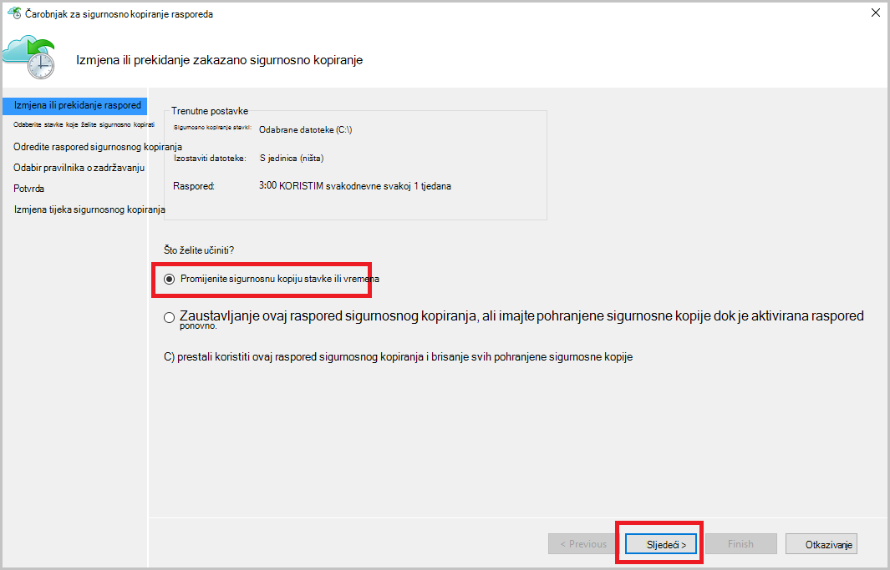

<properties
    pageTitle="Upravljanje sefovi Azure sigurnosnu kopiju i poslužitelji Azure pomoću modela uvođenje klasičnog | Microsoft Azure"
    description="Pomoću ovog praktičnog vodiča da biste saznali kako upravljati sefovi Azure sigurnosnu kopiju i poslužitelja."
    services="backup"
    documentationCenter=""
    authors="markgalioto"
    manager="jwhit"
    editor="tysonn"/>

<tags
    ms.service="backup"
    ms.workload="storage-backup-recovery"
    ms.tgt_pltfrm="na"
    ms.devlang="na"
    ms.topic="article"
    ms.date="09/27/2016"
    ms.author="jimpark;markgal"/>

# Upravljanje sefovi Azure sigurnosnu kopiju i poslužitelje pomoću model klasični implementacije

> [AZURE.SELECTOR]
- [Voditelj resursa](backup-azure-manage-windows-server.md)
- [Klasični](backup-azure-manage-windows-server-classic.md)

U ovom članku pronaći ćete pregled zadataka upravljanja sigurnosne kopije dostupne putem portala za Azure klasični i agent za Microsoft Azure sigurnosne kopije.

[AZURE.INCLUDE [learn-about-deployment-models](../../includes/learn-about-deployment-models-classic-include.md)]Voditelj resursa model implementacije.

## Portala zadatke upravljanja
1. Prijava na [Portal za upravljanje](https://manage.windowsazure.com).

2. Kliknite **Oporavak servise**, a zatim kliknite naziv sigurnosne kopije sigurnog da biste prikazali stranicu za brzo pokretanje.

    

Odabirom mogućnosti pri vrhu stranice za brzo pokretanje, vidjet ćete zadatke dostupna upravljanja.

### Nadzorna ploča
Odaberite **nadzornu ploču** da biste vidjeli pregled korištenja za poslužitelj. **Pregled korištenja** uključuje:

- Broj poslužitelja Windows registrirana oblak
- Broj Azure virtualnim računalima sustava zaštitu u oblaku
- Ukupan prostor za pohranu potrošnju Azure
- Status nedavne poslova

Pri dnu zaslona nadzornu ploču možete izvršiti sljedeće zadatke:

- **Upravljanje certifikatom** – ako certifikat koristila za registraciju poslužitelja, a zatim tom se mogućnošću poslužite da biste ažurirali certifikata. Ako koristite sigurnog vjerodajnice pomoću **certifikata za upravljanje**.
- **Brisanje** - briše trenutni sigurnosno kopiranje zbirke ključeva. Ako se više ne koristi sigurnosno kopiranje zbirke ključeva, možete je izbrisati da biste oslobodili prostor za pohranu. **Brisanje** omogućena samo nakon registrirani poslužiteljima na kojima su izbrisane iz na zbirke ključeva.

## Registrirani stavki
Odabir **Registrirana stavki** za prikaz naziva poslužitelja registrirane ovaj sigurnog.

Filtar **vrste** zadanih postavki za Azure virtualnog računala. Da biste vidjeli nazive poslužitelja registrirane ovaj sigurnog, na padajućem izborniku odaberite **Windows server** .

Na tom mjestu možete izvršiti sljedeće zadatke:

- **Ukloni Registracija Dopusti** – kada je odabrana ta mogućnost za poslužitelj možete koristiti **Čarobnjak za registraciju** u lokalni agent za Microsoft Azure sigurnosne kopije za registraciju poslužitelja s sigurnosno kopiranje zbirke ključeva drugi put. Možda ćete morati ponovno registrirajte zbog pogreške u certifikat ili ako poslužitelj morala se ponovno stvoriti.
- **Brisanje** - briše poslužitelju iz sigurnosne kopije zbirke ključeva. Odmah se briše sve pohranjeni podaci koji su povezani s poslužiteljem.

    

## Zaštićeni stavki
Odabir **Zaštićeni stavki** za prikaz stavki koje su sigurnosnu kopiju s poslužitelja.

## Konfiguriranje

Na kartici **Konfiguriraj** možete odabrati mogućnost zalihosti odgovarajuće prostora za pohranu. Najbolje vrijeme za odabir mogućnosti zalihosti prostora za pohranu je desno nakon stvaranja na sigurnog i prije jednom računalu registrirane na njega.

>[AZURE.WARNING] Kada stavku registrirani u sigurnog, zalihosti mogućnost pohrane je zaključan i ne može se mijenjati.

Pročitajte ovaj članak dodatne informacije o [zalihosti prostora za pohranu](../storage/storage-redundancy.md).

## Stvaranje sigurnosne kopije Microsoft Azure agent zadataka

### Konzola

Otvorite **Microsoft Azure Backup agent** (je možete pronaći traženjem računalu *Microsoft Azure Backup*).

Od **Akcija** dostupne s desne strane konzole agent za sigurnosne kopije možete izvršiti sljedeće zadatke upravljanja:

- Registriranje poslužitelja
- Raspored sigurnosnog kopiranja
- Sigurnosno kopiranje sada
- Promjena svojstava

>[AZURE.NOTE] **Oporavak podataka**potražite u članku [vratiti datoteke u sustavu Windows server ili Windows klijentskom računalu](backup-azure-restore-windows-server.md).

### Izmjena postojeću sigurnosnu kopiju

1. Agent za Microsoft Azure Backup kliknite **Raspored sigurnosnu kopiju**.

    

2. **Čarobnjak za sigurnosno kopiranje raspored** ostavite odabranu mogućnost **promjene za sigurnosno kopiranje stavki ili vremena** , a zatim kliknite **Dalje**.

    

3. Ako želite da biste dodali ili promijenili stavke, na zaslonu **Odaberite stavke za stvaranje sigurnosne kopije** kliknite **Dodaj stavke**.

    **Postavke izuzetaka** možete postaviti i s ove stranice u čarobnjaku. Ako želite izostaviti datoteke ili vrste datoteka pročitajte postupak dodavanja [izuzetaka postavke](#exclusion-settings).

4. Odaberite datoteke i mape koje želite sigurnosno kopirati, a zatim kliknite u **redu**.

    

5. Navedite **raspored sigurnosnog kopiranja** , a zatim kliknite **Dalje**.

    Možete planirati dnevnu (pri najviše 3 puta dnevno) ili s predlošcima tjednih sigurnosne kopije.

    

    >[AZURE.NOTE] Određivanje raspored sigurnosnog kopiranja je objašnjeno u ovom [članku](backup-azure-backup-cloud-as-tape.md).

6. Odabir **Pravilnika o zadržavanju** sigurnosne kopije, a zatim kliknite **Dalje**.

    

7. Na zaslonu za **potvrdu** pregledajte podatke, a zatim kliknite **Završi**.

8. Kad čarobnjak dovrši stvaranje **raspored sigurnosnog kopiranja**, kliknite **Zatvori**.

    Nakon izmjene zaštitu možete potvrditi da sigurnosne kopije su pokretanje pravilno tako da na kartici **Zadaci** i potvrdom da su promjene vidljive sigurnosne kopije zadataka.

### Omogućivanje ograničavanje mreže  
Agent za sigurnosne kopije Azure sadrži karticu Throttling koji omogućuje kontrolu načina na koji se propusnost mreže koristi tijekom prijenosa podataka. Ova kontrola može biti korisno ako je potrebno sigurnosno kopiranje podataka tijekom radno vrijeme, ali ne želite da se postupak sigurnosnog kopiranja da biste sukob s drugim internetski promet. Ograničavanje podataka prijenos odnosi se na sigurnosno kopiranje i vraćanje aktivnosti.  

Da biste omogućili ograničenja:

1. U **agent za sigurnosne kopije**, kliknite **Promijeni svojstva**.

2. Potvrdite okvir **Omogući korištenja propusnosti internetske ograničavanje za sigurnosne kopije operacije** .

    

3. Nakon što ste omogućili reguliranje, odredite dopuštene propusnosti za prijenos sigurnosne kopije podataka tijekom **radnog vremena** i **osobe koje nisu radno vrijeme**.

    Vrijednosti propusnosti pokrenuti 512 KB sekundi (KB/s) te mogu posjetiti do 1023 megabajta u sekundi (MB/s). Možete odrediti na početak i kraj **radnog vremena**i dane u tjednu smatraju radnog dana. Vrijeme izvan određenu radno vrijeme smatra se nisu radno vrijeme.

4. Kliknite **u redu**.

## Postavke izuzetaka

1. Otvorite **Microsoft Azure Backup agent** (je možete pronaći traženjem računalu *Microsoft Azure Backup*).

    

2. Agent za Microsoft Azure Backup kliknite **Raspored sigurnosnu kopiju**.

    

3. U čarobnjaku za sigurnosne kopije raspored ostavite odabranu mogućnost **promjene za sigurnosno kopiranje stavki ili vremena** , a zatim kliknite **Dalje**.

    

4. Kliknite **izostavljene postavke**.

    

5. Kliknite **Dodaj izuzetaka**.

    

6. Odaberite lokaciju, a zatim kliknite **u redu**.

    

7. Dodajte datotečni nastavak u polju **Vrsta datoteke** .

    

    Dodavanje datotečni nastavak .mp3

    

    Da biste dodali drugo proširenje, kliknite **Dodaj izuzetaka** i unesite drugu vrstu nastavkom (Dodavanje proširenje .jpeg).

    

8. Kada dodate sva proširenja, kliknite **u redu**.

9. Nastavite slijediti čarobnjak i sigurnosno kopiranje raspored tako da kliknete **Dalje** do na **stranici za potvrdu**, a zatim kliknite **Završi**.

    

## Daljnji koraci
- [Vraćanje Windows Server ili Windows klijent iz Azure](backup-azure-restore-windows-server.md)
- Da biste saznali više o Azure sigurnosne kopije, potražite u članku [Pregled sigurnosne kopije Azure](backup-introduction-to-azure-backup.md)
- Posjetite [Forum za Azure sigurnosne kopije](http://go.microsoft.com/fwlink/p/?LinkId=290933)
