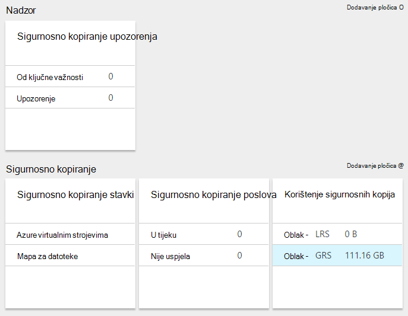
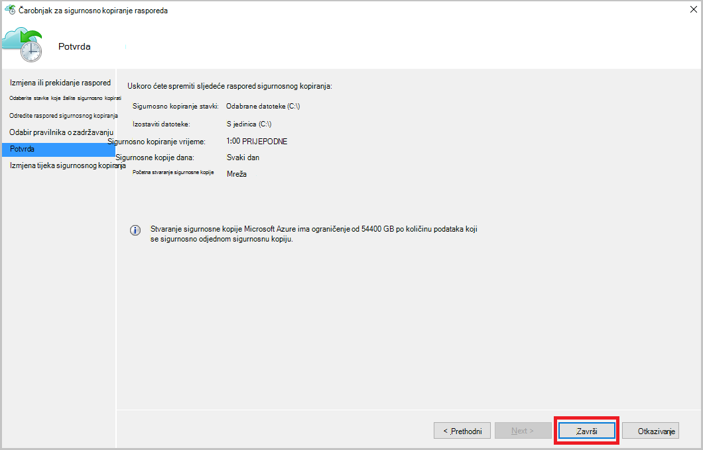

<properties
    pageTitle="Upravljanje sefovi servisa Azure oporavak i poslužitelji | Microsoft Azure"
    description="Pomoću ovog praktičnog vodiča da biste saznali kako upravljati sefovi servisa Azure oporavak i poslužitelja."
    services="backup"
    documentationCenter=""
    authors="markgalioto"
    manager="cfreeman"
    editor="tysonn"/>

<tags
    ms.service="backup"
    ms.workload="storage-backup-recovery"
    ms.tgt_pltfrm="na"
    ms.devlang="na"
    ms.topic="article"
    ms.date="10/19/2016"
    ms.author="jimpark; markgal"/>


# <a name="monitor-and-manage-azure-recovery-services-vaults-and-servers-for-windows-machines"></a>Nadzor i upravljanje sefovi servisa Azure oporavak i poslužitelji za računala za Windows

> [AZURE.SELECTOR]
- [Voditelj resursa](backup-azure-manage-windows-server.md)
- [Klasični](backup-azure-manage-windows-server-classic.md)

U ovom članku pronaći ćete pregled zadataka upravljanja sigurnosne kopije dostupne putem portala za Azure i agent za Microsoft Azure sigurnosne kopije.

[AZURE.INCLUDE [learn-about-deployment-models](../../includes/learn-about-deployment-models-rm-include.md)]Uvođenje klasičnog model.

## <a name="management-portal-tasks"></a>Portala zadatke upravljanja

### <a name="access-your-recovery-services-vaults"></a>Pristup vaše sefovi oporavak Services

1. Prijavite se na [Portal za Azure](https://portal.azure.com/) pomoću pretplate Azure.

2. Na izborniku koncentrator kliknite **Pregledaj** , a zatim na popisu resursi upišite **Servise za oporavak**. Kao što počnete pisati, na popisu će filtrirati na temelju unos. Kliknite **sefovi servise za oporavak**.

     <br/>

2. Odaberite naziv sigurnog želite prikazati na popisu da biste otvorili plohu nadzorne ploče za oporavak servisa sigurnog.

     <br/>

## <a name="monitor-jobs-and-alerts"></a>Praćenje zadataka i upozorenja
Vam praćenje zadataka i upozorenja na oporavak servisa sigurnog nadzornoj ploči kojem ćete vidjeti:

- Detalji o sigurnosne kopije upozorenja
- Datoteke i mape, kao i Azure virtualnim računalima sustava zaštitu u oblaku
- Ukupan prostor u Azure
- Stanja zadatka sigurnosnog kopiranja



Klikom na podaci u svakoj od tih pločica otvorit će se povezana plohu gdje upravljate povezani zadaci.

Na vrhu nadzorne ploče:

- Postavke omogućuje pristup dostupnih sigurnosne kopije zadataka.
- Sigurnosno kopiranje – pridonosi sigurnosno kopirate nove datoteke i mape (ili Azure VMs) za oporavak servisa sigurnog.
- Brisanje – ako je oporavak servisa sigurnog više ne koristi, možete je izbrisati da biste oslobodili prostor za pohranu. Brisanje omogućena samo kada zaštićeni poslužiteljima na kojima su izbrisane iz na sigurnog.


## <a name="alerts-for-backups-using-azure-backup-agent"></a>Upozorenja za sigurnosne kopije pomoću Azure agent za sigurnosne kopije:
| Razina upozorenja  | Upozorenja šalje |
| ------------- | ------------- |
| Od ključne važnosti | Sigurnosne kopije pogrešku, pogreška oporavak  |
| Upozorenje  | Sigurnosno kopiranje dovršeno uz upozorenja (kada manje od sto datoteke neće se sigurnosno zbog problema s oštećenje i više od milijun datoteke su uspješno sigurnosno)  |
| Informativna  | Ništa  |
## <a name="manage-backup-alerts"></a>Upravljanje upozorenjima za sigurnosne kopije
Kliknite pločicu **Sigurnosne kopije upozorenja** da biste otvorili plohu **Sigurnosne kopije upozorenja** i upravljanje upozorenjima.


Pločica upozorenja sigurnosnu kopiju prikazuje broj:

- ključna upozorenja nerazriješeni u zadnja 24 sata
- Upozorenje upozorenja nerazriješeni u zadnja 24 sata

Klikom na svaku od ovih veza otvara plohu **Upozorenja za sigurnosno kopiranje** s filtrirani prikaz tih upozorenja (ključnih ili upozorenje).

Iz plohu upozorenja sigurnosne kopije koju:

- Odaberite odgovarajuće podatke želite poslati zajedno s upozorenja.

    

- Težinu, status i početak i Kraj vremena možete filtrirati upozorenja.

    

- Konfiguriranje obavijesti za težinu, učestalost i primatelji, kao i isključivanje upozorenja.

    

Ako **Po upozorenja** označen kao učestalost **obavijesti** bez grupiranja ili smanjenja u porukama e-pošte pojavljuje se. Upozorenjem rezultira 1 obavijesti. To je zadana postavka i razlučivost e-pošte i šalje se odmah.

Ako **Svaki sat sažetka** označen kao korisnik ih obavještava da postoje nerazriješeni upozorenja novi generirani u zadnjem satu poslati jedan e učestalost **obavijesti** . Razlučivost e-pošte šalje se na kraju sat.

Za sljedeće razine težinu mogu poslati upozorenja:

- od ključne važnosti
- Upozorenje
- informacije o

Deaktiviranje upozorenje s gumb **Isključi** u pojedinosti plohu posao. Kada kliknete Deaktiviraj, možete unijeti razlučivost bilješke.

Odaberite stupce koje želite prikazati kao dio upozorenje s gumbom za **Odabir stupaca** .

>[AZURE.NOTE] Iz plohu **Postavke** Upravljanje upozorenjima za sigurnosne kopije tako da odaberete **praćenja i izvješća > upozorenja i događaje > sigurnosne kopije upozorenja** , a potom **Filtar** ili **Konfiguriranje obavijesti**.

## <a name="manage-backup-items"></a>Upravljanje stavkama sigurnosnog kopiranja
Upravljanje lokalnim sigurnosne kopije sada je dostupna na portal za upravljanje. U odjeljku sigurnosne kopije na nadzornoj ploči pločicu **Sigurnosnu kopiju stavke** prikazuje broj sigurnosno kopiranje stavki zaštićeni na sigurnog.

Kliknite **Mapa za datoteke** na pločici sigurnosnu kopiju stavke.


Otvorit će se plohu sigurnosno kopiranje stavki s filtrom postavite mapu datoteke u kojem piše svaki određene sigurnosnu kopiju stavke na popisu.


Ako odaberete određenu sigurnosne kopije stavku s popisa, vidjet ćete ključan detalja za tu stavku.

>[AZURE.NOTE] Iz plohu **Postavke** upravljate datoteke i mape tako da odaberete **zaštićene stavke > sigurnosnu kopiju stavke** , a zatim na padajućem izborniku odaberite **Mapa za datoteke** .


## <a name="manage-backup-jobs"></a>Upravljanje zadacima sigurnosnog kopiranja
Sigurnosno kopiranje zadaci i informacije o lokalnom (kada je lokalnog poslužitelja sigurnosno za Azure) i Azure sigurnosne kopije su vidljive na nadzornoj ploči.

U odjeljku sigurnosne kopije na nadzornoj ploči pločicu posao sigurnosnu kopiju prikazuje broj zadataka:

- u tijeku
- nije uspjela tijekom zadnja 24 sata.

Da biste upravljali poslova sigurnosnog kopiranja, kliknite pločicu **Sigurnosne kopije zadataka** koji se otvara plohu sigurnosne kopije zadataka.


Izmjena informacije koje su dostupne u plohu sigurnosne kopije zadataka s gumbom za **Odabir stupaca** na vrhu stranice.

Koristite gumb **Filtar** da biste odabrali između datoteka i mapa i sigurnosno kopiranje Azure virtualnog računala.

Ako ne vidite sigurnosne datoteke i mape, kliknite gumb **filtra** pri vrhu stranice i odaberite **datoteke i mape** na izborniku Vrsta stavke.

>[AZURE.NOTE] Iz plohu **Postavke** upravljanje zadacima sigurnosne kopije tako da odaberete **praćenja i izvješća > Zadaci > sigurnosne kopije zadataka** , a zatim na padajućem izborniku odaberite **Mapa za datoteke** .

## <a name="monitor-backup-usage"></a>Nadzor korištenja sigurnosnog kopiranja
U odjeljku sigurnosne kopije na nadzornoj ploči pločicu sigurnosne kopije korištenje prikažite potrošnju Azure prostora za pohranu. Korištenje spremišta namijenjeno:
- Korištenje spremišta LRS pridružene na sigurnog u oblaku
- Korištenje spremišta GRS pridružene na sigurnog u oblaku

## <a name="production-servers"></a>Proizvodne poslužitelje
Da biste upravljali proizvodne poslužitelje, kliknite **Postavke**. U odjeljku Upravljanje kliknite **infrastruktura za sigurnosno kopiranje > proizvodne poslužitelje**.

Popisi plohu proizvodne poslužitelje svih radnog poslužitelja. Kliknite na poslužitelju na popisu da biste otvorili Detalji o poslužitelju.


## <a name="microsoft-azure-backup-agent-tasks"></a>Stvaranje sigurnosne kopije Microsoft Azure agent zadataka

## <a name="open-the-backup-agent"></a>Otvaranje sigurnosne kopije agent

Otvorite **Microsoft Azure Backup agent** (smatrate traženjem računalu *Microsoft Azure Backup*).


Od **Akcija** dostupne s desne strane konzole za sigurnosne kopije agent izvedite sljedeće zadatke upravljanja:

- Registriranje poslužitelja
- Raspored sigurnosnog kopiranja
- Sigurnosno kopiranje sada
- Promjena svojstava


>[AZURE.NOTE] **Oporavak podataka**potražite u članku [vratiti datoteke u sustavu Windows server ili Windows klijentskom računalu](backup-azure-restore-windows-server.md).

## <a name="modify-an-existing-backup"></a>Izmjena postojeću sigurnosnu kopiju

1. Agent za Microsoft Azure Backup kliknite **Raspored sigurnosnu kopiju**.

    

2. **Čarobnjak za sigurnosno kopiranje raspored** ostavite odabranu mogućnost **promjene za sigurnosno kopiranje stavki ili vremena** , a zatim kliknite **Dalje**.

    

3. Ako želite da biste dodali ili promijenili stavke, na zaslonu **Odaberite stavke za stvaranje sigurnosne kopije** kliknite **Dodaj stavke**.

    **Postavke izuzetaka** možete postaviti i s ove stranice u čarobnjaku. Ako želite izostaviti datoteke ili vrste datoteka pročitajte postupak dodavanja [izuzetaka postavke](#exclusion-settings).

4. Odaberite datoteke i mape koje želite sigurnosno kopirati, a zatim kliknite u **redu**.

    

5. Navedite **raspored sigurnosnog kopiranja** , a zatim kliknite **Dalje**.

    Možete planirati dnevnu (pri najviše 3 puta dnevno) ili s predlošcima tjednih sigurnosne kopije.

    

    >[AZURE.NOTE] Određivanje raspored sigurnosnog kopiranja je objašnjeno u ovom [članku](backup-azure-backup-cloud-as-tape.md).

6. Odabir **Pravilnika o zadržavanju** sigurnosne kopije, a zatim kliknite **Dalje**.

    

7. Na zaslonu za **potvrdu** pregledajte podatke, a zatim kliknite **Završi**.

8. Kad čarobnjak dovrši stvaranje **raspored sigurnosnog kopiranja**, kliknite **Zatvori**.

    Nakon izmjene zaštitu možete potvrditi da sigurnosne kopije su pokretanje pravilno tako da na kartici **Zadaci** i potvrdom da su promjene vidljive sigurnosne kopije zadataka.

## <a name="enable-network-throttling"></a>Omogućivanje ograničavanje mreže  
Agent za sigurnosne kopije Azure sadrži karticu Throttling koji omogućuje kontrolu načina na koji se propusnost mreže koristi tijekom prijenosa podataka. Ova kontrola može biti korisno ako je potrebno sigurnosno kopiranje podataka tijekom radno vrijeme, ali ne želite da se postupak sigurnosnog kopiranja da biste sukob s drugim internetski promet. Ograničavanje podataka prijenos odnosi se na sigurnosno kopiranje i vraćanje aktivnosti.  

Da biste omogućili ograničenja:

1. U **agent za sigurnosne kopije**, kliknite **Promijeni svojstva**.

2. Na **Ograničavanje kartice, odaberite **Omogući korištenja propusnosti internetske ograničavanje za sigurnosne kopije operacije **.

    

    Nakon što ste omogućili reguliranje, odredite dopuštene propusnosti za prijenos sigurnosne kopije podataka tijekom **radnog vremena** i **osobe koje nisu radno vrijeme**.

    Vrijednosti propusnosti pokrenuti 512 KB sekundi (KB/s) te mogu posjetiti do 1023 megabajta u sekundi (MB/s). Možete odrediti na početak i kraj **radnog vremena**i dane u tjednu smatraju radnog dana. Vrijeme izvan određenu radno vrijeme smatra se nisu radno vrijeme.

3. Kliknite **u redu**.

## <a name="manage-exclusion-settings"></a>Upravljanje postavkama izuzetaka

1. Otvorite **Microsoft Azure Backup agent** (je možete pronaći traženjem računalu *Microsoft Azure Backup*).

    

2. Agent za Microsoft Azure Backup kliknite **Raspored sigurnosnu kopiju**.

    

3. U čarobnjaku za sigurnosne kopije raspored ostavite odabranu mogućnost **promjene za sigurnosno kopiranje stavki ili vremena** , a zatim kliknite **Dalje**.

    

4. Kliknite **izostavljene postavke**.

    

5. Kliknite **Dodaj izuzetaka**.

    

6. Odaberite lokaciju, a zatim kliknite **u redu**.

    

7. Dodajte datotečni nastavak u polju **Vrsta datoteke** .

    

    Dodavanje datotečni nastavak .mp3

    

    Da biste dodali drugo proširenje, kliknite **Dodaj izuzetaka** i unesite drugu vrstu nastavkom (Dodavanje proširenje .jpeg).

    

8. Kada dodate sva proširenja, kliknite **u redu**.

9. Nastavite slijediti čarobnjak i sigurnosno kopiranje raspored tako da kliknete **Dalje** do na **stranici za potvrdu**, a zatim kliknite **Završi**.

    

## <a name="frequently-asked-questions"></a>Najčešća pitanja
**Q1. Stanja zadatka sigurnosnog kopiranja se prikazuje kao dovršen u Azure sigurnosne kopije agent Zašto ne to dobiti odrazilo odmah portalu?**

A1. Postoji pri Maksimalna Odgoda od 15 minuta između stanja zadatka sigurnosnog kopiranja prikazuje Azure agent za sigurnosne kopije i Azure portal.

**Q.2 kada sigurnosno kopiranje ne uspije, koliko je potrebno da biste podigli upozorenja?**

A.2 upozorenje podignut unutar 20 minuta Azure sigurnosne kopije pogreške.

**Q3. Je li slučaj kojem neće poslati poruku e-pošte ako su konfigurirana obavijesti?**

A3. Ispod su slučajeve kad obavijest će biti poslana da biste smanjili upozorenja Šum:

   - Ako zaračunava konfigurirane obavijesti i upozorenja je podignut i razriješiti unutar sat
   - Zadatak je prekinuti.
   - Drugi sigurnosno kopiranje nije uspjelo jer je u tijeku je izvorni sigurnosno kopiranje.

## <a name="troubleshooting-monitoring-issues"></a>Otklanjanje poteškoća nadzora

**Problem:** Zadatke i/ili upozorenja iz sigurnosne kopije Azure agent ne prikazuju se na portalu.

**Korake za otklanjanje poteškoća:** Postupak, ```OBRecoveryServicesManagementAgent```, šalje podatke za posao i upozorenja sa servisom Azure sigurnosne kopije. Povremeno postaju zamrzne postupak ili isključivanja.

1. Da biste potvrdili postupak nije pokrenut, otvorite **Upravitelj zadataka** i provjeri je li u ```OBRecoveryServicesManagementAgent``` pokrenut proces.

2. Uz pretpostavku da je postupak nije pokrenut, otvorite **Upravljačku ploču** , a zatim pronađite popis servisa. Numeriranje ili ponovno **Agenta upravljanje usluge za Microsoft Azure oporavak**.

    Dodatne informacije potražite u zapisnicima pri:<br/>
`<AzureBackup_agent_install_folder>\Microsoft Azure Recovery Services Agent\Temp\GatewayProvider*`. Ako, na primjer:<br/> `C:\Program Files\Microsoft Azure Recovery Services Agent\Temp\GatewayProvider0.errlog`.

## <a name="next-steps"></a>Daljnji koraci
- [Vraćanje Windows Server ili Windows klijent iz Azure](backup-azure-restore-windows-server.md)
- Da biste saznali više o Azure sigurnosne kopije, potražite u članku [Pregled sigurnosne kopije Azure](backup-introduction-to-azure-backup.md)
- Posjetite [Forum za Azure sigurnosne kopije](http://go.microsoft.com/fwlink/p/?LinkId=290933)
