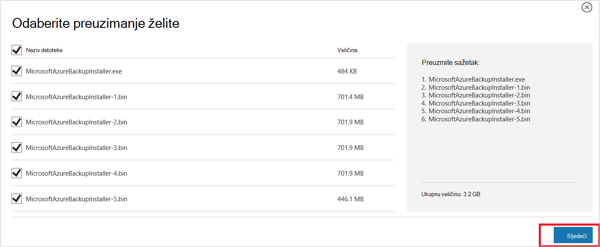
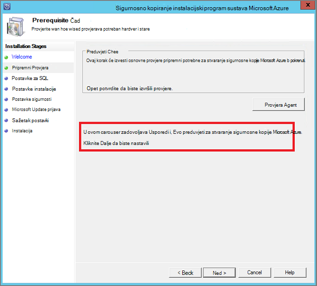
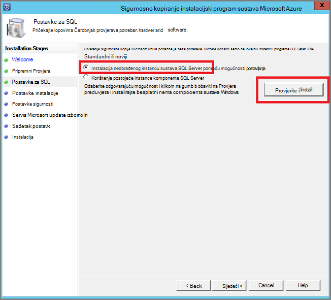
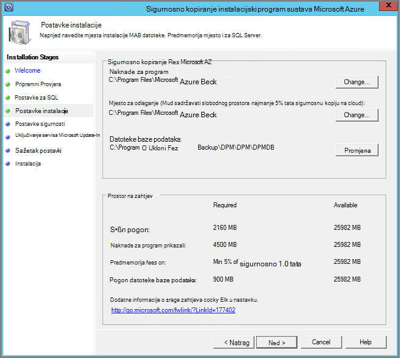
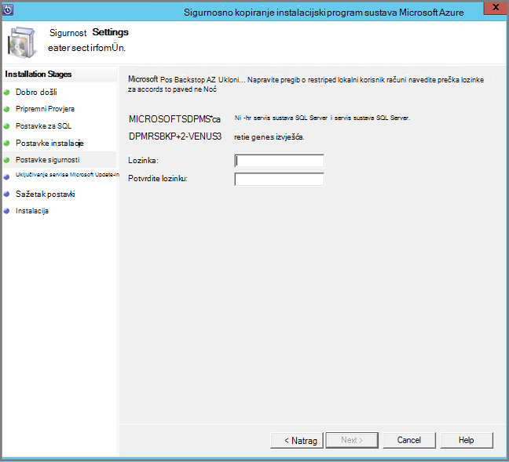
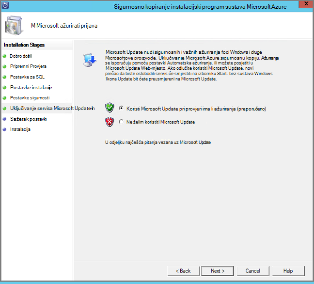
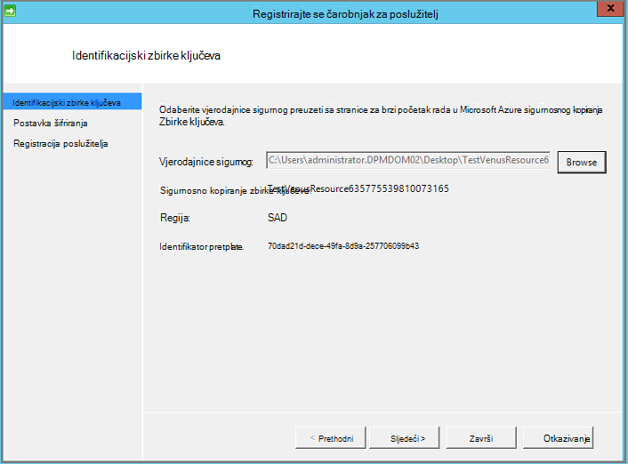
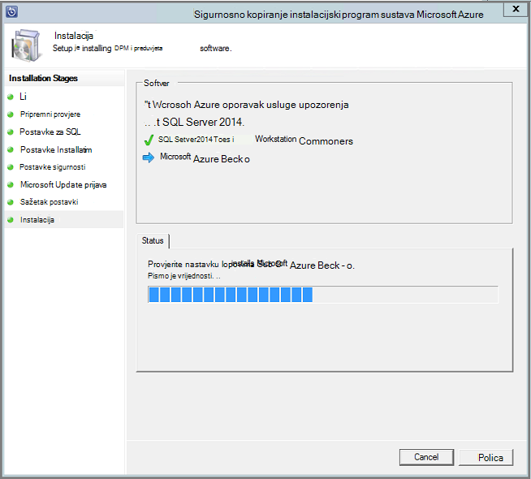

<properties
  pageTitle="Priprema vaše okruženje za sigurnosno kopiranje radnih opterećenja pomoću poslužitelja za sigurnosno kopiranje Azure | Microsoft Azure"
  description="Provjerite je li vaše okruženje ispravno pripremiti za sigurnosno kopiranje radnih opterećenja pomoću poslužitelja za sigurnosno kopiranje Azure"
  services="backup"
  documentationCenter=""
  authors="pvrk"
  manager="shivamg"
  editor=""
  keywords="poslužitelj za Azure sigurnosne kopije; sigurnosno kopiranje zbirke ključeva"/>

<tags
  ms.service="backup"
  ms.workload="storage-backup-recovery"
  ms.tgt_pltfrm="na"
  ms.devlang="na"
  ms.topic="article"
  ms.date="08/22/2016"
  ms.author="jimpark;trinadhk;pullabhk; markgal"/>

# <a name="preparing-to-back-up-workloads-using-azure-backup-server"></a>Priprema za sigurnosno kopiranje radnih opterećenja pomoću poslužitelja za sigurnosno kopiranje Azure

> [AZURE.SELECTOR]
- [Poslužitelj za Azure sigurnosne kopije](backup-azure-microsoft-azure-backup.md)
- [SCDPM](backup-azure-dpm-introduction.md)
- [Poslužitelj za Azure sigurnosne kopije (Classic)](backup-azure-microsoft-azure-backup-classic.md)
- [SCDPM (Classic)](backup-azure-dpm-introduction-classic.md)


Ovaj je članak o pripremi vaše okruženje za sigurnosno kopiranje radnih opterećenja pomoću poslužitelja za sigurnosno kopiranje Azure. S poslužiteljem za Azure sigurnosne kopije, možete zaštititi radnih opterećenja aplikacije kao što su VMs Hyper-V, Microsoft SQL Server, sustava SharePoint Server, Microsoft Exchange i klijenti sustava Windows s konzole za jedan.

>[AZURE.WARNING] Poslužitelj za Azure sigurnosne kopije nasljeđuje funkcionalnost od upravitelja podataka zaštitu (DPM) za radno opterećenje sigurnosnu kopiju. Tražit će pokazivači DPM potražite u dokumentaciji za neke od tih mogućnosti. No Azure sigurnosne kopije poslužitelj ne pruža zaštitu na vrpci ili integrirati s centrom za sustav.

## <a name="1-windows-server-machine"></a>1. Pokrenite poslužitelj Windows


Prvi korak pri njihovu sigurnosnu kopiju Server Azure postavljanju i upotrebi je imati računala za Windows Server.

| Mjesto | Minimalni preduvjeti | Dodatne upute |
| -------- | -------------------- | ----------------------- |
| Azure | Azure IaaS virtualnog računala<br><br>A2 Standardna: 2 jezgri, 3,5 GB RAM-a | Možete početi s jednostavne galerije Windows Server 2012 R2 podatkovnog centra. [Zaštita IaaS opterećenjem pomoću Server Azure sigurnosne kopije (DPM)](https://technet.microsoft.com/library/jj852163.aspx) ima mnogo nuances. Provjerite je li prije no što implementirate računalu potpuno pročitajte članak. |
| Lokalni | VM Hyper-V<br> VMWare VM<br> ili fizičke glavno računalo<br><br>2 jezgri i 4GB RAM-a | Možete deduplicate prostora za pohranu DPM pomoću Poništavanje duplikacije Windows Server. Dodatne informacije o [servisu DPM i Poništavanje duplikacije](https://technet.microsoft.com/library/dn891438.aspx) funkcioniranje kada implementiran u VMs Hyper-V. |

> [AZURE.NOTE] Preporučuje se da Server Azure sigurnosne kopije instaliran na računalo sa sustavom Windows Server 2012 R2 podatkovnog centra. Mnogo preduvjete automatski se primjenjuju na najnoviju verziju operacijskog sustava Windows.

Ako planirate uključivanje ovaj poslužitelj s domenom trenutku, preporučuje se aktivnosti domene uključivanja učiniti prije instalacije Server Azure sigurnosnu kopiju. Premještanje postojeće računala za poslužitelj za Azure sigurnosne kopije za novu domenu nakon implementacije *nisu podržani*.

## <a name="2-backup-vault"></a>2. sigurnosno kopiranje zbirke ključeva


Hoće li poslati sigurnosne kopije podataka Azure ili održavali lokalno, softver mora biti povezano s Azure. Želite li biti određene, na računalu poslužitelj za Azure sigurnosne kopije mora biti registriran u sigurnosno kopiranje zbirke ključeva.

Stvaranje sigurnosne kopije sigurnog:

1. Prijava na [Portal za upravljanje](http://manage.windowsazure.com/).

2. Kliknite **Novi** > **Data Services** > **oporavak Services** > **sigurnosne kopije sigurnog** > **brzo stvaranje**. Ako imate više pretplata povezan s računa tvrtke ili ustanove, odaberite odgovarajuće pretplate želite pridružiti sigurnosno kopiranje zbirke ključeva.

3. U odjeljak **naziv**unesite neslužbeni naziv da biste odredili na zbirke ključeva. To mora biti jedinstvena za svaku pretplatu.

4. U **regiji**, odaberite regiji u zbirke ključeva. Obično regija u sigurnog se izdvajaju na temelju podataka samostalnosti ili mreže Latencija ograničenja.

    

5. Kliknite **Stvaranje sigurnog**. Može potrajati neko vrijeme da sigurnosno kopiranje zbirke ključeva će biti stvoren. Praćenje obavijesti o statusu pri dnu portalu.

    

6. Poruke se potvrđuje da na sigurnog uspješno je stvorena i on će biti naveden na stranici servisa oporavak kao aktivna.
    

  > [AZURE.IMPORTANT] Provjerite je li mogućnost zalihosti odgovarajuće pohrane odabran desno nakon stvaranja u zbirke ključeva. Dodatne informacije o [zemlj suvišne](../storage/storage-redundancy.md#geo-redundant-storage) i [lokalno suvišne](../storage/storage-redundancy.md#locally-redundant-storage) mogućnostima na [Pregled](../storage/storage-redundancy.md).


## <a name="3-software-package"></a>3. paket softver


### <a name="downloading-the-software-package"></a>Preuzimanje paketa softver

Slično sigurnog vjerodajnice, možete preuzeti Microsoft Azure sigurnosne kopije za radnih opterećenja aplikacije na **Početnu stranicu za brzi** sigurnosno kopiranje zbirke ključeva.

1. Kliknite **aplikaciju radnih opterećenja (na disku na Disk na Cloud)**. Ta će vas na stranicu centra za preuzimanje iz koje je moguće preuzeti softverski paket.

    

2. Kliknite **Preuzmi**.

    

3. Odaberite sve datoteke, a zatim kliknite **Dalje**. Sve datoteke dolaze iz sigurnosne kopije Microsoft Azure stranicu za preuzimanje preuzmite i postavite sve datoteke u istoj mapi.


    Budući da veličina preuzimanja svih datoteka zajedno je > 3G, na na 10Mbps veza za preuzimanje može potrajati do 60 minuta za preuzimanje da biste dovršili.


### <a name="extracting-the-software-package"></a>Izdvajanje softverski paket

Nakon što preuzmete sve datoteke, kliknite **MicrosoftAzureBackupInstaller.exe**. To će se pokrenuti **Čarobnjak za postavljanje programa Microsoft Azure sigurnosnu kopiju** da biste izdvojili datoteke postavljanja na mjesto na koje ste naveli. Nastavite slijediti čarobnjak i kliknite gumb za **izdvajanje** da biste započeli postupak za izdvajanje.

> [AZURE.WARNING] Da biste izdvojili datoteke za postavljanje potreban je barem 4GB slobodnog prostora.


Kada se dovrši obrađivati izdvajanje, potvrdite okvir da biste pokrenuli freshly izdvojene *setup.exe* da biste započeli instalaciju sustava Microsoft Azure sigurnosne kopije Server, a zatim kliknite gumb **Završi** .

### <a name="installing-the-software-package"></a>Instalacija softvera paketa

1. Kliknite **Microsoft Azure Backup** da biste pokrenuli čarobnjak za postavljanje.

    

2. Na zaslonu dobrodošlice kliknite gumb **Dalje** . To će vas odvesti do odjeljka *Pripremni provjerava* . Na zaslonu, kliknite gumb **Provjeri** da biste odredili ako su ispunjeni hardverski i softverski preduvjeti za poslužitelj za Azure sigurnosnu kopiju. Ako su svi preduvjete su uspješno zadovoljen, vidjet ćete poruku koja navodi da računalo zadovoljava preduvjete. Kliknite gumb **Dalje** .

    

3. Microsoft Azure sigurnosne kopije poslužitelj zahtijeva SQL Server Standard, a instalacijski paket Server Azure sigurnosnu kopiju u sklopu paketu na odgovarajuću SQL Server binarne datoteke potrebne. Prilikom pokretanja novi instalacijama Server Azure sigurnosne kopije, trebali biste odaberite željenu mogućnost **Instaliraj novu instancu sustava SQL Server s ovaj će instalacijski program** i kliknite gumb **Provjera i instalirajte** . Kada uspješno su instalirani preduvjete, kliknite **Dalje**.

    

    Ako dođe do pogreške s preporuke za ponovno pokrenite računalo, učiniti, a zatim kliknite **Ponovno provjeriti**.

    > [AZURE.NOTE] Poslužitelj za Azure sigurnosnog kopiranja neće funkcionirati ako udaljene instancu sustava SQL Server. Instance koristi Server Azure sigurnosnu kopiju mora biti lokalni.

4. Mjesto za instalaciju sustava Microsoft Azure Backup datoteke poslužitelja, a zatim kliknite **Dalje**.

    

    Preduvjet za natrag na Azure je prazno mjesto. Provjerite je li prazno mjesto barem 5% podataka planirano za sigurnosno kopiranje s oblakom. Radi zaštite disk, potrebno je konfigurirati nakon dovršetka instalacije zasebnom diskova. Dodatne informacije o grupe za pohranu potražite u članku [Konfiguriranje prostora za pohranu grupe i prostora za pohranu na disku](https://technet.microsoft.com/library/hh758075.aspx).

5. Navedite jaku lozinku za ograničena lokalne korisničke račune, a zatim kliknite **Dalje**.

    

6. Odaberite želite li koristiti *Servis Microsoft Update* da biste provjerili ima li ažuriranja i kliknite **Dalje**.

    >[AZURE.NOTE] Preporučujemo da imate Windows Update preusmjeravanje na Microsoft Update, koji nudi sigurnosnih i važnih ažuriranja za Windows i ostale proizvode kao što je Microsoft Azure sigurnosne kopije Server.

    

7. Pregledajte *Sažetak postavke* , a zatim kliknite **Instaliraj**.

    

8. Instalacija se događa u fazama. Prva faza agenta za servise sustava Microsoft Azure oporavak instalacije na poslužitelju. Čarobnjak provjerava za povezivanje s Internetom. Ako je dostupan internetska veza možete nastaviti s instalacijom, ako nije, morate navesti proxy detalje za povezivanje s Internetom.

    Sljedeći je korak konfiguriranje agenta servisa za oporavak Microsoft Azure. Kao dio konfiguraciju, morat ćete unijeti ste sigurnog vjerodajnice da biste registrirali računala za sigurnosno kopiranje zbirke ključeva. Pristupni izraz za šifriranje/dešifriranje podataka koji se šalju između Azure i vaši lokalno i dati. Automatski možete generirati pristupni izraz ili pružaju vlastite minimalne pristupni izraz 16 znakova. Nastavite pomoću čarobnjaka za sve dok je konfiguriran agenta.

    

9. Nakon registracije poslužitelja Microsoft Azure Backup uspješno završi, cjelokupan Čarobnjak za postavljanje nastavlja se do instalacije i konfiguracije SQL Server i komponente Server Azure sigurnosnu kopiju. Nakon dovršetka instalacije komponente SQL Server Azure sigurnosne kopije poslužitelja komponenti instalirane.

    


Kada korak instalacija dovrši, ikona na radnoj površini proizvoda će stvorena kao i. Samo dvokliknite ikonu da biste pokrenuli proizvoda.

### <a name="add-backup-storage"></a>Dodavanje prostora za pohranu za sigurnosne kopije

Prvi sigurnosne kopije zadržavaju se na pohranu priložiti strojno poslužitelj za Azure sigurnosne kopije. Dodatne informacije o dodavanju diskova potražite u članku [Konfiguriranje prostora za pohranu grupe i prostora za pohranu na disku](https://technet.microsoft.com/library/hh758075.aspx).

> [AZURE.NOTE] Morate dodati sigurnosne kopije prostora za pohranu, čak i ako planirate slati podatke Azure. U trenutnom arhitektura poslužitelj za Azure sigurnosne kopije Azure sigurnosno kopiranje zbirke ključeva sadrži *drugi* kopiju podataka dok je lokalno spremište sadrži sigurnosne kopije prvi (i obavezno).  

## <a name="4-network-connectivity"></a>4. veza s mrežom


Server Azure sigurnosne kopije potrebna je veza sa servisom Azure sigurnosne kopije za proizvod rad uspješno. Da biste provjerili koristi li se na računalu je veza s Azure, koristite na ```Get-DPMCloudConnection``` cmdleta na konzoli za Azure sigurnosne kopije poslužitelja PowerShell. Ako Izlaz na cmdleta je TRUE, a zatim povezivanje postoji, još nema nema povezivanja.

U isto vrijeme Azure pretplate mora biti u dobar stanju. Da biste saznali stanja pretplate i upravljati, prijavite se na [portal za pretplatu]( https://account.windowsazure.com/Subscriptions).

Kada znate stanje Azure s povezivanjem i Azure pretplatu, možete koristiti u tablici u nastavku da biste saznali utjecaj na funkciju sigurnosnog kopiranja i vraćanja nudi.

| Povezivanje stanja | Azure pretplate | Sigurnosno kopiranje za Azure| Sigurnosno kopiranje na disk | Vraćanje iz Azure | Vraćanje s diska |
| -------- | ------- | --------------------- | ------------------- | --------------------------- | ----------------------- |
| Povezani | Aktivni | Dopuštene | Dopuštene | Dopuštene | Dopuštene |
| Povezani | Istekla | Zaustavi | Zaustavi | Dopuštene | Dopuštene |
| Povezani | Pretplati su uklonjeni resursi | Zaustavi | Zaustavi | Točke Zaustavi i Azure Oporavak izbrisane | Zaustavi |
| Gubi povezivanje > petnaest dana | Aktivni | Zaustavi | Zaustavi | Dopuštene | Dopuštene |
| Gubi povezivanje > petnaest dana | Istekla | Zaustavi | Zaustavi | Dopuštene | Dopuštene |
| Gubi povezivanje > petnaest dana | Pretplati su uklonjeni resursi | Zaustavi | Zaustavi |  Točke Zaustavi i Azure Oporavak izbrisane | Zaustavi |

### <a name="recovering-from-loss-of-connectivity"></a>Oporavak u slučaju gubitka veze
Ako imate vatrozid ili proxy poslužitelj Azure onemogućuje pristup, morate whitelist sljedeće adrese domene u profilu vatrozida/proxy poslužitelja:

- www.msftncsi.com
- \*. Microsoft.com
- \*. WindowsAzure.com
- \*. microsoftonline.com
- \*. windows.net

Kada se veza s Azure vraćena je na računalu Server Azure sigurnosne kopije, operacije koje možete izvršiti ovise o stanju Azure pretplate. Prethodno navedenoj tablici sadrži detalje o operacije dopušteno kada na ovom računalu "uspostavi".

### <a name="handling-subscription-states"></a>Rukovanje stanja pretplate

Moguće je da iskoristite Azure pretplate iz stanju *istekao* ili *Deprovisioned* *Active* stanje. No to sadrži neke utjecaju na ponašanje proizvoda dok još nije *aktivna*stanje:

- Pretplata na *Deprovisioned* gubi funkcije za razdoblje za koje je se uklanjaju resursi. O uključivanju *aktivna*, revived je funkcionalnost proizvoda sigurnosnog kopiranja i vraćanja. Sigurnosno kopiranje podataka na lokalnom disku i mogu biti dohvaćeni ako je čuva razdoblje zadržavanja dovoljno velikim. Sigurnosno kopiranje podataka u Azure irretrievably gubi se kada pretplata unosi *Deprovisioned* stanje.
- Pretplatu na *istekao* samo gubi funkcija dok je izvršena *aktivni* ponovno. Sve sigurnosne kopije zakazano za razdoblje *istekao* je pretplata će se pokrenuti.


## <a name="troubleshooting"></a>Otklanjanje poteškoća

Ako poslužitelj za Microsoft Azure sigurnosne kopije ne uspije s pogreškama tijekom faze postavljanje (ili sigurnosno kopiranje ili vraćanje), pročitajte ovaj [dokument šifre pogreške](https://support.microsoft.com/kb/3041338) dodatne informacije.
Možete se referirati [sigurnosne kopije Azure povezane najčešća pitanja](backup-azure-backup-faq.md)


## <a name="next-steps"></a>Daljnji koraci

Detaljne informacije o [Pripremi okruženja za DPM](https://technet.microsoft.com/library/hh758176.aspx) možete dobiti na web-mjestu Microsoft TechNet. Sadrži i informacije o podržanim konfiguracije na kojem Server Azure sigurnosne kopije mogu uvesti i koristiti.

Pomoću ovih članaka možete dobiti detaljnije objašnjenje zaštite radno opterećenje pomoću poslužitelja za stvaranje sigurnosne kopije Microsoft Azure.

- [Sigurnosno kopiranje sustava SQL Server](backup-azure-backup-sql.md)
- [Sigurnosno kopiranje sustava SharePoint server](backup-azure-backup-sharepoint.md)
- [Zamjenski poslužitelj sigurnosnog kopiranja](backup-azure-alternate-dpm-server.md)
